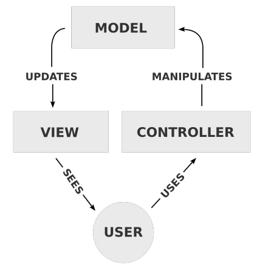

- [Model View Controller (MVC)](#model-view-controller-mvc)
  - [Framework MVC: Django](#framework-mvc-django)
    - [Template](#template)

# Model View Controller (MVC)

Sviluppato come modello per **Smalltalk-80** (linguaggio di programmazione), si tratta del ***modello di riferimento in ambito Web***: è un **pattern architetturale** per lo ***sviluppo di sistemi software*** che separa la *logica di rappresentazione dei dati* dalla *logica di business*. `MVC` è lo **standard de facto** per *progettare applicazioni complesse*. La struttura si divide in **3 componenti software**:

- **`MODEL`**: fornisce i ***metodi per accedere ai dati*** dell'applicazione (*astrae la rappresentazione dei dati*). Tipicamente si usa un ***modello `Object-Relational`*** per mappare *`classi` e `tabelle`*
- **`VIEW`**: permette la ***visualizzazione dei dati contenuti nel model***. A *un model possono corrispondere più Views*  
- **`CONTROLLER`**: ***gestisce gli eventi derivanti dall'interazione dell'utente con la view*** può *modificare il Model* e richiedere un *aggiornamento delle Views*

## Framework MVC: Django

Framework Python che segue l'approccio `MVC`: ciascun componente viene diviso su file diversi:

- `models.py` &rarr; **`MODEL`**. Viene implementato direttamente come ***collezione di classi Python*** che ***rappresentano le tabelle del database***, approccio ***`Object-Relational-Mapping (ORM)`*** e creazione di un ***`Virtual Object Database`*** accessibile direttamente mediante *API del linguaggio Python* (es. *query*). Normalmente utilizza un *Database Relazionale*, quelli *NoSQL* possono essere supportati attraverso delle *estensioni* (`Djongo` per il supporto a *MongoDB*). Il model presenta due layer: 
  -  il **model generico** che definisce l'interfaccia
  - il **`DAO`** che è specifico per il Database utilizzato

- `view.py` &rarr; **`VIEW`**. *Funzioni Python* per *gestire le interazioni* e che *generano le viste da restituire all'utente*. Queste funzioni prendono il nome di **`view`**: è possibile *utilizzare diversi template Django* in base all'output cercato, *accedere ai dati del Model* attraverso *API Python*.
- `urls.py` &rarr; **`CONTROLLER`**. *Mappa gli url richiesti sulle opportune funzioni Python (view)*. Si utilizzano delle *espressioni regolari* per fare il march con gli URL richiesti,

**`OBJECT-RELATIONAL MAPPING`**: Tecnica di programmazione che permette di gestire i dati di un database (memorizzazione, eliminazione, query, modifica) facendo uso di *Classi* in un *linguaggio Object-Oriented*.

### Template

Django ne fa un uso massiccio. Consente di tenere separate la rappresentazione dell'informazione dall'interazione col model per reperirla. Viene così introdotto un meccanismo di ereditarietà tra le pagine: c'è una pagina padre e una pagina figlio che ne eredita le caratteristiche e il più delle volte ne cambia alcune dimensioni.
