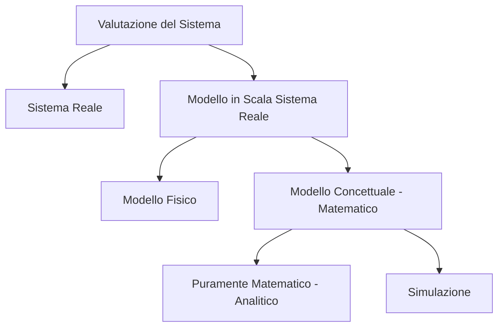
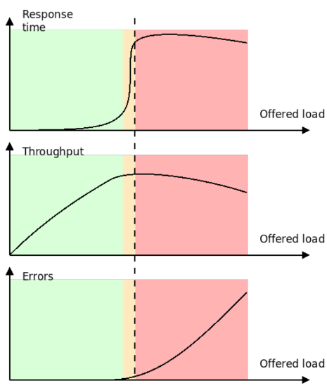
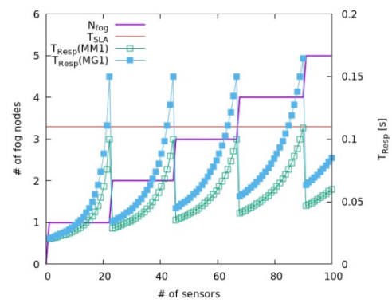
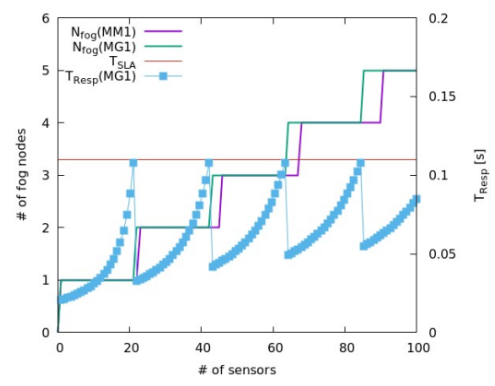
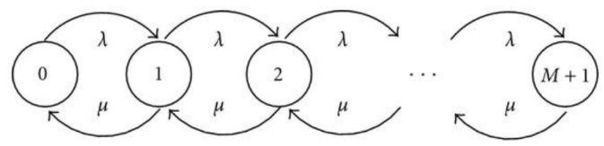
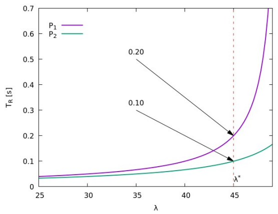
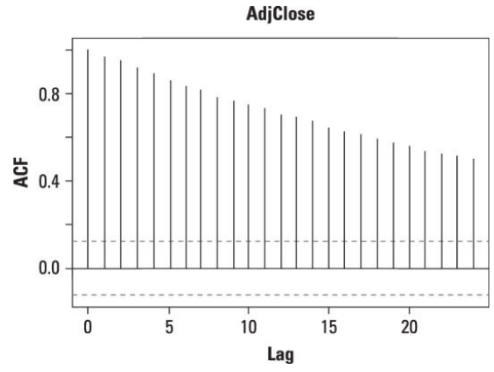
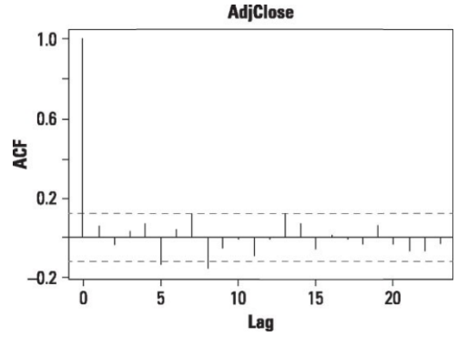

- [Valutazione delle Performance](#valutazione-delle-performance)
  - [Parametri di Performance](#parametri-di-performance)
    - [Capacità di Pianificazione](#capacità-di-pianificazione)
  - [Testing di Sistemi Reali](#testing-di-sistemi-reali)
    - [Tipologie di Benchmark](#tipologie-di-benchmark)
      - [Benchmark Standards](#benchmark-standards)
        - [SPEC Web](#spec-web)
        - [TPC](#tpc)
        - [SPEC-Cloud](#spec-cloud)
        - [YCSB](#ycsb)
        - [PerfKit](#perfkit)
  - [Modelli Matematici](#modelli-matematici)
    - [Sistema a Coda](#sistema-a-coda)
      - [Legge dell'Utilizzazione](#legge-dellutilizzazione)
      - [Legge di Little](#legge-di-little)
      - [Modelli ad Anello](#modelli-ad-anello)
    - [Teoria delle Code](#teoria-delle-code)
      - [Processo Poissoniano `M/M/1`](#processo-poissoniano-mm1)
      - [Formula di Pollaczek-Khinchin (`M/G/1`)](#formula-di-pollaczek-khinchin-mg1)
    - [Dirty Trick](#dirty-trick)
      - [Secondo Caso](#secondo-caso)
  - [Failures](#failures)
    - [Metriche](#metriche)
      - [Affidabilità di un Sistema](#affidabilità-di-un-sistema)
  - [Predizione](#predizione)

# Valutazione delle Performance

Per valutare le performance di un sistema è possibile seguire due diversi approcci: fare degli esperimenti sul **sistema reale**, oppure utilizzare un **modello del sistema**. Fare esperimenti sul sistema reale non è mai la via migliore per questioni di complessità e costi: non è pensabile mettere offline un sistema in produzione per delle ore (o giorni). Alcuni test devono essere svolti *senza un sistema reale*, specialmente in ***fase di progettazione***: quando lavorare sul sistema reale non è fattibile si utilizza un **modello in scala del sistema reale**.

Un modello in scala può essere costituito anche da un *rack interno al datacenter*: in questo caso si tratta di un **modello fisico**. Utilizzando sistemi di qualche ordine di grandezza più piccoli di quello reale però non si ha la garanzia che quando sarà necessario il sistema si comporti come deve: un modello fisico è indicato per tutti quegli esperimenti che non è fattibile fare su un sistema reale, ma non è adatto a tutte quelle situazioni in cui è necessaria una *scalabilità estrema*: si tratta di un *approccio costoso*. Su un sistema fisico possono inoltre essere presenti *elementi terzi* che vanno ad invalidare gli esperimenti effettuati, per questo è preferibile talvolta utilizzare un **modello matematico**: un sistema *completamente controllabile* che diventa un ***modello concettuale***. 

Un modello concettuale si dice **puramente matematico** quando il *comportamento e le sue prestazioni* sono *descritte completamente da **equazioni***. L'utilizzo di equazioni permette un ***grande livello di semplificazione***, in quanto permette di rilassare tanti dettagli: si tratta di un ***sistema tanto efficace*** quanto ***poco flessibile***. Un'approccio sempre matematico che conferisce ***più flessibilità*** è quello della **simulazione**: il *comportamento del sistema* in questo caso viene *descritto sotto forma di **codice***. si scrive un programma (o software) che cattura determinati comportamenti del sistema e va a misurare una serie di informazioni. Con la scrittura di codice che simula il comportamento del sistema, andare ad esplorare anche un *numero elevato di soluzioni* non diventa più proibitivo. Inoltre, con un modello matematico è possibile anche utilizzare delle ***funzioni obiettivo per problemi di utilizzazione*** per trovare le configurazioni ideali adatte al proprio scopo (es. minimizzare il tempo di risposta).

Non esistono approcci giusti o sbagliati, tuttavia è spesso preferibile lavorare su un modello piuttosto che sul sistema reale. Per scegliere tra un modello fisico e uno matematico è necessario scegliere tra l'accuratezza delle soluzioni e la velocità con cui è possibile trovare una risposta: anche il livello di dettaglio è differente: è importante che il **modello matematico** sia quanto ***più accurato possibile*** e *non troppo approssimativo*. Un **modello analitico** risulta ***molto preciso***, mentre una **simulazione** risulta ***più flessibile***.

## Parametri di Performance

- **TEMPO DI RISPOSTA**: tempo che intercorre tra *quando inizia una richiesta* e quando si *riceve l'ultimo byte della risposta*. In questi casi il tempo totale è costituito dal ***tempo legato alla rete*** e dal ***tempo legato al processing***.
- **THORUGHPUT**: *numero di richieste che è possibile soddisfare in una determinata unità di tempo*. Questo parametro è spesso *di interesse per gli amministratori di sistema*.
- **ERROR RATE**: *numero di richieste che non vengono soddisfatte a causa di **overload***.

> 
>
> L'immagine mostra le diverse metriche al variare del carico offerto. In tutti i grafici si riconoscono ***3 macro aree***:
>
> - **Area VERDE**: il ***sistema*** è ***scarico***. Quest'area non presenta errori: le richieste vengono sempre soddisfatte.
>   - Il **`tempo di risposta`** rimane abbastanza contenuto: è probabile che nel momento in cui si fa una richiesta non ci siano altre richieste che entrino in contesa per l'utilizzo delle risorse: non è particolarmente correlata al carico.
>   - Il **`throughput`** aumenta in maniera *lineare*: ottenendo 10 richieste al secondo si hanno 10 risposte al secondo.
> - **Area ARANCIONE**: il livello di carico aumenta e diventa tale per cui si verifica una ***contesa nell'utilizzo delle risorse***. La probabilità che le richieste debbano essere temporaneamente sospese aumenta, per questo motivo aumenta il **`tempo di risposta`**. Nel **`througput`** non si osserva più un aumento lineare del carico, la *curva si appiattisce* perché si stanno *saturando le risorse*: è presente una risorsa che fa da collo di bottiglia ed è già usata, se al sistema si chiede di fare qualcosa in più questo avrà un impatto solo sul tempo di risposta.
> - **Area ROSSA**: si hanno tempi di attesa non più accettabile e nel server cominciano a verificarsi degli errori. Qui il **`tempo di risposta`** comincia a saturare perché è dominato dalla *presenza del time-out*.
>
> L'**obiettivo** del sistema è quello di ***lavorare nella parte terminale della zona verde***: dove le risorse sono ben utilizzate e non si verifica nessuna situazione di *degrado prestazionale*.

### Capacità di Pianificazione

Normalmente un *server mal configurato* presenta *prestazioni scarse* (degrado anche fino al $-60\%$), altri possono comunque funzionare bene ma rispetto a un sistema ben configurato si potrebbe spendere $10\text{x}$ volte di più. La sfida consiste nel ***prevedere il comportamento del sistema*** in modo da **agire in maniera proattiva**. Il **Capacity Planning** consiste nel capire *come scalare il sistema* in modo da spostare la curva di carico in maniera corretta, senza entrare nella zona di soglia. L'**elasticità** è una caratteristica chiave del *cloud computing*, che permette di acquistare *potenza computazionale* aggiuntiva in caso di bisogno. Per acquistare potenza computazionale bisogna innanzi tutto **conoscere le performance del proprio sistema**: di *quante macchine si ha bisogno*, di *che tipo*, *per quanto tempo* e *quali risorse utilizzano*.

Se in una rete fog si vuole conoscere quali nodi accendere e/o spegnere in base al numero di sensori che producono dati, quando si chiede un'elaborazione a un nodo questo ha un ***tempo di servizio*** che segue una certa ***funzione di densità di probabilità***. Per semplificare il problema, si possono utilizzare dei **modelli per descrivere il comportamento del sistema**: questi modelli sono *utili*, ma *non particolarmente corretti*. C'è il rischio che il modello analitico rappresenti una ***situazione troppo semplificativa***: se la funzione di densità di probabilità è caratterizzata da un'alta varianza, allora il tempo di attesa in coda per il modello più semplice viene sottostimato, pertanto in uno scenario reale si potrebbero sforare i SLA. Per rimediare a questi casi è possibile utilizzare le **formule di Pollaczek-Khinchin**, che anticipano lo scaling che nel modello di riferimento utilizzato avviene troppo tardi.

## Testing di Sistemi Reali

Per quanto riguarda i **modelli fisici**, esistono diverse *tipologie di test*, a seconda dell'obiettivo dell'analisi:

- **FUNCTIONAL** &rarr; si controlla se ***il sistema si comporta come dovrebbe***. Non si guardano le prestazioni del sistema, ma si è più vicino a un ***integration testing***.

- **ACTIVITY** &rarr; di definisce un ***carico di lavoro realistico*** (in termini di numero di richieste) e si guarda come lavora il sistema a fronte di un certo carico nominale. Si guarda lo *scenario normale*. Viene spesso utilizzato per fare dei ***deployment controllati***.

- **ENDURANCE** &rarr; viene definito un ***carico di lavoro più intenso*** (ancora verosimile), come può essere il carico di lavoro durante l'ora di picco. Si guarda la ***capacità di scaling del sistema***. Con questo test *non si vogliono testare i limiti del sistema*, e quindi non lo si vuole rompere: il sistema deve essere in grado di fronteggiare correttamente il carico offerto.

- **STRESS** &rarr; si ricercano i ***limiti del sistema***: si vuole guardare fino a dove si può arrivare senza causare dei problemi. Il carico viene aumentato in maniera controllata fino anche a rompere il sistema. Con questo test è possibile conoscere: 

  - il *limite oltre il quale non andare* 
  - *dove si trova il collo di bottiglia* (ciò che si sta rompendo)

- **BENCHMARK** &rarr; definizione di un ***carico standardizzato*** per avere un'***indicazione delle performance del sistema***: serve generalmente per *fare un **confronto tra due diverse architetture*** (deployment diversi). Si tratta di un *insieme di criteri*, un riferimento che serve per effettuare delle *misurazioni*. L'**obiettivo** è sempre quello di ***definire un workload standardizzato*** per un *confronto*. Il concetto di benchmark risale alla valutazione di sistemi hardware, in particolare i primi ad interessarsene sono stati i *produttori dei sistemi di calcolo*.

### Tipologie di Benchmark

  - **`TOY BENCHMARK`**: si tratta di ***algoritmi***. Vengono utilizzati specialmente quando si vogliono valutare le *prestazioni di un sistema di calcolo* in termini di *processore* (*quicksort*, *operazioni matriciali*).

  - **`PROGRAMMI REALI`**: programmi tendenzialmente CPU-bound (es. *software di ray tracing*, *compilazione del kernel-linux* con le dovute attenzioni alla versione di `gcc` utilizzata, deve essere quanto più standard possibile).

  - **`BENCHMARK SINTETICI`**: partono da alcune *operazioni comuni in molti software mirati* per estrarre frammenti di codice significativi. Due esempi di software sono *Dhystone* e *Whetstone*. I principali ***sponsor dei benchmark*** sono enti che hanno collaborazioni con i produttori di chip. Alcuni dei produttori non mirano a fare la CPU buona in generale, ma ne massimizzano i risultati ottenuti sui benchmark.

  - **`BENCHMARK BASATI SU APPLICAZIONI REALI`**: tendenza attuale volta a evitare le "cattive pratiche" precedenti, che non si basa più su frammenti di codice estrapolati dal contesto. Consiste nella creazione di un benchmark il più possibile ***rappresentativo di un caso reale***. In questi casi i ***test*** sono ***ben documentati***. Viene utilizzata l'intera applicazione, non più solo un algoritmo: il problema affrontato è rappresentativo e si cerca di standardizzare ogni elemento rilevato. Ci sono **enti terzi indipendenti** che negli anni hanno proposto diversi standard di benchmark.

#### Benchmark Standards

##### SPEC Web

Sviluppato da *SPEC* (System Performance Evaluation Consortium). Si occupa di **applicazioni web** prendendo esempio da *tracce di workload il più realistici possibili*. Definisce in ottica web diversi tipi di files di dimensioni diverse, cercando di capire come è costruito il path dell'URL e di modellare il comportamento degli utenti (richiesta e attesa del caricamento di una pagina). Definisce inoltre un'*architettura* con un controller che pilota tanti client a fare richieste verso il server. Negli ultimi anni il sistema di benchmarking si è evoluto con il *supporto per le richieste persistenti* e l'*emulazione della presenza dei cookies*.
##### TPC

Esistono diverse varianti: ***TPC-W*** peri benchmark *web-based*, ***TPC-D*** per i *database*. Con questo sistema si cerca di ***creare un workload basato su un'applicazione***: nella sua prima versione TPC-W creava un *book store di aste online* molto simile ad *Ebay*, poi è stato cambiato in modo che si rifacesse ad *Amazon*. Anche in questo sistema è presente una parte di codice web, e una di comportamento degli utenti (*browsing di prodotti*, *acquisto*). Viene definito in modo preciso il **comportamento degli utenti** andando a creare una ***matrice di probabilità*** che indica la *probabilità di passare da una pagina a un'altra*: i nodi sono le pagine del sito e gli archi la probabilità di passare tra una pagina e l'altra. Cambiando i pesi degli archi è possibile definire *workload diversi*, per descrivere contesti differenti.

##### SPEC-Cloud

Orientato a sistemi cloud. Testa la ***scalabilità*** (incremento del carico senza sfociare in errori) e l'***elasticità*** (variare il carico mantendendo le SLA) di un cloud provider.

##### YCSB

Benchmark di riferimento per sistemi distribuiti: viene utilizzato per testare le prestazioni di un database NoSQL (Cassandra), prevalentemente utilizzato da Facebook nelle sue applicazioni. Tipicamente come *metrica* si guarda il ***throughput*** e come cambia al variare del numero di nodi.

##### PerfKit 

Tool di Google che ***valuta soluzioni Cloud diverse***. Dispone di un motore per creare ed eliminare automaticamente un certo numero di nodi, supporta il deployment sia sul Cloud Google, che su sistemi basati su Open Stack e il deployment fatto su ambienti containerizzati (es. *Docker*): inoltre supporta una discreta collezione di workload che possono essere utilizzati. Ha una struttura molto complessa.

## Modelli Matematici

Ci concentriamo sui Modelli *puramente matematici* (noti anche come *soluzioni analitiche*), *non sulle simulazioni*.

Per capire come sono fatti questi sistemi, è possibile prendere d'esempio un ***Sistema Web Multi-Tier***, composto da:

- ***front-end***
- ***back-end***
- ***middle-tier***
- ***rete*** (che interconnette i *tier* tra di loro)

Tutti questi componenti comportano un ***contributo al tempo di risposta***. In particolare, il tempo di risposta di ciascuno di questi server (nodi) è dato da altri elementi:

- CPU &rarr; tempo speso a fare operazioni di calcolo
- Storage &rarr; tempo di risposta che varia dal tipo di disco utilizzato
- LAN &rarr; tempo legato alla comunicazione nella rete

È possibile associare i singoli contributi di questi tempi all'***utilizzo di una risorsa***. Il modello matematico più comodo per descrivere l'utilizzo delle risorse deriva dalla **Teoria delle Reti di Code** (anni $'60/'70$), utilizzato ***per descrivere la rete***. L'input nel caso della rete è dato dall'arrivo delle richieste, che possono essere accodate nel buffer della scheda di rete. Quando il canale trasmissivo (risorsa) è libero, allora la scheda di rete lo occupa per il tempo necessario a trasferire il pacchetto. Se il canale trasmissivo è occupato, allora il pacchetto rimane in coda fino a quando la risorsa non viene liberata. Con questo *approccio* è possibile *descrivere l'uso di una risorsa limitata*.

Un generico **server** dunque avrà un ***modello a coda per ciascuna risorsa***: la CPU, il disco e la scheda di rete. Il tempo di risposta del server è dato dal contributo di ciascuna di queste risorse. Nel **sistema web**, è possibile prendere ciascun server per creare un sistema più complesso in modo che ci siano $n$ server per il *backend*, $n$ server per il frontend, $n$ server per il middle-tier. Il modello creato rappresenta sicuramente una semplificazione del sistema reale, ma è una buona approssimazione che consente di ***conoscerne i limiti e le prestazioni*** (es. se il problema risulta essere nel disco, è possibile mettere un raid di dischi in modo da parallelizzare la risorsa).

### Sistema a Coda

Il problema viene modellato utilizzando un **sistema a coda**. Di seguito vengono presentate alcune grandezze e strumenti matematici utili a misurare le *prestazioni di un singolo nodo*.

- WORKLOAD

  - $S_i$ : **tempo di servizio sulla risorsa** $i$-esima. Nei sistemi $MM1$: $S_i = \frac{1}{\mu_i}$ ***inverso del tasso di servizio (throughput)***

  - $W_i$ : **tempo di attesa sulla coda** $i$-esima

  - $\lambda_i$ : **tasso di arrivo** (o ***carico offerto***) alla coda $i$-esima

- METRICHE DI PERFORMANCE

  - $R_i$ : **tempo di risposta** alla coda $i$-esima
  - $X_i$ : **throughput** della coda $i$-esima
  - $X_0$ : **throughput complessivo** di più elementi

- NUMERO DI JOBS (RICHIESTE)

  - $N_{iw}$ : **numero di jobs in attesa** nella coda della risorsa $i$-esima
  - $N_{is}$ : **numero di jobs in fase di servizio** compreso tra $[0,m]$  dove $m= \text{numero di servitori}$ nella risorsa $i$-esima
  - $N_i$ : **numero di jobs all'interno dell'$i$-esima risorsa**

#### Legge dell'Utilizzazione

L'**utilizzazione** si definisce come il *tempo* $B_i$ *in cui il server è occupato in un determinato periodo* $\tau$. Introducendo i parametri:

- $B_i$ : **tempo in cui il server è occupato**

- $\tau$ : **periodo di tempo** per il quale si osserva il sistema

quindi si ha che l'utilizzazione $U_i=\frac{B_i}{\tau}$. Definendo in seguito:

- $C_i$ : numero di **richieste completate** nel periodo di tempo

È possibile notare che il **throughput** è dato dal *numero di richieste completate* $C_i$ *nel periodo di tempo* $\tau$, pertanto $X_i = \frac{C_i}{\tau}$. Riscrivendo $\frac{X_i}{C_i} = \frac{1}{\tau}$ si ottiene la **frequenza di campionamento del sistema**. Facendo una sostituzione, è possibile ottenere l'utilizzazione come:
$$
U_i = B_i \cdot \frac{X_i}{C_i} = \frac{B_i}{C_i} \cdot X_i = S_i \cdot X_i \\
\text{in uno stato stabile (concentrandosi solo sui valori medi)} \\
U_i = S_i \cdot \lambda_i
$$
Dove $\lambda_i$ è il ***tasso di arrivo delle richieste***. Spesso l'utilizzazione si definisce anche come: $\rho = \frac{\lambda}{\mu}$.

Volendo estendere il tutto ad un contesto multicoda, considerando il servizio suddiviso su $m$ servitori differenti si ha:
$$
U_i = \frac{S_i}{m} \cdot X_i
$$

#### Legge di Little

Si assume il sistema come una black box: non si guarda più il numero di servitori o le code. Si considera solamente:

- $N$ : numero di ***richieste nel sistema***
- $X$ : ***throughput***
- $R$ : ***tempo medio delle richieste*** all'interno del sistema

La notazione di Little afferma che **il numero di richieste** all'interno del sistema è:
$$
N = X \cdot R
$$
È possibile applicare la Legge di Little ai *singoli componenti del sistema*:
$$
N_{iw} = X_i \cdot W_i \qquad N_{is} = X_i \cdot S_i \qquad N_i = X_i \cdot R_i
$$
Dove $N_{is}$ è il ***numero di jobs in uno stato di servizio***, che ***corrisponde all'utilizzazione***. 

#### Modelli ad Anello

I sistemi a coda possono essere modellati secondo due diversi approcci:

- **ANELLO APERTO**

  Il ***numero di richieste all'interno del sistema è potenzialmente infinito***: non vengono fatte assunzioni. Le richieste entrano nel sistema, vengono processate ed escono. Non ci sono vincoli, se non quelle riguardanti le proprietà del processo di arrivo delle richieste. Un sistema di questo tipo mano a mano che vengono fatte delle nuove richieste crea nuovi thread con una certa probabilità.

- **ANELLO CHIUSO**

  La ***popolazione di utenti*** (richieste) all'interno del sistema è ***finita***. Tipico scenario web: alcuni utenti fanno le richieste, altri si mettono in attesa. La **Legge di Little per un Sistema Chiuso**, dati i seguenti parametri, afferma:

  - $M$ : numero di utenti nel sistema
  - X : throughput
  - $R$ : tempo di risposta
  - $Z$ : tempo di servizio

$$
R + Z = \frac{M}{X}
$$

### Teoria delle Code

Ciò che avviene all'interno del sistema viene descritto mediante un **processo stocastico**, ovvero sulla base di un *comportamento casuale* descritto esclusivamente in *termini statistici*. A seconda delle caratteristiche di questo comportamento è possibile definire *famiglie diverse di sistemi a coda* che hanno *leggi descrittive differenti*. In generale, una variabile aleatoria con quelle che sono le sue caratteristiche statistiche. La caratteristiche che si utilizza più spesso è la **funzione di densità di probabilità**.

Si assumono ***sistemi ad anello aperto***. Con i sistemi a coda si hanno due elementi fondamentali che caratterizzano il comportamento del processo statistico:

- **processo di arrivo delle richieste **&rarr; *legge* che descrive la variabile aleatoria rappresentante il ***tempo di inter arrivo tra una richiesta e l'altra***
- **processo di servizio delle richieste** &rarr; *legge* che descrive la variabile aleatoria rappresentante il ***tempo per servire una determinata richiesta***

In generale la notazione utilizzata è la seguente: `{Processo di Arrivo}/{Processo di Servizio}/{#Servitori}/{Dim. Coda}`

Se la lunghezza della coda non viene specificata si assume che abbia *lunghezza infinita*. I Processi possono essere classificati con delle lettere, ciascuna corrispondente a una ***distribuzione di probabilità***:

- **`M`** &rarr; Processo di *Poisson* (senza memoria). ***Processo di Arrivo Markoviano***: in qualsiasi momento può arrivare un nuovo job o finire il servizio di un job. La probabilità che si verifichi un certo evento non è legata alla storia passata (es. *creazione di sessioni*).
- **`D`** &rarr; Processo Deterministico: l'arrivo di un job o il tempo di servizio sono *valori certi* (es. *processi industriali come fotocellule su nastro*, attraverso un *timer*). 
- $E_k$ &rarr; Distribuzione di *Erlang*
- **`G`** &rarr; Processo *Generico*: non viene fatto alcun tipo di assunzione. Solitamente si utilizzano *distribuzioni Gaussiane*, *log-normali* o *esponenziali*.

#### Processo Poissoniano `M/M/1`

Questo modello non cattura un sistema realistico.

- $\lambda$ : tasso di arrivo
- $\mu$ : tasso di partenza (*ritorno allo stato precedente*), fine del job o *processing rate*
- $U = \rho = \frac{\lambda}{\mu}$ (*Utilizzazione*)
- $p_k = (1-\rho) \cdot \rho_k$ (*Probabilità di trovarsi nello stato $k$*, ovvero *avere $k$ job all'interno del sistema*)

- $T_{risposta} = \frac{1}{\mu - \lambda}$. Questo *aumenta con l'aumento dell'utilizzazione* (e quindi del carico) del sistema.

Per descrivere il **tempo di servizio** in un sistema `M/M/1` è sufficiente considerare il *tempo medio* $\frac{1}{\mu}$.

#### Formula di Pollaczek-Khinchin (`M/G/1`)

> **Proprietà PASTA**:
>
> L’indipendenza degli arrivi dallo stato del sistema è sempre vera se gli arrivi sono poissoniani.
>
> Sia dato un sistema a coda con arrivi poissoniani. Allora la probabilità che un utente che arriva nel sistema al tempo $t$ trovi il sistema allo stato $k$ (con $k$ utenti presenti) è uguale alla probabilità che il sistema sia allo stato $k$ al tempo $t$, ovvero: $a_k(t) = p_k(t)$

Utilizzata quando non è possibile descrivere il sistema con una distribuzione poissoniana. Con l'equazione di **Pollaczek-Khinchin** è possibile descrivere il **processo di servizio** utilizzando due parametri: il ***valore medio*** e la sua ***deviazione standard*** (o ***varianza***, definita come il *quadrato della deviazione standard*). Se non è possibile stimare la varianza, piuttosto che inserire valori poco rappresentativi, è comunque preferibile utilizzare un sistema `M/M/1`. Per la formula si definiscono:

- $E[W]$ : ***tempo di attesa medio*** (in coda)
- $E[T]$ : ***tempo di risposta medio***
- $E[S]$ : ***tempo di servizio medio*** (o *tempo di processing*, indicato come $\frac{1}{\mu}$ nei sistemi `MM1`)

$$
\begin{cases}
	E[W] = \frac{\lambda E[S^2]}{2(1-\rho)} = \frac{1+C_v^2}{2}\cdot\frac{\rho}{1-\rho}\cdot E[S] \\ \\
	E[T] = E[S] + E[W] = E[S] + \frac{\lambda E[S^2]}{2(1-\rho)} = (1 + \frac{1+C_v^2}{2} \cdot \frac{\rho}{1-\rho}) \cdot E[S]
\end{cases}
$$

Dove:

- $\frac{\rho}{1-\rho} \cdot E[S]$ : è il ***tempo di attesa in coda in un sistema*** **`M/M/1`**
- $C_v^2$ : è il quadrato del ***coefficiente di variazione***, ovvero il ***rapporto tra la deviazione standard e il valore medio*** di una distribuzione di probabilità che descrive il tempo di servizio. Per *Poisson* il valore di questo coefficiente è $1$.

### Dirty Trick

Si riprende l'esempio del vendor di CPU che vuole presentare il proprio hardware come il migliore quando messo a confronto con un altro. Supponendo di avere un sistema `M/M/1`, si vuole trovare quel $\lambda^*$ tale per cui il processore $P_2$ del venditore ottiene un *Tempo di Risposta* $T_2$ pari alla metà di $T_1$, corrispondente a quello del processore avversario $P_1$. 

> 

Sapendo che il *processing rate* di $P_2$ è  $k$ volte quello di $P_1$ (considerando un incremento del $10\%$ sarà $k=1.1$), è possibile scrivere: 

1. $T_1 = 2T_2$
2. $\mu_2 = k\cdot\mu_1$

Sapendo che il sistema è Poissoniano, è possibile riscrivere l'equazione $1)$ con la relativa *formula del tempo di risposta*: $T_{R}=\frac{1}{\mu-\lambda}$
$$
\frac{1}{\mu_1 - \lambda^*} = \frac{2}{\mu_2 - \lambda^*}
$$
A questo punto è possibile sostituire il valore di $\mu_1$ o $\mu_2$ utilizzando l'equazione $2)$ per trovare il valore di $\lambda^*$. Considerando l'incremento di prestazioni del processore $P_2$ rispetto al processore $P_1$ con il valore $k$ è possibile ricavare $\lambda^*$ come:
$$
\lambda ^ * = (2-k)\cdot\mu_1
$$
Il throughput tuttavia non è raddoppiato. Si tratta di trovare quel valore di $\lambda^*$ tale per cui le prestazioni di un processore superano l'altro.

#### Secondo Caso

Si considera di avere ora un valore di arrivo delle richieste $\lambda > \mu$, per cui inevitabilmente si verificherà una *condizione di sovraccarico*. Si vuole conoscere il *numero di server* $K$ necessario per scalare correttamente il sistema. Procedere andando ad aggiungere un server alla volta non è una soluzione accettabile in quanto occorre troppo tempo per raggiungere la soluzione. È necessario interrogarsi sul ***tempo necessario per garantire i SLA***, in particolare per il *Tempo di Risposta*, che deve essere: $T_R \leq T_{SLA}$. Ogni nodo, considerando $K$ server, deve trovarsi un numero di richieste $\lambda_k = \frac{\lambda}{K}$. Pertanto:
$$
T_R = \frac{1}{\mu-\frac{\lambda}{K}} \leq T_{SLA}
$$

> Oggi viene fatto ampiamento uso del **reinforcement learning** nei *problemi di autoscaling*: non si ha a priori un modello prestazionale, ma attraverso il Machine Learning è possibile osservare il comportamento del sistema aggiungendo un nodo alla volta. La creazione di un intero modello prestazionale può talvolta essere un'operazione onerosa. Il Tempo di Risposta può quindi essere talvolta ridotto a:
> $$
> T_R = T_R[\text{Modello Facile}] + \epsilon  
> $$
> Dove il *Modello di Riferimento* può essere un `M/M/1`.

## Failures

È possibile classificare le failures secondo diversi parametri:

- **DURATA**

  - **`PERMANENTI`**: ciò che si è rotto rimane rotto

  - **`RECUPERABILI`**: failure risolvibile mediante una o più determinate azioni

  - **`TRANSIENTI`**: la failure scompare dal sistema dopo un po' di tempo

  - **`INTERMITTENTE`**: failure che si appare e scompare continuamente 

- **EFFETTO**

  - **`FUNZIONAMENTO DEL SISTEMA`**: quando si presentano il sistema smette di funzionare

  - **`PERFORMANCE DEL SISTEMA`**: il funzionamento non viene compromesso, si continuano a servire delle richieste ma con performance degradate. Può essere un problema se porta a violare i *Service Level Agreement*.

- **ESTENSIONE**

  - **`TOTALE`**: riguarda l'intero sistema
  - **`PARZIALE`**: riguarda solo alcuni servizi

### Metriche

- $MTBF$ : Mean Time Between Fault
- $MTTF$ : Mean Time To Fault
- $MTTR$ : Mean Time To Repair (molto variabile, dipende dal tipo di problema)

$$
MTBF = MTTF + MTTR \\
\text{Availability} = A = \frac{MTTF}{MTBF}
$$

Con una disponibilità del $90\%$ un sistema potrebbe rimanere offline anche un mese, ma con una disponibilità di questo tipo la tariffa si abbassa. Un sistema viene considerato *altamente disponibile* quando si tratta di un sistema *five nine* $99.999\%$ di disponibilità vuol dire assicurare un *downtime* di *5 minuti all'anno*. In questi contesti ci sono *operazioni automatiche* che gestiscono le failures.

#### Affidabilità di un Sistema

- **Disponibilità**: *probabilità* che un sistema sia *disponibile a un certo **istante** $t$*
- **Affidabilità**: *probabilità* che un sistema *lavori correttamente* per un *certo **periodo** $\tau$*

Quando si considera un **sistema** lo si considera come un ***insieme di componenti*** (*sotto-sistemi*). A seconda di come questi suoi componenti sono connessi è possibile differenziare tra:

- **SISTEMI IN SERIE**

  La *failure globale* del sistema si verifica quando ***almeno uno dei sotto-sistemi è in failure***. L'Affidabilità è quindi data da:
  $$
  R = \prod r_i
  $$

- **SISTEMI IN PARALLELO**

  La *failure globale* del sistemi si verifica quando ***tutti i sotto-sistemi sono in failure***. Quindi l'Affidabilità è data da:
  $$
  R = 1-\prod(1-r_i)
  $$

## Predizione

È importante avere anche una ***capacità di previsione del carico*** nel sistema. Non si può prevedere *esattamente* il carico che sarà presente, ma si possono fare delle stime con *scenari ottimistici* e *pessimistici*. È necessario ***conoscere la tipologia di richieste e la loro percentuale*** (es. *Ecommerce: quanti utenti navigano tra i prodotti, quanti acquistano*). Gli step per una buona previsione prevedono:

1. Collezionare Informazioni sulle Richieste
2. Costruire i Modelli
3. Prevedere il Comportamento degli Utenti
4. Validare i Risultati: si utilizza il Machine Learning e si analizzano *scenari storici del sistema*. Una parte del set viene utilizzata per allenare il modello di previsione, l'altra per testarla. Analizzando i dati storici è possibile distinguere due tipologie di trend:
   - **`LINEARI`** (*lungo periodo*)
   - **`PERIODICI`** (*breve periodo*) &rarr; determinate fasce orarie, giorni dell'anno

L'**Errore** è dato dalla ***differenza*** tra i *valori reali* e quelli ottenuti attraverso la *predizione*. Quando si vuole interpolare i campioni ottenuti è possibile utilizzare una funzione di interpolazione andando a fare un fitting su una retta $Y=a+bX$ per trovare i parametri $a$ e $b$ che definiscono la retta, in modo da ***minimizzare l'errore medio per i punti noti***.

Prima di costruire un modello di previsione è bene ***assicurarsi dell'accuratezza dei dati utilizzati per costruire il modello***. Per farlo è possibile ricorrere al **test dell'autocorrelazione**: viene calcolata la correlazione che la serie ha con se' stessa ***traslata nel tempo di un fattore lag*** corrispondente a *uno o più intervalli di tempo*. Se la serie decade lentamente generalmente si presta bene per un modello di previsione, e l'utilizzo di valori passati si presta bene per prevedere valori futuri.

> 
 Serie Buona vs. Serie Cattiva 
