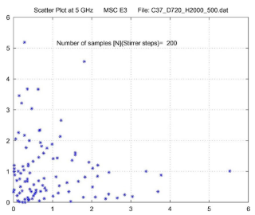
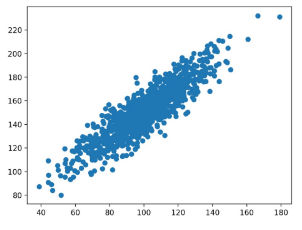
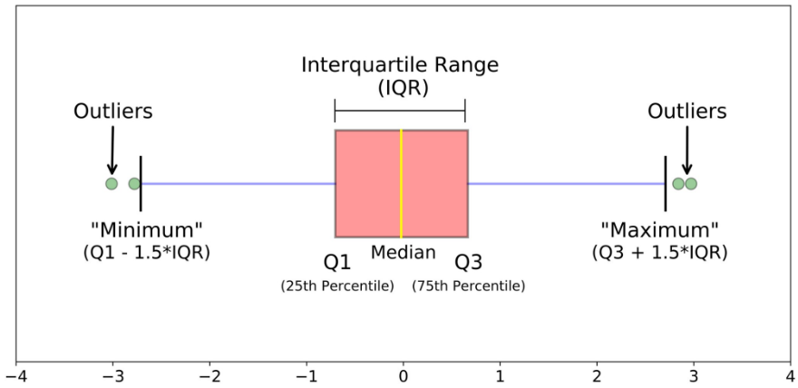
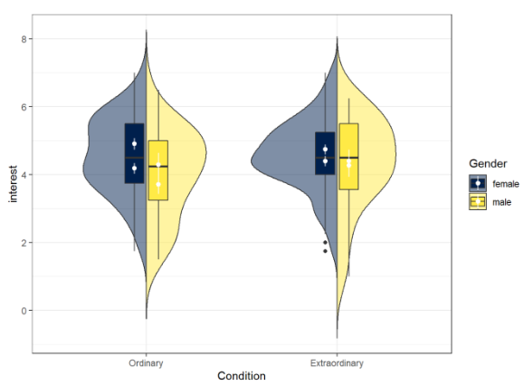

- [Simulazione](#simulazione)
  - [Tipologie di Simulazione](#tipologie-di-simulazione)
    - [Steps per una Buona Simulazione](#steps-per-una-buona-simulazione)
    - [Vantaggi della Simulazione](#vantaggi-della-simulazione)
      - [Errori Classici](#errori-classici)
  - [Richiami alla Statistica](#richiami-alla-statistica)
    - [Esperimenti Ripetuti](#esperimenti-ripetuti)
      - [Intervalli di Confidenza](#intervalli-di-confidenza)
  - [Costruzione dei Modelli](#costruzione-dei-modelli)
    - [Accreditamento](#accreditamento)
    - [Tecniche di Verifica](#tecniche-di-verifica)
  - [Descrizione degli Input](#descrizione-degli-input)
    - [Rappresentazione di una Variabile Casuale](#rappresentazione-di-una-variabile-casuale)
      - [Box Plot](#box-plot)
      - [Plot a Violino](#plot-a-violino)
    - [Confronto tra due Variabili](#confronto-tra-due-variabili)
  - [Analisi dei Dati](#analisi-dei-dati)
    - [Ridurre la Varianza](#ridurre-la-varianza)

# Simulazione

Una **simulazione** è un'**_implementazione software_** del modello di un sistema di cui si vogliono stimare le performance. Creando una simulazione l'**obiettivo** è quello di _creare un modello del sistema che ne descrive il comportamento_. Una simulazione permette di **valutare le prestazioni del sistema** sotto _condizioni differenti_ e **stimarne il comportamento** a seguito di *nuove **modifiche***.

## Tipologie di Simulazione

Una simulazione può definirsi **`STATICA`** o **`DINAMICA`** a seconda se il **_tempo_** viene considerato come grandezza del modello. Le simulazioni _statiche_ vengono per lo più utilizzate per ricercare _situazioni di equilibrio_. Può essere **`DETERMINISTICA`** o **`STOCASTICA`**: nel primo caso vengono utilizzati _dati ben definiti_, nel secondo caso nella simulazione vengono definite delle _grandezze_ sotto forma di **_variabili aleatorie_**. Per ultimo, le simulazioni possono essere **`DISCRETE`** o **`CONTINUE`**: nelle simulazioni discrete il tempo si considera diviso in **_periodi o eventi_** (non necessariamente uguali tra loro) in cui avviene qualcosa; in risposta a questi eventi il simulatore _cambia lo stato interno del sistema_. In una simulazione continua si assume che il _tempo non possa essere diviso in eventi_. La scelta di questo tipo di approccio dipende dal tipo di sistema (es. Traffico Stradale: un approccio discreto può essere quello che modella la singola auto, un approccio continuo invece modella il traffico considerando singoli tratti di strada).

Un **simulatore discreto** presenta un **concetto di stato**: una **_collezione di funzioni_** (es. di inizializzazione), uno **_scheduler di eventi_** (con la relativa _coda_). Quando l'esecuzione di un evento termina, c'è un **_sistema_** che recupera dalla coda il prossimo evento. Questo meccanismo si occupa anche dell'inserimento in coda di nuovi eventi e della loro rimozione. Inoltre un simulatore di questo tipo presenta meccanismi **data collectors** per _raccogliere informazioni_ sugli _elementi del simulatore_ e produrre qualche tipo di output. Per ultimo, gli **strumenti** per _l'avvio_ e la _terminazione_ dei processi.

### Steps per una Buona Simulazione

1. **`DEFINIZIONE DEL PROBLEMA DI INTERESSE`**: occorre _interrogarsi sulle domande a cui si vuole ottenere una risposta_. Deve essere chiaro **_cosa si vuole misurare_** (**`KPI`**: _Key Performance Indicator_) e l'**_area di validità del modello_**. Questa _fase è fondamentale_ perché _determina tutte le scelte progettuali future_.
2. **`DEFINIZIONE DEL MODELLO`** _raccogliendo informazioni_. Si tratta di una fase iterativa che può coinvolgere anche più persone e che consiste nella _produzione di domande_ sulla base di alcuni documenti di partenza: queste domande potranno poi essere oggetto di indagine. In questa fase è necessario **\*collezionare i dati** di performance del modello esistente* (*workload\*) e **_definire il livello di dettaglio_**.
3. **`VALIDAZIONE DEL MODELLO`**
4. **`SVILUPPO SW SIMULATORE`**
5. **`VALIDAZIONE DEL SIMULATORE`**. Il simulatore viene **_comparato al modello teorico_**. In questa fase può essere svolta un'**_analisi di sensibilità_**, durante la quale possono essere _cambiati alcuni parametri_ del modello (testati in un range) per vedere se il loro _cambiamento influisce sui risultati_ (es. osservare come il cambiamento del coefficiente di variazione del tempo di servizio influisce sul tempo di risposta).
6. **`DEFINIRE GLI ESPERIMENTI`** avere _run sufficientemente lunghe_ (ma non troppo). Se si è interessati maggiormente all'**_assestamento del sistema_**, può avere senso introdurre un **periodo di riscaldamento** nella simulazione. Anche il **numero di run** è qualcosa da tenere in considerazione: ad ogni run è possibile raccogliere delle metriche (valori medi, coefficienti di variazione della singola run) che vengono trattate come _valori di un'altra variabile aleatoria_ che, essendo campioni indipendenti tra loro, tende a disporsi secondo una curva che _approssima la Gaussiana_. È importante **definire un buon numero di run** per calcolare il **_valore medio atteso_** e per dare una **_stima della varianza dei risultati_**, e quindi un **intervallo di confidenza**.
7. **`FARE GLI ESPERIMENTI`**
8. **`ANALISI DEI DATI`**
9. **`COSTRUIRE UN REPORT`**. Un buon report **non salta a conclusioni**, ma presenta tutti i dati che permettono al _management_ di _prendere le dovute decisioni_. Si parla dei _risultati ottenuti_ facendo riferimento ai _parametri utilizzati_. Inoltre è sempre bene ricordare le **_assunzioni_** e i **_limiti di validità_** dell'analisi.

### Vantaggi della Simulazione

L'utilizzo di una simulazione permette di **lavorare con sistemi molto complessi** anche dove i _modelli analitici cominciano ad andare in crisi_. I modelli analitici sono soliti comportarsi bene quando si hanno delle _distribuzioni che seguono determinate caratteristiche_. Passando da un sistema `M/M/1` o `M/G/1` a uno `G/G/N` le formule diventano molto complicate ed è necessario fare ulteriori semplificazioni. Nei sistemi informatici **_il valore medio non è sempre significativo_**: quando c'è un problema i valori medi vengono a meno perché non sono più descrittivi per il sistema. I _percentili_ o le _mediane_ se trattati con metodi matematici classici risultano comunque complessi: una simulazione permette di analizzare queste metriche senza troppi problemi.

Un simulatore risulta comodo anche per **_analizzare scenari `what-if`_** e per condurre delle **_analisi di sensibilità su un parametro_** (anche se più complicato), oltre che per **_esplorare finestre temporali molto lunghe_**. Il simulatore fornisce anche informazioni in merito a _quanti eventi al secondo processa e quanti secondi di tempo simulato per tempo reale sta utilizzando_. In **pochi minuti** è possibile **_esplorare ore o giorni di tempo_**.

È importante ricordare che **un simulatore è buono se è buono il modello che implementa**: _tutto parte dal modello_.

#### Errori Classici

- Cattiva definizione degli **_obiettivi della simulazione_**
- Cattiva definizione del **_livello di dettaglio_** (spesso causata anche dai _clienti_ che non sanno su quale aspetto del sistema vogliono conoscere delle risposte). Richiedere una simulazione su "_tutto il sistema_" vuol dire _non fare assunzioni per la semplificazione di alcuni aspetti_: per una simulazione di questo tipo i tempi di esecuzione e i costi diventano paragonabili al sistema vero, si perde il senso di fare una simulazione. Per poter esplorare una _vasta varietà di configurazioni_ è necessario _non aggiungere un elevato livello di dettaglio al sistema_. Se non si conoscono alcuni elementi del sistema è sempre meglio tralasciarli piuttosto che sfociare in errore.
- Utilizzo di un **modello sbagliato**. È necessario \*conoscere le **variabili di input\*** e le sue **_`KPI`_**.
- Considerare il simulatore come un **_software da scrivere_**. Creare un simulatore prevede _anche una parte di programmazione_, ma non esclusivamente quella. I passaggi precedenti di _modellazione dei problemi_ e _analisi statistica_ non vanno sottovalutati.

## Richiami alla Statistica

Con il termine **esperimento** si fa riferimento a un **_campionamento di una certa variabile aleatoria_**. L'output ottenibile da una simulazione è un _insieme di risultati_. La **densità di probabilità** è una funzione che esprime la _probabilità che una variabile aleatoria abbia esattamente uno specifico valore_: l'integrale di questa funzione è $1$, così come la somma di tutte le probabilità.

Il **valore medio** viene indicato con la lettera $\mu$. La **mediana** è quel valore $x$ tale che $P(X\leq x) =  0.5$. I **quantili** possono essere definiti in modo similare: il _primo_, _secondo_ e _terzo_ quartile corrispondono a $\frac{1}{4}$, $\frac{2}{4}$ e $\frac{3}{4}$, analogamente possono essere definiti i _percentili_. La **varianza** è la _differenza_ tra il _valore della variabile_ e il _valore medio_ al quadrato, si esprime come $\sigma ^2 = E[(X-\mu)^2]$. la **deviazione standard** è la _radice quadrata della varianza_: $\sigma = \sqrt{\sigma^2}$.

Le **variabili** possono essere **_indipendenti_** o **_correlate_**. Le variabili indipendente possono essere studiate separatamente, mentre per quelle correlate è necessario _studiare le interazioni tra le variabili_. Lo studio delle variabili correlate è importante quando si deve fare un'**_analisi di sensibilità_** rispetto a un determinato parametro. La _correlazione_ tra variabili è _molto comune_.

### Esperimenti Ripetuti

Utilizzando **_seed differenti_** per la **_generazione di numeri casuali_** è possibile ottenere dei **_risultati indipendenti tra loro_**. È possibile utilizzare il **`TEOREMA DEL LIMITE CENTRALE`** per affermare che il risultato degli esperimenti tenderà a disporsi secondo una _Gaussiana_.

Facendo _molti esperimenti_, per la **`LEGGE DEI GRANDI NUMERI`**, assumendo $N\rightarrow \infty$ (dove $N$ è il numero di esperimenti), il **_valore medio degli esperimenti_** corrisponde al **_valore medio della variabile aleatoria studiata_**.

Graficamente la **varianza** si dice **_alta_** quando è bassa (vicina all'asse delle ascisse) e il _picco è ampio_, **_bassa_** quando è _elevata_ e il _picco è a punta_. Questa può essere utilizzata per conoscere il **_valore medio_** e l'**_intervallo di confidenza_** della variabile aleatoria.

#### Intervalli di Confidenza

**`INTERVALLO DI CONFIDENZA`**: Quando faccio una simulazione il **risultato** che ne deriva è un ***numero*** *con* un ***intervallo di confidenza***. È un **insieme di valori probabili per il parametro analizzato**.

Quando si ha una **_variabile Gaussiana_** la confidenza si esprime come:

- $\mu \pm \sigma$ &rarr; $68\%$
- $\mu \pm 3\sigma$ &rarr; $99\%$

## Costruzione dei Modelli

Un **modello** è una _rappresentazione accurata del sistema_: la sua costruzione prevede diverse fasi.

1. **`VALIDAZIONE`** _accerta l'accuratezza del modello_.
2. **`VERIFICA`**: _accerta la corrispondenza tra il modello teorico creato e quello reale_.
3. **`STABILIRE LA CREDIBILITÀ DELLE INFORMAZIONI`**: corrispondente all'ultima _fase di analisi e presentazione dei risultati_, che devono essere presentati in modo efficace affinché gli esperti diano il giusto peso agli elementi evidenziati.

### Accreditamento

Regole per essere abilitati presso il _Dipartimento di Difesa_ (DoD) in USA. Dovendo fare sempre simulazioni (es. volo aereo) hanno stabilito delle procedure e delle **regole riconosciute** per _verificare l'accettabilità di una simulazione_. Sono:

- **verifica** e **validazione** del _modello_
- **capacità di sviluppo software** (_reputazione come sviluppatore_)
- **disponibilità** e **qualità** dei _dati_
- **qualità della documentazione**
- **qualità dei limiti** e delle **assunzioni**

Aggiungere _tanti dettagli_ alla simulazione è un **_errore comune_**: può _compromettere la scalabilità della simulazione_.

### Tecniche di Verifica

- Utilizzo di un **approccio modulare** **_testando singoli componenti_** (_Unit Testing_)
- Lavorare su **problemi semplici** (_piccole run_)
- Rendere gli **esperimenti riproducibili** (_inizializzare i `seed` dei generatori di numeri casuali_)

## Descrizione degli Input

Tipicamente le informazioni che si hanno a disposizione sono contenute nei _dati storici_: è possibile approssimare le *funzioni di densità di probabilità con una rappresentazione a **istogramma*** oppure con **_modelli matematici_**. Le classiche distribuzioni sono:

- **esponenziale**
- **gaussiana**

I numeri casuali utilizzati nelle simulazioni utilizzano un `seed` per essere _inizializzati_ (es. nel linguaggio `C` si utilizza la funzione `srand()`). Questi numeri **_non sono veramente numeri casuali_**. Il fatto di utilizzare una **_funzione deterministica_** offre il vantaggio che, partendo dallo stesso seme, è possibile ottenere gli stessi risultati in una simulazione, rendendo gli **esperimenti riproducibili**.

Per studiare la correlazione di due valori tra loro è possibile utilizzare uno strumento chiamato **scatter plot**. Se i valori presenti nel grafico risultante tendono a disporsi in una _nuvola che si addensa intorno a una retta_ questo è un **_segno di correlazione_** tra le due variabili; viceversa se le variabili tendono a _occupare in maniera più o meno uniforme l'area_ la **_correlazione è bassa_**.

### Rappresentazione di una Variabile Casuale

#### Box Plot

Il quadrato che ha come lunghezza l'**intervallo interquartile** si costruisce utilizzando la **_mediana_**, il **_primo e il terzo quartile_**. Dopodiché vengono indicati i "baffi" come _stime di valori minimo e massimo_. I valori che stanno _sopra_ o _sotto_ a questi due baffi prendono il nome di **outliers**.

#### Plot a Violino

Consiste nella **rappresentazione della probabilità di densità**. Utile quando si hanno _variabili con comportamenti multi modali_ dove _distribuzioni di probabilità diverse_ portano ad avere _lo stesso tipo di Box Plot_. Un grafico a violino mette in risalto le mode e le differenze che un Box Plot non verrebbero notate.

### Confronto tra due Variabili

Oltre a utilizzare lo _scatter plot_, è possibile fare un **_confronto tra le distribuzioni di probabilità_**.

- **`P-P Plot`**: considera i **_singoli punti della variabile di densità di probabilità_** e li va a _sovrapporre per ogni variabile $x$_
- **`Q-Q Plot`**: analoga la precedente ma _non considera i singoli punti della funzione di densità di probabilità_, ma i **_quantili_** / **_percentili_**. Con i percentili si _evidenziano meglio le differenze sulla testa e la coda_, zone in cui il `P-P Plot` non rende.

## Analisi dei Dati

Gli obiettivi di una simulazione si riassumono in due analisi:

- **`STATO STABILE DEL SISTEMA`**: dove si considerano i _valori medi_ (es. _tempo di risposta medio_). L'analisi rispetto allo stato stabile (situazioni stazionarie) _non significa avere valori costanti_. L'**_evoluzione del carico di lavoro può essere presente_**, ma è molto più lenta rispetto alla tempistica di arrivo delle richieste.
- **`COMPORTAMENTO TRANSITORIO DEL SISTEMA`**

Le simulazioni possono essere:

- **`SIMULAZIONI CHE TERMINANO`**: presentano un **_evento_** identificabile come \*evento **di fine\***
- **`ILLIMITATE`**: per lo più utilizzate nell'**_analisi di fenomeni transitori_**. Il programmatore decide l'**_intervallo di tempo di interesse_** in modo da **_forzare in maniera arbitraria la simulazione_**. in queste simulazioni solitamente interessano i _parametri stazionari_ (comportamenti a regime) oppure _elementi stazionari ma ciclici_.

Un'**analisi dei cicli** può essere utile quando si vuole _cercare dei comportamenti oscillatori_ (variazioni giornaliere) o dei _trend_ (periodi dell'anno).

### Ridurre la Varianza

Nel confronto di scenari differenti è sempre utile **_utilizzare gli stessi `seed`_**: questo permettere di descrivere il _sistema secondo lo stesso processo di arrivo_. Una seconda opzione consiste nell'**utilizzare dei generatori di numeri casuali** che hanno **_serie temporali negativamente correlate tra loro_**: così che tra due run successive, se la prima porta al di sopra del _valore medio_, la seconda porta i risultati al di sotto. Normalmente i `seed` di questi generatori di numeri casuali sono _scelti accuratamente_, pertanto il programmatore non se ne deve preoccupare più di tanto.
