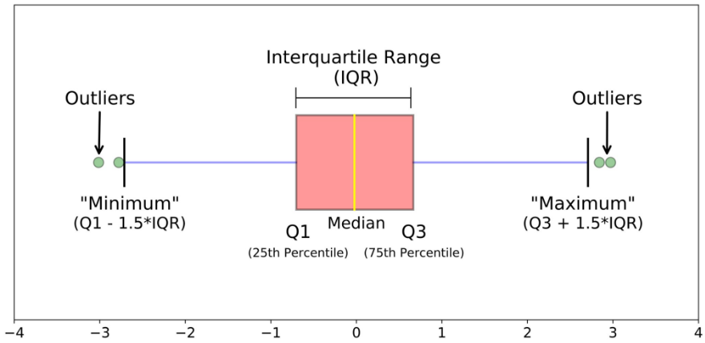
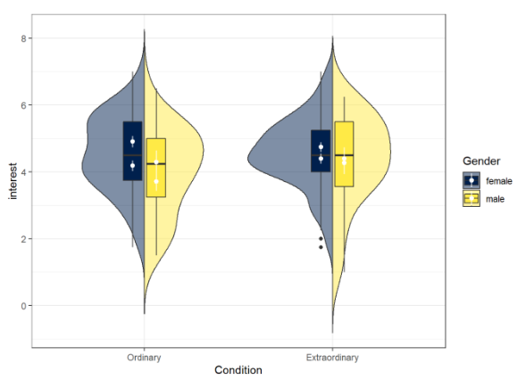

- [Simulazione](#simulazione)
  - [Tipologie di Simulazione](#tipologie-di-simulazione)
    - [Steps per una Buona Simulazione](#steps-per-una-buona-simulazione)
    - [Vantaggi della Simulazione](#vantaggi-della-simulazione)
      - [Errori Classici](#errori-classici)
  - [Richiami alla Statistica](#richiami-alla-statistica)
    - [Esperimenti Ripetuti](#esperimenti-ripetuti)
      - [Intervalli di Confidenza](#intervalli-di-confidenza)
  - [Costruzione dei Modelli](#costruzione-dei-modelli)
    - [Accreditamento](#accreditamento)
    - [Tecniche di Verifica](#tecniche-di-verifica)
  - [Descrizione degli Input](#descrizione-degli-input)
    - [Rappresentazione di una Variabile Casuale](#rappresentazione-di-una-variabile-casuale)
      - [Box Plot](#box-plot)
      - [Plot a Violino](#plot-a-violino)
    - [Confronto tra due Variabili](#confronto-tra-due-variabili)
  - [Analisi dei Dati](#analisi-dei-dati)
    - [Ridurre la Varianza](#ridurre-la-varianza)

# Simulazione

Una **simulazione** è un'***implementazione software*** del modello di un sistema di cui si vogliono stimare le performance. Quando si crea una simulazione l'**obiettivo** è quello di *creare un modello del sistema che ne descrive il comportamento*. Questo approccio permette di **valutare le prestazioni** sotto *condizioni differenti* e *stimare il **comportamento** del sistema* a seguito di *nuove **modifiche***.

## Tipologie di Simulazione

Una simulazione può definirsi **`STATICA`** o **`DINAMICA`** a seconda se il ***tempo*** viene considerato come grandezza del modello. Le simulazioni *statiche* vengono per lo più utilizzate per ricercare *situazioni di equilibrio*. Può essere **`DETERMINISTICA`** o **`STOCASTICA`**: nel primo caso vengono utilizzati *dati ben definiti*, nel secondo caso nella simulazione vengono definite delle *grandezze* sotto forma di ***variabili aleatorie***. Per ultimo, le simulazioni possono essere **`DISCRETE`** o **`CONTINUE`**: nelle simulazioni discrete il tempo si considera diviso in ***periodi o eventi*** (non necessariamente uguali tra loro) in cui avviene qualcosa; in risposta a questi eventi il simulatore *cambia lo stato interno del sistema*. In una simulazione continua si assume che il *tempo non possa essere diviso in eventi*. La scelta di questo tipo di approccio dipende dal tipo di sistema (es. Traffico Stradale: un approccio discreto può essere quello che modella la singola auto, un approccio continuo invece modella il traffico considerando singoli tratti di strada).

Un **simulatore discreto** presenta un **concetto di stato**: una ***collezione di funzioni*** (es. di inizializzazione), uno ***scheduler di eventi*** (con la relativa *coda*). Quando l'esecuzione di un evento termina, c'è un ***sistema*** che recupera dalla coda il prossimo evento. Questo meccanismo si occupa anche dell'inserimento in coda di nuovi eventi e della loro rimozione. Inoltre un simulatore di questo tipo presenta meccanismi **data collectors** per *raccogliere informazioni* sugli *elementi del simulatore* e produrre qualche tipo di output. Per ultimo, gli **strumenti** per *l'avvio* e la *terminazione* dei processi.

### Steps per una Buona Simulazione

1. **`DEFINIZIONE DEL PROBLEMA DI INTERESSE`**: occorre *interrogarsi sulle domande a cui si vuole ottenere una risposta*. Deve essere chiaro ***cosa si vuole misurare*** (**`KPI`**: *Key Performance Indicator*) e l'***area di validità del modello***. Questa *fase è fondamentale* perché *determina tutte le scelte progettuali future*.
2. **`DEFINIZINE DEL MODELLO`** *raccogliendo informazioni*. Si tratta di una fase iterativa che può coinvolgere anche più persone e che consiste nella *produzione di domande* sulla base di alcuni documenti di partenza: queste domande potranno poi essere oggetto di indagine. In questa fase è necessario ***collezionare i dati** di performance del modello esistente* e ***definire il livello di dettaglio***.
3. **`VALIDAZIONE DEL MODELLO`**. Durante questa fase può essere svolta un'***analisi di sensibilità***, durante la quale possono essere *cambiati alcuni parametri* del modello (testati in un range) per vedere se il loro *cambiamento influisce sui risultati* (es. osservare come il cambiamento del coefficiente di variazione del tempo di servizio influisce sul tempo di risposta).
4. **`DEFINIRE GLI ESPERIMENTI`** avere *run sufficientemente lunghe* (ma non troppo). Se si è interessati maggiormente all'***assestamento del sistema***, può avere senso introdurre un **periodo di riscaldamento** nella simulazione. Anche il **numero di run** è qualcosa da tenere in considerazione: ad ogni run è possibile raccogliere delle metriche (valori medi, coefficienti di variazione della singola run) che vengono trattate come *valori di un'altra variabile aleatoria* che, essendo campioni indipendenti tra loro, tende a disporsi secondo una curva che *approssima la Gaussiana*. È importante **definire un buon numero di run** per calcolare il ***valore medio atteso*** e per dare una ***stima della varianza dei risultati***, e quindi un **intervallo di confidenza**.
5. **`FARE GLI ESPERIMENTI`**
6. **`ANALISI DEI DATI`**
7. **`COSTRUIRE UN REPORT`**. Un buon report **non salta a conclusioni**, ma presenta tutti i dati che permettono al *management* di *prendere le dovute decisioni*. Si parla dei *risultati ottenuti* facendo riferimento ai *parametri utilizzati*. Inoltre è sempre bene ricordare le ***assunzioni*** e i ***limiti di validità*** dell'analisi.

### Vantaggi della Simulazione

L'utilizzo di una simulazione permette di **lavorare con sistemi molto complessi** anche dove i *modelli analitici cominciano ad andare in crisi*. I modelli analitici sono soliti comportarsi bene quando si hanno delle *distribuzioni che seguono determinate caratteristiche*. Passando da un sistema `M/M/1` o `M/G/1` a uno `G/G/N` le formule diventano molto complicate ed è necessario fare ulteriori semplificazioni. Nei sistemi informatici ***il valore medio non è sempre significativo***: quando c'è un problema i valori medi vengono a meno perché non sono più descrittivi per il sistema: spesso si guardano i *percentili* o le *mediane*, che se trattate con metodi matematici classici risultano comunque complessi: una simulazione permette di analizzare anche queste metriche senza troppi problemi.

Un simulatore risulta comodo anche per ***analizzare scenari `what-if`*** e per condurre delle ***analisi di sensibilità su un parametro*** (anche se più complicato), oltre che per ***esplorare finestre temporali molto lunghe***. Il simulatore fornisce anche informazioni in merito a *quanti eventi al secondo processa e quanti secondi di tempo simulato per tempo reale sta utilizzando*. In **pochi minuti** è possibile ***esplorare ore o giorni di tempo***.

È importante ricordare che **un simulatore è buono se è buono il modello che implementa**: *tutto parte dal modello*.

#### Errori Classici

- Cattiva definizione degli ***obiettivi della simulazione***
- Cattiva definizione del ***livello di dettaglio*** (spesso causata anche dai *clienti* che non sanno su quale aspetto del sistema vogliono conoscere delle risposte). Richiedere una simulazione su "*tutto il sistema*" vuol dire *non fare assunzioni per la semplificazione di alcuni aspetti*: per una simulazione di questo tipo i tempi di esecuzione e i costi diventano paragonabili al sistema vero, si perde il senso di fare una simulazione. Per poter esplorare una *vasta varietà di configurazioni* è necessario *non aggiungere un elevato livello di dettaglio al sistema*. Se non si conoscono alcuni elementi del sistema è sempre meglio tralasciarli piuttosto che sfociare in errore.
- Utilizzo di un **modello sbagliato**. È necessario *conoscere le **variabili di input*** e le sue ***`KPI`***.
- Considerare il simulatore come un ***software da scrivere***. Creare un simulatore prevede *anche una parte di programmazione*, ma non esclusivamente quella. Prima ci sono dei passaggi di *modellazione dei problemi* e *analisi statistica* che non vanno sottovalutati.

## Richiami alla Statistica

Con il termine **esperimento** si fa riferimento a un ***campionamento di una certa variabile aleatoria***. L'output ottenibile da una simulazione è un *insieme di risultati*. La **densità di probabilità** è una funzione che esprime la *probabilità che una variabile aleatoria abbia esattamente uno specifico valore*: l'integrale di questa funzione è $1$, così come la somma di tutte le probabilità.

Il **valore medio** viene indicato con la lettera $\mu$. La **mediana** è quel valore $x$ tale che $P(X\leq x) =  0.5$. I **quantili** possono essere definiti in modo similare: il *primo*, *secondo* e *terzo* quartile corrispondono a $\frac{1}{4}$, $\frac{2}{4}$ e $\frac{3}{4}$, analogamente possono essere definiti i *percentili*. La **varianza** è la *differenza* tra il *valore della variabile* e il *valore medio* al quadrato, si esprime come $\sigma ^2 = E[(X-\mu)^2]$. la **deviazione standard** è la *radice quadrata della varianza*: $\sigma = \sqrt{\sigma^2}$.

Le **variabili** possono essere ***indipendenti*** o ***correlate***. Le variabili indipendente possono essere studiate separatamente, mentre per quelle correlate è necessario *studiare le interazioni tra le variabili*. Lo studio delle variabili correlate è importante quando si deve fare un'***analisi di sensibilità*** rispetto a un determinato parametro. La *correlazione* tra variabili è *molto comune*.

### Esperimenti Ripetuti

Utilizzando ***seed differenti*** per la ***generazione di numeri casuali*** è possibile ottenere dei ***risultati indipendenti tra loro***. È possibile utilizzare il **`TEOREMA DEL LIMITE CENTRALE`** per affermare che il risultato degli esperimenti tenderà a disporsi secondo una *Gaussiana*.

Facendo *molti esperimenti*, per la **`LEGGE DEI GRANDI NUMERI`**, assumendo $N\rightarrow \infty$ (dove $N$ è il numero di esperimenti), il ***valore medio degli esperimenti*** corrisponde al ***valore medio della variabile aleatoria studiata***. 

Graficamente la **varianza** di dice ***alta*** quando è bassa (vicina all'asse delle ascisse) e il *picco è ampio*, ***bassa*** quando è *elevata* e il *picco è a punta*. La varianza può essere utilizzata per conoscere il ***valore medio*** e l'***intervallo di confidenza*** della variabile aleatoria.

#### Intervalli di Confidenza

Quando si una una ***variabile Gaussiana*** la confidenza si esprime come:

- $\mu \pm \sigma$ &rarr; $68\%$
- $\mu \pm 3\sigma$ &rarr; $99\%$

## Costruzione dei Modelli

Un **modello** è una *rappresentazione accurata del sistema*: la sua costruzione prevede diverse fasi.

1. **`VALIDAZIONE`** *accerta l'accuratezza del modello*. 
2. **`VERIFICA`**: *accerta la corrispondenza tra il modello teorico creato e quello reale*.
3. **`STABILIRE LA CREDIBILITÀ DELLE INFORMAZIONI`**: corrispondente all'ultima *fase di analisi e presentazione dei risultati*, che devono essere presentati in modo efficace affinché gli esperti diano il giusto peso agli elementi evidenziati.

### Accreditamento

Regole per essere abilitati presso il *Dipartimento di Difesa* (DoD) in USA. Dovendo fare sempre simulazioni (es. volo aereo) hanno stabilito delle procedure e delle **regole** per *verificare l'accettabilità di una simulazione* che sono riconosciute. Gli elementi sono:

- **verifica** e **validazione** del *modello*
- **capacità di sviluppo software** (*reputazione come sviluppatore*)
- **disponibilità** e **qualità** dei *dati*
- **qualità della documentazione**
- **qualità dei limiti** e delle **assunzioni**

Aggiungere *tanti dettagli* alla simulazione è un ***errore comune***: questo può andare a *compromettere la scalabilità della simulazione*.

### Tecniche di Verifica

- Utilizzo di un **approccio modulare** ***testando singoli componenti*** (*Unit Testing*)
- Lavorare su **problemi semplici** (*piccole run*)
- Rendere gli **esperimenti riproducibili** (*inizializzare i `seed` dei generatori di numeri casuali*)

## Descrizione degli Input

Tipicamente le informazioni che si hanno a disposizione sono contenute nei *dati storici*: è possibile approssimare le *funzioni di densità di probabilità con una rappresentazione a **istogramma*** oppure con ***modelli matematici***. Le classiche distribuzioni sono quelle:

- **esponenziale**
- **gaussiana**

I numeri casuali utilizzati nelle simulazioni utilizzano un `seed` per essere *inizializzati* (es. nel linguaggio `C` si utilizza la funzione `srand()`). Questi numeri ***non sono veramente numeri casuali***. Il fatto di utilizzare una ***funzione deterministica*** offre il vantaggio che, partendo dallo stesso seme, è possibile ottenere gli stessi risultati in una simulazione, rendendo gli **esperimenti riproducibili**.

Per studiare la correlazione di due valori tra loro è possibile utilizzare uno strumento chiamato **scatter plot**. Se i valori presenti nel grafico risultante tendono a disporsi in una *nuvola che si addensa intorno a una retta* questo è un ***segno di correlazione*** tra le due variabili; viceversa se le variabili tendono a *occupare in maniera più o meno uniforme l'area* la ***correlazione è bassa***.

### Rappresentazione di una Variabile Casuale

#### Box Plot

Il quadrato che ha come lunghezza l'**intervallo interquartile** si costruisce utilizzando la ***mediana***, il ***primo e il terzo quartile***. Dopodiché vengono indicati i "baffi" come *stime di valori minimo e massimo*. I valori che stanno *sopra* o *sotto* a questi due baffi prendono il nome di **outliers**.

#### Plot a Violino

Consiste nella **rappresentazione della probabilità di densità**. Utile quando si hanno *variabili con comportamenti multi modali* dove *distribuzioni di probabilità diverse* portano ad avere *lo stesso tipo di Box Plot*. Un grafico a violino mette in risalto le mode e le differenze che un Box Plot non verrebbero notate.

### Confronto tra due Variabili

Oltre a utilizzare lo *scatter plot*, è possibile fare un ***confronto tra le distribuzioni di probabilità***.

- **`P-P Plot`**: considera i ***singoli punti della variabile di densità di probabilità*** e li va a *sovrapporre per ogni variabile $x$*
- **`Q-Q Plot`**: analoga la precedente ma *non considera i singoli punti della funzione di densità di probabilità*, ma i ***quantili*** / ***percentili***. In generale con i percentili si *evidenziano meglio le differenze sulla testa e la coda*, zone in cui il `P-P Plot` non rende bene.

## Analisi dei Dati

Gli obiettivi di una simulazione si riassumono in due analisi:

- **`STATO STABILE DEL SISTEMA`**: dove si considerano i *valori medi* (es. *tempo di risposta medio*). L'analisi rispetto allo stato stabile (situazioni stazionarie) *non significa avere valori costanti*. L'***evoluzione del carico di lavoro può essere presente***, ma è molto più lenta rispetto alla tempistica di arrivo delle richieste.
- **`COMPORTAMENTO TRANSITORIO DEL SISTEMA`**

Le simulazioni possono essere:

- **`SIMULAZIONI CHE TERMINANO`**: presentano un ***evento*** identificabile come *evento **di fine***
- **`ILLIMITATE`**: per lo più utilizzate nell'***analisi di fenomeni transitori***. Il programmatore decide l'***intervallo di tempo di interesse*** in modo da ***forzare in maniera arbitraria la simulazione***. in queste simulazioni solitamente interessano i *parametri stazionari* (comportamenti a regime) oppure *elementi stazionari ma ciclici*.

Un'**analisi dei cicli** può essere utile quando si vuole *cercare dei comportamenti oscillatori* (variazioni giornaliere) o dei *trend* (periodi dell'anno).

### Ridurre la Varianza

Nel confronto di scenari differenti è sempre utile ***utilizzare gli stessi `seed`***: questo permettere di descrivere il *sistema secondo lo stesso processo di arrivo*. Una seconda opzione consiste nell'**utilizzare dei generatori di numeri casuali** che hanno ***serie temporali negativamente correlate tra loro***: così che tra due run successive, se la prima porta al di sopra del *valore medio*, la seconda porta i risultati al di sotto. Normalmente i `seed` di questi generatori di numeri casuali sono *scelti accuratamente*, pertanto il programmatore non se ne deve preoccupare più di tanto.
