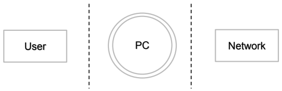
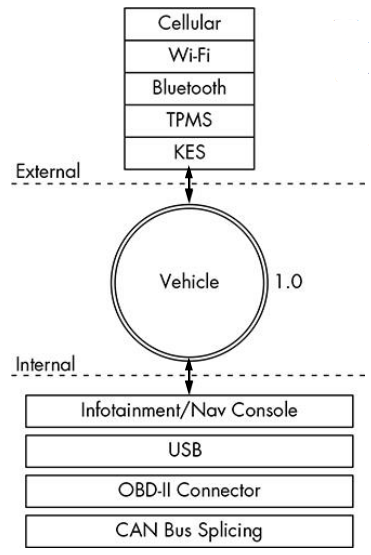

- [3. Attaccare un Veicolo Moderno](#3-attaccare-un-veicolo-moderno)
  - [Confine di Fiducia](#confine-di-fiducia)
  - [Minacce ad Alto Livello](#minacce-ad-alto-livello)
    - [Rete Cellulare](#rete-cellulare)
      - [OnStar](#onstar)
      - [JEEP Cherokee 2014](#jeep-cherokee-2014)
    - [Wi-Fi](#wi-fi)
    - [Keyless Entry Systems, Telecomandi, Immobilizzatore](#keyless-entry-systems-telecomandi-immobilizzatore)
    - [Tire Pressure Monitoring System](#tire-pressure-monitoring-system)
    - [Infotainment](#infotainment)
    - [USB & Bluetooth](#usb--bluetooth)
    - [CAN](#can)
    - [GPS](#gps)

# 3. Attaccare un Veicolo Moderno

La superficie di attacco è la somma di tutti i vettori di attacco, che sono a loro volta qualsiasi "punto di ingresso" o "canale di comunicazione" che un attaccante può usare per interagire con il sistema.

È bene quindi ***ridurre al minimo il numero di vettori di attacco nel sistema***. L'esistenza di un vettore di attacco non implica la presenza di una vulnerabilità del software o che un attaccante possa sfruttarlo.

## Confine di Fiducia

Il confine di fiducia è il *confine di un sistema*. Questo ***include tutti i sottosistemi*** (componenti hw/sw e dati) che sono considerati fidati e ***che si vogliono difendere da attacchi esterni***.

> <u>Esempio</u>: PC che riceve dati da un *utente* o dalla sua *interfaccia di rete*, due sottosistemi da difendere.
>
> 
>
> Il PC è visto come un sistema complesso cioè un sistema che può essere più lontanamente definito identificando le sue componenti.
> Le linee tratteggiate indicano i confini di fiducia. Le comunicazioni tra tutte le componenti del sistema complesso sono fidate, le comunicazioni che vengono dall'esterno non sono fidate. Gli *elementi oltre le linee tratteggiate* indicano *componenti esterni che possono interagire con il sistema complesso* come inviargli dati. Quando un ***interazione attraversa un confine di fiducia*** è possibile avere un ***vettore di attacco***. **Conoscere il numero di tutti i flussi di dati e confini di fiducia** aiuta ad identificare i controlli di sicurezza richiesti.

## Minacce ad Alto Livello

È possibile considerare il **veicolo** come un **sistema complesso**:

Alcune possibili minacce risiedono in scenari ad alto livello: controllare da remoto il veicolo, spegnere il veicolo, spiare gli occupanti di un veicolo, tracciare e rubare un veicolo. Anche il ***proprietario o il guidatore può essere una minaccia***: potrebbe *modificare file di configurazione* per *incrementare le performance dell'auto* o *ottenere optional che non ha pagato*. Separando il **sistema complesso** del veicolo **nelle sue molteplici componenti** è possibile notare che ***i componenti sono ancora sistemi complessi*** con confini di fiducia, e come tali sono ***soggetti a vettori di attacco***, che possono superare molteplici confini.

Classifichiamo le minacce ad alto livello in base al vettore di attacco:

- Cellulare
- Wi-Fi
- `KES` (*Keyless Entry Systems*)
- `TPMS` (*Tire Pressure Monitoring System*)
- Infotainment
- USB, Bluetooth
- `CAN`

### Rete Cellulare

Utilizzando una **rete cellulare** come veicolo d'attacco l'**attaccante** può ***lanciare un attacco da remoto***. Con un attacco di questo tipo l'attaccante può fare diverse cose:

- ***Accedere alla rete interna*** del veicolo
- Sfruttare l'applicazione dell'infotainment che gestisce le chiamate in ingresso
- Accedere alla SIM (*Subscriber Identity Module*) attraverso l'unità dell'infotainment
- Usare la rete cellulare per ***connettere il sistema di diagnosi remoto*** (OnStar)
- ***Origliare le comunicazioni*** cellulare
- ***Tracciare i movimenti*** del veicolo
- Instaurare una falsa stazione `GSM` (Global System for Mobile Communications)

#### OnStar

**`OnStar`** è un ***sistema di safety*** che *avvisa il proprietario e/o servizi di soccorso* (polizia, ambulanza) *se si verificano problemi di safety* (*incidenti*). La macchina invia continuamente dati (*posizione*, *stato*) a General Motors. Presenta un'**applicazione mobile** dalla quale è possibile ***effettuare remote control molto limitato*** (*aprire la macchina*, *climatizzazione*), che passa da un Cloud di General Motors che valida e comunica alla macchina.

Un hacker di 29 anni è stato in grado di prendere il controllo delle auto *GM*. Installando l'applicazione sul telefono e analizzando il traffico si nota che l'***api endpoint è https*** quindi il ***traffico è criptato***. Cercando di fare un MitM non si può ottenere nulla su https a meno che l'applicazione non verifichi il certificato digitale che è proprio quello che accadeva sull'app iOS.

Come sfruttare questo?

1. l'attaccante posiziona un dispositivo vicino all'auto che falsifica un `SSID` noto al telefono cellulare della vittima
2. una volta tornato il proprietario dell'auto, il suo telefono si bloccherà sull'`SSID` noto e utilizzerà il dispositivo come hotspot
3. il dispositivo attende che il telefono invii una richiesta DNS per `api.gm.com`
4. il dispositivo risponde con l'indirizzo di un server falso che l'attaccante utilizza come `MitM` (anche sullo stesso dispositivo)
5. l'applicazione invia la richiesta di autenticazione al server `MitM`. Non controlla il certificato, quindi sembra tutto a posto: in realtà l'attaccante ha ottenuto nome utente e password
6. a suo piacimento può accedere al vero `api.gm.com` utilizzando le credenziali rubate, ottenere le PII del proprietario, individuare l'auto, sbloccarla, avviare il motore, partire.

#### JEEP Cherokee 2014

Guardando alla configurazione di rete del sistema Uconnect, si può vedere che ha diverse interfacce utilizzate per le comunicazioni. Presenta **due interfacce per le comunicazioni**: 

1. **`uap0`** per **comunicazioni Wi-Fi interne** 
2. **`ppp`** (o `ppp0`) utilizzata per **comunicazioni con il mondo esterno** attraverso i ***servizi `Sprint 3G`***.

L'indirizzo IP privato è l'indirizzo del sistema Uconnect per qualsiasi host connesso all'access point Wi-Fi. Il **primo indirizzo IP pubblico** (`68.28.89.95`) è quello che qualunque host su Internet vedrebbe se comunicasse con il sistema Uconnect: la *porta $6667$* *non è aperta a questo indirizzo*. Il **secondo indirizzo pubblico IP pubblico **(``21.28.103.144`) è il vero indirizzo dell'interfaccia del Uconnect che si affaccia su internet, ma è solo ***disponibile internamente alla rete Sprint***.

La **connessione** tuttavia ***non è limitata a singole antenne o segmenti***: ***qualsiasi dispositivo Sprint*** ovunque nello stato ***può comunicare con qualsiasi altro dispositivo Sprint*** ovunque nello stato. 

Per trovare veicoli vulnerabili si ha solo bisogno di fare uno **scan sulla porta $6667$** da un dispositivo Sprint sugli indirizzi IP 21.0.0.0/8 e 25.0.0.0/8. Qualsiasi cosa risponda è un ***sistema Uconnect vulnerabile*** (o un server `IRC`). Per saperlo con sicurezza, si può **provare telnet** su dispositivo e vedere l'errore "Unknown command". Molti altri veicoli presentano la stessa vulnerabilità.

### Wi-Fi

Attacco **simile** a quello che utilizza la **rete cellulare**. La principale **differenza** consiste nella ***portata della rete***: l'***attaccante deve trovarsi a non più di qualche decina di metri di distanza***. L'**elenco delle possibili conseguenze** è *ancora più ampio* poiché comprende tutti gli ***attacchi Wi-Fi standard*** come jamming, cracking e così via, oltre a quelli specifici del veicolo:

- **Accedere alla rete interna del veicolo** (da fino a 100 metri a anche di più)
- Trovare un **exploit per il software che gestisce le connessioni in ingresso**
- **Installare codice malevolo sull'unità dell'infotainment**
- **Rompere la password del Wi-Fi**
- Creare un **falso access point da negoziante per ingannare il veicolo che sta per essere fatta manutenzione**
- Intercettare le comunicazioni che passano attraverso la rete wifi
- Tracciare il veicolo (BSSID + indirizzo MAC del Wireless Network Interface Controller)
- Tutti gli **attacchi Wi-Fi standard**, niente di specifico (jamming, cracking...)
- **Servizi insicuri esposti tramite Wi-Fi**
- **`SSH` server con credenziali deboli o conosciute** (`MAZDA`)
- Telnet:
  - Ian Tabor ha anche mostrato un analisi del sistema IVI. Si è connesso al dispositivo su `TCP` port $23$ (telnet) senza alcuna autenticazione e ha eseguito comandi.
- Servizi vulnerabili esposti tramite wifi:
  - Daan Keuper e Thijs Alkemade di Computest hanno ottenuto l'***accesso all'account root del sistema*** `IVI` per Volkswagen e Audi: potevano ***eseguire codice da remoto***

### Keyless Entry Systems, Telecomandi, Immobilizzatore

Il sistema di accesso `KEYLESS` funziona con l'auto che cerca costantemente i dispositivi nelle vicinanze, utilizzando una determinata *frequenza* e un determinato *protocollo*. È un **sistema senza crittografia** (molto *più costosa che in ambito IT*). Se uno risponde, l'auto sa che è abbastanza vicina. Le possibili conseguenze sono:

- Inviare **richieste di telecomandi malformate che mettono l'immobilizzatore del veicolo in uno stato sconosciuto**.
- **Interrogare attivamente l'immobilizzatore** per **prosciugare la batteria** della macchina
- **Scaricare** l'alimentazione dal **telecomando**
- **Bloccare una chiave**
- Catturare le informazioni crittografiche trapelate dall'immobilizzatore durante il processo di handshake → protocolli non sicuri
- Algoritmo di forza bruta del telecomando → spazi chiave piccoli
- **Clonare il telecomando**
- **Jamming** del segnale del telecomando
- I jamming dannosi possono essere combinati con replay e altre tecniche per sferrare attacchi di successo
- Attacchi ai KES possibili per crittografia debole
- Attacchi possibili da assunzioni sbagliate nel modello di sicurezza e design del KES

### Tire Pressure Monitoring System

Il Tire Pressure Monitoring System è ormai obbligatorio sui veicoli moderni e ***invia periodicamente le misure di pressione dei pneumatici alla centralina dedicata***. Per mantenere l'**utilizzo della batteria al minimo**, è **senza crittografia** (le *batterie devono durare degli anni*) . Questo vettore di attacco potrebbe essere potenzialmente molto potente:

- Inviare una **condizione impossibile alla centralina motore** (`ECU`), **causando un guasto** che potrebbe essere poi sfruttato
- Indurre l'`ECU` a correggere eccessivamente le condizioni stradali contraffatte
- Mettere il ricevitore `TPMS` o la `ECU` in uno **stato irrecuperabile** che potrebbe causare l'accostamento del conducente per verificare la presenza di una foratura segnalata o che potrebbe persino **rallentare o arrestare il veicolo** (modalità di emergenza)
- Traccia un veicolo in base agli `ID` univoci del `TPMS`
- Imbrogliare il segnale `TPMS` per attivare gli allarmi interni
- Tracciamento veicoli fino a $40m$ con apparecchiature low cost, **accensione a distanza della spia di segnalazione**, disattivazione del sistema `TPMS`
- Esistono anche `TPMS` attivi: ***possibilità di gonfiare un pneumatico a bassa pressione da una riserva di aria ad alta pressione***; gli attacchi possono portare a **pneumatici troppo gonfi**

### Infotainment

La maggior parte dei sistemi di infotainment ha una **modalità di `debug`** da cui è possibile ***modificare una varietà di impostazioni*** diverse che non sono pensate per essere toccate da nessuno, specialmente da persone con cattive intenzioni. Altre possibilità sono:

- Modificare le **impostazioni diagnostiche**

- Trovare un bug di input che causa risultati imprevisti
- Installare **malware sulla console**
- Utilizzare un'applicazione dannosa per **accedere alla rete `CAN` bus interna**
- Utilizzare un'applicazione dannosa per **intercettare le azioni intraprese dagli occupanti del veicolo**
- Utilizzare un'applicazione dannosa per falsificare i dati visualizzati all'utente, come la posizione del veicolo
- I ricercatori dell'azienda olandese Computest hanno rivelato molteplici vulnerabilità nel sistema di infotainment di alcuni modelli Volkswagen e Audi, consentendo loro di accedere in remoto al sistema e requisire microfono, sistema di navigazione e altoparlanti.

### USB & Bluetooth

USB:

- Installare **malware sull'unità infotainment**
- Collegare un dispositivo USB dannoso con file appositamente predisposti progettati per rompere gli importatori sull'unità infotainment, come la rubrica e i decoder MP3
- Installare il **software di aggiornamento modificato sul veicolo**

Dal $2014$, i proprietari di auto **Mazda** modificano e installano app sul proprio infotainment utilizzando `MZD-AIO-TI` (MZD All In One Tweaks Installer) nel forum Mazda3Revolution.

Bluetooth:

- Sfruttare un difetto nello stack Bluetooth dell'unità infotainment
- Caricare informazioni non corrette, come una **rubrica danneggiata progettata per eseguire codice**
- Bloccare il dispositivo Bluetooth

### CAN

Il `CAN` Bus è molto potente poiché **permette di controllare l'intero veicolo**:

- ***Installare un dispositivo diagnostico dannoso*** per inviare pacchetti al `CAN` bus
- Collegarsi direttamente a un `CAN` bus per tentare di **avviare un veicolo senza chiave**
- Collegarsi direttamente a un `CAN` bus per **caricare malware**
- Installare un **dispositivo diagnostico dannoso per rintracciare il veicolo**
- Installare un dispositivo diagnostico dannoso per **abilitare le comunicazioni remote direttamente al `CAN` bus**, trasformando un attacco normalmente interno ora una ***minaccia esterna***

### GPS

Dato che i **pacchetti `gps`** tra i *satelliti e i dispositivi a terra* ***non sono criptati***, ci si può fingere satelliti e dare informazioni errate:

- Trasmettere segnali `GPS` malformati cercando di **suscitare comportamenti imprevisti**
- Intasare i segnali `GPS` in modo da **inibire le abilità di geolocalizzazione**
- Trasmettere **false informazioni di geolocalizzazione**

È possibile **confondere il navigatore satellitare**, probabilmente portando a ***istruzioni di guida errate***. Questo può portare a  **conseguenze rilevanti per la sicurezza**, a seconda di come l'auto utilizza il segnale `GPS`.
