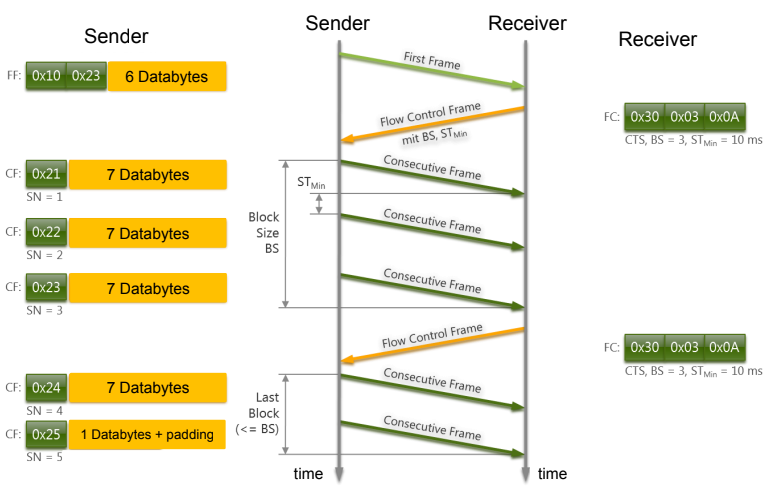

- [7. Interfacce e Protocolli Diagnostici](#7-interfacce-e-protocolli-diagnostici)
  - [Codici di Errore Diagnostici - `DTC`](#codici-di-errore-diagnostici---dtc)
    - [Formato `DTC`](#formato-dtc)
      - [Tools per la lettura di un `DTC`](#tools-per-la-lettura-di-un-dtc)
  - [Altri Protocolli Diagnostici](#altri-protocolli-diagnostici)
    - [ISO-TP](#iso-tp)
      - [Single Frame](#single-frame)
      - [First Frame](#first-frame)
      - [Consecutive Frame](#consecutive-frame)
      - [Flow Control Frame](#flow-control-frame)
        - [Esempio](#esempio)
      - [Richiesta `VIN`](#richiesta-vin)
        - [Ricerca `VIN` online](#ricerca-vin-online)
  - [Tool di Diagnostica Standard](#tool-di-diagnostica-standard)
    - [Comandi Hayes](#comandi-hayes)

# 7. Interfacce e Protocolli Diagnostici

Per fare delle **operazioni diagnostiche** sul veicolo si utilizza la ***porta `OBD`*** (*On Board Diagnostic*). Il connettore `OBD-II` espone molti bus e protocolli diversi oltre al `CAN`: diverse case automobilistiche possono utilizzare una diversa disposizione dei pin oltre a quelle standard come `CAN` (High e Low, rispettivamente sui *pin* $6$ e $14$), `SAE J1850 ` (più lento di `CAN` ma più economico) e `KWP2000/K-Line`, ciò che resta sono connessioni non standard che ciascuna casa automobilistica può utilizzare come preferisce. Lato PC si ha un connettore chiamato **`DB9`** che può avere diversi pinout. Esiste un'evoluzione di `OBD-II` e si chiama **`OBD-III`** e la sua idea principale era quella di poter avere **informazioni sullo stato del veicolo a distanza** senza l'interazione del proprietario con l'infrastruttura tramite una sorta di unità a bordo strada ma ***non è mai stata implementata a causa di alcuni vincoli legali***.

Il `California Air Resources Board` (`CARB`) ha iniziato a testare lettori stradali per OBD-III nel 1994 in grado di leggere i dati del veicolo da otto corsie di traffico che viaggiano a 100 miglia orarie. Se viene rilevato un guasto nel sistema, trasmetterà i **codici di errore diagnostici** (`DTC`) e i **numeri di identificazione del veicolo** (`VIN`) a una infrastruttura vicina. Il sistema riporta i livelli di inquinanti senza dover attendere il controllo periodico delle emissioni. Il veicolo telefona al produttore per segnalare i guasti. Il produttore contatta il proprietario per informarlo della necessità di riparazioni. Problemi legali: ***sorveglianza di massa***, ***monitoraggio***.

## Codici di Errore Diagnostici - `DTC`

Sono **valori standard** che indicano che ***qualcosa non funziona correttamente***. Vengono generati da una `ECU` (tipicamente una "intelligente", come il `PCM`) che fa accendere una ***spia di malfunzionamento*** (`MIL`, *spia gialla del guasto motore*) sul cruscotto e vengono poi memorizzati nella memoria temporanea o permanente della stessa.

I **Soft `DTC`** indicano ***guasti intermittenti*** e vengono ***automaticamente cancellati*** quando il guasto non viene più rilevato. Gli **Hard `DTC`** indicano ***guasti permanenti e non vengono mai eliminati*** automaticamente. Soft e Hard `DTC` possono essere eliminati utilizzando l'**Unified Diagnostic Service** (**`UDS`**)

### Formato `DTC`

Il `DTC` è una **stringa di 5 caratteri alfanumerica** (es. $P0301$).

Il **primo carattere** indica la ***categoria del `DTC`***:

- `P` = Powertrain
- `C` = Chassis
- `B` = Body
- `U` = Network

Il secondo carattere può essere $0$ o $1$: 0 sta per **standard** mentre 1 sta per **specifico dell'`OEM`**. Per ultimo un **numero esadecimale di 3 cifre** che indica i ***valori di diversi problemi***. Per la categoria `P`, il primo dei 3 indica la sottocategoria. La codifica del `DTC` utilizza 2 byte.

#### Tools per la lettura di un `DTC`

- **Professionale**, **specifico dell'`OEM`**: include tutti i `DTC` custom per un `OEM` o un insieme di modelli. Prezzo: migliaia.
- **Generico**, autonomo: solo **`DTC` generici**. Prezzo: da decine a centinaia.
- **Generico** basato su **`ELM327` o `ELM323`**: invia/riceve messaggi Unified Diagnostic Services, ***connessione Bluetooth con uno smartphone*** (PIN fisso, $0000$ o $1234$) con installata un'**app specifica**. Prezzo: meno di decine.

## Altri Protocolli Diagnostici

Abbiamo citato **Unified Diagnostic Service** (**UDS**), che è un p**rotocollo diagnostico standard** basato su `CAN` bus e `ISO-TP`. Consente di eseguire molte attività, incluso il ***recupero e il ripristino dei `DTC`*** ed è comunemente utilizzato dagli strumenti diagnostici. Ci sono casi in cui si ha bisogno di dati più lunghi, per questo si usa `ISO-TP`, che è un protocollo su `CAN` che ci consente di ***inviare più di 8 byte utilizzando più Data Frame `CAN`***.

### ISO-TP

Questo protocollo definisce quattro diversi frame `ISO-TP`:

- Single Frame
- First Frame
- Consecutive Frame
- Flow Control Frame

#### Single Frame

Utilizzato se il payload dei dati è pari o inferiore a $7$ byte. Il primo byte è il **Protocol Control Information** (**`PCI`**), che comprende:

- `MSB` 4 bit: ***tipo di frame***
- `LSB` 4 bit: **`DLC`** (Data Length Code)

#### First Frame

Primo di un pacchetto di messaggi multiframe. I primi 2 byte sono il Protocol Control Information (**`PCI`**).

- `MSB` 4 bit del 1° byte: ***tipo di frame***
- `LSB` 4 bit del 1° byte e tutto il 2° byte: **`DLC`** (Data Length Code)

#### Consecutive Frame

Seguono il First Frame per trasmettere i dati rimanenti. Il primo byte è il Protocol Control Information (**`PCI`**).

- `MSB` 4 bit: ***tipo di frame***
- `LSB` 4 bit: ***numero di sequenza*** (inizia da 1, incrementato per ogni frame consecutivo, modulo 16)

#### Flow Control Frame

Inviato dal destinatario per **configurare il comportamento del mittente** (*temporizzazione*, *buffer* di ricezione disponibile, *disponibilità a ricevere*). Tre byte di lunghezza, ***solo `PCI`***, nessun dato.

- **`1° BYTE`**:
  - `MSB` 4-bit: ***tipo di frame***
  - `LSB` 4-bit: **Flow Status** (**`FS`**) (o Flow Control Flag): `Clear to Send` (0), `Wait` (1), `Overload` (2, interruzione della comunicazione);
  
- **`2° BYTE`**:
  - **Block Size** (**`BS`**): ***quanti Consecutive Frame nel blocco di frame successivo***. Se `FS` = 0, `BS` può essere
    - $0$: ***invia tutti i dati rimanenti***, non si applica alcun controllo di flusso o vincolo di temporizzazione;
    - $X > 0$: ***invia $X$ frame***, quindi attendi un `CTS` per mandare gli altri
  
- **`3° BYTE`**: ***tempo minimo*** (**`ST`**) ***tra i Consecutive Frame***.

##### Esempio

#### Richiesta `VIN`

Alcuni servizi generano risposte lunghe o richiedono l'invio di molti dati (es. *richiesta del `VIN`)*, pertanto è necessario `ISO-TP` per utilizzare questi `PID`.

> **`VIN`** : Vehicle Identification Number (***numero di telaio***)

È Scritto da qualche parte nel telaio dell'auto ed è ***codificato anche all'interno delle centraline principali*** (`ECM`/`PCM`/`BCM`). È una **stringa di 17 caratteri**, maiuscola, non include le lettere I (i), O (o) e Q (q) (onde evitare confusione con $1$ e $0$).

##### Ricerca `VIN` online

Esistono molti **servizi online** per la **ricerca del `VIN`** (molto ***efficace per i veicoli statunitensi***, meno efficace per i veicoli europei). Può fornire informazioni utili sul veicolo; è infatti utilizzato anche dai meccanici per ***ottenere i pezzi di ricambio e le configurazioni corrette per le centraline***.

## Tool di Diagnostica Standard

Basati su `ELM327`, presentano una interfaccia seriale al PC.

- **`isotprecv`** : ***simula un endpoint ricevitore*** (inviando i flow control frame se serve)
- **`isotpsniffer`** : è una sorta di **ascoltatore "*passivo*"**, legge ma ***non interviene***

### Comandi Hayes

Le interazioni avvengono tramite i comandi Hayes: linguaggio di comando originariamente sviluppato da Dennis Hayes per il modem Hayes 300 baud nel 1981. I comandi iniziano con **"`AT`"** per ricevere "attenzione" dal modem, **seguito da una o due cifre che indicano il comando** ed ***eventualmente seguito da parametri o dati*** di comando. L'elenco completo dei comandi Hayes supportati da `ELM327` è incluso nella scheda tecnica per `ELM327` e dipende dalla versione.
