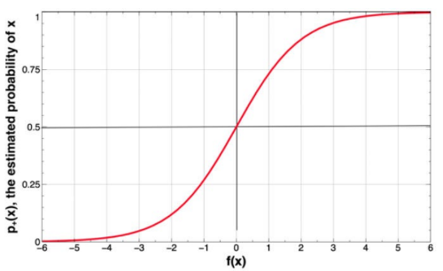
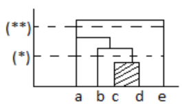
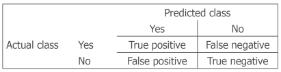

# 2. Approcci di Machine Learning per l'Analisi dei Big Data 

Il termine **data mining** fa riferimento alla *tecnica che permette di predire un dato*, *estrarre conoscenza mediante l'analisi dei dati*: si valuta un evento futuro sulla base dei dati del passato. Il **machine learning** è l'algoritmo utilizzato nella fase di mining.

> **`PRINCIPIO DI BONFERRONI`**: i dati devono essere *validati* poiché *non sono sempre veri* (possono presentare falsi positivi). Il dataset è influenzato dalla randomicità, pertanto non rappresenta la realtà: è possibile che l'occorrenza di un evento raro si verifichi con maggiore probabilità.

## Processo di Data Mining

1. Comprensione del Problema (*business understanding*)
2. Comprensione dei Dati (*data understanding*)
3. Preparazione dei Dati (*data preparation*): formato dei dati, conversione, gestione dei valori mancanti
4. Scelta del Modello (*modeling*): si basa sui dati
5. Valutazione del Modello (*evaluation*): per facilitare la valutazione è necessario rendere il modello comprensibile
6. Deployment

Le **prime 3 attività** sono quelle che *occupano più tempo*. La *pulizia dei dati* e l'*estrazione delle feature* sono importanti nel data mining, ma assumono meno importanza nel deep learning, che è meno sensibile al "rumore": è l'algoritmo stesso a occuparsene.

### ML Deployment

Il deployment è la **messa in produzione** dei risultati ottenuti con il data mining per ottenere un ***ritorno sugli investimenti***. Il risultato è solitamente un ***modello di predizione*** e delle tecniche di data mining inseriti all'interno di ***sistemi informativi*** o ***realtà aziendali***. A volte può essere meglio effettuare il **deployment dell'intero *data mining system***, in particolare quando:

- i dati utilizzati nel dataset cambiano più velocemente di quanto sia possibile gestirli per un team di data science
- un'azienda gestisce modelli differenti destinati a scopi differenti, e la loro gestione e deployment individuale risulta complessa

Il **modello** una volta messo in produzione deve ***essere mantenuto aggiornato*** in modo da essere in grado di imparare da *nuovi dati*. Un modello messo in produzione deve essere *sicuro e robusto*. Deve essere in grado di affrontare due tipologie di problemi:

- **Problemi di *Machine Learning***: riguardano cambiamenti del *dataset*, del *modello*, della *distribuzione dei valori*
- **Problemi di *Software Engineering***: riguardano *requisiti di tempistiche*, *risorse utilizzate*, *sicurezza*, *accuratezza*

#### Pattern Utilizzati per il Deployment

- **`SHADOW`** : il modello nuovo viene *affiancato al vecchio*, solo come "*supervisore*" dei risultati ottenuti. Se i risultati ottenuti con il nuovo modello sono migliori rispetto al precedente, vengono sostituiti
- **`CANARINO`** : il modello nuovo viene *utilizzato solo per una piccola parte di dati*, che *aumenta se ottiene buoni risultati*
- **`BLU / GREEN`** : il modello nuovo viene *messo in produzione* e *in caso di problemi viene sostituito dal vecchio*

#### Decadimento del Modello

Le performance di un modello calano con il tempo, pertanto è necessario riallenarlo. Il decadimento del modello prende il nome di **model drift**, e può essere causato da diversi aspetti:

- **`DATA DRIFT`** : i *dati in input cambiano*, e con essi la *loro distribuzione*, ma il modello non viene allenato su questi dati
- **`CONCEPT DRIFT`** : *ciò che si vuole predire cambia* e il modello ha appreso degli schemi non utili al nuovo scopo

Il model drift può essere altrimenti causato dal fatto che *esso non sia stato allenato con dati che rappresentassero la realtà*. Come **soluzione** a questi problemi, oltre a *riallenare o cambiare il modello*, è possibile ***migliorare la qualità dei dati***: ***pulendoli*** e ***normalizzandoli***. È possibile definire il suo **comportamento desiderato**, così da poterne individuare la *causa del decadimento*.

### Scelta del Modello

La scelta del modello di *ML* si compone di tre parti:

1. **`REPRESENTATION`** &rarr; scelta del **tipo di algoritmo**
2. **`EVALUATION`** &rarr; scelta di **come valutare** l'algoritmo
3. **`OPTIMIZATION`** &rarr; **ottimizzazione** (relativa alla *fase di training*)

I **dati** utilizzati per la costruzione del modello non sono ***mai abbastanza***. Una considerazione importante da fare per la scelta di un algoritmo è che esso **generalizzi**, ovvero che *funzioni bene non solo sui dati utilizzati per allenare l'algoritmo, ma anche su altri dati*. Al contrario, un algoritmo va in **overfitting** quando *funziona bene sui dati utilizzati nella fase di training*, ma *non riesce a generalizzare*. Quando un algoritmo va in overfitting generalmente ***commette errori di generalizzazione***, scomponibili in:

- **`Bias`**: l'algoritmo tende a ***imparare cose sbagliate***
- **`Varianza`**: l'algoritmo tende a ***imparare cose casuali***

Un algoritmo per non fare overfitting deve avere *basso bias* e *bassa varianza*. L'input dell'algoritmo è una tabella (dataset) formata da righe, ovvero le *istanze di esempio* e colonne, che rappresentano le *features*. Sebbene aumentare le colonne porti ad un *aumento del bias*, ***aumentare le righe*** porta dei ***benefici sia per bias che per varianza***.

#### Istanze e Attributi

Ogni istanza del dataset è descritta da un determinato *set di features*, i suoi **attributi** (*colonne*). Esistono quattro tipi di attributi riconducibili a due tipi di valori: ***numerici*** e ***categorici*** (*stringhe* che rappresentano una *categoria*). Alcuni algoritmi funzionano solo con valori numerici, categorici o entrambi.

#### Output - Rappresentazione della Conoscenza

L'output di un sistema di mining è un algoritmo che può generare:

- una **tabella decisionale** utilizzata per le *previsioni future* dati certi valori
- un'**equazione** *in funzione di uno o più parametri* (attributi con peso differente), utilizzata *per predire un **valore numerico***

Un altro tipo di output è l'**albero**: una sorta di ***rappresentazione in formato grafico della tabella***. L'esempio classico di questo tipo di output è l'**albero decisionale**, dove ogni *foglia dell'albero* (o nodo) rappresenta un determinato *attributo* (valore costante): a seconda se il caso soddisfa o meno una determinata condizione di comparazione, si entra in un nodo o nell'altro.

L'albero può essere proposto come un **insieme di regole**. Le regole nella maggior parte dei casi risultano *più compatte*. Questo possono essere ***ordinate*** quando *devono essere eseguiti in successione*, o ***disordinate***. Quando la **classe da predire** è di tipo **booleana**, è possibile utilizzare un'assunzione ***closed-world*** e definire le regole per la sola classe di interesse ("*yes*" o "*no*").

> ```text
> if attribute_A = y and attribute_B = y then X
> if attribute_A = n and attribute_C = n then Z
> ```

Una regola è strutturata in due parti: una **precondizione**, ossia un insieme di controlli (*`if` clauses*), sono le ***espressioni logiche***, e una **conclusione**, ossia ***la classe*** (o classi) di appartenenza.

## Algoritmi di Machine Learning

### Algoritmi Basici

Gli algoritmi più semplici funzionano molto bene, talvolta anche meglio di altri complessi: in questi algoritmi si lavora su un solo attributo, oppure gli attributi contribuiscono egualmente e in modo indipendente.

#### One Rule

Il **metodo più semplice** per la costruzione di un algoritmo di predizione. La **classificazione** viene implementata mediante ***una sola regola*** (relativa a *un attributo*). L'implementazione varia a seconda se il dataset presenta valori categorici o numerici:

- Con **valori `CATEGORICI`**: si creano delle regole che testano ciascun attributo. La regola mira a prevedere, per tutti i valori possibili dell'attributo, la classe più frequente. Per ciascuna regola viene calcolato l'error rate e infine viene scelto l'attributo con il numero totale di errori minore.

  > **Esempio**: L'output dell'algoritmo è la regola relativa all'attributo *Outlook*, che rispetto agli altri (*Temperature*, *Humidity*), presenta il numero totale di errori minore.  
  >
  > | Attribute | Rules               | Errors        | Total Errors   |
  > | --------- | ------------------- | ------------- | -------------- |
  > | Outlook   | Sunny &rarr; No     | $\frac{2}{5}$ | $\frac{4}{14}$ |
  > |           | Overcast &rarr; Yes | $\frac{0}{4}$ |                |
  > |           | Rainy &rarr; Yes    | $\frac{2}{5}$ |                |

- Con **valori `NUMERICI`**: l'algoritmo non funziona con valori numerici singoli. I valori numerici ***devono essere raggruppati in un intervallo*** che rappresenti un *insieme di valori*. Solitamente viene costruito un **gruppo** (o ***range***) quando si hanno ***almeno tre elementi concordi sulla valutazione***. 

##### Hyper-Pipes

Si tratta di un **miglioramento dell'algoritmo One Rule**, possibile mediante due tecniche:

- **combinazione di attributi**: consiste nel *considerare più di un attributo* per la predizione (nel caso precedente oltre a *Outlook* srebbe possibile utilizzare *Humidity*, che aveva lo stesso numero di errori totali)
- **pesare gli attributi**: *nel prendere una decisione vengono guardati gli attributi che sono soliti fare meno errori*

#### Modellazione Statistica

Si tratta della *tecnica di Bayes*: si assume che ***tutti gli attributi abbiano la stessa importanza e siano indipendenti*** l'uno dall'altro.

$$
P(H|E) = \frac{P(E|H)\cdot P(H)}{P(E)}
\\
\text{dove } H: \text{ Evento, } E: \text{ Evidenza}
$$

Data una combinazione (istanza) da predire, si calcola la probabilità che la combinazione appartenga a una determinata classe (ad esempio "*yes*" o "*no*"): per ogni attributo della combinazione si calcola la probabilità che il suo valore appartenga alla classe.

> $$
> P(E|H) = P(\text{A = X | "yes"})\cdot \text{ }...\text{ } \cdot P(\text{C = Z | "yes"})
> $$
> 
> Dove $A$ e $B$ sono *attributi della combinazione*, $X$ e $Z$ i *valori degli attributi*.

Questa **tecnica non funziona** se nella combinazione è ***presente uno zero***, in quanto si avvera la likelihood (definita moltiplicando le singole likelihood). Per risolvere questo problema si utilizza la **smoothing**, che consiste nel ***sostituire i valori nulli*** con $1$. Nel caso in cui si abbiano valori numerici è necessario utilizzare la **funzione di densità di probabilità**.

#### Decision Trees

Questo algoritmo ha una **strategia top-down** e **ricorsiva**: l'albero decisionale si costruisce a *partire da un attributo* (*root node*), che *crea diversi rami per ogni valore* assunto e suddivide le istanze della classe da predire per ogni ramo. L'operazione viene ripetuta ricorsivamente per gli altri attributi, che vengono messi uno di seguito all'altro per formare l'albero, fino ad ottenere delle istanze appartenenti alla stessa classe. È importante capire quando la scelta del *root node* è importante (qualora si ottengano delle *divisioni nette* e quindi il *nodo determina una scelta*) e quando è possibile partire da un nodo casuale: l'**obiettivo** è quello di ottenere un *albero il più compatto possibile*. La purezza della scelta del nodo iniziale si misura mediante un **parametro** chiamato ***guadagno d'informazione***: il nodo che genera il miglior guadagno di informazione è quello da scegliere. Più profondo è l'albero (numero di rami), più il modello risulta complesso e può causare **overfitting**.

##### Entropia

> Per misurare il guadagno dell'informazione si utilizza l'**entropia**. In generale quando il dataset è *puro* il valore dell'entropia è $0$, quando il dataset è *egualmente diviso* il valore dell'entropia è $1$, quando invece è *sbilanciato*, oppure ha un insieme di valori diversi, l'entropia ha dei valori più alti. L'entropia si calcola utilizzando la probabilità di una classe e il logaritmo della  probabilità stessa. Si applica alle istanze della classe da predire, per ogni valore di ogni attributo:
>
> **Esempio**: entropia del valore (*sunny*) di un attributo (*outlook*) in relazione alla classe booleana da predire (*play*). Il valore *`sunny`* compare $5$ volte nel dataset, $2$ volte la classe da predire presenta come valore "yes", le altre volte "no".
> 
> $$
> entropia(p_{yes},p_{no})=-p_{yes}\log p_{yes}-p_{no}\log p_{no} 
> \\
> Sunny \rightarrow info[2,3] = entropy(\frac{2}{5}, \frac{3}{5})= -\frac{2}{5}\log(\frac{2}{5})-\frac{3}{5}\log(\frac{3}{5}) = 0,971 \text{ }bits
> $$
> 
> Per conoscere l'**informazione dell'attributo** (*outlook*), è possibile fare la *somma dell'entropia di ogni distribuzione*, ovvero sommare l'entropia di ogni suo valore in relazione al numero di volte che quel valore compare nel dataset (il suo *peso*). Avendo *outlook* un totale di $14$ istanze, e presentando $5$ di queste il valore *`sunny`*:
> 
> $$
> info(Sunny)=(\frac{5}{14})\cdot0,971
> $$
>
> $$
> info(Outlook) = info(Sunny)+info(Overcast)+info(Rainy)
> $$

#### Algoritmi di Copertura - `PRISM`

Gli algoritmi di copertura ***generano delle regole senza*** passare dalla ***costruzione di un albero***. Per farlo è possibile ad esempio **mappare** le istanze di un **dataset** in uno **spazio bidimensionale** (*piano cartesiano*). Definiti:

- $t$ : *numero di istanze coperte da una regola*
- $p$ : *numero di casi in cui la regola viene applicata correttamente*

Si sceglie la **regola che massimizza il rapporto $\frac{p}{t}$** (*accuratezza*). Per determinare l'appartenenza a una classe si parte dal dataset iniziale e si considera l'attributo che massimizza il rapporto, fermandosi quando i rapporti ottenuti sono pari ad $1$. È possibile costruire ulteriori regole per le istanze non coperte dalla prima regola, ma troppe possono causare **overfitting**.

### Classificazione tramite Funzioni Matematiche

Sono algoritmi che utilizzano delle funzioni matematiche lineari: si parte da una ***distribuzione di punti sul piano***, dove la **linea** che divide in due parti il piano rappresenta la **discriminante**. Un algoritmo di questo tipo prende il nome di **Classificatore Lineare**. Sono algoritmi **semplici** e **generalizzano bene**: più sono **complessi**, maggiore è il rischio di ***overfitting***.

La retta che divide il piano è definita come una ***combinazione lineare di attributi $a$*** (*somma pesata*):

$$
f(x) = w_0+w_1a_1+w_2a_2+...+w_ka_k
$$

Le  $w$ sono le ***pendenze delle rette***, ovvero i **pesi** che indicano l'***importanza delle features*** (maggiore è il peso, maggiore è l'importanza per la classificazione, assumendo che i dati siano stati normalizzati) e le $a$ sono i ***valori del dataset***. Per separare due gruppi di punti possono essere considerate infinite rette. Quando si hanno **$n$ classi**, è possibile trasformare un classificatore in un ***insieme di classificatori binari***, in modo da *dividere l'iperpiano in un insieme di iperpiani così da massimizzare la discriminazione*. La **scelta della funzione** si basa sull'obiettivo da raggiungere (es. *minimizzare l'errore*) e sull'ottimizzazione degli altri parametri: nella pratica la sua definizione non è semplice, per questo motivo ***le scelte in genere si basano sull'esperienza***.

#### Support Vector Machine - `SVM`

La retta funge da **margine** di separazione per le classi. L'obiettivo è quello di ***trovare la retta che massimizza il margine*** (*distanza*) ***tra le classi***. Assumendo di trovarsi in un mondo reale, è possibile che *alcune istanze non siano classificate correttamente*. La **funzione obiettivo** determina la pendenza (*derivata*) che deve avere la retta.

Se un punto è presente nella sezione sbagliata (*outlier*) e i dati sono linearmente separabili, allora si aumenta il margine della banda. Se invece non sono separabili (punto in mezzo ad altri punti), si applica una penalità che è proporzionale alla distanza dal margine. In questo modo `SVM` compie solo degli errori relativamente piccoli. Questo errore è chiamato `hinge loss`.

#### Logistic Regression

> **`ALGORITMO DI REGRESSIONE`**: non predice l'appartenenza a una classe, ma un ***valore numerico***.
>
> <u>Esempio</u>: predizione del costo di una casa (*valore numerico*) sulla base di un parametro (*metri quadri*).

L'algoritmo fa una **separazione netta delle classi** e restituisce la ***probabilità che un evento faccia parte di una classe*** oppure no. In particolare è più utile rappresentare le probabilità come **`odds`** (*probabilità favorevoli su quelle sfavorevoli all'evento*), ovvero come rapporto fra la probabilità che un evento occorra, fratto la probabilità che lo stesso evento non occorra. Poiché questa funzione può assumere valori negativi, si considera il ***logaritmo dell'`odds`***:

$$
\log{(\frac{p_+(x)}{1-p_+(x)})} = f(x) = w_0+w_1a_1+w_2a_2+...+w_ka_k
$$

Il logaritmo assume valori da $-\infin$ a $+\infin$, e in questo modo il valore discriminante diventa lo $0$. Il training del dataset mira a trovare i coefficienti $w$ che generano meno errori nel trovare la probabilità corretta. Risolvendo l'equazione:

$$
p_+(x) = \frac{1}{1+e^{-f(x)}}
$$



La funzione ottenuta restituisce una probabilità compresa tra $[0,1]$: tende a $0$ per valori negativi, a $1$ per valori positivi. Quando $f(x)$ assume il valore $0$ allora la proabilità $p_+(x)=50\%$. Più la retta ha pendenza elevata, quindi più è verticale, meno si ha una fase di transizione in cui la funzione non ha valori che sono vicino a uno e vicino a zero. La funzione $f(x)$ non viene usata, come nel caso di `SVM`, per discriminare un semipiano, ma serve per indicare una certa probabilità: si utilizza come ***parametro di una funzione*** che rappresenta la **probabilità di aver classificato correttamente l'elemento considerato**.

### Apprendimento Basato sull'Istanza

Questi tipi di algoritmi ***ricercano l'esempio*** (*istanza*) che ***più si avvicina al caso in esame***. Il concetto di **distanza** varia a seconda del tipo di valori con cui si ha a che fare:

- **`valori numerici`** &rarr; si utilizza la ***distanza euclidea***

  $$
  \text{distanza }= \sqrt{(a_1^{(1)}-a_1^{(2)})^2+(a_2^{(1)}-a_2^{(2)})^2+...+(a_k^{(1)}-a_k^{(2)})^2}
  $$
  
- **`valori categorici`** &rarr; è possibile *calcolare **per ogni categoria** un **attributo booleano***, oppure ricorrere a un ***mapping aleatorio*** che deve essere fatto in maniera opportuna. Quando si mappano dei valori numerici su dei valori categorici si impone una distanza che non è detto rispecchi quella reale: è necessario fare in modo che i valori non risultino vicini tra loro. Prima del calcolo della distanza, per far sì che tutte le colonne contribuiscano alla predizione correttamente è necessario **normalizzare**. La normalizzazione viene fatta utilizzando la seguente formula:
  
  $$
  a_i =\frac{v_i-\min v_i}{\max v_i - \min v_i}
  $$

Un **problema** dell'instance based learning sta nel fatto che *dopo la normalizzazione*, tutte le colonne contribuiscono allo stesso modo nel predire il risultato, pertanto è necessario utilizzarlo dopo degli ***algoritmi di features extraction***, in modo da non introdurre *colonne inutili* che generano solo del rumore nella predizione del risultato.

#### K-Nearest Neighbors - `KNN`

Tecnica di *instance-based* learning. Dal dataset di training vengono ***scelte le $K$ istanze più simili a quella da predire***. Le istanze più simili sono quelle più vicine in termini di distanza, oppure i punti più vicini a quello da predire, se rappresentati graficamente. I *punti più vicini* sono dunque quelli aventi un *peso maggiore* nella predizione. Scegliendo un **numero dispari di istanze**, è possibile fare sempre una scelta (perché non si ha lo stesso numero di istanze appartenente a classi diverse). Se $K=1$ l'algoritmo ***overfitta*** (si rifà al dataset iniziale), ma ***all'aumentare di $K$*** l'algoritmo ***generalizza***: in generale il numero $K$ viene ***scelto per tentativi***, e l'ideale è che sia a metà tra l'overfitting e l'estrema generalizzazione. Il **problema** principale dell'algoritmo è dato dall'***indicizzazione*** delle istanze, ovvero *trovare le $K$ istanze più vicine*.

Questo algoritmo *funziona bene* nei **sistemi di raccomandazione** (es. *Netflix* nel consigliare un film sulla base di quelli visti, *Amazon* nel consigliare prodotti sulla base di quelli acquistati).

### Algoritmi di Clustering

Il **clustering** elabora un ***criterio di raggruppamento***. Si utilizza *quando non si ha una classe di riferimento*: si hanno dei dati che descrivono la realtà, che con un algoritmo di clustering vengono *divisi in gruppi*. È un **algoritmo non supervisionato**: l'apprendimento avviene su dati non classificati, pertanto è l'algoritmo stesso a proporre il *raggruppamento*. Può essere:

- **`DISGIUNTO`** o **`OVERLAPPING`**: nel primo caso un *elemento* appartiene a *un solo gruppo*, mentre nel secondo caso può appartenere a *più gruppi*. La maggior parte degli algoritmi sono disgiunti.
- **`DETERMINISTICO`** o **`PROBABILISTICO`**: nel caso in cui un algoritmo sia probabilistico viene espressa la *probabilità di appartenenza a un gruppo*, nel caso in cui sia deterministico il solo gruppo di appartenenza.
- **`FLAT`** o **`GERARCHICO`**: gli algoritmi gerarchici *determinano un certo numero di gruppi*, mentre quelli flat *un solo gruppo*.

È importante in questo tipo di algoritmi stabilire la **metrica** che indica *quando due gruppi sono vicini tra loro*: è quindi necessario definire una ***distanza***. Per valori numerici è sempre possibile utilizzare quella euclidea, ma è possibile definire anche *altri tipi di distanze per spazi non euclidei* (*distanza del `coseno`*, di *`Jaccard`* per valori categorici, di *`Hamming`* per le stringhe). Il problema rimane il **calcolo della distanza** (fra *due singoli punti*, *un punto e un cluster*, *due cluster*): per questo esistono diverse tecniche.

#### Clustering Gerarchico (o Agglomerativo)

L'algoritmo di clustering gerarchico si basa sulla fusione dei cluster più vicini, che porta alla costruzione di cluster di dimensioni maggiori a partire dalla combinazione di due cluster più piccoli. 

##### Funzionamento

Dato un insieme dello spazio ($a-b-c-d-e$), si fondono i due punti più vicini ($c-d$) creando il primo cluster: a questo punto si considerano le distanze tra il cluster e i punti rimanenti, andando a fondere il cluster sempre con il punto più vicino (in ordine: $b$ &rarr; $a$ &rarr; $e$), fino ad ottenere un ***cluster unico***. Il tutto può essere fatto servendosi di un **dendogramma**. 



L'algoritmo viene chiamato ***gerarchico*** perché il *numero di cluster che si ottiene* varia a seconda della distanza scelta:

- $(*) a,b,(cd),e$ &rarr; $4$ cluster
- $(**) (abcd), e$ &rarr; $2$ cluster

Si assume di operare in uno spazio Euclideo di modo tale da poter rappresentare un cluster mediante il suo ***centroide*** o la ***media dei suoi punti***. In questo modo la regola che permette di combinare due cluster considera la distanza tra due cluster come la *distanza euclidea tra i loro centroidi*, andando a scegliere i due cluster che hanno distanza minore.

> **`CENTROIDE`** : *media della distanza tra tutti i punti in un cluster in tutte le dimensioni*

#### K-Means

L'algoritmo costruisce tanti cluster quando specificato dal valore $K$.

##### Funzionamento

Una volta scelto il valore $K$, corrispondente al *numero di cluster che si vuole ottenere*, si procede **scegliendo $K$ punti casuali nel piano**. I cluster iniziali vengono costruiti associando a ciascuno di questi punti degli altri punti nello spazio: i più vicini a questi. Per ciascun cluster si calcola il **centroide**, si *cancella il cluster precedente* e si *riassegnano i punti* a seconda di quest'ultimo: vengono ora presi *come nuovi punti iniziali* per la creazione dei $K$ cluster quelli *più vicini al centroide*. Il procedimento viene iterato fino a quando non si ottiene lo stesso centroide, e quindi ***il centroide si converge***, ottenendo $K$ cluster. La velocità con cui si raggiunge la convergenza dipende dai $K$ punti scelti inizialmente.

### Ensemble Learning

Tecnica che consiste nell'utilizza ***più algoritmi di machine learning insieme***.

#### Bagging

Più classificatori vengono utilizzati in ***parallelo***. Dato un dataset di $m$ elementi, $n$ elementi vengono utilizzati per *allenare un classificatore*, altri $n$ elementi vengono utilizzati per allenarne un altro, e così via. Infine si combinano risultati ottenuti. La classe predetta dal maggior numero di classificatori per un'istanza appartenente al test set viene scelta come classe finale.

#### Boosting

Più classificatori vengono utilizzati in ***serie***. Si mette un classificatore dopo un altro per *migliorare la predizione*.

## Best Practice

### Evitare l'Overfitting

> **`OVERFITTING`**: si verifica quando un algoritmo predice meglio i dati utilizzati per il training set rispetto a quelli utilizzati come test set. Un algoritmo che overfitta non è in grado di generalizzare.

Quando un algoritmo overfitta è necessario prendere delle precauzioni per ***renderlo meno complesso***. Costruendo un grafico su cui rappresentare l'errore della predizione dell'algoritmo sul training set e sul test set è possibile notare che inizialmente il modello impara, e quindi l'errore diminuisce per entrambi i set, fino ad arrivare ad un certo punto dove non riesce più a generalizzare, l'errore sul training set continua a diminuire, ma quello sul test set aumenta, andando in overfitting. Per scegliere la **complessità più idonea** per il modello è dunque necessario scegliere quella che ***minimizza l'errore fra training set e test set***. Per sapere se si hanno a disposizione abbastanza istanze per allenare il modello è possibile utilizzare la **curva di apprendimento**, che indica *l'accuratezza del modello dopo un certo numero di istanze di training*.

### Valutazione degli Algoritmi

Per valutare un algoritmo possono essere utilizzati diversi parametri:

- **`SUCCESSO`**: numero di istanze classificate correttamente
- **`ERRORE`**: numero di istanze classificate non correttamente. Inoltre è possibile calcolare l'**`ERRORE PERCENTUALE`** come il numero di errori commessi in proporzione al numero delle istanze, e l'**`ERRORE DI RISOSTITUZIONE`**, corrispondente alla *percentuale di errore sul training data*.

Normalmente per valutare un algoritmo viene usata l'**`ACCURATEZZA`**, che dice se un'istanza è stata predetta correttamente o meno. Di solito il dataset viene diviso in *`training set`* e *`test set`*, ma a queste due divisioni se ne potrebbe aggiungere una terza: il *`validation set`*. Quest'ultimo set è utilizzato ***per ottimizzare i parametri dell'algoritmo***, provando versioni diverse.

### Cross Validation

Con la $k$-fold-cross-validation si ***divide il dataset in $k$ porzioni***: si fanno $k$ **test** e in ciascuno di questi si utilizzano $k-1$ porzioni per il *training* e una porzione per il *test*. Per ogni test svolto si ottiene un'accuratezza, e l'accuratezza finale è la *media delle accuratezze ottenute nei $k$ test*. Ne esistono due varianti:

- **`stratified ten-fold-cross-validation`** (con $k=10$): le *porzioni non sono costruite in maniera casuale*, ma ***vengono rispettate le porzioni delle istanze del dataset*** da classificare (*porzioni delle classi uguali tra loro*)
- **`leave-one-out cross-validation`**: si fa *training su tutto il dataset* e a turno si fa *fold su una istanza*, utilizzata *come test*

### Bootstrap

Tecnica utilizzata ***per aumentare il numero di istanze nel dataset***, funziona ***duplicando le istanze già esistenti***. Dal dataset iniziale vengono prese $n$ righe e aggiunte, duplicate così come sono, al dataset iniziale. Queste righe aggiunte non per forza sono diverse tra loro: può essere anche presa una stessa riga più di una volta. Ciascuna **riga** ha una ***probabilità di $\frac{1}{n}$ di essere selezionata***. Nel *test set* vengono inserite le *istanze del dataset che non sono state selezionate* per essere duplicate, nel training set le altre.

### Matrice di Confusione

Non sempre l'accuratezza è un buon parametro per la valutazione di un algoritmo, specie quando il dataset è fortemente sbilanciato, dove il numero di istanze classificate in maniera corretta non è sempre affidabile. Per questi casi si utilizza la **matrice di confusione**, una matrice sulle cui righe vengono messe le *classi reali*, mentre sulle colonne le *classi predette*, in questo modo:



Con queste misure è possibile calcolare:

- **`TP RATE`**: numero di *veri positivi* in rapporto a *tutti i casi effettivamente positivi*
- **`FP RATE`**: numero di *falsi positivi* in rapporto a *tutti i casi effettivamente negativi* 
