# 3. Mining Itemset Frequenti e Regole di Associazione

Le **regole associative** permettono di trovare una ***relazione tra un attributo e altri attributi del dataset***. L'esempio considerato di solito è quello del *market basket analysis*, ovvero degli scontrini del supermercato, dove è possibile individuare i prodotti acquistati insieme da diversi clienti. Questo problema è *diverso* da quello di *individuazione degli item simili*.

## Market Basket Analysis

Il modello vuole trovare la correlazione tra i prodotti (***items***) presenti nel magazzino e gli scontrini (***basket***) nei quali appaiono: l'**obiettivo** è quello di trovare l'***insieme di prodotti che appare in più scontrini*** (*frequent itemset*), e che quindi sono acquistati insieme dai consumatori. Si assume che il numero di prodotti in uno scontrino sia molto più piccolo del numero di prodotti totali, allo stesso tempo si assume un gran numero di scontrini. Le ***istanze dataset*** sono gli *scontrini*, mentre le ***colonne*** sono i *prodotti*.

> **`FREQUENT ITEMSETS`**: insieme di *prodotti* (*items*) che appaiono di frequente in diversi scontrini. Per definire il significato di "***frequente***" viene definita una ***soglia $s$*** (o ***supporto***) corrispondente a un certo *numero di scontrini*. Se l'itemset appare in un numero di scontrini maggiore o uguale ad $s$ allora è frequente. L'aspetto complesso consiste nel ***trovare una soglia opportuna***, in modo da avere un *numero bilanciato di frequent itemsets*.
> 
> $$
> Items = \{\text{milk}, \text{coke}, \text{pepsi}, \text{beer}, \text{juice}\}
> \\
> s = 3 \text{ baskets}
> \\
> B1 = \{m,c,b\} \qquad B2=\{m,p,j\}
> \\
> B3 = \{m,b\} \qquad B4=\{c,j\}
> \\
> B5 = \{m,p,b\} \qquad B6=\{m,c,b,j\}
> \\
> B7 = \{c,b,j\} \qquad B8=\{b,c\}
> \\ \\
> \text{Frequent Itemset: } \{m\},\{c\},\{b\},\{j\},\{m,b\},\{b,c\},\{c,j\}
> $$
> 
> Il **frequent itemset** è pertanto un *sottoinsieme* degli *items* che appaiono in $s$ o più scontrini. La **soglia** si esprime normalmente come ***valore percentuale***. Definito il frequent itemset si ricava un ***insieme di regole associative*** $I \rightarrow j$:
> 
> $$
> \text{F. Itemset: } \{a,b,c\}
> \\
> a,b \rightarrow c \qquad b,c \rightarrow a \qquad a,c \rightarrow b
> $$
> 
> Nelle regole associative l'***ordine non ha importanza***, il ragionamento è analogo anche quando l'itemset contiene $2$ elementi. Il **numero di regole** che si ottiene è pari al *numero di elementi presenti nell'itemset*.

### Regole di Associazione

Potenzialmente da un numero elevato di scontrini è possibile ricavare un gran numero di *frequent itemsets* e quindi di *regole diverse*, per questo motivo occorre limitare il numero di itemset (e quindi di regole) ottenibili.

#### Confidenza

La **confidenza** si utilizza per ***valutare l'importanza di una regola***. Definiti $I$ l'***insieme di items*** e $j$ il singolo ***item***, la *formula della confidenza* si esprime come il *supporto di quante volte appaiono i due negli scontrini*, diviso *quante volte appare l'insieme*:

$$
conf(I\rightarrow j)=\frac{support(I \cup j)}{support(I)} \qquad 
\\
\\
\text{Es. } \qquad conf(beer,milk \rightarrow apple) 
= 
\frac{s(beer,milk,apple)}{s(beer,milk)}
$$

La confidenza è un *numero **minore di $1$***: il numeratore (scontrini in cui tutti i prodotti appaiono contemporaneamente), è in numero minore o al massimo uguale al denominatore (scontrini in cui appare l'insieme). La confidenza non dà un valore significativo qualora un *item sia presente in tutti gli scontrini* (confidenza $1$ o $100\%$). 

#### Interesse

L'**interesse** misura l'***influenza dell'item $j$ nella regola stessa***. È definito come la *confidenza meno la probabilità dell'item* (*prodotto*) *considerato nella regola*:

$$
Interest(I \rightarrow j) = conf(I \rightarrow j)-P[j]
$$

La probabilità $P[j]$ si esprime come il *numero di scontrini in cui l'item $j$ è presente*, fratto il *numero totale di scontrini*.

### Gestione della Memoria per il Conteggio degli Itemset

Un **algoritmo** che legge gli scontrini da un dataset può risultare molto ***lento nel calcolare i prodotti frequenti***. Non ci sono problemi fintanto che si devono calcolare le occorrenze di *$n$ prodotti* singoli: si mette come chiave il prodotto e come valore un contatore che ne registra l'occorrenza. Il **problema** sorge quando l'algoritmo deve ***considerare le tuple*** (*coppie, triple, quadruple*) di prodotti *per trovare i frequent itemset*: solo per calcolare le coppie possono esserci $n^2$ possibilità (ovvero $\binom{n}{2} \sim \binom{n^2}{2} \sim n^2$). Il contatore $n+n^2$ se $n$ fosse un numero molto grande non starebbe in memoria, l'*hash map* andrebbe salvato su un file. Il **costo dell'algoritmo** è dato dal costo di lettura del dataset e del file contenente l'hash map, per i quali occorre molto tempo.

Generalmente si trova sempre una soluzione. Per prima cosa, non si è interessati a tuple composte da un numero elevato di *items*: si è interessati alle *triple* o al massimo alle *quadruple* di prodotti. Inoltre, per il **principio di monotonicità**, il numero di *coppie frequenti* è maggiore del numero di triple o quadruple.

> **`PRINCIPIO DI MONOTONICITÀ`**: dato un *itemset frequente* $(a,b,c)$ allora è frequente anche un *qualsiasi suo sottoinsieme* $(\{A\}, \{B\}, \{C\})$. Vale anche il contrario: se il *singolo item non è frequente*, non può comparire in un *itemset frequente*. Questo principio ***consente di risparmiare memoria***.

> **`ALGORITMO ESATTO`**: algoritmo in grado di trovare tutti i *frequent itemset*
> **`ALGORITMO IMPRECISO`**: algoritmo *non* in grado di trovare tutti i *frequent itemset*

#### Metodo Triangolare

Utilizzato per *memorizzare le coppie di items $(i,j)$*. I prodotti vengono rinominati al fine di ottenere una *numerazione continua*. Si costruisce un **array $a[k]$** in cui la ***posizione $k$ dell'elemento*** nell'array ***indica la coppia che si sta rappresentando***: in questo modo non si usa la chiave e si riduce spazio.
$$
k = (i-1)(n-\frac{i}{2})+j-1
\\
\text{Es. }(1,2) \rightarrow  k = 1
$$
Questo metodo si utilizza quando *almeno $1/3$ di tutte le possibili coppie appare negli scontrini* (altrimenti per la maggior parte delle coppie si dovrebbe salvare un valore *null*). Questo tipo di memorizzazione ***non è efficiente quando si hanno poche coppie frequenti***, dove invece si utilizza il *metodo delle triplette*.

#### Metodo delle Triplette

Le coppie di items $(i,j)$ vengono salvate mediante delle ***triplette** $(i,j,c)$* dove $c$ è il ***contatore associato alla coppia***. Consente di risparmiare spazio, poiché *se $c=0$ la coppia non viene salvata*.

#### Algoritmo a Priori

Utilizzato per ***ridurre il numero di coppie da contare***. Si compone di due step, ripetuti uno dopo l'altro. Questo algoritmo e le sue variazioni sono **algoritmi esatti**.

##### 1° Step - Filtro

Il primo step agisce da **filtro**. Si considera un ***numero limitato di item singoli*** in modo tale che ***possa stare in memoria***: per ciascun item, si tiene traccia della sua occorrenza mediante un *contatore $c$*. Una volta terminato, tutti gli items per cui $c$ non supera la *soglia* $s$ vengono scartati. In questo modo ***rimangono solo gli item frequenti***.

##### 2° Step

Si **costruisce un *insieme di coppie frequenti*** utilizzando il ***principio di monotonicità***, partendo dai singoli items frequenti ottenuti con lo step precedente. A questo punto l'output viene passato come *input nuovamente al primo step*, che procede a ***scartare le coppie non frequenti*** e a ***costruire le possibili triplette frequenti***. Si continua in questo modo fino quando serve.

#### Algoritmo di Park, Chen e Yu - `PCY`

Anche definito **algoritmo a priori con hashing**. L'algoritmo ***ottimizza l'utilizzo della memoria nel primo step***, dove si utilizza una *funzione di hash* per prevedere le possibili coppie (o triplette) che si vanno a calcolare successivamente, in modo da scartarle immediamente nel caso in cui non superino la soglia e arrivare così al secondo passaggio con più memoria libera.

###### Funzionamento

Terminato il primo step dell'algoritmo a priori e trovati *i singoli items frequenti*, si procede a creare le coppie $(i,j)$ con  $i<j$. Per ciascun $i$, si calcolano tutte le possibili coppie $(i_1, j_1),...,(i_1,j_n)$. La **funzione di hash** applicata alle coppie è la *somma delle occorrenze di ciascuna coppia*, che viene salvata nel ***bucket*** $i$-esimo. L'*hashing* viene utilizzato per ridurre un *insieme di valori in un unico valore*. Al secondo step vengono passate solo le ***coppie appartenenti ai bucket** i cui **valori superano la soglia $s$***.

> **Esempio:**  $Scontrini: \{1,2,3\}, \{1,3,4\}, \{1,2\},\{1,2,4\}, \{1,2,3,4\}, \{1,4\} \qquad s=3$
>$\text{Frequent Items: } 1 \rightarrow 6,\quad 2 \rightarrow 4,\quad 3 \rightarrow 3,\quad 4 \rightarrow 4$
> 
>- $\text{Pairs } (1,2)\rightarrow 4, \quad(1,3)\rightarrow 3, \quad(1,4)\rightarrow 4:\quad bucket_1=11>s \rightarrow OK$
> - $\text{Pairs } (2,3)\rightarrow 2, \quad(2,4)\rightarrow 2:\quad bucket_2=4>s \rightarrow OK$ 
>- $\text{Pairs } (3,4)\rightarrow 2, \quad bucket_3=2<s \rightarrow NO$

#### Algoritmo Simple Randomized - Limited Pass

È un *algoritmo impreciso*: rinuncia alla completezza degli algoritmi precedenti, ma si ottiene un'approssimazione del risultato in maniera ***più veloce***. L'algoritmo considera una ***percentuale $p$ randomica e non contigua del dataset*** (*scontrini*), in modo da poter *mantenere questa porzione in memoria*. Viene scelta una soglia $s$, e a questa porzione viene applicato un *qualsiasi algoritmo per trovare gli itemset frequenti*, utilizzando come ***soglia $s_p = p \cdot s$***. A questo punto possono verificarsi tre situazioni:

- **Situazione Ottimale**: l'*itemset* è *frequente sia nella porzione che nel dataset*
- **Falso Positivo**: l'*itemset* è *frequente nella porzione, ma non nel dataset*. Per eliminarli si verifica la loro presenza nel dataset.
- **Falso Negativo**: l'*itemset* *non* è *frequente nella porzione, ma lo è nel dataset*. Per abbassare la possibilità di averli è possibile *abbassare la soglia $s$*, in questo modo si ottengono più falsi positivi (più gestibili).

#### Algoritmo `SON`

Si tratta di un *algoritmo esatto*. Può essere implementato mediante *map reduce* e consiste in due passaggi:

1. Viene definita un soglia $s$ e il dataset viene diviso, utilizzando una percentuale $p$, in porzioni chiamate ***chunks***. Per ciascun chunk $i$ vengono calcolati i *frequent itemset ($I_{i1},...,I_{in}$)* mediante un algoritmo a priori (o un altro algoritmo) utilizzando una soglia $s_p=p\cdot s$. Un itemset frequente nel dataset deve essere frequente in *almeno un chunk* (non ci sono falsi negativi).

   <u>Map Reduce</u>: Il mapper calcola *chiave-valore* nel formato `<coppia, "1">`. Il reducer fa un *group by* eliminando i duplicati.

2. Viene calcolato *per ogni itemset* ottenuto dal punto precedente, la sua occorrenza in ciascun chunk. Per ogni item set $I$ si avrà un conteggio $I_i$ che tiene traccia della sua occorrenza nel *chunk $i$-esimo*. Infine per ogni item set si sommano le sue occorrenze $I_i$ in ogni *chunk*, in modo da riconoscere quali superano la soglia $s$.

   <u>Map Reduce</u>: Il mapper $i$ effettua il conteggio delle occorrenze degli *itemset* nel chunk $i$-esimo. Il *reducer* prende l'output dei diversi mapper, aggrega e somma i valori associati ad ogni $I_i$.

#### Algoritmo Toivonen

È un algoritmo *veloce*. Considera una porzione $p$ scelta a caso, e poi l'*intero dataset*. Fornisce un risultato esatto (nessun falso positivo né falso negativo), oppure in alcuni casi non funziona e richiede di essere rieseguito. Il funzionamento è ***simile all'algoritmo randomized***, ma la *soglia $s$* deve essere *impostata su un valore più basso del suo valore proporzionale*. Più piccola è la soglia, maggiore è la memoria utilizzata e la probabilità che l'algoritmo non funzioni. L'algoritmo costruisce in seguito il **negative border**.

> **`NEGATIVE BORDER`**: insieme di *itemset non frequenti nella porzione*, ma i cui *sottoinsiemi lo sono*

A questo punto conta gli elementi del negative border *frequenti nel dataset*. Si possono verificare due casi:

- ***alcuni elementi sono frequenti*** nel dataset, quindi è necessario ripetere il procedimento con un altro sottoinsieme
- ***nessun elemento*** del negative border è ***frequente nel dataset***, ***allora*** è possibile dimostrare che ***gli itemset frequenti nella porzione sono frequenti nel dataset***

## Individuazione degli Item Simili

L'obiettivo è quello di studiare una **tecnica** che ***valuti quando due documenti sono simili***. Se numerici, due valori sono simili quando sono vicini tra loro; per i documenti, trattandosi di *valori categorici*, è possibile utilizzare la **similarità di Jaccard**.

> **`SIMILARITÀ DI JACCARD`**: metrica utilizzata per *misurare la similarità tra due entità*. Presi due oggetti $A$ e $B$, la formula pone al numeratore i *valori degli attributi posseduti da entrambi gli elementi*, al denominatore i possibili valori delle entità:
> $$
> J(A,B) = \frac{A \cap B}{A \cup B}
> $$
> La **similarità** è compresa tra $[0,1]$ perché normalmente al denominatore con l'unione si hanno valori più grandi. La **distanza** tra due item si definisce come $1-similarità$. Nel caso dei documenti è possibile considerare al numeratore il numero di parole in comune tra i documenti, mentre al denominatore l'unione tra il numero complessivo di parole di ciascun documento. In questo modo è possibile affermare che ***due documenti sono simili se condividono un gran numero di parole***.
>
> È necessario però *trovare tecniche migliori* per il riconoscimento di documenti simili. Non sempre le parole sono la via corretta per misurare la similarità: alcune parole possono avere solo le radici simili ma inflessioni diverse. Inoltre, attraverso questa formula è possibile confrontare i documenti due a due, il che può rappresentare un problema. In generale i problemi sono due:
>
> - **rappresentazione dei documenti** per rendere il *confronto più agevole e preciso*
> - **confrontare i documenti in grande quantità**

### Step Essenziali per il Riconoscimento degli Elementi Simili

1. **`SHINGLING`**: *estrazione delle parole* dal documento, che viene *convertito* in un *set di stringhe*
2. **`MINHASHING`**: considerato un dataset come matrice `words x documents` è necessario ridurre il numero di righe per mantenerlo in memoria. Questo procedimento diminuisce la dimensione del dataset cercando di *preservare la similarità tra le colonne*
3. **`LOCALITY-SENSITIVE HASHING`**: tecnica utilizzata per *confrontare un gran numero di documenti velocemente*

#### Shingling

Con questa tecnica il documento viene convertito in un **insieme di stringhe**. Le ***finestre* in cui *salvare* un *numero $k$* di *caratteri*** prendono il nome di **`shingle`**: all'interno di queste vengono salvate le stringhe muovendosi di $1$ carattere alla volta.

> **Es.** *"ciao"* con $k=2$ &rarr; *"ci", "ia", "ao"*

Gli *shingle* **sono degli insiemi** che permettono di *non avere elementi ripetuti*. In base al **numero di elementi $k$ dello *shingle***: 

- se *$k$ è basso* si ottiene l'alfabeto, il che rischia di rendere tutti i documenti simili tra loro

- se *$k$ è alto* per ogni shingle vengono salvati molti caratteri, il che può richiedere troppa memoria

  > **Esempio**: $k=45$ e $30$ caratteri (*alfabeto e eventuali caratteri speciali*) &rarr; $30^{45}$ *combinazioni*. Una matrice di *troppe righe* ($\simeq 10^{56}$) che risulta *computazionalmente ingestibile* da qualsiasi computer.

Il **numero di elementi dello shingle** ($k$) deve essere scelto ***sulla base della lunghezza del documento***: solitamente si considerano stringhe di **$20$ caratteri** nel documento e **un $k$ compreso tra $5-9$**. In alternativa è possibile **utilizzare le *parole*, o *parole particolari seguite da altre due parole***: spesso la suddivisione delle stringhe del documento avviene in corrispondenza delle ***stop words***, parole frequenti nel linguaggio parlato che *non sono utili nella distinzione dei documenti* (es. *congiunzioni, pronomi*), alle quali vengono *aggiunte altre due parole*. Il dataset viene rappresentato ponendo *sulle righe (istanze) le stringhe generate mediante shingling*, mentre *sulle colonne (attributi) i documenti*, assumendo ***valori booleani*** a seconda se la stringa è presente o meno nel documento. Per conoscere la **similarità tra due documenti** è possibile applicare la ***formula di Jaccard ai loro valori $1$***.

Il **problema** dello *shingling* risiede nel ***numero di righe** che si vengono a creare*: è necessaria una ***riduzione del numero di shingle***. 

> **Esempio**: Supponendo di voler confrontare tra loro *$n=1\text{ milione}$* di documenti, i confronti da fare sarebbero $\binom{n}{2} \simeq (\frac{n^2}{2}) \simeq 5 \cdot 10^{11}$. Facendo $106$ confronti al secondo, occorrerebbero $5$ giorni, e se si passasse da 1 milione a 10 milioni di documenti i tempi si dilaterebbero ad oltre un anno, una situazione computazionalmente ingestibile.

#### Minhashing

Questa tecnica mira a **diminuire il numero di righe** del dataset in modo tale da ***mantenere la similarità iniziale***. La **riduzione** viene fatta mediante una ***funzione di hashing $h$*** che ***preserva la similarità tra due documenti*** assegnando loro un *valore*: se la *similarità tra due documenti* $D_1$ e $D_2$ è alta, allora lo sarà anche quella della loro riduzione, viceversa quando è bassa:
$$
sim(D_1,D_2)=sim(h(D_1),h(D_2))
$$
Il **minhashing** sostituisce questi insieme grandi con ***rappresentazioni più piccole*** chiamate ***signatures***, abbastanza piccole da *stare in memoria*. La *similarità* fornita dalle *signatures* non è esatta, ma è una *stima*: più grandi sono le signatures, più accurata è la stima.

##### Funzionamento

Il minhashing **agisce sulle righe** del dataset: su di esse **esegue *$k$ permutazioni casuali*** per realizzare una **signature matrix** di dimensioni $k \text{ x } documents$ in cui ogni riga è una permutazione, e le colonne rappresentano i documenti. Per ogni documento, nella *signature matrix*, viene messo il valore della permutazione (partendo da $1$ e andando in ordine) in cui compare per la prima volta il valore $1$ nel dataset di partenza. Il **risultato** è una ***matrice di meno righe***: per ogni documento e permutazione viene salvato un ***valore numerico* che rappresenta il documento**. Questo valore è il *risultato della funzione di hashing* (*riduzione*).

> **Esempio**:
>
> 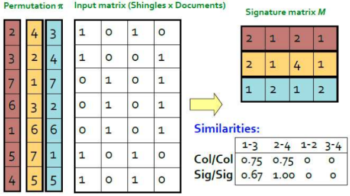
>
> - <u>P1</u>: Il valore $1$ (indice $5$), presenta uno $0$ per il primo documento (prima colonna) del dataset, il valore $2$ presenta un $1$, pertanto si inserisce questo valore. Per il secondo documento al valore $1$ della prima permutazione corrisponde un $1$. Ragionando in maniera analoga per gli altri due documenti: nel terzo documento si ottiene il primo $1$ per il valore $2$ della prima permutazione, mentre per l'ultimo del documento in corrispondenza sempre del valore $1$.
> - <u>P2</u>: Il valore $1$ (indice $3$) presenta un valore $0$ per il primo documento, ma presenta i valori $1$ per il secondo e per il quarto documento, pertanto è possibile segnare per questi documenti il valore $1$ sulla signature matrix. Per il valore $2$ della permutazione il primo documento presenta un $1$, pertanto si segna $2$ per quest'ultimo. Il terzo documento assume il suo primo valore $1$ in corrispondenza del valore $4$ della permutazione, pertanto si segna questo valore.
> - <u>P3</u>: In corrispondenza del valore $1$ (indice $6$) assumono i valori $1$ il primo e il terzo documento. Proseguendo, si ottiene che il secondo e il quarto documento ottengono entrambi il loro primo $1$ in corrispondenza del valore $2$.
>
> Per calcolare la **similarità tra due documenti** si prendono i loro *valori uguali sulla stessa permutazione* (riga), rapportandoli al numero di permutazioni esistenti ($k$): la similarità tra $D_1$ e $D_3$ risulta: $sim(D_1,D_3)= 2/3$.

##### Valore di Hashing di due Documenti

Si assume che due documenti $D_1$ e $D_2$ di un dataset possano essere di tre tipi:

- **`X`** : i due documenti presentano *entrambi* $1$ sulla riga considerata 
- **`Y`** : i due documenti presentano *valori diversi* sulla riga considerata
- **`Z`** : i due documenti presentano *entrambi* $0$ sulla riga considerata

Due documenti hanno lo **stesso valore di minhashing** se, *tolte le prime righe di tipo `Z` nella permutazione*, se ne ha una *di tipo $X$*. La  *probabilità che due due documenti abbiano lo stesso valore di hash* è uguale alla **similarità di Jaccard**, esprimibile come:
$$
sim(D_1, D_2) = \frac{x}{x+y}
$$

##### Calcolo delle Signatures con Meno Permutazioni

Durante il calcolo delle signature matrix è possibile anche ***non generare tutte le permutazioni***, *fermandosi prima*. Ci si limita a cambiare l'ordine delle prime $k$ righe del dataset: qualora arrivati al $k$-esimo elemento (seguendo l'ordine) non si avrà la riga della permutazione completata sulla *signature matrix*, possono verificarsi due casi possibili. Si riprende l'esempio precedente:

- In una colonna $C_2$ si ha un *valore espresso* e in $C_3$ un *valore ignoto*: gli elementi delle due colonne saranno sicuramente diversi, e il *valore di minhashing* di $C_3$ è maggiore di quelli considerati per la permutazione.

  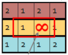
  
- Le colonne $C_2$ e $C_3$ presentano un valore ignoto. I valori non possono essere confrontati, ed è possibile trascurare la riga.

  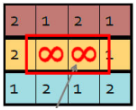

Per fare un **hashing** più *generico possibile* si utilizza la **funzione di hashing universale**:
$$
h_{a,b} = ((ax+b) \mod p)\mod N
$$

- $a,b$ : sono *interi casuali*
- $p$ : *numero primo* tale che $p>N$
- $N$ : *numero massimo di valori* (numero di righe)

Ipotizzando di utilizzare *due funzioni di hashing universale*, la ***signature matrix iniziale*** viene costruita in questo modo:

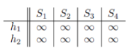

A questo punto le due colonne contenenti i valori delle funzioni di hashing vengono *affiancate al dataset originale*, in maniera analoga a quanto visto per le permutazioni. Si comincia dalla prima riga delle due funzioni di hashing (non in ordine di valore come per le permutazioni) e si ***aggiunge il valore della riga*** se c'è un $1$ nella matrice originale, e se il ***valore della funzione di hash è minore del precedente valore presente nella matrice***. Nel primo caso si avrà che qualsiasi siano i valori $v_{11}, v_{21}$ della prima riga della due funzioni  $h_1$ e $h_2$, $v_{11}, v_{2,1}$ $< \infin$, pertanto è possibile inserirli entrambi nella matrice. Dopodiché si procede con i valori $v_{12},v_{22}$ fino ad arrivare a $v_{1n},v_{2n}$ andando di volta in volta ad aggiungere il valore relativo alla riga solo se questo presenta un $1$ nella matrice originale ed è minore dei precedenti valori di $v_1,v_2$ inseriti. La **similarità** viene sempre preservata.

> **Esempio**:
>
> La situazione di partenza, con le funzioni di hashing calcolate, è la seguente:
>
> 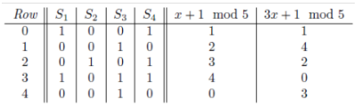
>
> Partendo dalla prima riga, e procedendo riga per riga per le due funzioni di hash, si guarda se queste presentano un valore $1$ nel dataset originale, e se ciascuno dei loro valori ($(1,1),(2,4),...,(0,3)$) è minore del valore presente nella *signature matrix iniziale*, partendo da una situazione dove questa presenta come valore tutti $\infin$, pertanto la prima riga viene inserita:
>
> 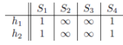
>
> Si procede poi riga per riga ottenendo:
>
> 
 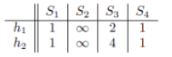 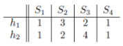 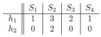 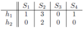 

È possibile **velocizzare il processo** considerando un *sottoinsieme di righe* $k$ della matrice originale: così facendo però si possono ottenere *risultati diversi*, poiché il risultato dipende dal *sottoinsieme $T$ scelto*.

#### Locality-Sensitive Hashing - `LSH`

La tecnica `LSH` viene utilizzata per **velocizzare i confronti tra i documenti**. Questa tecnica ***consiste nell'applicazione di una funzione di hash ai documenti*** (per semplicità si pensi a una *somma dei valori*), in modo tale che ***documenti simili assumano lo stesso valore***. L'idea è quella di **inserire nello *stesso bucket*** i ***documenti simili***, che quindi *assumono lo stesso valore* quando date input alla funzione si *hashing*: in questo modo *ogni bucket ha una dimensione inferiore* rispetto *a quella del dataset*, pertanto il ***numero di confronti sarà minore***. Affinché la tecnica funzioni, i falsi positivi devono essere ridotti al minimo: documenti non simili devono essere inseriti in bucket diversi. Inoltre, anche la *scelta del numero di bucket* non è da sottovalutare: se se ne hanno a disposizione pochi, l'algoritmo hash su pochi bucket e quindi inevitabilmente nel confronto possono essere commessi errori.

Normalmente si divide la **signature matrix** ottenuta con il *minhashing* in un *numero di bande $b$* contenenti *$r$ righe*:

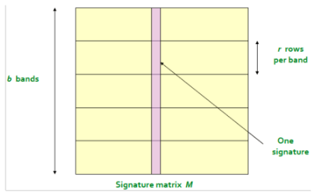

L'`LSH` viene *applicato ad ogni banda*: le colonne sulla stessa banda che ottengono lo stesso valore su tutte le $r$ righe vengono messe nello stesso bucket: in questo modo viene ridotto fortemente il numero di falsi negativi (due documenti simili non vengono messi nello stesso bucket). Per diminuire il numero di falsi positivi e falsi negativi è possibile **modulare il numero di bande**:

- **meno bande** (+ *larghe*) : diminuisce il numero di ***falsi positivi*** &rarr; riduce il numero di confronti
- **più bande** (+ *strette*): diminuisce il numero di ***falsi negativi*** &rarr; aumenta il numero di confronti

> **Esempio**: Si assume di avere $1000$ bucket, ciascuno contenente $100$ documenti. Il numero di confronti che si fa $\binom{n}{2}$ &rarr; $\binom{100}{2} \simeq (\frac{100^2}{2})=5000 =5 \cdot 10^3$ confronti per bucket. Per ottenere il *numero totale* di confronti tra tutti i bucket si *moltiplica per il numero di bucket* &rarr; $5 \cdot 10^3 \cdot 10^4 = 5 \cdot 10^7$. Si ottiene una *grande diminuzione* rispetto alla situazione di partenza dove i confronti erano di $4$ *ordini di grandezza più grandi* (esempio nel paragrafo `Shingling`).

##### Analisi della Dimensionalità

La **probabilità** che i valori di due documenti in una riga $r$ all'interno di una banda siano uguali è pari alla ***similarità di Jaccard per i due documenti***, e si definisce come $s$. La probabilità che tutte le righe $r$ di due documenti in una banda coincidano è pari a $s^r$.

- la probabilità che ***due documenti non coincidano in almeno una riga*** è $1-s^r$
- la probabilità che ***due documenti siano diversi in tutte le bande*** è $(1-s^r)^b$
- la probabilità che ***due documenti siano uguali in almeno una banda*** è $1-(1-s^r)^b$

Per capire meglio al **similarità $s$** è possibile disegnare un diagramma mettendo sulle righe la *similarità di Jaccard* tra due colonne $C_1,C_2$, mentre sulle colonne la *probabilità che queste condividano un bucket*:

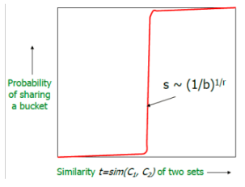

Per qualsiasi valore di $b$, $r$ e $s$ si ha sempre una funzione che disegna una “$S$” sul piano. Essa scatta in prossimità della similarità fissata e la sua pendenza dipende da $b$ e $r$. Per **diminuire il numero di falsi positivi e di falsi negativi** è sufficiente **variare il *numero di righe $r$*** e il ***numero di bande $b$***. A parità di errore, è *più grave* quando *due documenti simili finiscono su bucket diversi* (*falso negativo*), rispetto a quando due documenti diversi finiscono nello stesso bucket (*falso positivo*).

Al **diminuire del *numero di righe*** la curva vista nel grafico ***scatta subito***, mentre ***aumentando numero di righe scatta dopo***.
