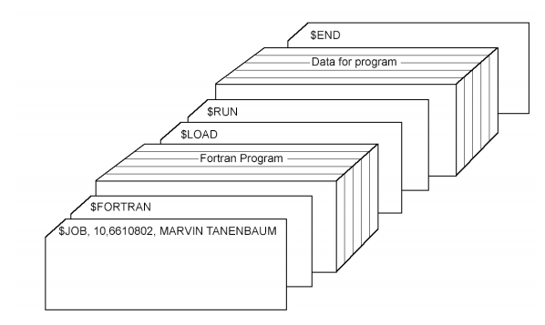
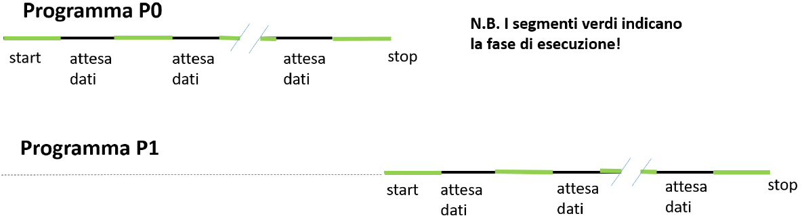
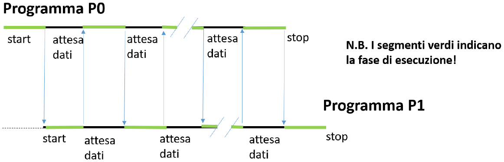
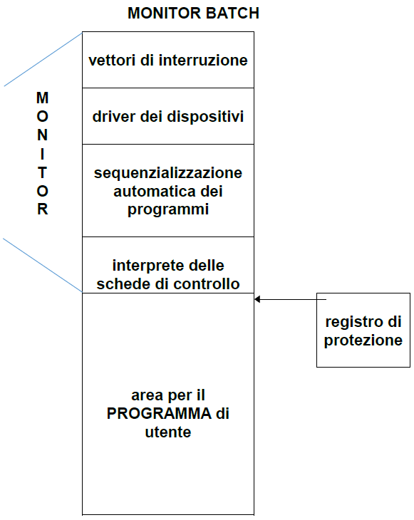
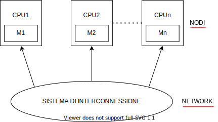
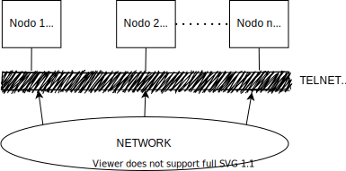
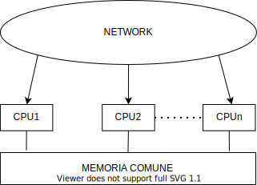
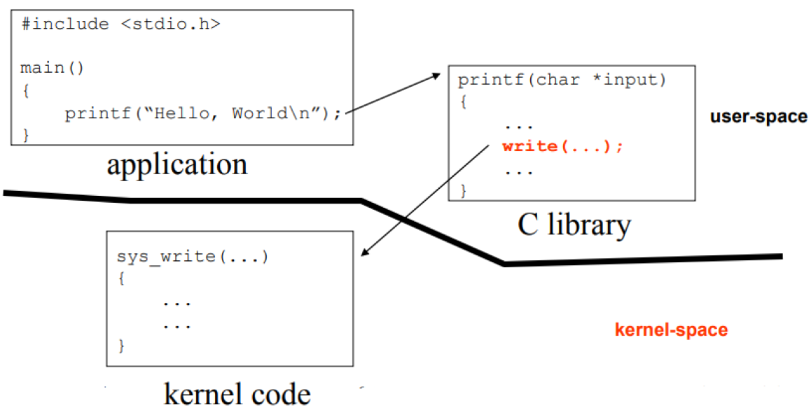
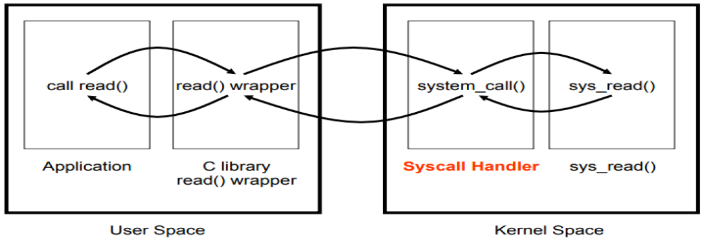

# 1. Introduzione

Un Sistema Operativo è quel componente software che ha il compito di assicurare la corretta operatività di un sistema: **controlla** e **coordina** le risorse **hardware** e **software** utilizzate dai programmi in esecuzione, anche detti **processi**.

**Esempio di Risorse Hardware**:

- Processori (in termini di tempo di CPU che offrono ai vari processi)
- Memorie
- Dispositivi periferici (I/O)

**Esempio di Risorse Software**:

- Coda dei processi pronti
- Tabella di process table (UNIX)
- Tabelle dei file aperti per ogni singolo processo (nell'ambito di gestione file)

La gestione di questo tipo di risorse avviene da parte del **Kernel**, la parte più importante del sistema operativo.

## 1.1 Compiti di un Sistema Operativo

Il Sistema Operativo deve:

- Tenere traccia delle risorse (conoscendone anche lo stato, se sono libere o occupate. Nel caso della CPU è necessario sapere se questa è già stata assegnata a un processo o è libera)
- Adottare strategie di assegnazione delle risorse (necessario quando più processi richiedono la stessa risorsa)
  - **A CHI** assegnare la risorsa
  - **QUANDO** assegnarla
  - **PER QUANTO TEMPO**
- Allocare le risorse
- Recuperare le risorse

Quindi, le risorse devono essere assegnate ai processi secondo determinate politiche.

Il Sistema Operativo si deve occupare della **RISOLUZIONE DI POSSIBILI CONFLITTI**, deve garantire l’integrità del sistema e ottimizzarne le prestazioni globali.

## 1.2 Definizione

Un Sistema Operativo è un `PROGRAMMA DI CONTROLLO`: controlla l’esecuzione di altri programmi per prevenire errori ed usi impropri del calcolatore.

### 1.2.1 Funzionalità

1. Controllo del/dei processore/i
2. Controllo della memoria principale
3. Controllo dei dispositivi di I/O (anche dispositivi di memorizzazione secondaria)

### 1.2.2 Obiettivi

- Semplificare l'uso di un sistema di calcolo
- Rendere efficiente l'uso delle risorse (hw/sw) di un sistema di calcolo

### 1.2.3 Requisiti Fondamentali

#### Multiplexing

Garantisce che tutti i processi possano eseguire secondo la politica stabilità dal sistema Operativo.

#### Isolamento

Garantisce che se un processo ha un problema questo problema non infici gli altri processi.

#### Interazione

Permette ai processi di interagire tra loro. Quando ciò accade, l'*Isolamento* non è garantito.

## 1.3 Storia dei Sistemi Operativi

L’evoluzione dei S.O. è stata influenzata dall’evoluzione dell’Hardware.

### 1.3.1 Evoluzione Sequenziale

#### Definizione

Le risorse del sistema vengono dedicate a un singolo programma (non ha importanza definirlo come processo quando è uno solo) finché questo non ha terminato l’esecuzione. Il programma si prende il possesso di tutto il sistema di calcolo.

#### Primi Sistemi

Scrittura dei programmi in linguaggio macchina (costituito da bit 0 e 1).

> PROGRAMMATORE = OPERATORE

Sviluppo dei programmi e caricamento dei sistemi di calcolo completamente manuale. L'operatore deve essere a contatto con il sistema di calcolo e andare a configurare manualmente il sistema in modo da scrivere il programma durante la configurazione.

`PROGRAM COUNTER`: indirizzo della prima istruzione dalla quale si sviluppava l'intero programma scritto in linguaggio macchina, che doveva essere scritto manualmente. Si doveva quindi avere accesso al *Program Counter* del Sistema di Calcolo. Si tratta di un **registro della CPU** la cui funzione è quella di conservare *l'indirizzo di memoria della prossima istruzione* (in linguaggio macchina) da eseguire.

- **PRODUTTIVITÀ MOLTO BASSA** sia per la macchina che per l’utente. Lo sviluppo di un programma risultava molto lento.

**Evoluzione**

- Linguaggi più evoluti (e loro **traduttori**)
- Perforatrici di schede e terminali (**editor**): non c'era più un caricamento manuale ma il programma era scritto diversamente, sempre in modo difficile ma aumentando la produttività.
- Utilizzo di routine standard per trattare le periferiche di I/O (**linker**): in questo modo il programmatore non doveva più scrivere il codice per interfacciarsi alle periferiche di Input / Output.
  > **Esempio**
  >
  > Un programma scritto in C, una volta compilato, genera un file oggetto. Questo non è eseguibile perché all'interno del programma è presente una `printf`, che fa parte della libreria standard C e quindi deve intervenire il linker che prende il formato oggetto del programma e produce, collegandolo con l'oggetto della libreria, il file eseguibile da parte di un processo.
- LOADER: caricatore automatico dei programmi. Parte basilare di un S.O.
  - Controllo diretto della esecuzione da console
  - Correzione in linea (in diretta) degli errori: (debugger)

In caso **MULTIUTENTE** vengono applicate prenotazioni del tempo di uso del sistema.

SEQUENZIALE perché:

- Caricamento editor: permette all'operatore di scrivere il proprio programma. (L'eseguibile viene poi caricato nuovamente sul nastro magnetico)
- Caricamento traduttore: produce il programma nella forma oggetto.
- Caricamento linker
- Caricamento programma eseguibile

Il caricamento, in genere, avveniva da *nastro magnetico*, utilizzato sia come dispositivo di input che di output.

**PROBLEMA**: scarsa efficienza.

### 1.3.2 Esecuzione Batch

Si è pensato di aumentare il grado di *sfruttamento delle risorse* e la *produttività* dei programmatori attraverso la riduzione (o eliminazione) dei tempi morti causati dalle operazioni manuali.

**Concetto di Batch**
Insieme di diversi programmi (JOB), più precisamente comandi per fare eseguire programmi. Vengono raggruppati in base ad esigenze comuni.

> **Esempio**
> Diversi programmi FORTRAN vengono raggruppati insieme.
>
> PROGRAMMATORE != OPERATORE
>
> Il Programmatore scrive il programma Fortran e lo passa all'Operatore. Questo raggruppa i diversi programmi Fortran e costruisce un BATCH.

**VANTAGGIO** &rarr; si carica il compilatore FORTRAN una sola volta.

I Programmi venivano consegnati come schede di memoria perforate.

**Configurazione schematica del Sistema di Calcolo:**

> Lettore di Schede &rarr; CPU &rarr; Stampante (fogli contigui)

**Linguaggio Comandi**

All’interno di un BATCH, i comandi sono dati in modo automatico tramite un linguaggio comandi **JOB CONTROL LANGUAGE (JCL)**. Azioni che era necessario che il sistema (ma anche l'operatore) facesse con il pacco di schede che veniva consegnato dal programmatore. Ogni linea di codice corrispondeva a una scheda. Il concetto del JCL è attualmente *presente in ogni sistema operativo*. E' possibile considerarlo come l'antenato dei linguaggi delle varie shell.

- **$JOB** - Inizio di un programma (oltre a costituire il programma, costituiva le schede di controllo e i dati)
- **$FTN** - Compilatore FORTRAN (quale compilatore caricare)
- **$LOAD** - Caricamento programma (caricamento esplicito del compilatore)
- **$RUN** - Esecuzione programma
- **$END** - Fine di un programma

Questi comandi sono interpretati da una parte del S.O. (sempre residente in memoria) &rarr; **MONITOR**

**SVANTAGGIO DELLA ESECUZIONE BATCH** &rarr; l’utente non può controllare interattivamente l’esecuzione del programma. Se si riscontra un errore a runtime il sistema fa un DUMP della memoria &rarr; immagine della memoria quando il programma si ferma per un errore.

#### Problema

La velocità della CPU era più grande di 2/3 ordini di grandezza rispetto ai dispositivi I/O a causa della enorme differenza di velocità fra *dispositivi meccanici* (più lenti) come lettori di schede e stampanti rispetto alla velocità di *dispositivi elettronici CPU* (più veloci). La CPU rimane *in attesa* del completamento di operazioni di I/O per una notevole percentuale di tempo.

#### Soluzione

Sovrapposizione delle operazioni di I/O con le operazioni eseguite dalla CPU tramite una delle seguenti 3 opzioni:

- **OPERAZIONI FUORI LINEA**

Per il lettore di schede e la stampante (lenti nei confronti della CPU ma anche nei confronti del lettore e scrittore di nastro) si utilizza un'ulteriore CPU.

CPU LENTA &rarr; per interfacciarsi con un lettore di schede (lento). Viene scritto su nastro ciò che viene letto dal lettore di schede fuori linea (non connesso ancora alla CPU principale). In un secondo momento questa CPU può leggere da nastro i risultati della CPU veloce (principale) e riversare offline i risultati su una stampante.

L'utilizzo di una CPU lenta rappresenta l'interfaccia verso il programmatore, più lenta ma comunque *fuori linea*. Nei confronti del sistema di calcolo, con la CPU VELOCE l'interfacciamento è sempre e solo tramite nastro, un po' più veloce di altri dispositivi come stampanti. Il nastro infatti è un *dispositivo magnetico*, al contrario di una periferica che è un *dispositivo meccanico*.

Un programmatore deve poter sviluppare i propri programmi (il proprio JOB) senza sapere se vengono eseguiti con un S.O che fa uso o meno di operazioni fuori linea e quindi tali programmi devono poter leggere da schede o da nastro e devono poter scrivere su stampante o su nastro.

> **&rarr; INDIPENDENZA DAI DISPOSITIVI FISICI**
> **&rarr; DISPOSITIVI LOGICI DI I/O**

È il S.O che, sapendo se sta facendo uso o meno di operazioni fuori linea, **collega** il dispositivo logico di I/O con il giusto dispositivo fisico &rarr; **concetto base della ridirezione**

- **UTILIZZO DI BUFFER DI INPUT - OUTPUT**

**meccanismo di INTERRUPT**  &rarr; la CPU viene sollecitata a gestire un dato ingresso inserendolo in un buffer, potendo continuare a fare altro fintanto che il dato non risulta disponibile sul dispositivo.

Questi buffer consentono di effettuare una sovrapposizione delle operazioni di input / output (operazioni di lettura del dato successivo) di un JOB con la sua esecuzione.

Quando il JOB ha bisogno del dato successivo lo trova già nel BUFFER (su memoria centrale)

Il concetto vale anche per l’uscita:
> programma produce uscita &rarr; BUFFER &rarr; stampante

- **TECNICA DI SPOOLING**

Acronimo per ***simultaneous peripheral operations on-line***. Invece che operare fuori linea, si lavora *on line* utilizzando i *dischi come buffer*. Tutto questo è reso possibile dall'avvento dei dischi magnetici a livello hardware. Consente quindi di caricare più programmi (o JOB) in memoria di massa.

Durante i tempi morti della CPU, venivano lette le schede (relative al JOB successivo) in parallelo all’esecuzione di un certo JOB, *memorizzando il risultato in un buffer su disco*. Quando il JOB successivo va in esecuzione trova i dati già nel buffer.

Lo Spooling è utilizzato nei sistemi operativi moderni per l'Output.

> Quando si chiede di stampare un documento, non si rimane in attesa del completamento della stampa, ma in realtà il documento viene battezzato in un'area di spooling e da questa viene preso dal gestore della stampante e va a riportare i dati che trova in quest'area sul dispositivo di output (stampante).

### 1.3.3 Multiprogrammazione

Quando un certo programma (JOB corrente) deve attendere un qualche evento, questo JOB viene sospeso. Ciò implica che la CPU risulti libera e in questo modo il sistema esegue un JOB diverso (siccome ci sono altri programmi in memoria di massa, per lo *spooling*). I Programmi rispettano lo schema di **Von Neumann**:

> Un programma per essere eseguito deve essere sempre necessariamente caricato sulla memoria centrale.
>
> 
 <i> JOB in memoria di massa = JOB in memoria centrale </i> 

Non è detto che sia caricato sempre il programma per intero, in quanto ci sono casi in cui con la memoria sono caricate solo parti di un programma, tuttavia *le istruzioni da eseguire nell'immediato devono essere caricate in memoria centrale*.

#### Funzionamento

La CPU, potendo avere a disposizione più JOB da eseguire, non ha più il vincolo dell'esecuzione sequenziale, ma può andare ad eseguire (quando il JOB corrente attende un evento) un altro JOB. Questo discorso è applicabile non solo a due programmi, ma a un numero qualunque di programmi. *Finché la CPU ha un JOB da eseguire non rimane mai **inutilizzata*** (cioè non è *mai **IDLE***).

La presenza di diversi JOB nel sistema implica per il S.O:

- Gestione della memoria di massa
- Gestione della memoria centrale
- Gestione della CPU

#### Analisi Comportamento

- **SENZA MULTIPROGRAMMAZIONE**

In caso di assenza di multiprogrammazione, il Sistema Operativo si definisce `SISTEMA OPERATIVO MONOPROGRAMMATO`, poiché *gestisce i programmi in modo sequenziale nel tempo*. Tutte le risorse hardware e software del sistema sono dedicate ad un solo programma per volta **&rarr; BASSO GRADO DI UTILIZZO DELLE RISORSE**

- **CON MULTIPROGRAMMAZIONE**

I programmi danno luogo a due processi concorrenti (o paralleli) le cui esecuzioni si avvicendano sulla CPU.

##### Confronto

Supponiamo di dovere mandare in esecuzione due programmi P0 e P1 (due processi), ognuno con le seguenti caratteristiche:
> - Durata complessiva di 1 minuto (dallo *start* allo *stop*)
> - 50% di attività di CPU (*in verde*) e il 50% di attesa di dati (*in nero*)

##### Caso 1: Assenza di Multiprogrammazione

- Durata complessiva dei due processi: 2 minuti (1 minuto per P0 + 1 minuto per P1)
- Occupazione della CPU: 1 minuto (grado di utilizzo = 50%)
- Throughput della CPU (cioè numero di programmi completati nell'unità di tempo): 1 al minuto

##### Caso 2: Presenza di Multiprogrammazione

- Durata complessiva dei due processi: 1 minuto

- Occupazione della CPU: 1 minuto (grado di utilizzo = 100%)

- Throughput della CPU (cioè numero di programmi completati nell'unità di tempo): 2 al minuto &rarr; caso teorico

**Nella realtà**: grado di utilizzo e throughput più bassi.

#### Vantaggi

- Migliore utilizzo delle risorse (riduzione dei tempi morti)

#### Svantaggi

- Maggiore complessità del S.O.:
  - Algoritmi per la gestione delle risorse (CPU, memoria, I/O)
  - Protezione degli ambienti dei diversi processi (in un sistema *monoprogrammato* c'è un problema di protezione per il sistema operativo solo nei confronti dell'unico programma in esecuzione)

### 1.3.4 Definizione di Processo

Le attività che vengono svolte da un Sistema Operativo quando un programma è in esecuzione determinano un *flusso di esecuzione* che viene denominato `PROCESSO` (entità attiva definita dal S.O. per eseguire un programma). Prima della sua esecuzione, quando si trova ancora in memoria centrale nella fase precedente a quella di *start*, è possibile fare riferimento ad esso con il termine `PROGRAMMA`.

## 1.4 Categorie di Sistemi Operativi

### 1.4.1 Sistemi Operativi Batch

I programmi devono essere sottomessi al sistema da parte dell'operatore attraverso dei comandi di sistema.

> programma + comandi di sistema &rarr; `JOB`

#### Problema

- Mancanza di interazione fra utente e JOB in esecuzione &rarr; *debugging difficile*

#### Utilizzo

- Programmi che non richiedono interazioni
- Programmi con tempo di esecuzione molto alto

> **Esempi**:
>
> * buste-paga
> * previsioni del tempo
> *  analisi statistiche
>

#### Scheduling dei JOB

In genere, First *COME* First *SERVED* (FCFS o anche FIFO).

#### Gestione Memoria

- Una parte &rarr; Monitor BATCH (parte del sistema operativo sempre residente)
- Il resto &rarr; JOB corrente in un'esecuzione in linea con quella sequenziale (in assenza di multiprogrammazione)

##### Protezione

La protezione viene semplificata. E' importante avere un *registro* che indica la *prima locazione di memoria* utilizzabile da un programma utente. Il programma utente viene caricato a partire da questa locazione e per tutto lo spazio di cui ha bisogno deve essere possibile contenerlo nell'area di memoria RAM a disposizione (le dimensioni sono fissate dalla dimensione fisica della memoria). Tutte le volte che viene prodotto un indirizzo dal programma, il S.O andrà a controllare che questo sia maggiore o almeno uguale a quello segnato nel *registro di protezione*, questo andrà a *garantire che il programma sta richiedendo l'accesso a zone di memoria che non sono utilizzate dal S.O*. Questo concetto è maggiormente importante per gli *accessi in scrittura*, ma in generale viene realizzato anche per gli *accessi in lettura*, dove l'esecuzione del programma viene bloccata per tentativo di accesso a zone di memoria non autorizzate che non sono appartenenti al S.O.

> **Ogni volta che il Program Counter si muove per far eseguire il programma viene fatto un controllo sul registro di protezione?**
>
> Non viene controllato solo il valore del *Program Counter*. Esso punta a un indirizzo di un'istruzione che è in memoria centrale e sulla quale viene fatto un *fetch*. L'istruzione viene decodificata e poi deve essere eseguita. Nell'esecuzione di questa istruzione devono essere utilizzati dei valori presenti nei registri, che ad un certo punto saranno derivati dal caricamento di un valore che ha in memoria. Tutte le volte che c'è un indirizzamento alla memoria che possa essere, da parte del PC nei confronti di un'istruzione, o da parte dell'esecuzione di un'istruzione nei confronti dell'accesso in un'area di dati viene fatto questo controllo.

#### Gestione Periferiche

- Controllo di programma (polling sul dispositivo)
- Interrupt &rarr; il vettore delle interruzioni serve per recuperare l'indirizzo iniziale della routine di risposta all'interruzione specifica

### 1.4.2 Sistemi Operativi Multiprogrammati

**MULTIPROGRAMMAZIONE** &rarr; più programmi in memoria centrale
Un S.O. multiprogrammato gestisce *contemporaneamente* più programmi presenti nella memoria principale. Quando un processo è IDLE (inattivo) ne prende un altro e lo comincia a eseguire parzialmente.

La *contemporaneità* può essere:

- **Reale**

  > **Esempio**:
  >
  > Avendo 3 CPU e 3 Programmi in memoria centrale, ciascuna può mandare in esecuzione un programma e avere così un processo attivo in ogni CPU e in questo caso i 3 processi sono *realmente* in esecuzione contemporaneamente.

- **Simulata**

  > **Esempio**:
  >
  > Avendo un numero di CPU minore rispetto al numero di programmi (quindi al *grado di multiprogrammazione* &rarr; numero di programmi caricati in memoria centrale). In questo caso le CPU saranno assegnate per brevi lassi temporali, secondo apposite politiche di scheduling, ai vari programmi per eseguirli in parallelo.

#### Categoria di Processi e Terminologie

Programma in esecuzione &rarr; `PROCESSO`

- **PROCESSI I/O BOUND** &rarr; attività di I/O rilevante
- **PROCESSI CPU BOUND** &rarr; attività di CPU rilevante (sia in stato di *running* che di *ready*)

Prendendo come riferimento le immagini precedenti, per i processi **I/O bound** i tratti *neri* del disegno sarebbero preponderanti, mentre per i processi **CPU bound** quelli preponderanti sono quelli *verdi*.

**MULTIPROCESSO** &rarr; più processi attivi (implica di avere la multiprogrammazione). Da *non confondere* con il termine *multiprogrammazione*. Dal punto di vista teorico (in realtà non è mai così) con la multiprogrammazione si potrebbe anche non avere più processi attivi: il sistema potrebbe anche gestire un processo alla volta. Un programma descrive un *insieme infinito* di processi.

**MULTIUTENTE** &rarr; più utenti possono accedere contemporaneamente (*SISTEMI INTERATTIVI* o *CONVERSAZIONALI*).

> **Esempio**:
>
> Il sistema Windows non è multiutente, come accesso *contemporaneo* allo stesso sistema Windows nello stesso momento. I sistemi UNIX sono invece multiutente, in quanto permettono l'accesso contemporaneo allo stesso sistema UNIX da parte di più utenti.

Possibili combinazioni:

- Sistema multiprogrammato, ma non multiutente

  > **Esempio**
  >
  > sistema real-time

- Sistema multiprogrammato e multiutente

  > **Esempio**
  >
  > sistema time-sharing

### 1.4.3 Sistemi Special Purpose

Sistemi *dedicati ad applicazioni specifiche*, spesso con *hardware speciale* (dispositivi di I/O).

> **Esempio**:
>
> - Sistemi Real-Time

### 1.4.4 Sistemi General Purpose

Sistemi che servono per scopi generali (non specifici).

> **Esempio**:
>
> - Linux
> - Windows

Sistemi che non sono stati scritti per applicazioni specifiche.

### 1.4.5 Sistemi Time-Sharing

Un S.O *time-sharing* *fornisce a ciascun utente una **porzione di un sistema di calcolo***.

Ogni utente ( &rarr; *multiutenza*) ha i propri programmi in memoria ( &rarr; *multiprogrammazione*) .

#### Funzionamento

Il sistema operativo garantisce l'esecuzione dei vari programmi (e quindi dei vari processi) assegnando un **quanto di tempo**, e per questa durata va in esecuzione un determinato processo che esegue lo specifico programma che fa parte di uno specifico utente. In questo modo un programma è in esecuzione per **al massimo un quanto di tempo** (*time slice*), definito dal sistema.

Al completamento del quanto, il controllo passa ad un altro processo (che esegue un altro programma), a rotazione. Se prima della scadenza del suo quanto, il processo/programma fa una richiesta di I/O, perde il controllo.

- Ogni utente ha l’illusione di avere la macchina dedicata completamente a lui (CPU, memoria, dispostivi I/O unicamente appartenenti a lui).
- *Astrazione* di più **macchine virtuali**

`MACCHINA VIRTUALE` &rarr; utilizzo di uno strumento che ci permette di installare un S.O diverso da quello di partenza. Su un hardware è presente un Sistema Operativo *ospite* e su di esso una macchina virtuale sulla quale è possibile farne girare un altro.

#### Problema

- Scheduling della CPU

### 1.4.6 Sistemi Operativi Misti

Sono sistemi che forniscono diverse possibilità:

- **Gestione Interattiva** &rarr; time-sharing (utenti ai terminali)

> Una parte del S.O ragiona in termini di time-sharing perché ha bisogno di gestire utenti connessi con diversi terminali fisici (gestione del II tipo).

- **Gestione BATCH** (nei tempi morti)

> Necessità di eseguire dei JOB che necessitano molto tempo e che quindi vengono eseguiti di notte dal sistema.

- **Gestione Real-Time**

> Gestione di eventi che non possono essere rimandati.

## 1.5 Struttura di un Sistema Operativo

Esistono 3 tipi di approccio rispetto alla progettazione di un Sistema Operativo:

- Monolitici
- Layered (stratificati)
- Microkernel

### 1.5.1 Monolitici

I Sistemi Operativi monolitici sono costituiti da un *insieme di moduli* (non è detto che il programma sia un tutt'uno), *senza alcuna relazione gerarchica*.

- Ogni modulo può chiamare ogni altro modulo
- Tutti i moduli possono accedere indiscriminatamente a tutti i dati presenti nel kernel

#### Vantaggi

- Il progettista *NON* deve decidere quali parti del S.O. hanno bisogno di avere i privilegi per accedere all’HW (accessibile solo dal Kernel), tutte le parti hanno gli stessi privilegi.
- Parti differenti del S.O. possono cooperare facilmente

#### Svantaggi

- Cambiando un singolo modulo, potrebbe rompersi il sistema di chiamata dei moduli. Un modulo che chiamava quello che è stato modificato poteva fare delle assunzioni che dopo le modifiche potrebbero non essere più valide.
- L’interfacciamento fra le differenti parti di un S.O. è spesso reso più complicato e uno sviluppatore potrà più facilmente compiere degli errori. In un *Kernel Monolitico*, ***un errore è fatale*** perché si lavora sempre in *kernel mode* e quindi *si blocca tutto*.

  > **Esempio**:
  >
  > *UNIX*. L’intero Sistema Operativo risiede nel kernel e tutte le *system call* eseguono in *kernel mode*.
  >
  > **N.B**: Un certo grado di modularità viene garantito dal fatto che i più recenti kernel monolitici (es. *LINUX*) permettono di effettuare il caricamento di moduli eseguibili a runtime &rarr; è possibile estendere le potenzialità del kernel, solo su richiesta.

### 1.5.2 Stratificati

In questi Sistemi Operativi esiste una *relazione gerarchica tra i moduli (layer)* che compongono il Sistema Operativo. Questa stratificazione presenta un *protocollo* che fa sì che:

- Ad ogni modulo è assegnato un numero che indica il livello di appartenenza
- Un modulo di livello N potrà accedere solo a funzionalità e dati presenti al livello sottostante (N-1)

In questo caso il sistema risulta di più facile manutenzione anche se meno efficiente del sistema monolitico. E' possibile cambiare tutti i moduli di un certo livello senza bisogno di cambiare i moduli del livello sottostante, e nemmeno quelli del livello sovrastante se viene garantita che l'interfaccia data ad essi sia sempre la stessa. E' dunque possibile cambiare l'intera implementazione di un livello senza che questa abbia effetto sugli altri, cosa *contraria* a quanto visto nella *struttura monolitica*.

Il Sistema Operativo può essere progettato come una gerarchia di **livelli di astrazione**: per ogni livello possono essere usate tecniche di *information hiding* &rarr; **modularità**

### 1.5.3 Microkernel

In questo tipo di Sistemi Operativi sono contenuti solo ed esclusivamente i *servizi indispensabili per il funzionamento dell'intero sistema*. In particolare, questa struttura gestisce:

- Processi
- Messaggi &rarr; meccanismo di comunicazione tra processi

I *restanti servizi* (gestione memoria, file system, gestore finestre, ecc...) sono considerati processi utente: non eseguono a livello di kernel, ma eseguono *sopra alla microkernel*. L’*approccio è opposto a quello monolitico* dato che si va a minimizzare la parte di S.O. che esegue in kernel mode e *la maggior parte del S.O. esegue in user mode*.

#### Vantaggi

- Kernel molto contenuto → manutenzione più facile, meno errori
- Codice eseguito in kernel mode molto contenuto
- S.O. nel complesso più facilmente estendibile e personalizzabile &rarr; è sufficiente aggiungere nuovi servizi che sono visti come processi utente.

#### Svantaggi

Basse prestazioni. Tutte le volte che il gestore della memoria o il file system ha bisogno di operare a livello fisico sull'hardware deve interfacciarsi con il microkernel facendo una richiesta (inviando dunque un messaggio) per poter accedere ad un dispositivo di memorizzazione secondario, piuttosto che alla memoria o altro.

Nei S.O. a microkernel le applicazioni che implementano i diversi servizi possono essere pensate come dei server che forniscono funzionalità agli altri server o alle applicazioni utente che in questo caso operano come client: per questo motivo i sistemi microkernel sono chiamati anche ***client-server OS***.

## 1.6 Componenti di un Sistema Operativo

Questi componenti devono gestire aspetti specifici del sistema operativo. Svolgono diverse funzioni:

- **PROCESSOR/PROCESS MANAGEMENT (NUCLEO o KERNEL)**
  - Gestione processore tramite processi,
  - Sincronizzazione e comunicazione

* **I/O SYSTEM**
  * gestione dei dispositivi di I/O
* **MEMORY MANAGEMENT**
  * gestione della memoria primaria (centrale &rarr; RAM)
* **FILE SYSTEM**
  * gestione della memoria secondaria
* **PROTECTION SYSTEM**
  * gestione degli accessi
* **NETWORKING**
  * gestione di sistemi distribuiti
* **COMMAND INTERPRETER SYSTEM**
  * gestione interfaccia utente &rarr; interprete del linguaggio comandi

### 1.6.1 Gestore dei Processi

Il processo è l’unità di lavoro in un Sistema Operativo multiprogrammato. In generale, un Sistema Operativo gestisce una *collezione di processi*:

- processi del S.O. che *eseguono il codice del sistema*
- processi utente che *eseguono il codice di utente*

Questi due tipi di processi possono essere in esecuzione ***concorrentemente*** (*reale* con più CPU, *simulata* con una sola CPU).

#### Gestione del Processore

Il Sistema Operativo si deve occupare della politica di assegnazione del processore (o dei processori) ai vari processi &rarr; ***scheduling* dei processi**

#### Funzioni Svolte

* Creazione e distruzione di processi
* Sospensione e riattivazione di processi
* Strumenti per la sincronizzazione e la comunicazione di processi
* Scheduling dei processi &rarr; vari algoritmi a seconda delle esigenze del S.O e/o degli utenti

### 1.6.2 Gestione dei Dispositivi I/O

<!-- paragrafo non rilevante -->

Nasconde al programmatore i dettagli e le peculiarità dei dispositivi di I/O (periferiche, memoria di massa, ecc...), in particolare:

- Gestione a controllo di programma (polling)
- Gestione ad interruzioni (interrupt) &rarr; routine di risposta alle interruzioni

#### Funzioni Svolte

- Routine di risposta alle interruzioni se il dispositivo è trattato come interrupt
- Gestione dei buffer di I/O

### 1.6.3 Gestione della Memoria Centrale

Si tratta della *gestione degli spazi di indirizzamento dei processi* (sistemi operativi multi programmati e time-sharing, e quindi multiprocessing). Il grado di multiprogrammazione, considerando la sola memoria RAM, potrebbe essere limitato.

**MEMORIA VIRTUALE** &rarr; il programmatore ha l’**illusione** di avere a disposizione una memoria più grande di quella fisica.

#### Funzioni Svolte

* Allocazione e deallocazione di memoria
* Gestione degli spazi di indirizzamento di ogni processo
* Gestione della memoria virtuale (non si dovrà utilizzare la sola memoria RAM, ma anche dischi ad accesso veloce)

### 1.6.4 Gestione della Memoria Secondaria

L’informazione può essere memorizzata su diversi dispositivi (dischi, nastri, cassette, ecc...), all'utente non interessa *dove* l'informazione viene salvata. Ciascun dispositivo di memorizzazione ha le proprie caratteristiche e la propria organizzazione fisica. Il Sistema Operativo **astrae** dalle caratteristiche fisiche introducendo il concetto di file e di file system.

**FILE** &rarr; unità di memorizzazione logica, insieme di informazioni logicamente correlate.

> **Esempio**:
> - Programmi (codice sorgente, codice oggetto, codice eseguibile)
> - Dati (numerici, alfabetici, alfanumerici)

**FILE SYSTEM** &rarr; organizzazione dei file (directory)

* ad un solo livello
* a più livelli

#### Funzioni Svolte

* Creazione e cancellazione di directory
* Creazione e cancellazione di file
* Operazioni di trattamento dei file
* Piazzamento dei file sulla memoria secondaria (corrispondenza delle informazioni sulla memoria secondaria, per la quale all'utente viene fornita un'astrazione).

### 1.6.5 Gestione Interfaccia Utente

Questo livello ***interpreta i comandi*** dati al Sistema Operativo (richiesti dall'utente) &rarr; *costituisce l’interfaccia fra il Sistema Operativo e l’utente*.

I comandi sono relativi a tutte le funzioni viste:

- Gestione dei processi
- Gestione dell’I/O
- Gestione della memoria
- Gestione del file system
- Gestione della protezione
- Gestione dei sistemi distribuiti

A questo livello si collocano anche gli strumenti che sono offerti per il supporto ai linguaggi di programmazione

- COMPILATORI
- INTERPRETI

### 1.6.6 Gestione della Protezione

*Meccanismi* e *politiche* *per controllare l’accesso dei processi alle risorse* del sistema di calcolo. Elemento più importante del Sistema Operativo.

**MECCANISMI** &rarr; realizzati via *hardware*. *Unità fondamentale* del gestore di protezione realizzato via hardware.

In particolare:

#### Modi differenti di Funzionamento

Il punto di partenza per realizzare la protezione a livello hardware è rappresentato dal **bit di modo**: *monitor (0) - utente (1)*.

Consente di stabilire se l'istruzione corrente è eseguita per conto del S.O. o dell'utente (si definisce *stato monitor* o *stato utente*). Ogni volta che si verifica un interrupt oppure si richiede un servizio del S.O. (tramite una system call), l'hardware passa da modo utente a modo supervisore (o privilegiato, detto anche kernel mode) &rarr; le istruzioni macchina che possono causare danni allo stato del sistema (a livello hardware possono fare qualsiasi cosa) sono definite come **istruzioni privilegiate** che possono essere eseguite solo in modo supervisore.

#### I/O

Il livello di gestione dell’I/O impedisce l’accesso diretto ai dispositivi da parte degli utenti poiché le istruzioni di I/O sono privilegiate.

#### Memoria

Hardware di indirizzamento della memoria assicura che un processo possa operare solo entro il proprio spazio di indirizzamento &rarr; ad esempio con ***registri base e limite***.

## 1.7 Problematiche di Gestione dei Sistemi Distribuiti

Se a livello architetturale è presente una rete, il Sistema Operativo si deve occupare anche della gestione di questa rete.

### 1.7.1 Architettura Distribuita (Loosely Coupled Architecture)

Insieme di processori (CPU) che ***non condividono né la memoria né il clock***. Ogni processore ha la sua memoria locale (e il suo clock) e comunica con gli altri solo mediante linee di comunicazione.

Assenza di una memoria comune. Ciò comporta più problemi: considerando che il Sistema Operativo debba andarsi ad appoggiare sull'hardware (architettura distribuita) quello che si dovrà andare a definire è un *sistema distribuito*. Questo sistema non è di facile progettazione proprio a causa dell'*assenza di una memoria comune*, si hanno *tante memorie locali* alle varie CPU e quindi non è facile stabilire la parte di S.O che deve essere sempre caricata in memoria centrale in quale memoria si trova. La *soluzione migliore* rimane l'implementazione di un ***Sistema Operativo di Rete***.

> **Esempio**:
>
> Attuali versioni di UNIX (LINUX) sono *sistemi operativi di rete*.

**Sistema Operativo di RETE** &rarr; Si tratta di un normale sistema operativo sviluppato per ragionare su un'unica CPU o più CPU in memoria comune, sul quale si va ad aggiungere uno *strato software* per interfacciarsi con la rete, aggiungendo servizi come *FTP*.

In questo caso il S.O non è propriamente distribuito, in quanto deve nascondere del tutto la natura distribuita dell'architettura, ma sono S.O di rete che possono gestire alcuni aspetti dell'architettura distribuita ma non necessariamente nasconderne la distribuzione. Eventualmente l'utente può essere a conoscenza che il proprio processo stia girando su un certo nodo dell'architettura piuttosto che un altro.

### 1.7.2 Architettura Multiprocessore (Tightly Coupled Architecture)

Insieme di processori (CPU) che condividono la memoria. Ogni processore comunica con gli altri o tramite la memoria comune (condivisa) oppure mediante linee di comunicazione (network).

Il Sistema Operativo può essere allocato nella memoria comune, e in seguito esso nasconderà tutte le caratteristiche relative alla presenza di più CPU e di una rete.

La rete di comunicazione può essere configurata in modi diversi:

- Bus
- Connessioni punto a punto
  - Rete totalmente connessa
  - Rete parzialmente connessa

In entrambi i casi nascono problematiche di ***NETWORKING***. Rispetto a un *sistema centralizzato*, dove il ***network non è presente***, che può degenerare avendo un'unica CPU e un'unica memoria, *possono verificarsi i seguenti problemi*:

- Problemi di routing (strategie di connessioni)
- Problemi di sicurezza e di accesso contemporaneo in relazione alla rete di comunicazione
- Problemi di allocazione dei processi ai processori
  - Statica (dove il *processo* viene assegnato *per sempre allo stesso processore*) o dinamica (dove può essere che il processo cominci a eseguire su un processore e in seguito venga spostato)
  - Trasparenza o meno dell'allocazione: l'utente può non sapere dove viene eseguito il proprio processo, oppure richiedere che l'esecuzione avvenga su un processore specifico (*predilezione del processore*). Se questo concetto viene a meno e può trattare *tutto il S.O* possono essere presenti delle strategie di ***LOAD BALANCING*** &rarr; migrazione di processi. Questi vengono allocati in modo da bilanciare il carico sia a livello di computazione che di comunicazione.

## 1.8 Studio di un Sistema Operativo

**PUNTO DI VISTA DELL’UTENTE** &rarr; esterno

**PUNTO DI VISTA DEL S.O** &rarr; interno

### 1.8.1 Punto di Vista dell'Utente

I servizi del Sistema Operativo ad un programmatore sono offerti in modi diversi a seconda se l'utente è:

1. *UN PROGRAMMATORE* (livello di programmazione) &rarr; ***CHIAMATE DI SISTEMA*** (*SYSTEM CALL*)
2. *UN UTENTE* (vero e proprio, livello utente) &rarr; ***PROGRAMMI DI SISTEMA*** (compilatore, programmi che si utilizzano senza conoscenza delle richieste fatte al S.O)

#### Chiamate di Sistema (SYSTEM CALL o SYSCALL)

In ambito UNIX vengono definite *chiamate primitive*. Sono funzioni implementate nel S.O. che possono essere usate dai processi (programmatori) in *user space*:

- Da un punto di vista concettuale un programmatore che vuole utilizzare una certa funzione del S.O chiama una syscall come una normale funzione.
- La differenza sostanziale (rispetto a una chiamata di funzione) è che l’indirizzo della syscall è presente in una ***tabella del kernel*** e nel momento in cui si effettua la chiamata il processore entra in *Kernel Mode* &rarr; tutte le chiamate di sistema producono così un *cambio del bit di modo*
- Tutti i processori contengono nel loro ISA (*Instruction Set Architecture*, set di istruzioni a basso livello) un’istruzione per effettuare una syscall

> - x86: int/iret &rarr; chiamata di interrupt software che prevede una *iret*, ovvero un ritorno
> - MIPS: syscall (istruzione hardware)
> - In altri casi: trap (al S.O)

Possono definirsi come ***l'interfaccia*** con cui i processi operanti in *user space* possono:

- Accedere all’hardware e alle altre risorse gestite dal sistema operativo
- Comunicare con il kernel

Pertanto, le *system call* costituiscono uno ***strato tra hardware e processi in user space***, che:

- Fornisce un’interfaccia per semplificare l’uso delle risorse *HW* da parte dei processi user space
- Assicura la sicurezza del sistema &rarr; È il kernel che decide chi e come può accedere alle diverse risorse del sistema. In questo modo non è possibile che un processo utente possa andare a scrivere in un'allocazione in cui è presente la tabella dei processi del sistema.

La chiamata di una system call da parte di un’applicazione avviene attraverso la chiamata di opportune funzioni di **libreria**, che a loro volta si rifanno all’interfaccia della system call per svolgere il loro compito.

> **Esempio**:
>
> Il programmatore sa che per fare un'azione sullo *standard output* deve chiamare la *funzione di libreria* *printf*. Questa funzione, invocata in user space, dopo che vengono fatte delle operazioni relative alla formattazione della stringa da stampare, invoca una syscall (funzione write), che nel kernel corrisponde all'andare a invocare *la funzione write*.

*Ad ogni **system call** è assegnato un **numero che la contraddistingue***, e quindi il kernel riconosce le syscall per numero e non per nome &rarr; una volta assegnato il *numero* ad una system call, *non può più essere mutato*, altrimenti le applicazioni precedentemente compilate non troverebbero la corretta corrispondenza.

**N.B**: Se una syscall viene rimossa il suo identificativo non potrà essere “riciclato”.

> **Esempio**:
>
> Il kernel Linux mantiene una lista di tutte le syscall registrate in una tabella memorizzata in *sys_call_table* in *entry*.S (Assembler Source Code)

In generale una System Call ha:

- Uno o più argomenti di input
- Un valore di ritorno che indica la corretta esecuzione o meno &rarr; Di solito un valore di ritorno pari a *0* (zero) è indicazione di *successo* (si ricordi la semantica UNIX), mentre un qualunque *valore diverso da 0 denota un errore*.

##### Passaggio dei Parametri

- Molte syscall richiedono parametri per poter essere eseguite
- I *parametri sono scritti nei registri di CPU* prima della chiamata della syscall
- Se sono richiesti più argomenti, gli stessi sono passati attraverso stack o puntatori (il valore del puntatore viene caricato nel registro e in seguito si va a considerare la zona di memoria puntata dal puntatore).

##### Librerie vs System Call

Le system call vengono mappate in un *sottoinsieme delle librerie*. Rispetto alle system call, le funzioni di libreria possono svolgere una delle seguenti funzioni

- ***Wrapper*** alla system call, cioè fornisce ***elaborazioni supplementari*** a quelle fornite dalla system call.

  > **Esempio**:
  >
  > La funzione di libreria *printf()* effettua le formattazioni dei dati prima di chiamare la system call *write()* che scrive i dati su standard output.

- Relazione 1-1 con la system call, cioè chiama esclusivamente la system call di competenza

  > **Esempio**:
  >
  > *open()* per i file

- Non chiamano nessuna system call

  > **Esempio**:
  >
  > *strcpy()*

###### Libreria Standard C

La libreria standard del C (`libc`) contiene funzioni di utilità che forniscono servizi general purpose al programmatore queste funzioni *non sono chiamate dirette a servizi del kernel*, sebbene alcune di esse possono fare uso delle system call per realizzare i propri servizi. Questa libreria implementa:

- La principale API (Application Programming Interface) sui sistemi Unix
- L’interfaccia per le chiamate di sistema &rarr; *libc* fornisce anche la maggior parte dell’API POSIX (Portable OS interface).

#### Programmi di Sistema

A livello utente è disponibile una *collezione di programmi di utilità*, in particolare per sviluppare un programma:

- Compilazione
- Collegamento (linking)
- Caricamento
- Esecuzione
- Debugging

L’interfaccia utilizzata dell'utente è la ***command interpreter*** (*processore comandi*, nel caso di LINUX è la *shell*)

### 1.8.2 Punto di Vista del Sistema Operativo

Un Sistema Operativo è un ***programma event driven*** (guidato dagli eventi). Sostanzialmente, non esegue azioni fino a quando non succede effettivamente qualcosa. Non prende iniziative autonome ma reagisce a delle richieste, si pone in attesa per:

- Lavori da eseguire
- Dispositivi da gestire
- Utenti a cui rispondere

Tipicamente un evento è rappresentato dal verificarsi di un ***INTERRUPT*** &rarr; al verificarsi di un interrupt, il controllo passa al S.O.

`INTERRUPT` &rarr; particolare richiesta al sistema operativo da parte di un processo in esecuzione.

Esistono tipi diversi di interrupt:

- ***Asincroni*** derivanti da un dispositivo di I/O (quindi da hardware), definito asincrono rispetto alla normale esecuzione del programma in esecuzione sulla CPU
- ***Sincroni***
  - Derivanti da errori verificatisi durante la esecuzione

    > **Esempio**:
    >
    > *overflow*, *divide by 0*, *tentativi di accesso ad arie di memoria non consentite*

  - Derivanti da una system call

Il trattamento di questo interrupt produce un *cambio di visibilità*: si passa *da modalità utente a modalità supervisore*.

#### Distinzione fra Meccanismi e Politiche

- Le ***politiche*** decidono *cosa debba essere fatto*
- I ***meccanismi*** *attuano la decisione stabilita da una certa politica*: sono l'oggetto alla quale la politica si riferisce.

È un concetto fondamentale del software engineering: avere due componenti distinte per prendere decisioni sulle *politiche* e per implementare i meccanismi rende possibile cambiare uno senza cambiare l'altro.

> **Esempio**: (non relativo ai S.O)
>
> *meccanismo* &rarr; denaro
>
> politica &rarr; come il denaro viene speso

> **Esempio**:
>
> *meccanismo* &rarr; interrupt asincrono. Un certo dispositivo richiede l'attenzione della CPU, interrompendone l'esecuzione.
>
> politica &rarr; routine di risposta all'interruzione. La CPU, sulla base del numero di interrupt, va ad eseguire una routine di risposta all'interruzione.

## 1.9 Progettazione di un Sistema Operativo

Prima di partire con la progettazione, si deve partire con la definizione del problema:
- Definire gli ***obiettivi*** del S.O. che si vuole realizzare
- Definire i ***vincoli*** entro cui il S.O. deve operare

La progettazione sarà *influenzata*:

- A livello più basso, *dal sistema hardware* sul quale si va ad eseguire
- A livello più alto, dalle *applicazioni che devono essere eseguite* dal Sistema Operativo

A seconda di queste condizioni, il S.O sarà: *batch*, *time-shared*, *single-user*, *multi-user*, *distribuito*, *general-purpose*, *real-time*, ...

Bisogna poi considerare:

- Richieste dell'utente &rarr; *comodo da usare* (user friendly), *facile da imparare*, *robusto* (senza crash o interruzioni), *sicuro* (i dati che l'utente va ad utilizzare devono essere mantenuti in modo privato), *veloce*
- Richieste degli sviluppatori &rarr; *facile da progettare*, da *mantenere* e da *aggiornare*, *veloce da implementare*

## 1.10 Installazione di un Sistema Operativo

Una volta che il S.O. sia stato progettato e quindi implementato bisogna installarlo: normalmente il S.O. è implementato in modo da garantirne la ***portabilità***:

- Lo stesso Sistema Operativo viene spesso previsto per architetture hardware differenti
- Possono essere equipaggiati con dispositivi periferici molto diversi, e spesso anche diverse architetture di CPU e BUS &rarr; bisogna prevedere meccanismi per la generazione del S.O. specifico per l'architettura utilizzata

I parametri tipici per la generazione di un sistema operativo sono:

- *Tipo di CPU* utilizzata (o di CPU utilizzate)
- *Quantità di memoria centrale*
- *Periferiche utilizzate*
- *Parametri numerici* di vario tipo (numero utenti, processi, ampiezza dei buffer, tipo di processi, ...)

I metodi che possono essere utilizzati per la generazione/istallazione sono:

- Rigenerazione (nel senso di *ricombinazione*) del kernel con i nuovi parametri/driver
- Prevedere la gestione di moduli aggiuntivi collegati durante il boot &rarr; non si ha una rigenerazione di tutto il kernel ma si parte da una situazione preesistente: all'accensione del sistema si vanno a caricare dei moduli aggiuntivi, in particolare se si devono andare a trattare delle periferiche che prima non c'erano (ciò è reso possibile da alcune tecniche particolari di *caricamento dinamico*, che consentono di caricare determinate librerie come *extension MacOS, DLL Windows, moduli Linux*).
