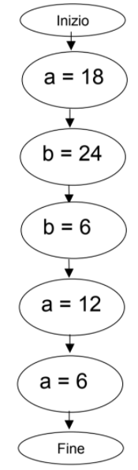

[TOC]

# 2. Primo Componente del Sistema Operativo

## 2.1 Gestione dei Processi (e Processori)

Normalmente prende il nome di `KERNEL` o `NUCLEO`. Nel caso in cui la strutturazione sia monolitica tutto collassa nel *nucleo* (che coincide con il sistema operativo). Questa *macchina astratta* che comprende l'hardware a disposizione deve mettere in campo:

- un *meccanismo di esecuzione di **processi sequenziali*** 
- uno o più *meccanismi di sincronizzazione*

Questa macchina (kernel o nucleo) può essere anche realizzata:

- totalmente in *hardware* (in genere non è così)
- *software* (una parte consistente) 
- *firmware*

Si analizzano di seguito i concetti essenziali del nucleo per prima cosa dal ***punto di vista ESTERNO*** (utente programmatore).

### 2.1.1 Algoritmo, Programma, Processo

`ALGORITMO` &rarr; procedimento logico che deve essere seguito per risolvere il problema in esame

`PROGRAMMA` &rarr; descrizione dell'algoritmo tramite un opportuno formalismo (*linguaggio di programmazione*), che rende possibile l'esecuzione dell'algoritmo da parte di un particolare elaboratore. Parlando di un linguaggio di programmazione, si dovrà passare per le fasi opportune, quali compilazione, collegamento (linking) fino all'ottenimento del formato eseguibile, partendo dal programma scritto in forma sorgente. Se il linguaggio è interpretato come linguaggio shell, mandiamo direttamente in esecuzione il programma senza tutte le fasi necessarie in un linguaggio di programmazione compilato.

Un programma *descrive* un *insieme* (possibilmente infinito) *di processi*, ognuno dei quali è relativo all’esecuzione del programma da parte del processore per un determinato insieme di dati in ingresso. *Ogni volta che si richiede l'esecuzione di un programma si genera un nuovo processo*.

`PROCESSO` (*sequenziale*) &rarr; sequenza di eventi a cui dà luogo un elaboratore quando opera sotto il controllo di un particolare programma.

#### Differenza fra Programma e Processo

Un programma (entità statica, prima memorizzato come file nel file system e poi caricato in memoria centrale) può essere eseguito da più processi (entità dinamiche).

<center><b><i>Un processo è un programma in esecuzione</i></b></center>

### 2.1.2 Rappresentazione di un Processo

Sequenza di ***stati*** attraverso i quali passa l’elaboratore durante l’esecuzione di un programma.

> **Esempio**:
> Massimo Comune Divisore (M.C.D.) di x e y (numeri naturali)
>
> ```c
> a = x; 
> b = y;
> while (a != b) { 
>     if (a > b)
>     	a = a - b;
>     else b = b - a;
> }
> ```
>
> | **x**     | 18   | 18   | 18   | 18   | 18   | 18   |
> | ----- | ---- | ---- | ---- | ---- | ---- | ---- |
> | **y** | 24   | 24   | 24   | 24   | 24   | 24   |
> | **a** | -    | 18   | 18   | 18   | 12   | 6    |
> | **b** | -    | -    | 24   | 6    | 6    | 6    |
>
> ***a = 6***, ***b = 6*** &rarr; M.C.D dei due numeri dati in ingresso: 18, 24
>
> ***STATO*** &rarr; espresso dai valori delle variabili

La rappresentazione tabellare non è particolarmente comoda, perché se si dovesse rappresentare un programma più complesso questa diventerebbe molto grande e di difficile interpretazione. A questa, vengono preferite altre modalità di rappresentazione.

#### Grafo di Precedenza

Un processo può essere rappresentato tramite un *grafo orientato* &rarr; *grafo di precedenza* del processo.

I *nodi* del grafo rappresentano i singoli eventi del processo, mentre gli *archi* identificano le *precedenze* *temporali tra tali eventi*. 

##### Processo Sequenziale

Il grafo di precedenza è a *ordinamento totale* cioè ogni nodo (fatta eccezione per quello iniziale e quello finale) ha esattamente un predecessore ed un successore.

> **Esempio**: (riprende *Esempio M.C.D*)
>
> 

Per vedere che questa non è l'unica possibilità in cui si sviluppa un programma che porti ad ottenere un grafo di precedenza a ordinamento totale e quindi a un processo sequenziale, passiamo a considerare un *formalismo matematico*.

> **Esempio**:
>
> Il programma corrisponde alla valutazione dell'espressione:
> $$
> (3 * 4) + (2 + 3) * (6 - 2)
> $$
> **GRAFO DI PRECEDENZA AD ORDINAMENTO TOTALE** 
>
> 
>
> **GRAFO DI PRECEDENZA AD ORDINAMENTO PARZIALE**
>
> Nel *caso in cui si è in di più* nella risoluzione dell'espressione. Con una suddivisione dei compiti, l'espressione può essere valutata svolgendo in parallelo i calcoli. Prima di calcolare D deve essere posto il *vincolo* di aver prima calcolato B e C. Con l'ordinamento parziale, *un nodo può avere più di un predecessore* o *un successore*.
>
> 
>
> ARCO &rarr; vincolo di precedenza tra gli eventi
>
> VINCOLO DI SINCRONIZZAZIONE &rarr; ordinamento di eventi

##### Processo non Sequenziale

L'***ordinamento totale*** di un grafo di precedenza *può derivare* dalla natura sequenziale di un processo, cioè può essere implicito nel problema da risolvere (il calcolo dell'MCD è possibile ottenerlo solo con un grafo a ordinamento totale). Altre volte, invece, l’ordinamento totale può essere imposto dalla natura sequenziale dell’elaboratore e non essere insito nel problema (come nel caso del formalismo matematico precedente, dove la natura del programma è tale per cui potrei ottenere un grafo di precedenza a ordinamento parziale, e quindi un *processo non sequenziale*).

Esistono molti esempi di applicazioni che potrebbero essere più naturalmente rappresentate da processi *non sequenziali* &rarr; cioè processi tra i cui eventi non esiste un ordinamento totale, ma solo *parziale*.

> **Esempio**:
>
> Elaborazione di dati su un file sequenziale (composto da N record).
>
> 
>
> ```c
> T buffer;
> int i;
> 
> for (i = 1; i <= N; i++) { 
>     lettura(buffer);
>     elaborazione(buffer);
>     scrittura(buffer); 
> }
> ```
>
> Scrivendo il programma in questi termini, senza ragionare attraverso compilatori paralleli, quello che otteniamo è un'esecuzione che da luogo a un processo sequenziale e quindi a un *grafo di precedenza a ordinamento totale*.
>
> **GRAFO DI PRECEDENZA AD ORDINAMENTO TOTALE** 
>
> - **L** &rarr; lettura
> - **E** &rarr; elaborazione
> - **S** &rarr; scrittura
>
> 
>
> **GRAFO DI PRECEDENZA AD ORDINAMENTO PARZIALE**
>
> In realtà il problema non è necessariamente sequenziale, pertanto il grafo che è possibile ottenere è un *grafo a ordinamento parziale* in cui rimangono dei *vincoli di sequenzialità* (sulle letture e sulle elaborazioni e sulle scritture). Una volta fatto partire il tutto, è possibile arrivare alla lettura del terzo dato che può avvenire in parallelo con l'elaborazione del secondo dato e la scrittura del primo: non c'è nessuna ragione insita nella natura del problema che lo vieti.
>
> 

L’esecuzione di un processo non sequenziale richiede:

- un elaboratore non sequenziale
- un linguaggio di programmazione non sequenziale (oppure degli strumenti che automaticamente producono da un programma scritto in modo sequenziale dal programmatore, un programma non sequenziale)

###### Elaboratore non Sequenziale

In grado di eseguire più operazioni contemporaneamente &rarr; la *contemporaneità* può essere ***reale (A)*** o ***simulata (B)***.

> **Esempio**:
>
> In relazione all'esempio precedente,  la *lettura*, *elaborazione* e *scrittura* di dati diversi in contemporanea. E' necessaria una CPU differente per svolgere ciascuno di questi compiti.

**A) PIÙ ELABORATORI**

- architettura multiprocessore (più processori, memoria comune)
- architettura distribuita (più processori ognuno con memoria privata)


**B) UN SOLO ELABORATORE**

- architettura monoprocessore

**MULTIPROGRAMMAZIONE** &rarr; quasi parallelismo


Si tratta di un sistema di elaborazione in grado di eseguire processi non sequenziali. Deve fornire:

- una serie di ***unità di elaborazione*** (*fisiche*, quindi distinte l'una dall'altra, o *virtuali*) 
- ***meccanismi di sincronizzazione*** per imporre i vincoli di precedenza e per consentire l’interazione tra i processi. Il processo di elaborazione deve ricevere il dato su cui deve operare.

###### Linguaggi di Programmazione non Sequenziale

| <center> Linguaggi CONCORRENTI </center> | <center> Linguaggi SEQUENZIALI <br />+ Funzioni di Libreria (Primitive) </center> |
| ---------------------------------------- | ------------------------------------------------------------ |
| Concurrent Pascal (*process*)            | C per UNIX (*fork()*, ecc...)                                |
| ADA (*task*)                             |                                                              |
| Java (*thread*)                          |                                                              |

**Linguaggi Concorrenti**:

Hanno delle parole chiave nei linguaggi che consentono di definire i vari processi non sequenziali (indicati tra parentesi nella tabella).

**Linguaggi Sequenziali**:

Se utilizziamo un linguaggio sequenziale su dei sistemi, utilizzando delle *funzioni di libreria specifiche* che si interfacciano con le opportune *system call* (primitive) del Sistema Operativo consentono di creare dei processi (ad esempio con la parola chiave *fork*).

Per superare le difficoltà dovute alla complessità di un algoritmo non sequenziale &rarr; ***scomposizione*** di un processo non sequenziale in un ***insieme di processi sequenziali*** eseguiti ”contemporaneamente” (contemporaneità reale o simulata)

Ogni processo sequenziale costituente (cioè derivato da tale scomposizione) è *analizzato e programmato separatamente*.

> **Esempio**:
>
> - *processo* di lettura (lettura del secondo dato garantita solo al completamento della lettura del primo)
>
> - *processo* di elaborazione
>
> - *processo* di scrittura

I processi possono essere eseguiti ***contemporaneamente***, ma devono rispettare i ***vincoli di precedenza*** che esistono tra le operazioni dei vari processi &rarr; **SINCRONIZZAZIONE**

`PROCESSI CONCORRENTI INTERAGENTI` &rarr; processi sequenziali di cui è *costituito* un *processo non  sequenziale*.

##### Processi Concorrenti

**Definizione**: Più processi (sequenziali) si dicono ***concorrenti*** se la loro esecuzione si sovrappone nel tempo.

Due processi sono ***concorrenti*** se la ***prima*** operazione di uno inizia prima *dell’ultima dell’altro*. Indichiamo con *t1* l'istante di tempo in cui *finisce* il processo *P1*, mentre *t0* l'istante di tempo in cui *comincia* il processo *P2*. Utilizzando questa definizione non c'è bisogno di chiarire se si tratta di una sovrapposizione reale o simulata.

A) **OVERLAPPING** &rarr; *PARALLELISMO REALE* (architettura multiprocessore)


​	P1 e P2 sono eseguiti su due CPU distinte.

B) **INTERLEAVING** &rarr; *QUASI PARALLELISMO* (architettura monoprocessore)


Utilizzando una sola CPU, potrebbe accadere che ad un certo punto P1 richieda un'operazione di I/O, liberi la CPU che viene utilizzata per l'esecuzione di P2, a ciò non è garantito. Se P1 fosse un processo *CPU bound* (si limita a fare i calcoli, senza bisogno di fare interazioni I/O), una volta che prende possesso della CPU non la lascia. In questo caso *deve intervenire il Sistema Operativo* per garantire che anche P2 possa essere eseguito.

Nel caso di un sistema **MULTIPROGRAMMATO**, risulta comune che il processore esegua sequenze di operazioni appartenenti a processi diversi (che quindi determinano *multiprocessing*). Quindi, nel Sistema Operativo sono presenti ***contemporaneamente*** più processi attivi di cui:
- uno solo è in esecuzione
- gli altri sono: 
  - ***PRONTI*** &rarr; in attesa del processore 
  - ***IN ATTESA*** di eventi (ad esempio, completamento di operazioni di I/O)

###### Evoluzione Temporale di Due Processi Concorrenti


Si fa riferimento agli istanti temporali rappresentanti l'evoluzione dei due processi concorrenti. Nell'istante *t5* entrambi i processi sono in blocco e la ***CPU*** risulta ***libera***. Queste situazioni sono possibili, ma si cerca di limitarle in modo di dare alla CPU sempre un compito da eseguire.

### 2.1.3 Stati di un Processo

- **IN ESECUZIONE** (*RUNNING*) &rarr; sta usando la CPU
- **SOSPESO** (*SLEEPING*) &rarr; in attesa di un evento
- **PRONTO** (*READY*) &rarr; pronto per l'esecuzione


Nel caso in cui un processo fosse di tipo ***CPU bound*** (non abbandona la CPU autonomamente) può essere gestito da un Sistema Operativo ***TIME-SHARING*** in modo da forzare la transizione di stato da *esecuzione* a *pronto* andando a sottrarre la CPU, in modo che questa non venga monopolizzata da un unico processo. I sistemi *time-sharing* assegnano *un quanto di tempo specifico* per l'esecuzione di una parte del processo, una volta esaurito questo quanto *riportano il processo in stato di pronto*, e solo a un giro successivo questi possono tornare ad essere in esecuzione.

### 2.1.4 Descrittore di un Processo

