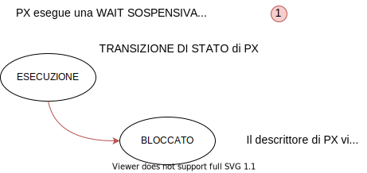

[TOC]

# 2.1 Gestione dei Processi (e Processori)

Questo *gestore* normalmente prende il nome di `KERNEL` o `NUCLEO`. Nel caso in cui la strutturazione sia monolitica tutto collassa nel *nucleo* (che coincide con il sistema operativo). Questa *macchina astratta* che comprende l'hardware a disposizione deve mettere in campo:

- un *meccanismo di esecuzione di **processi sequenziali*** 
- uno o più *meccanismi di sincronizzazione*

Questa macchina (kernel o nucleo) può essere anche realizzata:

- totalmente in *hardware* (in genere non è così)
- *software* (una parte consistente) 
- *firmware*

Si analizzano di seguito i concetti essenziali del nucleo per prima cosa dal ***punto di vista ESTERNO*** (utente programmatore).

## 2.1.1 Algoritmo, Programma, Processo

`ALGORITMO` &rarr; procedimento logico che deve essere seguito per risolvere il problema in esame

`PROGRAMMA` &rarr; descrizione dell'algoritmo tramite un opportuno formalismo (*linguaggio di programmazione*), che rende possibile l'esecuzione dell'algoritmo da parte di un particolare elaboratore. Parlando di un linguaggio di programmazione, si dovrà passare per le fasi opportune, quali compilazione, collegamento (linking) fino all'ottenimento del formato eseguibile, partendo dal programma scritto in forma sorgente. Se il linguaggio è interpretato come linguaggio shell, mandiamo direttamente in esecuzione il programma senza tutte le fasi necessarie in un linguaggio di programmazione compilato.

Un programma *descrive* un *insieme* (possibilmente infinito) *di processi*, ognuno dei quali è relativo all’esecuzione del programma da parte del processore per un determinato insieme di dati in ingresso. *Ogni volta che si richiede l'esecuzione di un programma si genera un nuovo processo*.

`PROCESSO` (*sequenziale*) &rarr; sequenza di eventi a cui dà luogo un elaboratore quando opera sotto il controllo di un particolare programma.

### Differenza fra Programma e Processo

Un programma (entità statica, prima memorizzato come file nel file system e poi caricato in memoria centrale) può essere eseguito da più processi (entità dinamiche).

<center><b><i>Un processo è un programma in esecuzione</i></b></center>

## 2.1.2 Rappresentazione di un Processo

Sequenza di ***stati*** attraverso i quali passa l’elaboratore durante l’esecuzione di un programma.

> **Esempio**:
> Massimo Comune Divisore (M.C.D.) di x e y (numeri naturali)
>
> ```c
> a = x; 
> b = y;
> while (a != b) { 
>     if (a > b)
>     	a = a - b;
>     else b = b - a;
> }
> ```
>
> | **x**     | 18   | 18   | 18   | 18   | 18   | 18   |
> | ----- | ---- | ---- | ---- | ---- | ---- | ---- |
> | **y** | 24   | 24   | 24   | 24   | 24   | 24   |
> | **a** | -    | 18   | 18   | 18   | 12   | 6    |
> | **b** | -    | -    | 24   | 6    | 6    | 6    |
>
> ***a = 6***, ***b = 6*** &rarr; M.C.D dei due numeri dati in ingresso: 18, 24
>
> ***STATO*** &rarr; espresso dai valori delle variabili

La rappresentazione tabellare non è particolarmente comoda, perché se si dovesse rappresentare un programma più complesso questa diventerebbe molto grande e di difficile interpretazione. A questa, vengono preferite altre modalità di rappresentazione.

### Grafo di Precedenza

Un processo può essere rappresentato tramite un *grafo orientato* &rarr; *grafo di precedenza* del processo.

I *nodi* del grafo rappresentano i singoli eventi del processo, mentre gli *archi* identificano le *precedenze* *temporali tra tali eventi*. 

#### Processo Sequenziale

Il grafo di precedenza è a *ordinamento totale* cioè ogni nodo (fatta eccezione per quello iniziale e quello finale) *ha esattamente un predecessore ed un successore*.

> **Esempio**: (riprende *Esempio M.C.D*)
>
> <center> </center>

Per vedere che questa non è l'unica possibilità in cui si sviluppa un programma che porti ad ottenere un grafo di precedenza a ordinamento totale e quindi a un processo sequenziale, passiamo a considerare un *formalismo matematico*.

> **Esempio**:
>
> Il programma corrisponde alla valutazione dell'espressione:
> $$
> (3 * 4) + (2 + 3) * (6 - 2)
> $$
> **GRAFO DI PRECEDENZA AD ORDINAMENTO TOTALE** 
>
> <center></center>
>
> **GRAFO DI PRECEDENZA AD ORDINAMENTO PARZIALE**
>
> Nel *caso in cui si è in di più* nella risoluzione dell'espressione. Con una suddivisione dei compiti, l'espressione può essere valutata svolgendo in parallelo i calcoli. Prima di calcolare D deve essere posto il *vincolo* di aver prima calcolato B e C. Con l'ordinamento parziale, *un nodo può avere più di un predecessore* o *un successore*.
>
> <center></center>
>
> ARCO &rarr; vincolo di precedenza tra gli eventi
>
> VINCOLO DI SINCRONIZZAZIONE &rarr; ordinamento di eventi

#### Processo non Sequenziale

L'***ordinamento totale*** di un grafo di precedenza *può derivare* dalla natura sequenziale di un processo, cioè può essere implicito nel problema da risolvere (il calcolo dell'MCD è possibile ottenerlo solo con un grafo a ordinamento totale). Altre volte, invece, l’ordinamento totale può essere imposto dalla natura sequenziale dell’elaboratore e non essere insito nel problema (come nel caso del formalismo matematico precedente, dove la natura del programma è tale per cui potrei ottenere un grafo di precedenza a ordinamento parziale, e quindi un *processo non sequenziale*).

Esistono molti esempi di applicazioni che potrebbero essere più naturalmente rappresentate da processi *non sequenziali* &rarr; cioè processi tra i cui eventi non esiste un ordinamento totale, ma solo *parziale*.

> **Esempio**:
>
> Elaborazione di dati su un file sequenziale (composto da N record).
>
> <center></center>
>
> ```c
> T buffer;
> int i;
> 
> for (i = 1; i <= N; i++) { 
>     lettura(buffer);
>     elaborazione(buffer);
>     scrittura(buffer); 
> }
> ```
>
> Scrivendo il programma in questi termini, senza ragionare attraverso compilatori paralleli, quello che otteniamo è un'esecuzione che da luogo a un processo sequenziale e quindi a un *grafo di precedenza a ordinamento totale*.
>
> **GRAFO DI PRECEDENZA AD ORDINAMENTO TOTALE** 
>
> - **L** &rarr; lettura
> - **E** &rarr; elaborazione
> - **S** &rarr; scrittura
>
> <center> </center>
>
> **GRAFO DI PRECEDENZA AD ORDINAMENTO PARZIALE**
>
> In realtà il problema non è necessariamente sequenziale, pertanto è anche possibile ottenere un *grafo a ordinamento parziale* in cui rimangono dei *vincoli di sequenzialità* (sulle letture, sulle elaborazioni e sulle scritture). Una volta fatto partire il tutto, è possibile arrivare alla lettura del terzo dato che può avvenire in parallelo con l'elaborazione del secondo dato e la scrittura del primo: non c'è nessuna ragione insita nella natura del problema che lo vieti.
>
> <center>  </center>

L’esecuzione di un processo non sequenziale richiede:

- un elaboratore non sequenziale
- un linguaggio di programmazione non sequenziale (oppure degli strumenti che automaticamente producono da un programma scritto in modo sequenziale dal programmatore, un programma non sequenziale)

#### Elaboratore non Sequenziale

In grado di eseguire più operazioni contemporaneamente &rarr; la *contemporaneità* può essere ***reale (A)*** o ***simulata (B)***.

> **Esempio**:
>
> In relazione all'esempio precedente,  la *lettura*, *elaborazione* e *scrittura* di dati diversi in contemporanea. E' necessaria una CPU differente per svolgere ciascuno di questi compiti.

**A) PIÙ ELABORATORI**

- architettura multiprocessore (più processori, memoria comune)
- architettura distribuita (più processori ognuno con memoria privata)

<center></center>

**B) UN SOLO ELABORATORE**

- architettura monoprocessore

**MULTIPROGRAMMAZIONE** &rarr; quasi parallelismo

<center></center>

Si tratta di un sistema di elaborazione in grado di eseguire processi non sequenziali. Deve fornire:

- una serie di ***unità di elaborazione*** (*fisiche*, quindi distinte l'una dall'altra, o *virtuali*) 
- ***meccanismi di sincronizzazione*** per imporre i vincoli di precedenza e per consentire l’interazione tra i processi. Il processo di elaborazione deve ricevere il dato su cui deve operare.

##### Linguaggi di Programmazione non Sequenziale

| <center> Linguaggi CONCORRENTI </center> | <center> Linguaggi SEQUENZIALI <br />+ Funzioni di Libreria (Primitive) </center> |
| ---------------------------------------- | ------------------------------------------------------------ |
| Concurrent Pascal (*process*)            | C per UNIX (*fork()*, ecc...)                                |
| ADA (*task*)                             |                                                              |
| Java (*thread*)                          |                                                              |

**Linguaggi Concorrenti**:

Hanno delle parole chiave nei linguaggi che consentono di definire i vari processi non sequenziali (indicati tra parentesi nella tabella).

**Linguaggi Sequenziali**:

Utilizzando un linguaggio sequenziale su dei sistemi, vengono utilizzate delle *funzioni di libreria specifiche* che si interfacciano con le opportune *system call* (primitive) del Sistema Operativo, le quali consentono di creare dei processi (ad esempio con la parola chiave *fork*).

Per superare le difficoltà dovute alla complessità di un algoritmo non sequenziale &rarr; ***scomposizione*** di un processo non sequenziale in un ***insieme di processi sequenziali*** eseguiti ”contemporaneamente” (contemporaneità reale o simulata)

Ogni processo sequenziale costituente (cioè derivato da tale scomposizione) è *analizzato e programmato separatamente*.

> **Esempio**:
>
> - *processo* di lettura (lettura del secondo dato garantita solo al completamento della lettura del primo)
>
> - *processo* di elaborazione
>
> - *processo* di scrittura

I processi possono essere eseguiti ***contemporaneamente***, ma devono rispettare i ***vincoli di precedenza*** che esistono tra le operazioni dei vari processi &rarr; **SINCRONIZZAZIONE**

`PROCESSI CONCORRENTI INTERAGENTI` &rarr; processi sequenziali di cui è *costituito* un *processo non sequenziale*.

#### Processi Concorrenti

**Definizione**: Più processi (sequenziali) si dicono ***concorrenti*** se la loro esecuzione si sovrappone nel tempo. In generale, i *processi che compongono un processo non sequenziale*.

Due processi sono ***concorrenti*** se la ***prima*** operazione di uno inizia prima *dell’ultima dell’altro*. Indichiamo con *t1* l'istante di tempo in cui *finisce* il processo *P1*, mentre *t0* l'istante di tempo in cui *comincia* il processo *P2*. Utilizzando questa definizione non c'è bisogno di chiarire se si tratta di una sovrapposizione reale o simulata.

A) **OVERLAPPING** &rarr; *PARALLELISMO REALE* (architettura multiprocessore)

<center></center>

​	P1 e P2 sono eseguiti su due CPU distinte.

B) **INTERLEAVING** &rarr; *QUASI PARALLELISMO* (architettura monoprocessore)

<center></center>

Utilizzando una sola CPU, potrebbe accadere che ad un certo punto P1 richieda un'operazione di I/O, liberi la CPU che viene utilizzata per l'esecuzione di P2, a ciò non è garantito. Se P1 fosse un processo *CPU bound* (si limita a fare i calcoli, senza bisogno di fare interazioni I/O), una volta che prende possesso della CPU non la lascia. In questo caso *deve intervenire il Sistema Operativo* per garantire che anche P2 possa essere eseguito.

Nel caso di un sistema **MULTIPROGRAMMATO**, risulta comune che il processore esegua sequenze di operazioni appartenenti a processi diversi (che quindi determinano *multiprocessing*). Quindi, nel Sistema Operativo sono presenti ***contemporaneamente*** più processi attivi di cui:
- uno solo è in esecuzione
- gli altri sono: 
  - ***PRONTI*** &rarr; in attesa del processore 
  - ***IN ATTESA*** di eventi (ad esempio, completamento di operazioni di I/O)

##### Evoluzione Temporale di Due Processi Concorrenti

<center></center>

Si fa riferimento agli istanti temporali rappresentanti l'evoluzione dei due processi concorrenti. Nell'istante *t5* entrambi i processi sono in blocco e la ***CPU*** risulta ***libera***. Queste situazioni sono possibili, ma si cerca di limitarle in modo di dare alla CPU sempre un compito da eseguire.

## 2.1.3 Stati di un Processo

- **IN ESECUZIONE** (*RUNNING*) &rarr; sta usando la CPU
- **SOSPESO** (*SLEEPING*) &rarr; in attesa di un evento
- **PRONTO** (*READY*) &rarr; pronto per l'esecuzione

<center></center>

Nel caso in cui un processo fosse di tipo ***CPU bound*** (non abbandona la CPU autonomamente) può essere gestito da un Sistema Operativo ***TIME-SHARING*** in modo da forzare la transizione di stato da *esecuzione* a *pronto* andando a sottrarre la CPU, così che questa non venga monopolizzata da un unico processo. I sistemi *time-sharing* **assegnano *un quanto di tempo specifico*** per l'esecuzione di una parte del processo, una volta esaurito questo quanto *riportano il processo in stato di pronto*, e solo a un giro successivo questi possono tornare ad essere in esecuzione.

## 2.1.4 Descrittore di un Processo

Siccome quando un processo è in esecuzione utilizza la CPU (*i registri macchina della CPU*), bisogna fare in modo che *quando questo non occupa più la CPU*, ***tutte le informazioni relative allo stato di esecuzione*** vengano ***salvate***. Se non si prende questo accorgimento, il processo *non può riprendere la sua esecuzione* dalla situazione in cui era arrivato.

A questo scopo *ogni processo* possiede un ***DESCRITTORE di PROCESSO*** (*Process Control Block, PCB*) che *mantiene tutte queste informazioni* (e altre) *quando il processo non è in esecuzione* (pronto o sospeso). Questi descrittori sono solitamente *in code*, pertanto si fa riferimento alle *code di processi pronti* e alle *code di processi sospesi*. Di solito presentano almeno un *riferimento al prossimo processo in coda*, potendone presentare uno *anche* per il *processo precedente*.

# 2.2 Relazione tra Processi Concorrenti

## 2.2.1 Processi Concorrenti Disgiunti 

`PROCESSO INDIPENDENTE` &rarr; un processo che *non può influenzare o essere influenzato da altri* processi.

### Proprietà

- il suo stato *non è condiviso* da altri processi
- la sua esecuzione è *deterministica*: il *risultato della esecuzione dipende solo dai dati di ingresso*
- la sua esecuzione è *riproducibile*: il *risultato della esecuzione è sempre lo stesso* a parità dei dati in ingresso
- la sua *esecuzione* *può essere bloccata e fatta ripartire* senza provocare danni

## 2.2.2 Processi Concorrenti Interagenti

`PROCESSO INTERAGENTE` &rarr; un processo che *può influenzare o essere influenzato da altri processi*.

### Proprietà

- il suo *stato è condiviso* da altri processi
- la sua esecuzione è *non deterministica*: il *risultato della esecuzione* dipende dalla sequenza di esecuzione relativa e *non è predicibile*
- la sua esecuzione è *non riproducibile*: il *risultato della esecuzione non è sempre lo stesso* a parità dei dati in ingresso
- la sua *esecuzione* *non può essere bloccata e fatta ripartire* senza provocare danni

### Interazione tra Processi Interagenti

Si distinguono più tipi di interazioni:

- **COMPETIZIONE **&rarr; ***sincronizzazione*** *indiretta o implicita*
- **COOPERAZIONE** &rarr; ***sincronizzazione*** *diretta o esplicita*

A queste se ne aggiunge un terzo tipo, che però risulta ***indesiderata***:

- **INTERFERENZA** 

#### Competizione (indiretta)

I processi *competono per l’uso di risorse comuni*. Un problema inerentemente non sequenziale può essere risolto da un insieme di processi concorrenti che interagiscono in modo competitivo.

Il problema di base della competizione è quello della ***mutua esclusione***, cioè la *competizione per l’uso di risorse comuni che non possono essere usate contemporaneamente*. A questo problema tuttavia possono aggiungersene altri. Questo tipo di interazione introduce dei ***vincoli di sincronizzazione*** *tra gli eventi* dei processi concorrenti. Questi vincoli servono per garantire una corretta interazione.

Anche i processi indipendenti competono per l’uso esclusivo di risorse comuni.

#### Cooperazione (diretta)

Un problema inerentemente non sequenziale può essere risolto da un insieme di processi concorrenti che interagiscono in modo cooperativo.

Con questo tipo di interazione è previsto uno ***SCAMBIO DI INFORMAZIONI***. Questo scambio di informazioni può semplicemente essere: 

- *invio e la ricezione di un segnale* (senza trasferimento di dati)

- *invio e ricezione di messaggi* (con trasferimento di dati) &rarr;  in questo caso la *sincronizzazione che è necessaria* (vincoli di sincronizzazione) fra i processi spesso viene detta `COMUNICAZIONE`. É possibile pertanto considerare la comunicazione come un *caso particolare di sincronizzazione*.

Anche con questo tipo di interazione, i processi concorrenti interagenti che compongono un processo non sequenziale introducono dei vincoli di ***SINCRONIZZAZIONE*** tra gli eventi dei processi concorrenti.

#### Interferenza

Questo tipo di interazione è *provocata* da ***errori di programmazione***, in particolare può essere provocata da:

- inserimento nel programma di interazioni tra processi non richieste dalla natura del problema

- erronee soluzioni a problemi di interazione (cooperazione e competizione) necessarie per il corretto funzionamento del programma

Si tratta di un'interazione *non prevedibile e non desiderata* che dipende dalla ***velocità relativa*** tra i processi. Ciò vuol dire che una certa esecuzione in un lasso di tempo potrebbe non portare a problemi di interferenza, ma a parità dei dati di ingresso un'ulteriore esecuzione potrebbe portare al verificarsi di problemi di interferenza. Questi ***errori*** sono ***dipendenti dal tempo***, e prendono anche il nome di *corse critiche* (race condition).

## 2.2.3 Sincronizzazione

Per far modo che non si verifichino errori dipendenti dal tempo, viene introdotto un ***vincolo di sincronizzazione***. La sincronizzazione rappresenta un ***vincolo sull’ordine con cui sono eseguite le operazioni*** sui processi. Questi vincoli sono diversi a seconda dell'interazione:

- Nel caso di *INTERAZIONE INDIRETTA*, il vincolo deve rendere *impossibile* l’esecuzione contemporanea delle operazioni con le quali i *processi accedono a risorse comuni* (caso della mutua esclusione).

- Nel caso di *INTERAZIONE DIRETTA*, il vincolo *deve imporre* che le operazioni di un processo *non abbiano inizio prima o dopo determinate operazioni di altri processi*.

In ogni caso sono necessari **MECCANISMI DI SINCRONIZZAZIONE** &rarr; non usare sincronizzazione o sbagliarla implica introdurre degli *ERRORI DIPENDENTI DAL TEMPO*.

> **Esempio**:
>
> Si riprende in considerazione l'esempio di elaborazione di dati su un file sequenziale (in particolare, il *grafo ad ordinamento parziale*). 
>
> In questo caso il processo E (elaboratore), non può svolgere le operazioni di elaborazione sul secondo dato prima che il processo L (lettore) non abbia letto il secondo dato e glielo abbia comunicato. La *freccia* tra i due eventi rappresenta un *vincolo di sincronizzazione diretta*. Il processo lettore dovrà avere un modo per comunicare il secondo dato che è stato letto al processo di elaborazione. Così come il processo di elaborazione dovrà fornirlo al processo scrittore (mediante una comunicazione). Le frecce verticali rappresentano la *normale sequenzialità delle operazioni del singolo processo*. Un qualsiasi processo L (così come gli altri) non può leggere il dato *i* se prima non ha letto il dato *i-1* e così via. Fra i vari processi allo stesso modo esistono delle relazioni di sincronizzazione (comunicazione) per cui il processo lettore, fino a che non ha comunicato il dato letto al processo di elaborazione non può passare a leggere il successivo.

### Strumenti di Sincronizzazione

Due diversi modelli logici di riferimento:
* MODELLO AD AMBIENTE GLOBALE &rarr; la prima configurazione a livello hardware era di avere una sola CPU con una memoria comune.
  * il primo definito a livello storico
  * detto anche Modello a memoria comune
* MODELLO AD AMBIENTE LOCALE &rarr; è il modello dei processi utilizzato in UNIX (e quindi anche in Linux), scelto nonostante avessero anch'essi una sola CPU e una sola memoria.
  * il secondo definito a livello storico
  * detto anche Modello a scambio di messaggi
  * *maggiore* *PROTEZIONE* e *CORRETTEZZA* (ogni processo ha il proprio spazio di indirizzamento che non è condiviso con gli altri processi)

#### Modello ad Ambiente Locale

Ogni ***applicazione*** viene strutturata come un ***insieme di processi***, ciascuno operante in un *ambiente locale* *non accessibile direttamente da nessun altro processo*. In questo modello si può avere ***solo un tipo di interazione*** fra processi: la *COOPERAZIONE*. Ogni forma di interazione tra processi (sincronizzazione) avviene tramite *scambio di messaggi* o *invio di segnali*.

Questo modello è tipico dei Sistemi UNIX (in particolare LINUX).

A livello logico l'applicazione è *composta esclusivamente da processi*:


#### Modello ad Ambiente Globale

Ciascuna applicazione viene strutturata come un *insieme di componenti*, suddivisa in due insiemi disgiunti:
- PROCESSI (componenti attivi)
- RISORSE (componenti passivi)


`RISORSA` &rarr; qualunque oggetto, fisico (es. stampante) o logico (es. memoria) di cui un processo necessita per portare a termine il suo compito. Una risorsa è generalmente utilizzata da più processi. In questo tipo di modelli le risorse sono raggruppate in classi.

Una ***classe di risorse*** identifica l’*insieme di tutte e sole le operazioni che un processo può eseguire per operare su risorse di quella classe*.

> **Esempio**:
>
> Si ha la classe di risorse denominata "Stampante". Se a livello architetturale si hanno a disposizione 3 stampanti, le operazioni che si possono fare su *una delle specifiche istanze* della classe Stampante, sono le stesse, ma si hanno più istanze appartenenti alla classe.

Nel modello ad ambiente globale si possono avere ***due tipi di interazione*** fra processi:
*COMPETIZIONE* e *COOPERAZIONE*. Gli STRUMENTI DI SINCRONIZZAZIONE sono: semafori (meccanismi semplici, a livello di S.O), monitor (più sofisticati, a livello di programmazione), ecc...

I vari problemi di sincronizzazione nell'ambito dei processi concorrenti interagenti possono essere sia *problemi di competizione* che *problemi di cooperazione*.

##### Problemi di Competizione

###### Mutua Esclusione

Si ha necessità di mutua esclusione quando ***non più di un processo alla volta*** *può accedere ad una risorsa comune* &rarr; *problema base della competizione* fra processi (modello ad ambiente globale).

> **Esempio di Risorsa Comune**:
>
> Insieme di variabili contenute in memoria centrale (comune).


Supponendo di avere un solo processore, definiamo i segmenti *P1* e *P2* l'insieme delle istruzioni che vanno a modificare le variabili comuni da parte dei rispettivi processi P1 e P2.  La ***regola*** di mutua esclusione impone che le ***operazioni*** con le quali i processi accedono alle variabili comuni ***non si sovrappongano nel tempo***. In figura vengono riportati i due scenari dove nel primo opera prima P1, mentre nel secondo opera prima P2. Non viene imposto ***nessun vincolo sull'ordine*** on il quale le operazioni sulle variabili comuni sono eseguite.

> **Esempio di Mutua Esclusione (1)**:
>
> P1 e P2 accedono a due variabili comuni: 
>
> - un contatore (*cont*) che deve incrementare ogniqualvolta si effettua una determinata azione 
> - un identificatore (*id*) che deve tenere traccia dell’ultimo processo che ha effettuato l’azione 
>
> Al completamento dell’esecuzione dei processi, *cont* deve contenere un valore pari al numero complessivo delle azioni effettuate dai due processi e *id* deve contenere l’identificatore dell’ultimo processo che ha effettuato l’azione. Si consideri che un processo può eseguire un frammento di codice anche più volte (inserendolo ad esempio in un ciclo for).
>
> 
>
> Con la sintassi <azione> si fa riferimento a una parte di codice eseguita da ciascun processo.
>
> **Possibile sequenza di esecuzione**:
>
> > t0:   <azione> 			   (P1)
> > t1:   <azione> 			   (P2)
> > t2:   cont = cont + 1; 	  (P2)
> > t3:   id = P2; 					(P2)
> > t4:   cont = cont + 1; 	  (P1)
> > t5:   id = P1; 					(P1)
>
> A livello pratico, il contatore è stato incrementato di *2 unità*, e il codice è stato eseguito *2 volte*, prima da P1, poi da P2. Per quanto riguarda l'ID, il valore non è corretto in quanto risulta che l'ultimo processo a eseguire l'azione è stato P1, ma è chiaramente visibile dalla sequenza che in realtà l'ultimo ad averlo eseguito è stato P2.

> **Esempio di Mutua Esclusione (2):**
>
> Due processi (P1 e P2) hanno accesso ad una struttura dati organizzata a pila (STACK) per inserire e prelevare informazioni (sempre dalla prima posizione, il top dello stack).
>
> 
>
> I due processi fanno uso delle due procedure:
>
> - INSERIMENTO
> - PRELIEVO
>
> 
>
> L’esecuzione contemporanea delle due procedure può portare ad un uso scorretto della risorsa STACK.
>
> **Possibile sequenza di esecuzione**: (peggior caso possibile, caso di *corsa critica*)
>
> > t0:   top = top + 1 		(P1)
> > t1:   x = stack[top] 	   (P2)
> > t2:   top = top - 1 		 (P2)
> > t3:   stack[top] = y 	   (P1)
>
> Quando nell'istante *t1* si fa un'operazione di *prelievo* puntando al top, il top risulta ancora vuoto, in quanto alla corrispettiva posizione dell'array non è ancora stata assegnata il valore y, pertanto la precedente operazione di inserimento non risulta completata.

###### Sezione Critica

Una sezione critica è la ***sequenza di operazioni*** *con le quali un processo accede e modifica un insieme di variabili comuni*.

Ad un insieme di variabili comuni possono essere associate:

- UNA SOLA sezione critica (usata da tutti i processi)
- PIÙ sezioni critiche (classe di sezioni critiche) &rarr; nello scenario più completo la classe potrebbe essere degenere e contenere una sola sezione critica.

Per capire meglio questi termini, riprendiamo gli esempi precedenti:

- Nel primo esempio, i processi usavano variabili comuni (cont e id) tramite una sola sezione critica (*cont = cont+1; id = getpid();*)

+ Nel secondo esempio, i processi usavano variabili comuni (top e stack) tramite due sezioni critiche, che quindi definivano una classe di sezioni critiche (INSERIMENTO e PRELIEVO).

La *REGOLA di MUTUA ESCLUSIONE* stabilisce che: ***sezioni critiche appartenenti alla stessa classe devono escludersi mutuamente nel tempo***. In altre parole, *una sola sezione critica di una classe può essere in esecuzione ad ogni istante* di tempo.

## 2.2.4 Soluzioni 

Come soluzione al problema della mutua esclusione si devono utilizzare degli ***STRUMENTI DI SINCRONIZZAZIONE***. La sezione critica *deve essere preceduta* da una parte di ***PROLOGO*** e *seguita* da una parte di ***EPILOGO***.

- PROLOGO &rarr; deve assicurarsi che il processo sia l'unico che sta cercando di eseguire la porzione critica. Deve verificare la disponibilità della sezione critica, e in caso affermativo, acquisirla.
- EPILOGO &rarr; fa in modo che sia chiaro al sistema operativo che il processo non è più in esecuzione sulla sezione critica. Si deve occupare del rilascio della sezione critica (in modo che altri processi possano eseguirla)

> ...
>
> PROLOGO
>
> SEZIONE CRITICA
>
> EPILOGO
>
> ...

Nel seguito considereremo (se non diversamente specificato) il CASO PARTICOLARE di avere due processi P1 e P2.

### Requisiti per una Soluzione Accettabile

1. Mutua esclusione dei processi che eseguono le sezioni critiche

2. Indipendenza dei processi che eseguono le sezioni critiche (l'esecuzione di un processo non deve essere un prerequisito per l'esecuzione di un altro).

3. Assenza di condizioni di stallo (deadlock a livello di strumento di sincronizzazione) per i processi che eseguono le sezioni critiche

   `DEADLOCK` &rarr; i processi sono bloccati nell'attesa di verificarsi di situazioni che non si possono verificare

4. Assenza di attese attive per i processi che eseguono le sezioni critiche (conviene mettere in attesa un processo se questo non può eseguire la sezione critica)

5. Assenza di *starvation* per i processi che eseguono le sezioni critiche (i processi messi in attesa devono essere riattivati non appena possibile.

   `STARVATION` &rarr; dimenticarsi di un processo nella coda dei processi pronti

6. Le sezioni critiche eseguite con interruzioni abilitate

**Osservazione**: Si suppone che ogni processo sia eseguito ad una velocità diversa da 0  &rarr; non si può fare alcuna ipotesi sulla velocità relativa dei processi. Le sezioni critiche non hanno quindi una velocità istantanea di esecuzione.

I requisiti **1**, **2** e **3** sono di ***CARATTERE LOGICO*** e ’implementazione del meccanismo di mutua esclusione è ***corretto*** solo se presenta questi tre requisiti. Il requisito **5** è di ***ordine realizzativo*** ed è ancora legato alla ***CORRETTEZZA*** dell’implementazione. 

I requisiti **4** e **6** sono di ordine realizzativo e non riguardano la correttezza del meccanismo, ma l’***EFFICIENZA*** della sua implementazione. 

Il problema della mutua esclusione può, in prima approssimazione, essere risolto rispondendo solo ai REQUISITI 1, 2, 3, e 5, trascurando i requisiti 4 e 6 ***&rarr; IPOTESI DI SEZIONI CRITICHE BREVI***

### Sezioni Critiche Sufficientemente Brevi

Posso avere una soluzione al problema della mutua esclusione introducendo delle *attese attive*. Con questa soluzione il sistema non è efficiente, in quanto si sprecano dei cicli di clock per nulla, ma potrebbe comunque rappresentare una soluzione per sezioni critiche sufficientemente brevi. In alternativa, posso decidere di rappresentare lo strumento di sincronizzazione attraverso la *disabilitazione delle interruzioni*, perché ciò, nel caso di sistemi monoprocessore, realizza immediatamente la mutua esclusione. Disabilitando le interruzioni non può né intervenire un processo perché lo scheduler ha scoperto che è scaduto il quanto di tempo (che rappresenta un'interruzione) né si può accorgere che è intervenuto un processo a maggiore priorità, in quanto questo nuovo evento (l'avere un nuovo processo nella coda dei processi pronti) non viene evidenziato.

Sia {A, B, C, ...} una classe di sezioni critiche ”sufficientemente” brevi

#### Soluzione in Caso Monoprocessore

PROLOGO &rarr; DISABILITAZIONE INTERRUZIONI
	violazione requisito n. 6
EPILOGO &rarr; ABILITAZIONE INTERRUZIONI

#### Soluzione in Caso Multiprocessore

USO DI OPERAZIONI INDIVISIBILI (***PRIMITIVE***) chiamate 
PROLOGO &rarr; LOCK (X)
	violazione requisito n. 4
EPILOGO &rarr; UNLOCK (X)

```c
typedef enum {false, true} Boolean;
void LOCK (Boolean X) {
	while (X);			// fino a che X è true si rimane in attesa attiva
	X = true
}
void UNLOCK (Boolean X) {
    X = false;
}
```

**X** è un ***indicatore*** associato alla classe di sezioni critiche (un indicatore per ciascuna classe):

- **X == false** nessuna sezione critica in esecuzione &rarr; il processo che trova X a false può metterlo a true e cominciare ad eseguire
- **X == true** una sezione critica in esecuzione &rarr; un processo sta eseguendo una funzione critica quindi ogni altro processo che tenta di fare l'epilogo per poi passare ad eseguire la sezione critica viene bloccato

`INDIVISIBILITA'` &rarr; nessun altro processo può andare ad eseguire la LOCK se questa è in esecuzione sulla stessa variabile X da parte di un altro processo. 

Per quanto riguarda l'*UNLOCK* in un singolo ciclo di clock viene posto *X = false*, nello stesso ciclo di clock nessun altro può avere accesso alla memoria centrale e andare a interrompere l'assegnamento. La *LOCK* è più problematica, in quanto presenta una verifica del valore di X e dall'assegnazione *X = true* quando questa ha valore false.

L’**INDIVISIBILITÀ** della LOCK (in particolare, per le due funzioni di LOCK e UNLOCK) viene *garantita da istruzioni hardware* :

- TEST-AND-SET
- EXCHANGE

##### LOCK con TEST-AND-SET

Questa istruzione HARDWARE, ***in un solo ciclo di clock***, verifica e assegna valore alla variabile su cui agisce. A livello logico (astratto):

```c
typedef enum {false, true} Boolean;
Boolean TEST_AND_SET (Boolean &parametro) { 
    Boolean valore = parametro;
	parametro = true;
	return valore;
}
```

L’operazione LOCK diviene:

```c
void LOCK (Boolean X) {
	while (TEST_AND_SET(X));
}
```

La *TEST-AND-SET* verifica il valore e lo setta contestualmente a *true*.

- se *X == false* torna il valore precedente ma avendo contestualmente cambiato il valore di X a true, facendo terminare il ciclo while, terminando a sua volta la LOCK e quindi l'EPILOGO. Terminato l'epilogo, il processo può andare ad eseguire la *sezione critica* della classe protetta dal booleano X. Una volta eseguita questa parte dovrà essere eseguita l'UNLOCK affinché riporti il valore a false.
- se *X == true* (è già presente un processo che sta eseguendo la sezione critica della classe X) la funzione setta nuovamente X a true e ritorna true, andando a bloccare in un ciclo di attesa attiva il processo mediante un *while(true)*. Questo rimarrà tale fino a quando il processo che sta eseguendo la sezione critica della classe associata a X andrà ad eseguire l'UNLOCK, ponendo X = false.

Non c'è nessuna garanzia che il primo processo che tenta di accedere alla sezione critica della classe occupata sia il primo ad accedere alla sezione critica. 

##### LOCK con EXCHANGE

Questa istruzione hardware, in un solo ciclo di clock, scambia il valore di due variabili. 

```c
typedef enum {false, true} Boolean;
void EXCHANGE (Boolean &a, Boolean &b); { 
    Boolean temp = a;
	a = b;
	b = temp;
}
```

La funzione *EXCHANGE* si limita a scambiare il valore di due variabili passate per riferimento.

La funzione LOCK diviene:

```c
void LOCK (Boolean X) { 
    Boolean priv;
	priv = true;
	do
        EXCHANGE(X, priv);
	while (priv == true);
}
```

La funzione LOCK deve definire una *variabile privata*, ovvero allocata sullo *stack della LOCK*, ovvero sullo *stack privato del processo*, non è una variabile condivisa come la X. In questo modo ciascun processo che esegue la LOCK ha una propria istanza della variabile *priv*. Nel ciclo di attesa attivo si va a scambiare il valore di *priv* (inizializzato a true) con X:

- se *X == false*, *X* assume il valore true, mentre *priv* assume il valore di false. In questo caso la LOCK viene definita *PASSANTE*. L'EPILOGO ha successo e quindi il processo può eseguire la sezione critica associata alla classe di sezione critica X e contestualmente la X viene mesa a false, quindi vengono bloccati eventuali tentativi di accesso con la LOCK.
- se *X == true*, lo scambio è inutile ma viene comunque fatto, ponendo *X* a true e *priv* a true. Poiché priv è ora uguale a true si rimane nel ciclo di attesa attiva.

### Semaforo

Un semaforo S rappresenta una ***istanza*** di un ***tipo di dato astratto*** (*Semaphore*). 

`TIPO DI DATO ASTRATTO` &rarr; simile al concetto di *classe* per i linguaggi di programmazione a oggetti (come ad esempio Java). In esso è però *assente il concetto di ereditarietà*.

Un Semaforo presenta la *rappresentazione interna di ogni sua istanza* (oggetto, in termini di linguaggi di programmazione) mediante un *valore intero* (valore del semaforo) e una *coda di descrittori dei processi*, i quali saranno accodati all'interno dei semafori in attesa delle condizioni necessarie per poter proseguire nella loro esecuzione. Un Semaforo *non implica un'attesa attiva*. Il processo all'interno della sua coda si sospende qualora le condizioni per la sua esecuzione non risultano soddisfatte. Un Semaforo presenta inoltre due operazioni indivisibili chiamate *wait(S)* e *signal(S)*, ciascuna che prende come parametro una certa istanza di semaforo.

La sua struttura si presenta dunque in questo modo:

> - DATO
>   	valore intero
>   	coda descrittori
>
> - OPERAZIONI (INDIVISIBILI)
>            wait (S)
>            signal (S)

Le due funzioni possono anche essere chiamate diversamente:

- WAIT (S) &rarr; P(S) (si effettua una verifica che presenta un *if*)
- SIGNAL (S) &rarr; V(S)

Ad un Semaforo S è associato un valore intero non negativo *Sv*, con valore iniziale: 
$$
S_0 ≥ 0
$$
La *coda di attesa* associata ad un generico Semaforo S verrà riconosciuta con il simbolo Q<sub>S</sub> dove S è l'istanza specifica del semaforo. Essendo le due operazioni precedentemente definite *INDIVISIBILI*, mentre un processo esegue un'operazione non deve essere possibile per nessun altro processo eseguire nessun'altra operazione sullo stesso semaforo.

#### Operazioni su un Semaforo

###### WAIT(S)

```c
void WAIT(Semaphore S) {
if (Sv == 0) {
	< il processo viene SOSPESO
	e il suo descrittore viene inserito in QS >
}
else Sv = Sv - 1;
}
```

- Se *Sv == 0* (semaforo rosso), la WAIT viene detta SOSPENSIVA, in quanto non ha avuto successo e il processo è stato sospeso. Non può essere eseguita nessun'altra istruzione seguente all'invocazione della WAIT perché il processo risulta bloccato.
- Se *Sv ≥ 0* (condizione necessaria, un semaforo non può avere valore negativo), allora il valore viene decrementato e la WAIT ha successo. Il processo in questo modo può proseguire con l'istruzione successiva.

###### SIGNAL(S)

```c
void SIGNAL(Semaphore S) {
if (<esiste un processo P nella coda QS?>) {
    < il suo descrittore viene tolto da QS e
    lo stato di P modificato in PRONTO >
}
else Sv = Sv + 1;
}
```

- Se *Q<sub>S</sub> presenta processi in coda* viene estratto il primo processo nella coda (FIFO) e inserito nella *coda dei processi pronti*. La coda *Q<sub>S</sub>* rappresenta la *coda dei processi sospesi*, mentre la Signal cambia lo stato di questi processi, togliendoli della coda e *segnandoli come pronti*. Questa operazione *non può mettere in esecuzione*, poiché in esecuzione c'è chi sta eseguendo la Signal.

- Se *Q<sub>S</sub> non presenta processi in coda* il valore del semaforo viene incrementato.

#### Invariante dei Semafori

$$
Sv = S0 + ns(S) - nw(S)
$$

- **Sv** &rarr; valore del semaforo
- **S<sub>0</sub>** &rarr; valore iniziale del semaforo
- **ns(S)** &rarr; numero di volte che è stata eseguita la signal con nessun processo in coda
- **nw(S)** &rarr; numero di volte che è stata eseguita la wait con successo

Dato che
$$
Sv ≥ 0
$$
 allora
$$
nw(S) ≤ ns(S) + S0
$$
Questa relazione è ***INVARIANTE*** chiamata anche ***INVARIANTE DEL SEMAFORO*** cioè *è sempre vera* qualunque sia il numero di primitive (WAIT e SIGNAL) eseguite su un qualunque semaforo.

#### Utilizzo di un Semaforo per Garantire la Mutua Esclusione

I Semafori rappresentano un ***meccanismo*** per sospendere e riattivare i processi. Questo meccanismo può essere usato per realizzare ad esempio una **politica** di mutua esclusione.

```c
Semaphore MUTEX;
/* valore iniziale MUTEX_0 = 1 */
```

In questo ambito i semafori vengono normalmente chiamati *MUTEX* (*mutual exclusion*). Questi Semafori devono avere sempre come valore iniziale 1.


> **Esempio:** Possibile Sequenza di Operazioni di Sincronizzazione
>
> 
>
> 
>
> **Nota**: Il valore del semaforo è rimasto a 0 perché P1 è dentro la sezione critica. Se arrivasse un processo P3, o lo stesso P2 fosse in un ciclo per tornare dentro la sezione critica questo processo deve essere bloccato *fuori dalla sezione critica*.
>
> 

#### Soddisfacimento dei Requisiti

1. Un solo processo alla volta si può trovare nella sezione critica:

$$
n = nw(MUTEX) - ns(MUTEX)
$$

<center><b><i>numero di processi entro la sezione critica</i></b></center>

**NOTA**: n ≥ 0

L’invariante
$$
nw(MUTEX) ≤ ns(MUTEX) + MUTEX_0
$$
diventa
$$
nw(MUTEX) ≤ ns(MUTEX) + 1
$$

$$
n = nw(MUTEX) - ns(MUTEX) ≤ 1
$$

Quindi
$$
0 ≤ n ≤ 1
$$

2. Un processo può bloccarsi SOLO se la sezione critica è occupata. infatti, se un processo si blocca su un semaforo è perché:

$$
MUTEXv == 0
$$

Quindi dalla relazione invariante dei semafori:
$$
MUTEXv = ns(MUTEX) - nw(MUTEX) + MUTEX0
$$
diventa
$$
nw(MUTEX) = ns(MUTEX) + 1
$$
e quindi
$$
n = nw(MUTEX) - ns(MUTEX) = 1
$$

3. Assenza di condizioni di stallo &rarr; il meccanismo del semaforo non le presenta per lo stesso motivo appena dimostrato.
4. Un semaforo non presenta attese attive.
5. Non c'è *starvation* in quanto perché la coda è gestita *FIFO*, in questo modo viene garantito che il primo processo sospeso è il primo ad essere riattivato.
6. Non si è parlato di disabilitazione delle interruzioni 

#### Osservazioni su WAIT e SIGNAL

1. L’esecuzione della wait può essere un’azione sospensiva per il processo (P<sub>X</sub>) che la esegue. La sospensione *dipende dal valore del semaforo*: se il valore è 0 (rosso), allora il processo viene sospeso.
   
   

   -  eventuale (se il valore del semaforo è 0) modifica dello *stato del processo* da *ESECUZIONE* &rarr; *BLOCCATO*. 
   -  *evita l’ATTESA ATTIVA*
   
2. L’esecuzione della signal NON comporta concettualmente nessuna modifica nello stato del processo (P<sub>Y</sub>) che la esegue. 

   

   - eventuale MODIFICA DELLO STATO DI UN PROCESSO in coda da BLOCCATO a PRONTO

3) La scelta del processo sospeso da riattivare è fatta tramite una politica ***FIFO*** &rarr; evita la ***STARVATION***.

I semafori *non* sono meccanisimi utili *esclusivamente per il problema della mutua esclusione*, ma sono dei meccanismi più generali su cui si riesce a implementare delle *politiche di sincronizzazione*, in particolare per risolvere problemi di cooperazione e di competizione.

Se il valore del contatore associato ad un semaforo ha il valore vincolato ad essere sempre 0 o 1 (come nel caso dei semafori usati solo per la mutua esclusione) si usa più propriamente il termine ***SEMAFORO BINARIO o MUTEX***, altrimenti si parla di ***SEMAFORO CONTATORE o GENERALIZZATO***.

#### Indivisibilità della WAIT e della SIGNAL

L'implementazione dello *pseudo-codice* della WAIT e della SIGNAL comporta che le due operazioni vadano ad agire sul valore del semaforo (S<sub>V</sub>), sia in lettura che in scrittura e sulla coda associata al semaforo (Q<sub>S</sub>) &rarr; occorre garantire l'indivisibilità delle operazioni (primitive) sui semafori.

Concettualmente è come avere un problema di mutua esclusione per una classe di sezioni critiche di primo livello (`'`).


Questo problema si risolve introducendo:

> PROLOGO &rarr; *wait(Mutex)*
>
> EPILOGO &rarr; *signal(Mutex)*

Così facendo si ha la garanzia che la sezione critica venga eseguita in maniera mutualmente esclusiva. In questo modo si sposta il problema a dover realizzare una mutua esclusione di secondo livello  (indicata in figura con `"` ) perché i codici della WAIT e della SIGNAL presentano a loro volta delle sezioni critiche. 

**Perché di II Livello?** &rarr; I codici delle due operazioni vanno a fare accedere un *insieme di processi maggiore di 1* a una struttura dati condivisa (corrispondente al semaforo). I codici indicati con `<s. c. 1>` e `<s. c. 2>` sono codici appartenenti alla classe di sezione critica di secondo livello.

**Perché di III Livello?** &rarr; Per implementare la LOCK è come se andassimo ad introdurre un *problema di sezione critica di terzo livello* (`'''`). Con la UNLOCK *X* viene settato a false. Con la LOCK è necessario verificare il valore di X: nel caso in cui sia *false* bisogna metterlo *true*, mentre nel caso in cui questo sia *true* bisogna continuare in un *ciclo di attesa attiva* verificando quando questo valore cambia. Questo livello è l'ultimo perché in seguito si utilizza una soluzione con *TEST-AND-SET* o con *EXCHANGE* (soluzioni a livello hardware).

`INDIVISIBILITA'` &rarr; mentre un processo sta eseguendo la WAIT su un semaforo, un altro processo non può eseguire né la WAIT né la SIGNAL sullo stesso semaforo.

##### Prima Soluzione

Disabilitazione delle interruzioni &rarr; Rappresenta una *soluzione parziale* perché *non vale per i multiprocessori*.

##### Seconda Soluzione

Uso di LOCK e UNLOCK implementate con TEST-AND-SET o EXCHANGE &rarr; Utilizzate esclusivamente per *soluzioni critiche sufficientemente brevi*, per il fenomeno di *attesa attiva* all'interno della LOCK. Il codice della WAIT, così come quello della SIGNAL, essendo dei codici scritti a livello di programmazione *rispettano i requisiti di essere sezioni critiche sufficientemente breve*.

Possiamo dunque proteggere con un PROLOGO di LOCK e un EPILOGO di UNLOCK su una certa variabile booleana X il codice della WAIT e quello della SIGNAL.

```c
void WAIT (Semaphore S) {
    LOCK (X);
    < codice della wait >;
    UNLOCK (X); // ATTENZIONE
}

void SIGNAL (Semaphore S) {
    LOCK (X);
    < codice della signal >;
    UNLOCK (X);
}
```

Se si hanno più classi di sezioni critiche di primo livello (livello utente-programmatore) si dovranno avere tanti semafori di mutua esclusioni quanti sono le classi che si dovranno proteggere. Il numero di parametri X che servono sono tanti quanti i semafori.

Il codice della UNLOCK va eseguito sia che la esecuzione del codice della WAIT comporti la sospensione del processo (quindi subito prima della sospensione, liberando la sezione critica associata al semaforo, permettendo al sistema l'inserimento del descrittore nella coda) e sia in caso di semplice decremento del valore del semaforo.

# 2.3 Nucleo: Riepilogo Punti di Vista


# 2.4 Esempi di Uso dei Semafori

Utilizzando il *meccanismo dei semafori*, vediamo di applicare alcune ***politiche di sincronizzazione*** per risolvere problemi di competizione più articolati rispetto alla semplice mutua esclusione:

## 2.4.1 Gestione di un Insieme di Risorse Equivalenti

Un insieme di **n** processi **P0, P1, P2, ..., Pn-1** che *competono* per l’uso di una delle **m** risorse (equivalenti) **R0, R1, R2, ..., Rm-1** (si pensi alle risorse come delle stampanti equivalenti). Il generico processo Pi ha necessità di accedere ad una qualunque delle risorse **Rk**.

***Banale Problema di Mutua Esclusione*** &rarr; l'accesso alla risorsa deve avvenire in modo mutualmente esclusivo. Se la stampante viene assegnata a un processo che stampa i suoi risultati non deve essere assegnata a nessun'altro, altrimenti le informazioni di stampa si andrebbero a mescolare.

### Prima Soluzione

Si definisce *1 semaforo di mutua esclusione per ogni risorsa* (*m semafori*). &rarr; *Pi* deve specificare a quale risorsa vuole accedere, facendo la *WAIT* su un *Mutex<sub>K</sub>* specificando il valore K.

&rarr; ***NON ACCETTABILE***

#### Problema

Pi potrebbe rimanere bloccato sulla richiesta della risorsa *Rk* (facendo su questa una *WAIT*) mentre altre sono libere. La risorsa *Rk* potrebbe già essere stata presa in carico perché i processi non si coordinano tra loro e scelgono la risorsa da utilizzare in modo random. In questo caso dunque *un altro processo* potrebbe aver fatto la WAIT sul *semaforo di mutua esclusione* che protegge Rk e aver cominciato ad utilizzarla.

### Seconda Soluzione 

Per non trovarsi di fronte al problema precedente viene introdotto un ***Gestore delle Risorse*** (è un'*entità passiva*, non un altro processo), che *gestisce la allocazione dinamica delle risorse ai processi*:

* assegna una risorsa libera (qualunque) ad ogni processo che ne fa richiesta
* libera la risorsa non appena il processo non ne ha più bisogno

Per fare ciò introduciamo:

- **STRUTTURA DATI** &rarr; per sapere se la risorsa è libera o occupata. Questa può essere un *array di dimensione m* costituito da valori booleani, *dove* per ogni risorsa corrispondente a un indice abbiamo i seguenti valori:
  - *true* : risorsa libera
  - false : risorsa occupata

- **OPERAZIONI** &rarr; utilizzate dai processi.
  - *richiesta di una risorsa libera* : per acquisire la risorsa libera, se esiste: solitamente *n* è un numero a volte *molto maggiore di m* pertanto un processo potrebbe arrivare a fare una richiesta senza che ci siano risorse libere.
  - *rilascio di una risorsa* : per liberare una risorsa occupata

#### Schema del Generico Processo *Pi*

Dato un ***processo Pi*** (con i = 0, 1, 2, ..., n-1). Questo schema può anche essere inserito in un *loop senza fine*.

```c
int x; /* x può assumere valori nel range 0..m-1 */
...
x = RICHIESTA(); /* 	il parametro effettua una richiesta
					x rappresenta l’indice della risorsa assegnata */
<uso della risorsa Rx>
RILASCIO (x);
...
```

#### Schema del Gestore

Descriviamo nel dettaglio le operazioni di *Richiesta* e *Rilascio* elencando cosa è necessario implementare a livello di *struttura dati*:

- Serve un semaforo per rappresentare il numero di risorse (equivalenti) R0, R1, R2, … Rm-1 &rarr; il semaforo verrà chiamato *`RISORSE`* (semaforo *contatore* o *generalizzato*, con valore iniziale pari a M). Questo valore viene decrementato mano a mano che le risorse vengono assegnate e dunque incrementato quando queste tornano disponibili.
- Serve una struttura dati (*array*) per mantenere lo stato di ognuna delle risorse (rappresentato dal booleano true se la risorsa è libera o dal booleano false se la risorsa è occupata) &rarr;  l'array verrà chiamato *`LIBERO`*
- Poiché abbiamo bisogno dell’array LIBERO (che diventa una variabile *condivisa fra più processi*) abbiamo bisogno di garantire l’accesso mutuamente esclusivo e quindi serve un semaforo binario &rarr; *MUTEX*

```c
typedef enum {false, true} Boolean;
Semaphore MUTEX; 	/* valore iniziale MUTEX0=1 */
Semaphore RISORSE; 	/* valore iniziale RISORSE0=m */
Boolean LIBERO[m]; 	/* valore iniziale LIBERO[i]=true, tutte le risorse libere */

int RICHIESTA() {
    int i; 			/* i può assumere valori nel range 0..m-1*/
    wait(RISORSE);
    wait(MUTEX);									 // PROLOGO
    for (i = 0; ! LIBERO[i]; i++);                   // 
    /* trovato indice i per cui libero[i] è true */	 //  
    LIBERO [i] = false;                              //  <s.c>
    signal(MUTEX);                                   // EPILOGO
    return i; // otteniamo l'indice della risorsa
}

void RILASCIO(int x){
    wait(MUTEX);									 // PROLOGO
    LIBERO[x] = true;								 //  <s.c>
    signal(MUTEX);									 // EPILOGO
    signal(RISORSE);
}
```

##### Richiesta

Fino a quando il valore del semaforo *Risorse* è *maggiore di 0*, la *wait()* va a *decrementare il valore del semaforo*. Quando il numero di risorse disponibili arriva a 0, il *processo viene bloccato sulla stessa wait()*, facendo passare il processo dallo stato di esecuzione a bloccato.

Sia che la wait() sia bloccante, sia che il processo ad un certo punto sia stato risvegliato tornando in stato di esecuzione, questo va a avanti nella richiesta, cercando quale tra le risorse disponibili è libera. Per fare questa operazione, deve risolvere il problema della mutua esclusione (sezione critica). Una volta entrati nel ciclo for *è sicuro che ci sia almeno una risorsa libera* per il processo, in quanto o la wait era passante o questo è tornato in esecuzione dopo che *almeno una risorsa* si è liberata. 

##### Rilascio

Anche su questa operazione è presenta una sezione critica appartenente alla stessa classe della sezione critica precedente. Si utilizza lo stesso *MUTEX* facendo una wait() che ci permette di *accedere in modo mutualmente esclusivo all'array di risorse*. La *signal(RISORSE)* avrà come effetto quello di far passare un processo *da bloccato a pronto* (se la coda dei processi sospesi non è vuota), oppure e la questa coda è vuota andrà ad incrementare il valore del semaforo risorse, conteggiando una risorsa in più a disposizione dei processi che ne devono fare richiesta.

#### Osservazioni

1. L'***ordine delle due primitive*** *wait(RISORSE)* e *wait(MUTEX)* è ***vitale***. Se l’ordine delle due PRIMITIVE WAIT nella procedura RICHIESTA venisse così invertito:

   > wait(MUTEX);
   > wait(RISORSE);

   La soluzione precedentemente introdotta *garantisce un'implementazione esente da DEADLOCK*, tuttavia ciò *non è garantito per l'utilizzo di più semafori*, facendo errori di programmazione come nell'osservazione corrente, con i semafori con i seguenti valori:

   > MUTEX = 1
   > RISORSE = 0
   >
   > wait(MUTEX) &rarr; passante
   >
   > wait(RISORSE) &rarr; bloccante

   Nessun processo può più entrare nella sezione critica protetta da MUTEX &rarr; ***DEADLOCK***

   

2. Se il numero di risorse (*m*) si riduce a 1, la soluzione si semplifica: non ci sarebbe più bisogno di un array di booleani &rarr; basta un semaforo R inizializzato ad 1.

   Il codice degenere in questo modo (le risorse sono in realtà *un'unica risorsa*): 

   > RICHIESTA &rarr; wait(RISORSE)
   >
   > RILASCIO &rarr; signal(RISORSE)

## 2.4.2 Problema Lettori-Scrittori

Più processi possono accedere allo stesso insieme di dati (come ad esempio, un *file*), visto come una ***risorsa condivisa tra i processi***. Nell'esempio precedente non era rilevante l'utilizzo che un processo faceva della risorsa, mentre qui lo è, per questo si distinguono due categorie di processi:

- Processi che possono ***SOLO leggere i dati*** &rarr; **PROCESSI LETTORI**
- Processi che possono ***ANCHE modificarli*** &rarr; **PROCESSI SCRITTORI**

Nella realtà è difficile avere processi che hanno un comportamento univoco nei confronti di tutte le risorse. Piuttosto, è più facile avere a che fare con processi che si comportano come lettori in alcune fasi, poi come scrittore in altre. In questo esempio definiamo degli *intervalli di tempo* in cui i processi agiscono come lettori o come scrittori.

### Vincoli

1. I processi **lettori** possono accedere ***contemporaneamente*** alla risorsa
2. I processi **scrittori** hanno ***accesso esclusivo*** alla risorsa
3. I processi **lettori e scrittori** si ***escludono mutuamente*** nell’accesso alla risorsa

#### Schema Processo Lettore

```c
Inizio_lettura();
<lettura>;
Fine_lettura();
```

#### Schema Processo Scrittore

```c
Inizio_scrittura();
<scrittura>;
Fine_scrittura();
```

Le funzioni di *Inizio* possono essere funzioni che *permettono l'accesso alla risorsa*, ma anche funzioni che *provoca la sospensione del processo in esecuzione*, consentendo l'accesso alla risorsa solo quando le condizioni lo permettono.

Questo problema noto è stato usato per verificare tutti gli strumenti di sincronizzazione in ambiente globale. I suoi vincoli possono considerarsi *"una prova del 9"*.

### Prima Soluzione

- Serve un semaforo per la sincronizzazione nell’accesso alla risorsa degli scrittori f*ra di loro* e di uno scrittore *nei confronti dei lettori* &rarr; semaforo *`SYNCH`* inizializzato a 1 che consentirà di rispettare i vincoli 2 e 3.

- Serve un contatore per il numero di lettori in accesso alla risorsa &rarr; *`num_lettori`* inizializzato a 1. Serve ai lettori per sapere quando è il momento di sbloccare un eventuale scrittore bloccato su *SYNCH*: a *Inizio_lettura* gli scrittori *incrementano* questo numero, mentre a *Fine_lettura* lo decrementano, in modo da sbloccare uno scrittore rimasto bloccato su *SYNCH* quando questo è uguale a 0.
- Poiché abbiamo bisogno del contatore *num_lettori* (che diventa una variabile condivisa fra più processi) si deve garantire l’accesso mutuamente esclusivo &rarr; *MUTEX*

Anche SYNCH è tecnicamente un MUTEX (semaforo binario), ma gli si associa un nome diverso per la sua funzione.

```c
Semaphore MUTEX; /* valore iniziale 1 */
Semaphore SYNCH; /* valore iniziale 1 */
int num_lettori = 0; /* valore iniziale 0 */

void Inizio_lettura() {
    wait(MUTEX);				
    num_lettori++;				//
    if (num_lettori == 1) 		//  < s.c >
        wait(SYNCH);			//
    signal(MUTEX);				
}

void Fine_lettura() {
    wait(MUTEX);
    num_lettori--;				//
    if (num_lettori == 0) 		// < s.c >
        signal(SYNCH);			//
    signal(MUTEX);
}

void Inizio_scrittura() {
	wait(SYNCH);
}

void Fine_scrittura() { 
    signal(SYNCH);
}
```

#### Inizio_lettura

Se quello che tenta di accedere alla risorsa *è il primo lettore*, allora questo primo lettore deve fare una *wait(SYNCH)*, che andrà a verificare il valore del *semaforo SYNCH* che sarà *uguale a 1* (*WAIT PASSANTE*) se e solo se non c'è alcun processo scrittore che ha preso possesso della risorsa desiderata in scrittura. Il primo lettore potrà accedere alla *signal(MUTEX)* solo se la *wait(SYNCH)* non è bloccante.

#### Fine_lettura

Qui è presente l'operazione di decrementazione, complementare a quella fatta a *Inizio_lettura*. Se quello che tenta di accedere alla risorsa è l'*ultimo lettore del blocco*, la risorsa dopo questo non è più utilizzata da nessun lettore, quindi va a fare la *signal(SYNCH)* e se c'è un processo scrittore in coda viene liberato, mentre se non è presente viene fatto un *incremento* del semaforo (decrementato in precedenza con la wait passante del semaforo, che aveva occupato la risorsa).

#### Osservazioni

1. Il **semaforo MUTEX** garantisce la ***mutua esclusione sull’accesso alla variabile num_lettori***

2. Il **semaforo SYNCH** garantisce la ***mutua esclusione fra processi lettori e processi scrittori*** e fra i processi scrittori

3. Se c’è ***un processo scrittore che sta accedendo*** alla risorsa e ***n processi lettori in attesa***, *allora uno (**il primo**) attende sul semaforo **SYNCH***, mentre ***gli altri n-1*** processi lettori sono in attesa ***sul semaforo MUTEX***. Una volta terminata la scrittura, il processo scrittore effettua una *signal(SYNCH)* che permetterà al primo lettore di tornare in esecuzione.

4. Questa soluzione ***dà priorità ai processi lettori***. Appena un lettore riesce a superare un *wait(SYNCH)*, tutti gli altri lettori non effettuano più un controllo e passano. Se il *lotto di lettori* non arriva mai al termine, *il numero di lettori non arriva mai a 0*, e non permette di eseguire la *signal(SYNCH)*. I processi scrittori possono essere bloccati indefinitamente &rarr; ***STARVATION***. Il semaforo, come meccanismo a livello implementativo, non ha un problema di starvation, in quanto la coda dei processi dei semafori è gestita in modalità FIFO.

### Seconda Soluzione

<!-- Consultare le slide, non spiegata dalla Prof. -->

Analoga alla precedente ma anch'essa non definitiva. Introduce ***STARVATION***, ma *per i lettori*.

### Regole per la STARVATION

- Un processo lettore non deve accedere alla risorsa se c’è un processo scrittore in attesa
  &rarr; *evita starvation scrittori*. Bloccando l'accesso ai nuovi lettori, il numero di lettori può tornare a 0.

* Tutti i processi lettori in attesa, alla fine di una scrittura, devono avere priorità sull’accesso alla risorse rispetto all’accesso di un altro processo scrittore &rarr; *evita starvation lettori*.

### Terza Soluzione

Questa terza soluzione risolve il problema della starvation sia dei lettori che degli scrittori.
La soluzione per tale ragione risulta più complicata:

- Serve una variabile *contatore* che conta *quanti lettori sono in accesso alla risorsa* (ricordiamo che ci può essere un insieme di processi lettori contemporaneamente in accesso) &rarr; *`lettori_attivi`*

- Serve una variabile *contatore* che conta *quanti lettori sono bloccati in attesa della risorsa* &rarr; *`lettori_bloccati`*

**N.B.1** - Il blocco di un lettore (che incrementa questo contatore) ci sarà sia se la risorsa è impegnata già da uno scrittore (si bloccherà il primo lettore di un ‘lotto’) e sia se si è formata coda di scrittori (si bloccheranno tutti i lettori di un ‘lotto’) &rarr; evita la starvation degli scrittori!

**N.B.2** - Il valore di lettori bloccati servirà nella *Fine_scrittura* per fare in modo che lo scrittore che sta liberando la risorsa possa verificare la presenza di lettori in attesa e quindi dare il controllo a loro invece di darlo ad uno scrittore &rarr; evita la starvation dei lettori!

- Serve una *variabile booleana* (inizializzata a *false*) che indica, se è vera, che c’è uno *scrittore in accesso alla risorsa* (non serve un contatore) &rarr; *`scrittori_attivi`*

- Serve una variabile contatore che conta quanti scrittori sono bloccati in attesa della risorsa &rarr; *`scrittori_bloccati`*

- Poiché abbiamo bisogno di tutte queste variabili (che sono tutte variabili condivise fra più processi) si deve garantire l’accesso mutuamente esclusivo &rarr; *MUTEX*

- Servono due semafori, uno per sospendere i lettori e uno per sospendere gli scrittori &rarr; *`S_LETTORI`* e *`S_SCRITTORI`*

```c
typedef enum {false, true} Boolean;
Semaphore MUTEX; 		/* valore iniziale 1 */
Semaphore S_LETTORI; 	/* valore iniziale 0 */
Semaphore S_SCRITTORI; 	/* valore iniziale 0 */
int lettori_attivi = 0; 			/* valore iniziale 0 */
Boolean scrittori_attivi = false; 	/* valore iniziale false */
int lettori_bloccati = 0; 			/* valore iniziale 0 */
int scrittori_bloccati = 0; 		/* valore iniziale 0 */

void Inizio_lettura() {
    wait(MUTEX);
    if (!scrittori_attivi && scrittori_bloccati==0){ //
        signal(S_LETTORI);							 //
    	lettori_attivi++;							 // < s.c >
	}												 //
	else lettori_bloccati++;						 //
	signal(MUTEX);
	wait(S_LETTORI);
}

void Fine_lettura() {
    wait(MUTEX);
    lettori_attivi--;								//
    if (lettori_attivi==0 && scrittori_bloccati>0){ //
        scrittori_attivi = true;					// < s.c >
    	scrittori_bloccati--;						//
    	signal(S_SCRITTORI);						//
    }
    signal(MUTEX);
}

void Inizio_scrittura() {
    wait(MUTEX);
    if (lettori_attivi == 0 && !scrittori_attivi) { //
        signal(S_SCRITTORI);						//
        scrittori_attivi = true;					// < s.c >
    }												//
    else scrittori_bloccati++;						//
    signal(MUTEX);
    wait(S_SCRITTORI);
}

void Fine_scrittura() {
    wait(MUTEX);
    scrittori_attivi = false;						//
    if (lettori_bloccati > 0)						//
        do { 										//
            lettori_attivi++;						//
    		lettori_bloccati--;						//
    		signal(S_LETTORI);						//
        }											// < s.c >
		while (lettori_bloccati != 0);				//
    else if (scrittori_bloccati > 0) { 				//
        scrittori_attivi = true;					//
        scrittori_bloccati--;						//
        signal(S_SCRITTORI);						//
    }												//
    signal(MUTEX);
}
```

#### Inizio_lettura

Il generico lettore si deve chiedere *se non ci sono scrittori attivi* (vincolo numero 3) *e se non ci sono scrittori bloccati* (per evitare la starvation di quest'ultimi). 

- Se le *condizioni sono vere*, questo lettore diventerà un lettore attivo (incrementando il relativo valore) e farà una *signal(S_LETTORI)*. Questa non andrà mai a liberare un lettore, ma al contrario *andrà ad incrementare il valore del semaforo* (inizializzato a 0). In questo modo la *wait(S_LETTORI)* fatta a valle della sezione critica risulterà *passante* incrementando la relativa variabile.
- Se le *condizioni sono false*, il lettore incrementa il valore dei lettori bloccati e la *wait(S_LETTORI)* risulterà *bloccante*.

#### Fine_lettura

A fine lettura, si decrementa il valore dei lettori attivi e in seguito il processo controlla *se è l'ultimo lettore*, e *se essendolo è presente una coda di scrittori*.

- Se le *condizioni sono vere*, il primo scrittore in coda deve essere liberato mediante una *signal(S_SCRITTORI)*. Prima di fare ciò, è necessario sistemare le variabili relative alla scrittura in modo che siano coerenti con questo tipo di operazione, mettendo a *true* il valore di *scrittori attivi* e *decrementando* il valore di *scrittori bloccati*.
- Se le condizioni sono false, viene *incrementato* il valori di *scrittori bloccati*.

#### Inizio_scrittura

Lo scrittore deve controllare che *non ci siano lettori attivi* (vincolo numero 3) *e* che *non ci siano scrittori attivi* (vincolo numero 2).

- Se le *condizioni sono vere* il codice sarà in parte simile a quello di *Inizio_lettura()*. La variabile *scrittori_attivi* verrà messa a true e attraverso una *signal(S_SCRITTORI)* ai va ad incrementare la il valore del semaforo inizializzato a 0.
- Se le condizioni sono false, il processo *diventa un nuovo scrittore bloccato*, andando a *incrementare il valore* della variabile *scrittori bloccati*.

La *wait(S_SCRITTORI)* ha il compito di iniziare la scrittura mettendo in coda il semaforo.

#### Fine_scrittura

Con la fine scrittura si ha nuovamente una sezione critica. In essa, si controlla *se ci sono lettori bloccati* ***prima*** *degli scrittori bloccati*, per *evitare la starvation dei lettori*.

- Se la *condizione è vera*, fino a quando non si termina la serie di lettori bloccati, questi vengono *a turno messi in esecuzione*, andando prima a *incrementare* il valore di *lettori attivi* e a *decrementare* quello di *lettori bloccati*, facendo in seguito una *signal(S_LETTORI)*.
- Se la *condizione è falsa*, si procede controllando *se sono presenti scrittori bloccati*. Se *sono presenti scrittori bloccati* (non è presente un ciclo while come nel caso precedente perchè al massimo ci può essere un solo scrittore in accesso), la varabile *scrittori attivi* viene settata a *true*, si decrementano gli scrittori bloccati e si manda in esecuzione il primo di essi facedo una *signal(S_SCRITTORI)*.

#### Osservazione

I semafori *S_LETTORI* e *S_SCRITTORI* (binari, sempre inizializzati a 0) sono detti ***semafori PRIVATI***:
* solo i *processi lettori/scrittori* possono fare la *wait sul corrispondente semaforo*
* *ogni altro processo può fare la signal*

#### Simulazione di Esecuzione

```c
// Processo Lettore L1 -> Inizio_lettura();
wait(Mutex);
if(!scrittori_attivi && scrittori_bloccati == 0) {
    signal(S_LETTORI); // S_LETTORI, precedentemente uguale a 0, diventa S_LETTORI = 1
    lettori_attivi++;
}
wait(S_LETTORI); // siccome S_LETTORI = 1 la wait è passante, e riporta S_LETTORI = 0
<lettura>

// Mentre L1 è in lettura, arriva un secondo lettore L2 -> Inizio_lettura()
// L2 -> stesso codice -> <lettura>
// ...
// Ln -> ... -> <lettura> (ottenendo lettori_attivi = n)

// S1 -> Inizio_scrittura()
wait(Mutex);
if(lettori_attivi == 0 && ... ){ // condizione falsa in quanto abbiamo in esecuzione n>0 lettori
	/* codice non rilevante */
}
else scrittori_bloccati++;
signal(Mutex);
wait(S_SCRITTORI); // WAIT BLOCCANTE -> il semaforo non è stato incrementato (perchè non è entrato nell'if)
				   // quindi S_SCRITTORI = 0

// Supponiamo che via via i vari Li completino la lettura, Li -> Fine_lettura()
lettori_attivi--; // mano a mano che i processi finiscono, questo valore arriva a 0
if(lettori_attivi == 0 && scrittori_bloccati > 0){ // condizione vera
	scrittori_attivi = true;
    scrittori_bloccati--; // essendoci un solo scrittore bloccato in coda, questo il valore torna a 0
}
signal(S_SCRITTORI); // lo scrittore S1 viene sbloccato e può eseguire -> <scrittura>


```

## 2.4.3 Problema della Cena dei Filosofi

**Cinque filosofi** passano il tempo a **pensare** (senza bisogno di risorse) e a **mangiare** I filosofi si trovano davanti ad una tavola rotonda su cui c’è una ciotola di riso e hanno ***solo* cinque bastoncini** (rappresentano le risorse, due di questi sono necessari per mangiare). Ogni filosofo alterna una fase di meditazione e una in cui vuole mangiare.


### Problema

Poiché un filosofo per mangiare ha bisogno di due bastoncini, i *filosofi non possono mangiare tutti assieme contemporaneamente*. &rarr; ***Problema di Mutua Esclusione nell'Accesso alle Risorse Bastoncini***. 

<center><i>Se F2 sta impiegando le risorse per mangiare, allora non possono mangiare né F1 né F3</i>.</center>

### Soluzione

Associare un semaforo ad ogni bastoncino.

```c
Semaphore S_BASTONCINI [5]; /* array di semafori */
/* valore iniziale di ognuno = 1 (risorsa libera) */
```

#### Schema Processo Filosofo i-esimo

```c
while (true) { 
    wait(S_BASTONCINO[i]);
	wait(S_BASTONCINO[(i+1) % 5]);
    <mangia>;
    signal(S_BASTONCINO[i]);
    signal(S_BASTONCINO[(i+1) % 5]);
    <pensa>
}
```

Il filosofo alterna, in un ciclo senza fine, una fase dove mangia e una in cui pensa.

#### Problemi

Supponiamo che i cinque filosofi decidano di mangiare contemporaneamente

- ognuno acquisisce il bastoncino alla sua sinistra
- ognuno tenta di acquisire il bastoncino alla sua destra
- blocco di ogni filosofo
- ***DEADLOCK***

Il deadlock non è certo, ma si verifica se due filosofi adiacenti decidono di mangiare nello stesso momento.

#### Soluzioni

- usare una ***soluzione asimmetrica***: 
  - un **filosofo dispari** acquisisce prima il bastoncino alla sua sinistra e poi quello alla sua destra
  - un **filosofo pari** acquisisce prima il bastoncino alla sua destra e poi quello alla sua sinistra
- permettere ad un filosofo di acquisire i **due bastoncini** *solo se entrambi sono disponibili* &rarr; questo deve essere fatto in una sezione critica. In questo modo si ragiona sulla *coppia di risorse*, *non più sulla singola risorsa*.

# 2.5 Cooperazione tra Processi Concorrenti

La cooperazione può avvenire mediante:

- **scambio di un segnale** che indica il verificarsi di un certo evento
- **scambio di messaggi** generati da un processo e letti da un altro (Esempio: lettore, elaboratore scrittore visto in precedenza).

La ***cooperazione tra processi*** prevede che  l’esecuzione di alcuni di essi risulti ***condizionata*** dall’informazione prodotta da altri &rarr; VINCOLI SULL’ORDINAMENTO NEL TEMPO DELLE
OPERAZIONI DEI PROCESSI

Nel caso del *modello dei processi ad ambiente globale*, anche i ***problemi di cooperazione*** possono essere risolti usando i ***semafori***.  

## 2.5.1 Esempio Scambio Segnale

n processi P1, P2, ... Pn attivati dal processo P0.

### Regole

- l’esecuzione di Pi non può iniziare prima che sia giunto il segnale da P0
- ad ogni segnale inviato da P0 deve corrispondere una attivazione di Pi

### Soluzione tramite Semafori

UN SEMAFORO PER OGNI PROCESSO Pi &rarr; Si con valore iniziale Si0 = 0

```c
// processo Pi
{
    ...
    while (true){ 
        wait (Si); // eventuale attesa SEGNALE
    	< azioni di Pi >
    }
}

// processo P0
{ 
    ...
	while (true){ 
       	...			  // scelta processo Pi 
		signal (Si); // invio SEGNALE sul corrispondente semaforo
		...
    }
}
```

Dall'invariante dei semafori, abbiamo:


$$
nw(Si) ≤ ns (Si) + Si_0
$$
Dato che *Si<sub>0</sub> = 0* 
$$
nw(Si) ≤ ns (Si)
$$
Quindi, il *numero di volte che il processo Pi è stato attivato* è *minore o uguale al numero di segnali inviati da P0*.

## 2.5.2 Problema Produttore - Consumatore

Per illustrare in generale il concetto di cooperazione tra processi, si consideri il problema del *PRODUTTORE* e del *CONSUMATORE*. &rarr; Un processo ***PRODUTTORE*** produce informazioni che sono consumate da un processo ***CONSUMATORE***.

Un Consumatore è un *processo che consuma il dato* (i processi lettori si limitano a leggere il file, pertanto non possono essere considerati consumatori).

> **Esempio**:
>
> Un processo di stampa che produce caratteri (*produttore*) che sono consumati dal processo gestore della stampante (*consumatore*).
>
> **Esempio**:
>
> Un processo compilatore che produce codice assembler (*produttore*) consumato da un processo Assemblatore (*consumatore*).

**Osservazione**: Per consentire una esecuzione concorrente dei processi produttore e consumatore occorre disporre di un buffer (di dimensione maggiore di 1), in modo che un produttore possa inserire un elemento, mentre il consumatore ne preleva un altro. Il suo utilizzo conferisce *flessibilità in fase di esecuzione*. Il processo consumatore, in particolare, può avere i dati necessari alla sua esecuzione *già pronti in un buffer*, andandoli a consumare rispettando i propri tempi.

Il buffer per la comunicazione può essere codificato esplicitamente facendo uso di *memoria condivisa* (nel caso di ***modello ad ambiente GLOBALE***) oppure *essere fornito dal S.O.* attraverso l'uso di una *funzione di comunicazione fra processi* (implicito quindi negli strumenti di comunicazione nel caso di ***modello ad ambiente LOCALE***).

Nel seguito si supporrà di essere nel primo caso, cioè con un buffer (e altre variabili) condiviso fra i processi produttore e consumatore.

### Implementazione del Buffer

I processi produttore e consumatore condividono per comunicare un *buffer circolare a N posti* e due variabili (*punt1* e *punt2*). Queste variabili identificano la posizione *dove il produttore deve inserire* il dato e da cui il *consumatore deve estrarre* il dato.


Regole

- il *consumatore* non può prelevare un messaggio dal buffer se questo è vuoto

- il *produttore* non può depositare un nuovo messaggio nel buffer se questo è pieno
- Il processo produttore e quello consumatore ***non devono mai contemporaneamente alla stessa posizione*** del buffer (accesso mutuamente esclusivo alla posizione del buffer)

$$
0 ≤ D - E ≤ N
$$

> ***D*** = numero di messaggi depositati
> ***E*** = numero messaggi estratti

Si consideri una semplice implementazione del *buffer come un array* e di *punt1 e punt2 come indici “circolari”* di tale array.

#### Inserimento

```c
buffer[punt1] = messaggio;
punt1 = (punt1 + 1) % N // aggiornamento puntatore
```

#### Prelievo

```c
messaggio = buffer[punt2];
punt2 = (punt2 + 1) % N // aggiornamento puntatore
```

Se *punt1 == punt2* possiamo trovare due casistiche:

- buffer tutto pieno &rarr; può agire solo il consumatore (blocco produttore)
- buffer tutto vuoto &rarr; può agire solo il produttore (blocco consumatore)

### Soluzione tramite Semafori

Si introducono due semafori:

- ***spazio_disponibile***
  - con valore iniziale uguale a N
  - all’inizio c'è spazio per N messaggi

-  ***messaggio_disponibile***
  - con valore iniziale uguale  a 0
  - all’inizio il buffer è vuoto

```c
processo PRODUTTORE{ 
    while (true){ 
        <produzione messaggio>
		wait(spazio_disponibile); // passante al primo tentativo, decrementerà
		<deposito messaggio>	  // il valore del semaforo
		signal(messaggio_disponibile); //deve sbloccare eventuali consumatori
    }								  // oppure incrementare il semaforo
}

processo CONSUMATORE{ 
    while (true){ 
        wait (messaggio_disponibile);
		<prelievo messaggio>
		signal(spazio_disponibile);
		<consumo messaggio>
    }
}
```

In questo caso, i processi produttore e consumatore possono accedere ***contemporaneamente*** al BUFFER (utilizzando le due variabili *punt1* e *punt2*), se non si è in una situazione limite (buffer pieno o buffer vuoto).

## 2.5.3 Problema Produttori - Consumatori

In questo esempio si hanno ***più produttori e più consumatori*** (anche con molteplicità diverse, *H* e *K*). Le informazioni preparate da un produttore possono essere utilizzate da un qualunque consumatore.

Così facendo, la variabile *punt1* è utilizzata da *tutti i produttori*, mentre *punt2* da *tutti i consumatori* &rarr; **necessità di mutua esclusione sugli indici *punt1* e *punt2*** . Sono necessari **due semafori** *MUTEX1* e *MUTEX2* (inizializzati a 1).

```c
//processo PRODUTTOREi (con i che varia da 1 a H)
{ 
    while (true){ 
        <produzione messaggio>
        wait(spazio_disponibile);
        wait(MUTEX1);
        <deposito messaggio> // < s.c >
        signal(MUTEX1);
        signal(messaggio_disponibile);
	}
}

// processo CONSUMATOREj (con j che varia da 1 a K)
{ 
    while (true){ 
        wait (messaggio_disponibile);
        wait(MUTEX2);
        <prelievo messaggio> // < s.c >
        signal(MUTEX2);
        signal(spazio_disponibile);
        <consumo messaggio>
	}
}
```

In questo modo *non è possibile avere più produttori in accesso al buffer*, così come *non è possibile avere più consumatori in accesso al buffer*. Il *produttore i-esimo* può andare *in parallelo ad operare sul buffer* insieme con il *consumatore j-esimo*.

# 2.6 Costrutti di Sincronizzazione in Ambiente Globale

## 2.6.1 La Necessità

L’uso di ***semafori*** e delle primitive *WAIT* e *SIGNAL* consentono di risolvere *ogni problema di sincronizzazione in ambiente globale*, ma sono strumenti di ***basso livello***. Inoltre, un loro uso scorretto produce ***errori*** difficilmente rilevabili.

### Primo Esempio

Supponiamo di avere una semplice sincronizzazione:

```c
wait(mutex)
SEZIONE CRITICA
signal(mutex)
```

e di aver invertito l’ordine delle due primitive:

e di aver invertito l’ordine delle due primitive:

```c
signal(mutex)
SEZIONE CRITICA
wait(mutex)
```

In particolare supponiamo di avere tre processi *P1*, *P2* e *P3*: P1 con il codice sbagliato come indicato precedentemente; P2 e P3 con il codice giusto.

Supponiamo ora di avere questo ordine di esecuzione:

- P1 signal(mutex) &rarr; mutex<sub>v</sub> = 2
  - SEZIONE CRITICA &rarr; 1 processo nella SC

- P2 wait(mutex) &rarr; mutex<sub>v</sub> = 1
  - SEZIONE CRITICA &rarr; 2 processi nella SC

- P3 wait(mutex) &rarr; mutex<sub>v</sub> = 0
  - SEZIONE CRITICA &rarr; 3 processi nella SC

**Errore** &rarr; 3 processi sono all'interno della sezione critica.

### Secondo Esempio

Supponiamo in questo caso di avere:

```c
wait(mutex)
SEZIONE CRITICA
signal(mutex)
```

```
wait(mutex)
SEZIONE CRITICA
wait(mutex)
```

In particolare, supponiamo di avere due processi P1 e P2: P1 con il codice sbagliato come indicato precedentemente; P2 con il codice giusto.

Supponiamo ora di avere questo ordine di esecuzione:

- P1 wait(mutex) &rarr; mutex<sub>v</sub> = 0
       SEZIONE CRITICA
       wait(mutex) &rarr; mutex<sub>v</sub> = 0 &rarr; P1 bloccato

- P2 wait(mutex) &rarr; mutex<sub>v</sub> = 0 &rarr; P2 bloccato

**Errore** &rarr; 2 processi bloccati *all'esterno della seczione critica*: ***DEADLOCK***

La possibilità di commettere errori usando i semafori cresce al crescere della complessità del problema di sincronizzazione da risolvere &rarr; necessità di introdurre dei ***costrutti di sincronizzazione*** nei linguaggi di programmazione concorrenti.

## 2.6.2 Monitor

Il Monitor è stato introdotto per la prima volta nel linguaggio Concurrent Pascal consiste in un ***tipo di dato astratto*** (A.D.T., pensiamo al concetto di classe ma senza ereditarietà) viene applicato anche in ambito concorrente ***estendendolo*** con dei ***VINCOLI DI SINCRONIZZAZIONE***.

Qualcosa di simile ad un monitor si può ottenere in Java utilizzando la keyword ***synchronized*** *a livello di metodo* (operazione di una classe) o a *livello di blocco di codice*.

Nei Monitor troviamo delle ***strutture dati comuni a più processi***, e delle ***operazioni*** *uniche invocabili su un'istanza di tipo Monitor*. Su *un'istanza di tipo Monitor* viene garantito un ***vincolo di mutua esclusione***, che fa sì che *un solo processo alla volta può eseguire una delle operazioni del monitor*. Se un altro i-esimo processo vuole eseguire la stessa operazione o una delle altre definite dal monitor, vengono sospesi all'esterno.

### Sintassi del Monitor (Pascal-like)

```pascal
type <nome_monitor> = monitor;
<dichiarazione di variabili locali al monitor> // corrispondenti a 'private'
// STRUTTURA DATI stato risorsa (raramente la risorsa stessa)

// interfaccia delle istanze del monitor che si sta definendo
procedure entry Proc1 (...);
begin ... end;
.....
procedure entry ProcN (...);
begin ... end;

procedure Proci1 (...);
begin ... end;
.....
procedure ProciM (...);
begin ... end;

begin <inizializzazione> end;
```

La parola chiave *`entry`* corrisponde al *`public`* di Java. Si tratta delle ***sole entità visibili all'esterno di un monitor*** &rarr; i processi le dovranno invocare per poter acquisire e rilasciare la risorsa.

La *Proci1* o la *ProciM*, invece possono essere invocate *solo all'interno del monitor* (*Proc1*, *ProcN*). Senza *entry* la variabile è come se fosse *privata*. L'*inizializzazione* viene eseguita ogni volta che si dichiara una variabile di questo tipo.

Le parole evidenziate sono *parole chiave* del linguaggio: 

- `type` serve per definire un nuovo tipo
- `monitor` definisce che quel nuovo ADT è un monitor
- `procedure` definisce una procedura, la quale *non ritorna un valore*
- `function` definisce una funzione, la quale *ritorna un valore*
- `begin`  e`end` definiscono il *corpo di una procedura/funzione* o la *parte di inizializzazione* (corrispondono alle *parentesi graffe* del linguaggio C)

Una volta definito il tipo monitor, bisogna crearne una ***istanza***:

```pascal
var <nome_istanza>: <nome_monitor>;
```

La chiamata ad una procedura entry del monitor presenta la sintassi *dot notation*:

```pascal
<nome_istanza>.<nome_procedura_entry> (parametro1, ...);
```

Il ***compilatore*** controlla che le strutture dati, definite all’interno di un monitor, siano accedute solo attraverso le procedure/function `entry` e mai direttamente.

### Primo Livello di Controllo

Un solo processo alla volta può essere attivo all’interno di un monitor&rarr; le ***procedure*** di un monitor sono ***eseguite in maniera mutuamente esclusiva***.

*Se un processo invoca una procedura di un monitor*, *mentre un altro processo sta eseguendo una procedura* dello stesso monitor, ***viene sospeso*** in attesa che il monitor sia liberato. Questi processi in attesa della liberazione di un monitor sono chiamati ***processi sospesi all’esterno del monitor***.

I problemi di sincronizzazione *non si limitano alla mutua esclusione*, possono esserci ad esempio *problemi competitivi* e *cooperativi* nell'esecuzione di un processo. É dunque necessario un ulteriore livello di controllo.

### Secondo Livello di Controllo

Mediante l’introduzione di ***VARIABILI SPECIALI***, che consentono al processo di *sospendersi* nel caso non siano rispettate le ***condizioni*** per la sua esecuzione, consentendo ad un altro processo di tentare l'accesso. Con queste variabili è possibile anche controllare l’ordine di accesso al monitor e quindi realizzare particolari politiche di sincronizzazione.

Le *condizioni* sono ottenute dal valore sia di variabili interne al monitor che da variabili proprie di ogni processo (passate come parametri nelle procedure entry). Poiché vengono utilizzate a valle per *verificare una condizione* sono chiamate ***Condition Variables***.

I processi che hanno le condizioni soddisfatte, entrano nel monitor e, in generale, modificano alcune variabili per fare sì che i processi sospesi possano riprendere la esecuzione.

**Sintassi**

```pascal
var x: condition;
```

Le uniche operazioni che si possono eseguire sulle variabili *condition* si chiamano ***WAIT*** e ***SIGNAL***.

**Attenzione**: Da non confondere con le omonime operazioni primitive che si usano per i semafori (hanno semantica diversa).

- ```pascal
  x.WAIT;
  ```

  Questa operazione è *sempre **sospensiva***.

  **Esempio di Utilizzo**:

  Supponiamo che \<condizione> sia la condizione che consente ad un processo di utilizzare una risorsa o un insieme di risorse. All’interno di una procedure/function del monitor dovremo scrivere qualcosa tipo:

  ```pascal
  if NOT <condizione> then x.WAIT;
  ```

  In questo modo che se la \<condizione> non è verificata il processo si sospende sulla variabile condition x (introdotta appunto per accogliere una coda di processi per i quali la condizione non è verificata). I processi sospesi su variabili condition a seguito della esecuzione di una WAIT vengono detti ***processi sospesi all’interno del monitor***.

- ```pascal
  x.SIGNAL;
  ```

  Questa operazione ***risveglia*** *un processo sospeso*, se non c’è nessun processo sospeso, non ha nessun effetto.

**Problema da Risolvere**:

Sia P il processo sospeso sulla *variabile condition x* (per effetto di una WAIT su x), e Q il processo che esegue la SIGNAL su x, allora sia Q (il segnalante) che P (il segnalato) si troverebbero ad essere attivi all’interno del monitor &rarr; questo violerebbe il vincolo di MUTUA ESCLUSIONE insito nel costrutto MONITOR.

P &rarr; Processo Segnalato

Q &rarr; Processo Segnalante

L'implementazione della *x.SIGNAL* deve decidere ***a chi lasciare il controllo***. Per risolvere questo problema sono state definite ***due semantiche***:

1. **Segnala e Aspetta (Soluzione di *Hoare*)**:
   Il processo P (il processo segnalato) riprende immediatamente l’esecuzione, mentre Q (il processo segnalante) viene sospeso:

   - Q potrà andare in esecuzione solo quando P sarà uscito dal monitor oppure si sarà sospeso su una variabile condizione
   - in ogni modo *Q torna in esecuzione prima di qualunque altro processo* che arriva *dall'esterno* del monitor
   - il monitor risulterà libero solo quando anche Q sarà uscito

   Nel seguito vedremo l’uso del costrutto monitor e la sua implementazione tramite semafori con questa semantica.

2. **Segnala e Continua**:

   Il processo Q (il processo segnalante) continua la propria esecuzione, mentre P (il processo segnalato) viene sospeso in attesa che Q liberi il monitor:

   - P potrà andare in esecuzione solo quando Q sarà uscito dal monitor oppure si sarà sospeso su una variabile condizione
   - in ogni modo *P torna in esecuzione prima di qualunque altro processo* che arriva *dall'esterno* del monitor
   - il monitor risulterà libero solo quando anche P sarà uscito

Il problema nell’utilizzo di questa semantica è che il programmatore deve essere consapevole di essa dato che, quando il controllo viene finalmente dato al processo P, non c’è nessuna garanzia che le condizioni che avevano portato Q a segnalare P siano ancora soddisfatte e quindi *P deve per forza riverificarle* prima di poter procedere.

### Primo Esempio Uso Monitor: Gestione Risorse Equivalenti

Supponiamo di avere un insieme di processi che facciano uso della stessa risorsa, che quindi va usata in moto *mutuamente esclusivo* &rarr; lo *stato della risorsa* (non la risorsa) va protetto in un monitor. Si tratta di un problema semplice affrontato con l'utilizzo di un monitor.

Il monitor è ***uno strumento software***, pertanto non è possibile salvare in esso la risorsa fisica, ma solo *lo stato di essa*.

```pascal
type GESTORE = monitor;
	var occupato: boolean; libero: condition;

procedure entry RICHIESTA;
begin
	if occupato then libero.WAIT; // la wait che entra nella condition è sempre sospensiva
	occupato := true; // non è un 'else'
end;

procedure entry RILASCIO;
begin
	occupato := false; libero.SIGNAL;
end;

begin { inizializzazione } occupato := false; end;
```

I ***processi*** dovranno prevedere una fase di *acquisizione* ed una di *rilascio* tramite le due **procedure entry** invocate su una istanza del monitor *GESTORE*:

```pascal
var R: GESTORE;
```

Allora i processi dovranno avere tutti questo schema: 

```pascal
// Processo Pi
begin
    R . Richiesta;
    	<uso della risorsa>
    R . Rilascio;
end;
```

In questo modo si è realizzato *il corrispondente di un **semaforo binario***.

### Secondo Esempio di Uso di Monitor: Lettori-Scrittori

Riprendiamo l’esempio dei processi lettori e scrittori.

**Variabili del Monitor**:

- `num_lettori` &rarr; numero di lettori attivi;
- `occupato` &rarr; indica se la risorsa è occupata da uno scrittore;

- `ok_lettura` &rarr; variabile CONDIZIONE su cui si sospendono i processi lettori

- `ok_scrittura` &rarr; variabile CONDIZIONE su cui si sospendono i processi scrittori

Per semplificare la codifica si supponga di avere un'ulteriore operazione applicabile su una variabile condizione `COND . QUEUE` che ritorna *true* se esistono dei processi sospesi, *false* altrimenti.

I ***processi lettori e scrittori*** dovranno prevedere una fase di *acquisizione* ed una di *rilascio* tramite le due ***procedure entry*** invocate su una istanza del monitor *LETTORI_SCRITTORI* 

```pascal
var LS: LETTORI_SCRITTORI; 
```

Allora i processi dovranno avere questi schemi:


```pascal
type LETTORI_SCRITTORI = monitor;
	var num_lettori: integer;
		occupato: boolean;
		ok_lettura, ok_scrittura: condition;

procedure entry Inizio-lettura;
begin
    if occupato or ok_scrittura.QUEUE
    	then ok_lettura.WAIT;
    num_lettori := num_lettori + 1;
    ok_lettura.SIGNAL; // vedi osservazione
end;

procedure entry Fine-lettura;
begin
    num_lettori := num_lettori - 1;
    if num_lettori = 0 then ok_scrittura.SIGNAL;
end;

procedure entry Inizio-scrittura;
begin
    if num_lettori <> 0 or occupato
    	then ok_scrittura.WAIT;
    occupato := true;
end;

procedure entry Fine-scrittura;
begin
    occupato := false;
    if ok_lettura.QUEUE then ok_lettura.SIGNAL; // no starvation lettori
    else ok_scrittura.SIGNAL;
end;

begin { inizializzazione }
    num_lettori := 0; occupato := false;
end;
```

**Osservazione**: In questa soluzione si utilizza una *politica di risveglio con meccanismo **A CASCATA***. Ciò vuol dire che il processo scrittore (alla fine della sua esecuzione), una volta che si accorge che c'è coda di processi lettori *libera il primo*. Questo, cominciando la lettura, andrà a risvegliare il seguente processo lettore in attesa di eseguire.

#### Simulazione di Esecuzione

```pascal
// L1
occupato = false; 
numero_lettori = 0;
ok_scrittura.QUEUE = false;
// L2 e L3 
```

Con queste condizioni *il Processo lettore L1 può leggere*. Se in seguito arrivano i processi *L2* e *L3* questi possono iniziare anch'essi la lettura.

```pascal
// S1
numero_lettori <> 0; // S1 -> sospeso su ok_scrittura
// S2
numero_lettori <> 0; // S2 -> sospeso su ok_Scrittura
```

Con l'arrivo di due *processi scrittori* durante la lettura dei 3 precedenti processi, questi vengono sospesi e messi in attesa su *ok_scrittura*.

```pascal
// L4
occupato = false;
ok_scrittura.QUEUE = true; // L4 -> sospeso su ok_lettura
```

Con l'arrivo di un *nuovo processo lettore L4* questo trova *ok_scrittura.QUEUE* *true*, in quanto sono ora presenti dei processi scrittori in attesa di essere eseguiti. In questo modo il nuovo processo L4 viene a sua volta *sospeso su ok_scrittura*.

```pascal
// L2 finisce la lettura
numero_lettori = 2; // 3-1 = 2
numero_lettori = 0; // false
// L1 finisce la lettura
numero_lettori = 1; // 2-1 = 1
numero_lettori = 0; // false
// L3 finisce la lettura
numero_lettori = 0; // true
ok_scrittura.SIGNAL // S1 READY

// S1 riprende l'esecuzione
occupato = true;

// arriva L5, il quale trova
occupato = true; // L5 si sospende su ok_lettura

// S1 finisce la sua esecuzione
occupato = false;
if (ok_lettura.QUEUE) // true, sono presenti processi lettori in attesa
	ok_lettura.SIGNAL; // L4 READY
	
// L4 comincia la sua esecuzione
numero_lettori = 1
ok_lettori.SIGNAL // L5 READY

// L5 esegue
numero_lettori = 2
ok_lettori.SIGNAL // non ci sono processi sospesi su questa variabile, nessun effetto

// L5 termina la lettura
numero_lettori = 1 // 2-1 = 1

// L4 termina la lettura
numero_lettori = 0
if numero_lettori = 0 // true
	ok_scrittura.SIGNAL // S2 READY
	
// S2 esegue
occupato = true;
// finisce la scrittura
occupato = false;
if (ok_lettura.QUEUE) // false
else ok_scrittura.SIGNAL // non ci sono scrittori in attesa, nessun effetto
```

Al termine si ritorna alla *situazione inziale*.

### Terzo Esempio di Uso di Monitor: Cena dei Filosofi

Riprendiamo l’esempio dei *filosofi*: la soluzione risolve il problema del deadlock, imponendo che un filosofo acquisisca contemporaneamente i *due bastoncini* di cui ha bisogno. I ***bastoncini*** rappresentano la ***risorsa*** il cui stato deve essere protetto da un monitor mediante una particolare politica di sincronizzazione.

#### Variabili del Monitor

- `STATO` &rarr; array che mantiene lo stato di ogni filosofo (*thinking*, *hungry*, *eating*): un filosofo può passare nello stato di eating *se e solo se* i sui vicini non stanno mangiando
- `COND` &rarr; *array di variabili condizione* su cui si sospendono i processi filosofi quando sono ”affamati”, ma i due bastoncini di cui hanno bisogno sono occupati


```pascal
type CENA_FILOSOFI = monitor;
    var STATO: array[0 .. 4] of
   		(thinking, hungry, eating); // enumerazione
    COND: array[0.. 4] of condition;

procedure entry Pick-up(i: 0..4);
begin
    STATO[i] := hungry;
    test (i);
    if STATO[i] <> eating then
    	COND[i].WAIT;
end;

procedure entry Put-down(i: 0..4);
begin
    STATO[i] := thinking;
    test(i+4 mod 5);
    test(i+1 mod 5);
end;

// Controlla se i filosofi vicini stanno mangiando
procedure test(k: 0..4);
begin
    if STATO[k+4 mod 5] <> eating and
        STATO[k] = hungry and
        STATO[k+1 mod 5] <> eating
    then begin
        STATO[k] := eating;
        COND[k].SIGNAL; // nel caso della Pick-Up non fa nulla, il filosofo
    end;				// K è l'unico nella coda di esecuzione
end;

begin { inizializzazione }
	for i:= 0 to 4 do STATO[i] := thinking;
end;
```

Lo stato iniziale dei filosofi è quello di *thinking*, nel quale a *nessuno occorre avere i bastoncini*. Indicando con CF una istanza del MONITOR:

```pascal
var CF: CENA_FILOSOFI;
```

Il processo filosofo i-esimo avrà il seguente schema:

```pascal
// Processo FILOSOFOi
begin
	repeat
    CF . Pick-up(i); // se ci sono le bacchette esegue
    <mangia>
    CF . Put-down(i); // se altri sono in attesa li libera
    <pensa>
    until false;
end;
```

La sintassi del *repeat until false* è la corrispondente del *while(true)*. 

#### Simulazione di Esecuzione

I filosofi si trovano attorno a un tavolo con 5 bastoncini a disposizione.

```pascal
// Comincia F1
Pick-up(1); {
    s[1] := H;
    test(1);
    if s[1] <> E { // non eseguita, il primo filosofo riesce a mangiare
        ...
    }
}
```

Chiamando *test(1)* viene eseguito il seguente codice:

```pascal
if s[k+4mod5] <> E // con k=1 -> 5mod5 = 0, stato del filosofo S0 (true)
and 
s[1] = H; // true, lo stato di F1 è HUNGRY (true)
and
if s[k+1mod5] <> E // con k=1 -> 2mod5 = 2, stato del filosofo S2 (true)
```

La condizione è verificata, pertanto *F1 può mangiare*:

```pascal
s[1] = E;
```

Supponiamo che arrivi *F0* (i filosofi sono 5, *F0* ... *F4*)

```pascal
// F0
Pick-up(0) {
    S[0] := H;
    test(0);
    if s[0] <> E { // vedi implementazione sotto
        ...
    }
}
```

Chiamando *test(0)* viene ripresa la funzione precedente:

```pascal
if s[k+4mod5] <> E // con k=0 -> 4mod5 = 4, stato del filosofo S4 (true)
and 
s[0] = H; // true, lo stato di F0 è HUNGRY (true)
and
if s[k+1mod5] <> E // con k=0 -> 5mod5 = 1, stato del filosofo S1 (false)
```

Poiché ci sono già filosofi adiacenti che stanno mangiando, *F0* non può prendere le bacchette che gli servono per cominciare, pertanto, riprendendo il codice precedente:

```pascal
if s[0] <> E { // true
	COND[0].WAIT; // F0 sospeso
}
```

 Se a questo punto arrivasse anche *F2* verrebbe *ugualmente sospeso*. Supponiamo ora che *F1 finisca di mangiare*:

```pascal
// F1 finisce di mangiare
Put-down(1) {
    s[1] := T;
    test(i+4mod5);
    test(i+1mod5);
}
```

Riprendendo la *test(1+4mod5)*:

```pascal
// test(i+4mod5) -> con i=1 test(5mod5) -> test(0)
if s[k+4mod5] <> E // con k=0 -> 4mod5 = 4, stato del filosofo S4 (true)
and 
s[0] = H; // true, lo stato di F0 è HUNGRY (true)
and
if s[k+1mod5] <> E // con k=0 -> 5mod5 = 1, stato del filosofo S1 (true) 
```

Si è verificato che il *primo filosofo adiacente a F1* (*F0*, a sinistra) fosse *affamato* (in attesa dunque delle bacchette), in seguito si è verificato che nessun filosofo adiacente ad esso stesse mangiando. Poiché tutte le condizioni sono rispettate, *F0 può mangiare*:

```pascal
// Condizione precedente con k = 0
if s[k+4mod5] <> E and s[0] = H and if s[k+1mod5] {
	s[0] = E;
	COND[0].SIGNAL; // F0 RIATTIVATO, READY
}
```

*F0*, precedentemente sospeso e in possesso di una sola bacchetta, può *raccogliere la seconda e cominciare a mangiare*, terminando la fase di *Pick-up*. La *Put-down(1)* continua, facendo ora la *test(1+4mod5)* sul secondo filosofo adiacente a *F0*: quello *alla sua destra*:

```pascal
// test(i+1mod5) -> con i=1 test(2mod5) -> test(2)
if s[k+4mod5] <> E // con k=2 -> 6mod5 = 1, stato del filosofo S1 (true)
and 
s[2] = H; // false, lo stato di F2 non è HUNGRY (false)
and
if s[k+1mod5] <> E // con k=2 -> 3mod5 = 3, stato del filosofo S3 (true) 
```

Poiché la condizione interna alla *if clause* non è rispettata la *Pick-up* termina.

### Quarto Esempio di Uso di Monitor: Produttori-Consumatori

A differenza dei precedenti, si tratta di un esempio in *ambito cooperativo*. Si riprende l’esempio di più processi *PRODUTTORE* e di più processi *CONSUMATORE* che comunicano utilizzando
un *buffer circolare*. La ***risorsa buffer viene protetta da un monitor***. 

I processi Produttore hanno bisogno di una *procedura entry* con questa interfaccia:

```pascal
procedure entry DEPOSITA(x: messaggio);
```

I processi produttore della seguente *procedura entry*:

```pascal
procedure entry PRELEVA(var x: messaggio);
```

Le condizioni per cui un processo può attendere possono essere rappresentate con ***due variabili condizione***:

- `non_pieno` &rarr; per i Produttori che si sospendono in attesa che il *buffer non sia più pieno*
- `non_vuoto` &rarr; per i Consumatori che si sospendono in attesa che il *buffer non sia più vuoto*

```pascal
type BUFFER_CIRCOLARE = monitor;

	var buff: array[0..N-1] of messaggio; // formato definito in precedenza
		punt1, punt2: 0..N-1; // variano da 0 a N-1 in modo circolare
		inseriti: 0..N;
		non_pieno, non_vuoto: condition;

procedure entry DEPOSITA(x: messaggio);
begin
    if inseriti = N then non_pieno.WAIT;
    buff[punt1] := x;
    punt1 := (punt1 + 1) mod N; 
    inseriti := inseriti + 1;
    non_vuoto.SIGNAL; //sveglia il primo consumatore in attesa, se esiste
end;

// con la sintassi 'var' si fa riferimento a un parametro di uscita
procedure entry PRELEVA(var x: messaggio);
begin
    if inseriti = 0 then non_vuoto.WAIT;
    x := buff[punt2];
    punt2 := (punt2 + 1) mod N;
    inseriti := inseriti - 1;
    non_pieno.SIGNAL; //sveglia il primo produttore in attesa, se esiste
end;

begin { inizializzazione }
	inseriti := 0; punt1 := 0; punt2 := 0;
end;
```

Il *valore della variabile* `inseriti` nell'implementazione precedente attraverso *semafori* era rappresentato sia dal valore del semaforo per sospendere i produttori (*N*), sia da quello utilizzato per sospendere i consumatori (*0*). Il valore delle variabili `punt1` e `punt2` quando vengono inizializzati potrebbe essere qualsiasi rappresentante gli *N indici del buffer*, trattandosi di un *buffer circolare*.

**Note su sintassi Pascal-like**:

1. La parola-chiave `mod` realizza l'operazione modulo (resto intero della divisione)
2. La parola-chiave `var` nel passaggio dei parametri serve a ottenere il passaggio per riferimento.

Indicando con *BUFFER* una *istanza del MONITOR*:

```pascal
var BUFFER: BUFFER_CIRCOLARE;
```

I processi produttore e consumatore avranno i seguenti schemi:

```pascal
// Processo PRODUTTOREi
begin
    repeat
    <produzione messaggio m>
    BUFFER . DEPOSITA(m);
    until false;
end;

// Processo CONSUMATOREj
begin
    repeat
    BUFFER . PRELEVA(m);
    <consumo messaggio m>
    until false;
end;
```

**Osservazione**: L'aver inserito il monitor nel buffer fa sì che il *parallelismo che si aveva nella soluzione con i semafori* (in particolare nel caso di più produttori e più consumatori) *non si possa avere*. Non è possibile che produttore e consumatore accedano in contemporanea al buffer, anche se concettualmente *potrebbero farlo*. In realtà, basterebbe che i due processi non agissero contemporaneamente sulla stessa locazione del buffer.

### Realizzazione Monitor (Segnala e Aspetta)

Il costrutto di monitor viene trattato dal compilatore *come un **semaforo***. Il compilatore si assicura che le ***procedure entry*** di un monitor vengano eseguite in mutua esclusione: per farlo, associa ad *ogni istanza di un un monitor un semaforo **MUTEX** inizializzato a 1*. Quindi, per ogni dichiarazione:

```pascal
procedure entry Proc (...); ... end;
```

il compilatore genera una *wait(MUTEX)* (prologo) all’inizio della procedura. Come ci si aspetta, alla fine genera una *signal(MUTEX)* (epilogo). Questa operazione (liberare il monitor mediante la signal) non deve essere fatta qualora si hanno processi sospesi mediante la ***semantica segnala e aspetta***. Questi processi segnalanti infatti, non devono essere "scavalcati" da altri processi al di fuori del monitor, ma hanno precedenza rispetto agli altri. Questi processi segnalanti vengono sospesi su un ***semaforo URGENT*** (inizializzato a 0), e ci sarà un ***contatore URGENTCOUNT*** che rappresenta il numero di processi sospesi su URGENT, ovvero quelli che hanno fatto una *SIGNAL* su una variabile condizione e che per effetto della semantica segnala e aspetta sono stati sospesi su *URGENT*. Al posto della semplice *signal(MUTEX)*, come epilogo della procedura ritroviamo il seguente codice:

```pascal
if URGENTCOUNT > 0 then signal(URGENT);
else signal(MUTEX);
```

Per ogni variabile condizione *COND*  viene associato:
- un semaforo `CONDSEM`, inizializzato a 0, sul quale si sospendono i processi che effettuano la *COND.WAIT*. Nel caso di *array di variabili condition* deve esserci *un array di semafori per ogni variabile condizione*.
- un contatore `CONDCOUNT`, inizializzato a 0, per tenere traccia del numero di processi sospesi sulla variabile condizione

Vediamo ora come vengono realizzate le operazioni ***WAIT*** e ***SIGNAL*** su una variabile condizione ***COND***:

```pascal
// COND.WAIT
CONDCOUNT := CONDCOUNT + 1; // il processo viene sospeso
if URGENTCOUNT > 0 then signal(URGENT);
else signal(MUTEX);
wait(CONDSEM);
CONDCOUNT := CONDCOUNT - 1;
```

Prima di sospendersi un processo deve eseguire il codice visto in precedenza alla fine di una procedure entry. Deve controllare che non ci siano processi sospesi segnalanti da risvegliare. Se non ci sono può liberare il monitor andando a risvegliare eventualmente un processo in attesa all'esterno di esso. Una volta che questo processo viene risvegliato dalla sospensione esso potrà andare a *decrementare il valore del contatore indicante il numero di processi sospesi*.

```pascal
// COND.SIGNAL
if CONDCOUNT > 0 then begin
    URGENTCOUNT := URGENTCOUNT + 1;
    signal(CONDSEM);
    wait(URGENT);
    URGENTCOUNT := URGENTCOUNT - 1;
end;
```

Se sono presenti processi sospesi, il processo che esegue la *SIGNAL* si deve sospendere (sul semaforo *URGENT*). Prima di farlo, risveglia un processo in coda di attesa (per forza presente se si esegue la *SIGNAL*).

### Priorità nelle Code delle Variabili Condizione

Negli esempi precedenti, si è supposto che la gestione delle code di processi associate alle variabili condizione fosse di tipo ***FIFO*** &rarr; *con l’operazione SIGNAL* eseguita su una variabile condizione, viene *risvegliato il processo in attesa da più tempo*. Questo tipo di gestione ***garantisce*** che ***non ci siano dei fenomeni di ATTESA INDEFINITA*** da parte dei processi sospesi (***NO STARVATION***). Ci sono casi in cui la politica *FIFO* non risulta adeguata. Introducendo una ***priorità*** è tuttavia possibile avere starvation, altrimenti occorre *complicare la soluzione* per fare in modo di gestire un *numero massimo di processi che hanno accesso alla risorsa. Superato questo numero, la coda di processi in attesa di essa deve essere gestito, resettando il contatore e ripartendo con una **nuova serie di ingressi gestiti a priorità***.

**Soluzione**

Occorre una modifica della sintassi della *WAIT*. Consiste nell'introduzione di un parametro che rappresenta la ***priorità di accodamento***. 

```pascal
cond . WAIT(p);
```

Nel momento che viene eseguita una

```pascal
cond . SIGNAL;
```

viene risvegliato il processo a priorità maggiore e quindi, ad esempio, con minore valore di **p**. Solitamente un processo con priorità maggiore è quello con il minore valore di p.

#### Primo Esempio: Gestione di Risorse Equivalenti

Consideriamo ancora una volta il problema di più processi che facciano uso della stessa risorsa R. Supponiamo che la ***politica di gestione*** della risorsa si basi su questa considerazione: *"quando R viene rilasciata, la risorsa viene assegnata al processo che la usa per il periodo di tempo più breve"*. Se la risorsa è libera, *l'informazione sul tempo* risulta inutile, ma se la risorsa è occupata, il tempo serve per *accodare  con questo valore* sulla variabile condition `libero`, in modo che una volta attuato il *rilascio*, la *SIGNAL* vada a risvegliare il processo che ha intenzione di utilizzare la risorsa per meno tempo possibile.  L’esempio precedente si modifica in questo modo:

```pascal
type GESTORE = monitor;
	var occupato: boolean;
		libero: condition;

procedure entry RICHIESTA(tempo: integer);
begin
    if occupato then libero.WAIT(tempo);
    occupato := true;
end;

procedure entry RILASCIO;
begin
    occupato := false;
    libero.SIGNAL;
end;

begin { inizializzazione }
	occupato := false;
end;
```

Il Processo avrà la seguente struttura:

```pascal
var t: integer;
begin
    <definizione di t> // tempo per cui usa la risorsa
    R . Richiesta(t);
    <uso di R>
    R . Rilascio;
end;
```

#### Secondo Esempio: Accesso Disco a Testine Mobili

La ***politica di gestione*** di questa risorsa deve tendere a *minimizzare il numero di spostamenti e di cambiamenti di direzione del braccio del disco*. *Inizialmente* il *braccio del disco è posizionato sulla traccia 0* (quella più *esterna*) e si muove verso l’interno. Quando viene fatta una richiesta di accesso e il disco è occupato si confronta il numero della *traccia corrente* (***POS***) con *quella richiesta* (***dest***).

Sono possibili tre casi:

1. Se si ha che `POS < dest`, allora il processo viene inserito (con l’indicazione della traccia richiesta) in una coda associata alla direzione *SU* (cioè verso *l’interno*)

2. Se si ha che `POS > dest`, allora il processo viene inserito (con l’indicazione della traccia richiesta) in una coda associata alla direzione *GIÙ* (cioè verso *l’esterno*)

3. Se si ha che `POS = dest`, allora la richiesta viene accodata nella direzione corrente (che può essere SU o GIÙ, a seconda di dove si trova il disco)

Nella ***politica di risveglio***, viene *servita la richiesta più prossima nella coda relativa alla direzione corrente*: *se* questa coda è *vuota*, allora viene *cambiata direzione* e viene *servito il processo nella coda relativa alla nuova direzione e con la richiesta più prossima*.

##### Variabili del Monitor

Le variabili locali del monitor comprendono:
- `POS` &rarr; posizione corrente del braccio (numero della traccia corrente)
- `DIR` &rarr; direzione corrente del braccio (SU o GIU)
- `OCCUPATO` &rarr; lo stato del disco

Sono inoltre definite ***due variabili condizione***, `DIR_SU` e `DIR_GIU`, per la sospensione dei processi

```pascal
type traccia = 0 .. N;
type GESTORE_DISCO = monitor;
    var POS: traccia;
    	DIR: (giu, su); // enumerazione
    	OCCUPATO: boolean;
    	DIR_GIU, DIR_SU: condition;

procedure entry RICHIESTA(dest: traccia);
begin
    if OCCUPATO then
    if (POS < dest) or (POS = dest and DIR = su)
    	then DIR_SU.WAIT(dest);
    	else DIR_GIU.WAIT(N - dest);
    OCCUPATO := true; // caso in cui siamo stati risvegliati
    POS := dest;
end;

procedure entry RILASCIO;
begin
    OCCUPATO := false;
    if DIR = su then
    	if DIR_SU.QUEUE then DIR_SU.SIGNAL;
    	else begin
        	DIR = giu; DIR_GIU.SIGNAL; // cambio direzione
    		end;
    else 
    	if DIR_GIU.QUEUE
    	then DIR_GIU.SIGNAL;
        else begin
            DIR = su; DIR_SU.SIGNAL;
        end;
end;
begin { inizializzazione }
	POS := 0; DIR := su; OCCUPATO := false;
	// oppure POS := N; DIR := GIU
end;
```

Supposto di aver definito

```pascal
var DISCO: GESTORE_DISCO;
```

allora i processi che vogliono accedere al disco dovranno avere questo schema:

```pascal
// PROCESSO Pi
var t: traccia;
begin
    <calcolo di t>
    DISCO . Richiesta(t);
    <uso della traccia richiesta>
    DISCO . Rilascio;
end;
```

*t* corrisponderà a `dest` (a livello generale).