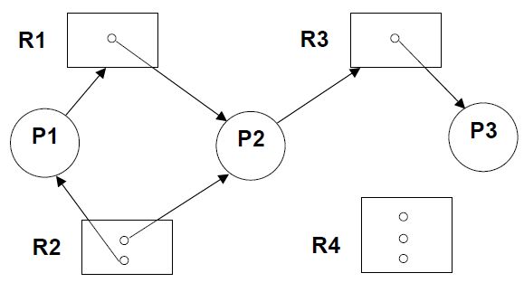
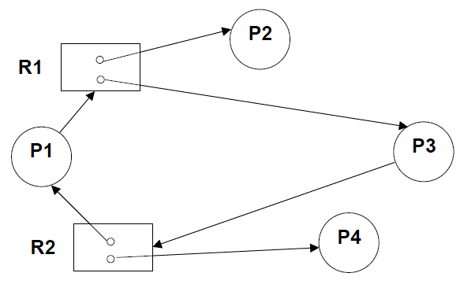
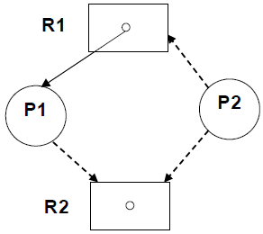
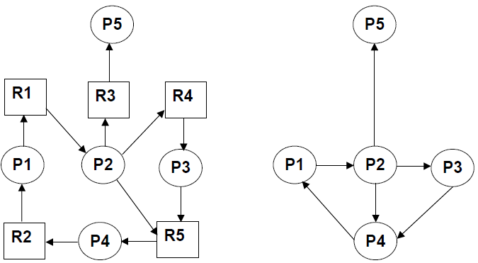
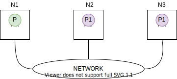

# 3.1 Punto di Vista INTERNO

## 3.1.1 Sistema Operativo

`NUCLEO` &rarr; ***primo livello di astrazione*** del Sistema Operativo

Il nucleo dovrebbe, per quanto possibile, *contenere solo meccanismi* consentendo a livello dei processi di utilizzare tali meccanismi *per la realizzazione di politiche di gestione*, diverse a seconda del tipo di applicazione.

# 3.2 Progettazione del Nucleo di un Sistema Operativo Multiprogrammato

**Ipotesi**: Architettura Monoprocessore

Il nucleo deve fornire il *supporto* per:

1. Processi Sequenziali che possono essere in vari stati:

   - 1 Processo in Esecuzione (perché monoprocessore) &rarr; *RUNNING*
   - In una coda di processi pronti &rarr; *READY QUEUE*. Il loro stato di esecuzione viene salvato in un *Descrittore di Processo* e sono mandati in esecuzione attraverso specifici *ALGORITMI DI SCHEDULING*.

2. Meccanismi di Sincronizzazione, avendo prima definito il *modello di riferimento*:

   - Modello ad Ambiente Globale
     - *SEMAFORI* con *coda dei processi sospesi*
     - *OPERAZIONI* sui semafori (*Inizializzazione*, *WAIT* e *SIGNAL*)
   - Modello ad Ambiente Locale
     - *CANALI DI COMUNICAZIONE* con *coda dei processi sospesi*
     - *OPERAZIONI* (*SEND* e *RECEIVE*)

   In entrambi i casi le operazioni di sincronizzazione (sia sui semafori che sui canali) sono *PRIMITIVE*. Ogni volta che un processo esegue una di queste operazioni si transita da:

<center><b><i>STATO UTENTE &larr;&rarr; STATO SUPERVISORE (SISTEMA)</i></b></center>

La *visione complessiva* che deve avere il nucleo è quella dello ***stato globale del sistema***, ovvero lo stato di tutti i processi e, nel caso del modello ad Ambiente Globale, di tutte le risorse (occupate/disponibili).

# 3.3 Progettazione delle Strutture Dati del Nucleo

1. **Registro che identifica il *processo in esecuzione*** (RUNNING). Il processo running *può essere o meno mantenuto nella*
   *coda dei processi pronti*. Il registro non è necessariamente hardware.

2. Un ***DESCRITTORE* per ogni processo**  &rarr; **Process Control Block (*PCB*)**
3. Una ***coda dei processi pronti*** (*READY QUEUE*), a livello logico. A livello implementativo possono esserci più code.
4. Una ***coda dei processi sospesi*** (possono anche essere più code)
   - *code eventi esterni*
   - *code semafori* (in *Ambiente Globale*)
   - *code canali* (in *Ambiente Locale*)

Le code, sia quella dei processi pronti che quelle dei processi sospesi, possono essere gestite in *modalità FIFO*. Se a livello di progetto, si associa una *PRIORITÀ ai processi* che influenza l’algoritmo di scheduling, queste possono essere gestite tramite essa.

Bisogna quindi decidere se la READY QUEUE è:

- Realizzata con *una sola coda con i descrittori accodati in ordine di priorità* &rarr; nel momento in cui un processo può essere messo in stato di *READY*, deve essere messo in coda nella posizione corrispondente al suo *grado di priorità*, cosa non semplice.
- Se è realizzata *con più code di descrittori* &rarr; *una per ogni priorità*

Oltre che stabilire il *range di valori* che può assumere la priorità e se un valore basso significa priorità alta o bassa, è bene distinguere tra priorità:

* statica
* dinamica 

## 3.3.1 Descrittore di Processo

Un descrittore di processo deve riportare le seguenti informazioni:

- **Nome** del processo, solitamente un *numero identificativo* (*PID*) per identificare univocamente un descrittore.

- **Stato** del processo; in una ipotesi di minima:
  - pronto
  - bloccato
  - in esecuzione (solo se il PCB resta nella coda di processi pronti, altrimenti basta un riferimento *RUNNING* nel registro).
- **PROGRAM COUNTER** &rarr; indirizzo della prossima istruzione da eseguire. Serve per quando il processo riprende la propria esecuzione dallo stato di *pronto* o *bloccato*.
- **Registri della CPU** &rarr; serve sempre quando un processo riprende la propria esecuzione. Serve per riprendere l'esecuzione in modo corretto. A seconda dell'hardware sottostante si possono trovare le seguenti tipologie di registri:
  - accumulatori
  - registri indice
  - registri generali
- **Informazioni di Scheduling**:
  - priorità
  - puntatore al prossimo processo in coda &rarr; se la lista presenta un solo elemento al puntatore sarà assegnato il valore *NULL*.
- **Informazioni di Accounting**
  - tempo di CPU usato
  - limiti di tempo (correlati agli algoritmi di scheduling in *time sharing*)
- **Informazioni sullo Stato di I/O**
  - richieste non soddisfatte di I/O
  - dispositivi assegnati
  - lista file aperti
- **Informazioni per la Gestione della Memoria**

Nel momento in cui un processo viene creato nel S.O (e quindi si lancia un programma in esecuzione), deve essere creato il suo descrittore. A livello progettuale si hanno due scelte.

1. Quando ho *necessità di avere un nuovo processo attivo nel sistema* si crea anche una memoria (*struttura dati*), come quella appena specificata nell'elenco soprastante. Il tempo che il sistema impiega ad allocare questa memoria viene denominato ***tempo di overhead***. In questo caso, dopo la creazione del processo, è necessario un tempo supplementare per *creare il descrittore di processo*.
2. Allocazione di una ***Pool di Descrittori Liberi***. Il nucleo in questo modo mantiene una coda di *descrittori disponibili* per non perdere in seguito del tempo ad allocarli. Questi descrittori vengono mano a mano associati ai processi creati e tornano disponibili alla loro distruzione. Nel caso non ci siano descrittori disponibili, il nucleo può segnalare un errore all'utente (UNIX/LINUX) oppure allocarne uno nuovo.

### Esempi di Descrittori di Processi

#### In UNIX

Il *descrittore esiste per tutta la vita del processo* e contiene tutte le informazioni importanti per il processo (sia quando è in esecuzione e sia quando è pronto o sospeso).

- **pid** (process identifier) &rarr; nome del processo

- **ppid** (parent process identifier) &rarr; nome del processo padre
- **real uid** (user identifier)
- **real gid** (group identifier)

Un processo è creato da un utente (con un UID e un GID) di cui si tiene traccia nel descrittore.

- **effective uid** (user identifier)
- **effective gid** (group identifier)

Un processo può eseguire un programma che ha il SUID e/o il SGID settato che appartiene ad un utente (con UID e GID) di cui si tiene traccia nel descrittore.

- locazioni delle aree utente e di kernel &rarr; rappresentano le *Informazioni per la Gestione della Memoria*. Lo spazio di indirizzamento in UNIX è diviso in un'area utente e un'area di codice.
- **stato** del processo
- **priorità** del processo
- **puntatore al prossimo processo in coda**

#### In LINUX

Linux usa due termini diversi a seconda del punto di vista:
a) **Punto di vista del KERNEL** &rarr; *task = entità con dati e codice*
b) **Punto di vista ESTERNO** &rarr; *processo = parte dei task eseguita in user mode*

Per quanto risulta dal codice scritto in C per la versione del *Kernel 2.0* abbiamo:

- Tabella dei Processi (statica), corrispondente al Pool a cui si è fatto riferimento precedentemente
- Stato del Processo
- Identificatore del Processo
- User ID, Effective User ID, Saved User ID
- Group ID, Effective Group ID, Saved Group ID
- Tempo di Esecuzione
- Priorità Statica
- Codice di Terminazione
- Task *Seguente* e Task *Precedente*
- Padre Originale
- Padre Attuale
- Informazioni sui File Aperti

# 3.4 Progettazione delle Operazioni del Nucleo

Queste operazioni sono rappresentano le ***chiamate di sistema (system calls)*** o ***primitive***, che *funzionano sempre in STATO SUPERVISORE*. Prendendo come riferimento un *processo UNIX*, questo può eseguire in due modi diversi:

* "processo di utente" (***user mode***) &rarr; modo di esecuzione *NORMALE*
* "processo di sistema" (***kernel mode***) &rarr; modo di esecuzione con *MAGGIORE VISIBILITÀ*

La transizione tra i "*modi*" user e kernel avviene *mediante l'invocazione delle primitive*. L’esecuzione delle primitive avviene in ***stato kernel*** con una *visibilità maggiore*, in quanto devono andare ad agire su strutture dati non accessibili in *user mode*.

## 3.4.1 Operazioni Primitive 

### Creazione di un Processo

Parametri:

- tipo (di sistema o di utente)
- priorità
- programma da mandare in esecuzione (da cui ricavare dimensioni e quantità di memoria per DATI e CODICE)
- informazioni di protezione

Effetto:

- creazione di un nuovo descrittore (o suo recupero dal POOL di descrittori liberi), sua inizializzazione con anche allocazione della memoria che rappresenta lo spazio di indirizzamento del processo, infine transizione dello stato (**STATO = PRONTO**)
- inserimento nella coda dei processi pronti, o eventualmente nella coda di priorità se c'è gestione della priorità

#### Creazione in UNIX

In UNIX si utilizza la ***primitiva FORK***. In questo caso tutti i parametri che servono al Kernel per effettuare la creazione sono *impliciti*. Il tipo del processo, così come la priorità, dipende dal tipo che siamo nel momento in cui effettuiamo la creazione. Unix usa lo stato *IDLE* (esplicito) fino a che la fase di inizializzazione non è terminata e poi lo stato *READY*.

### Distruzione di un Processo

Questa operazione viene usata per:

* terminazione o autodistruzione
* uccisione (un processo può volerne distruggere un altro)

Parametri:

- identificatore processo

Effetto:

- recupero risorse assegnate
- eliminazione dal sistema (se è in una coda, viene estratto)
- distruzione del suo descrittore (o reinserimento nel POOL di descrittori liberi)

#### Distruzione in UNIX

In UNIX si utilizza la ***primitiva EXIT*** (per terminazione o autodistruzione) e ***primitiva KILL*** con *SIGKILL* (uccisione di un processo da parte di un altro processo). Unix usa lo stato *TERMINATED* e se necessario lo stato *ZOMBIE* per indicare uno stato padre in attesa della terminazione del processo figlio, in questo modo viene mantenuto il descrittore del processo figlio che può essere utile al processo padre.

### Sospensione di un Processo

Usata da:

* richieste di I/O
* In *Ambiente Globale* &rarr; *WAIT* sospensiva su semaforo
* In *Ambiente Locale* &rarr; *RECEIVE* se manca messaggio, *SEND SINCRONA* se manca il rendez-vous e *SEND ASINCRONA* con canale pieno se bufferizzazione limitata

Parametri:

- identificatore processo

Effetto:

- spostamento del suo descrittore dalla coda dei processi pronti, (se come per ipotesi precedente è questa presenta il processo in esecuzione) alla coda di sospensione e transizione dello stato in (***STATO = SOSPESO***).
- selezione del prossimo processo pronto come processo *RUNNING* (secondo l'algoritmo di SCHEDULING) &rarr; PROCESS
  SWITCHING (o cambio di contesto)

### Riattivazione di un Processo

Usata da:

* completamento di richieste  I/O &rarr; gestione interrupt
* In *Ambiente Globale* &rarr; *SIGNAL* su semaforo con coda
* In *Ambiente Locale* &rarr; *RECEIVE* quando arriva il messaggio, *SEND SINCRONA* quando arriva il receiver e *SEND ASINCRONA* quando si libera spazio nel canale limitato

Parametri:

- identificatore processo

Effetto:

- spostamento del suo descrittore dalla coda di sospensione alla coda dei processi pronti. La riattivazione di un processo *non implica mai che esso passi direttamente in stato di esecuzione*. Transizione dello stato in (***STATO = PRONTO***).
- ***eventuale*** selezione del prossimo processo pronto come processo *RUNNING* (algoritmo di SCHEDULING) &rarr; PROCESS SWITCHING. L'arrivo di un processo nella coda dei processi pronti può far sì che quel processo debba immediatamente andare in esecuzione. Se è già presente un processo in fase di *running* questo deve ritornare nello stato *pronto*.

### Sospensione Temporizzata di un Processo

Usata per:

* autosospensione (ad esempio per uso di time-out)
* sospensione di un altro processo &rarr; collegata alla gestione di un ***TIMER***

Parametri:

- identificatore processo
- durata

Effetto:

- spostamento del suo descrittore [dalla coda dei processi pronti, (se come per ipotesi precedente questa presenta il processo in esecuzione) alla ***coda del TIMER*** e transizione dello stato (***STATO = SOSPESO***)
- selezione del prossimo processo pronto come processo RUNNING (algoritmo di SCHEDULING) &rarr; PROCESS SWITCHING

#### Sospensione Temporizzata in UNIX

In UNIX, si utilizza la ***primitiva SLEEP*** per l'autosospensione, mentre *non è prevista una primitiva che permetta di sospendere un altro processo*. Allo scadere del tempo di sospensione &rarr; riattivazione (con la stessa primitiva indicata precedentemente). La riattivazione infatti è *indipendente da qualsiasi sia stata la causa di sospensione*.

### Lettura degli Attributi di un Processo

Visto che i *descrittori di un processo* fanno parte dello spazio di indirizzamento accessibile solo al nucleo, se si vogliono rendere disponibili delle informazioni ai programmatori di sistema è necessario prevedere delle *primitive che vadano a leggere alcune informazioni presenti nei descrittori dei processi*.

#### Lettura degli Attributi in UNIX	

Queste primitive in UNIX sono costituite dalle operazioni: GETPID, GETPPID, GETUID, GETGID, GETEUID, GETEGID.

### Modifica degli Attributi di un Processo

Un esempio di attributo di un processo che può essere soggetto a modifica nel corso della sua vita è la *priorità*.

#### Modifica degli Attributi in UNIX

In UNIX esiste una primitiva chiamata *NICE* che permette di modificare la priorità di un processo (a livello utente), *abbassandola*.

I progettisti devono considerare che le *chiamate di sistema possano fallire* e quindi devono prevedere **CODICI DI ERRORE**.

## 3.4.2 Transizioni di Stato


0. **da programma a processo**
1. **da esecuzione a sospeso**
2. **da sospeso a pronto**
3. **da pronto a esecuzione** &rarr; effetto di una azione dello SCHEDULER
4. **da esecuzione a pronto** &rarr; effetto di una azione dello SCHEDULER dovuta a uso di PREEMPTION
5. **da esecuzione a terminazione**


- *SWAPPED* immagine copiata su disco
  *SWAP OUT* &rarr; si applica preferibilmente a processi sospesi
- *ZOMBIE* terminato, ma presente in attesa di consegna del risultato al padre (che non ha ancora aspettato il figlio)

## 3.4.3 Cambio di Processo

Il *cambio di processo* (detto anche *cambio di contesto*, ***context switching***) è necessario quando si *effettua la commutazione della CPU dal processo running al prossimo processo che deve andare in esecuzione* (in base all’algoritmo di scheduling).

**N.B**: Si ha a causa delle transizioni *(1)* e *(4)* e ha come effetto finale la transizione *(3)*

Quando il nucleo deve effettuare il cambio di processo sono necessarie le seguenti azioni:

- *salvataggio del contesto del processo in esecuzione*, dai registri macchina, *nel suo descrittore*
- *inserimento del suo descrittore nella coda appropriata* (di processi sospesi o dei processi pronti)
- *caricamento dell’identificatore del nuovo processo che deve andare in esecuzione* nel registro RUNNING
- *ripristino del contesto del nuovo processo running* nei registri macchina

## 3.4.4 Dispatcher

Il DISPATCHER è quel modulo del nucleo che passa effettivamente il controllo della CPU ai processi scelti dallo scheduler (con il quale non deve essere confuso). Quindi si occupa di effettuare:

- il *cambio di contesto* (con le azioni sopra descritte)
- il *passaggio da modo SUPERVISORE a modo UTENTE*
- il *salto alla giusta posizione del programma utente* per riattivarne l'esecuzione

## 3.4.5 Creazione di un Processo

Quando un processo crea un nuovo processo, ci sono ***due possibilità*** per quanto riguarda lo ***spazio di indirizzamento*** del nuovo processo:

- il *processo figlio è un duplicato del processo genitore*
- *nel processo figlio si carica un diverso programma*, da specificare a lato della creazione

### Esempi nei Sistemi Operativi

#### UNIX

In UNIX, un nuovo processo si crea per mezzo della ***primitiva FORK***. Il nuovo processo è composto da una copia dello
spazio di indirizzamento del processo padre per quanto riguarda i dati (sia utente che kernel, il codice viene condiviso e i due processi eseguono lo *stesso programma*). Molto spesso dopo la creazione, uno dei due processi (il padre o, più normalmente, il figlio) impiega una delle primitive della famiglia ***EXEC*** per sostituire lo spazio di memoria del processo con un nuovo programma.

#### VMS

La creazione di un processo carica il programma specificato in tale processo e ne avvia l'esecuzione.

#### Windows

Sono previste entrambe le possibilità: la *semantica simile alla FORK*, e *la semantica simile a VMS*.

## 3.4.6 Tabelle per Processi in UNIX


### Tabelle del KERNEL - Parte Residente

#### Process Table

La Process Table rappresenta la *pool di descrittori* sia *liberi* che *in uso* per i processi attivi nel sistema, specificato da un campo apposito. Presenta dunque un ***descrittore di processo*** per ***ogni processo attivo nel sistema***.

#### Text Table

In questa tabella è presente *un elemento per ogni codice attivo*, presentando un'ulteriore tabella per rappresentare in modo facile la condivisione di codice tra processo padre e i vari processi figli (anche solo uno).

Queste due tabelle appartengono al *kernel* e si trovano nella parte della *Parte Residente*, sempre accessibile a prescindere dalla gestione della memoria fatta sui processi utente

### Spazio di Indirizzamento dei Processi

Si trova nella *Parte Swappabile*. Se il processo *non è in stato swapped* allora in memoria centrale, nello spazio utente avremo la presenza di *aree dedicate ad ogni singolo processo*:

#### Area di KERNEL

In genere accessibile *solo durante la esecuzione delle primitive* del Sistema Operativo, nella quale troviamo:

- Stack &rarr; utilizzato per le *system calls*
- System Data &rarr; a sua volta suddivisa in:
  - *enviroment*, dove oltre all'ambiente di esecuzione ci sono anche *argc* e *argv* (parametri passati all'invocazione del *main*)
  - *user area* (o *user data*) dove troviamo la *tabella dei file aperti* e la *tabelle di trattamento dei segnali*

#### Area DATI

Suddivisa in:

- Dati Globali &rarr; che nel linguaggio C sono le *variabili static ed extern*
- Dati Dinamici &rarr; dati gestiti a *Stack*, come variabili definite a livello di singole istruzioni nella funzione main e dati gestiti a *Heap*, come le zone di memoria che si vanno ad allocare con primitive tipo *mallock()*

#### Area di CODICE 

Ne è solo una ma più processi possono fare riferimento alla *stessa* tramite il loro descrittore di processo.

## 3.4.7 Primitive in UNIX/LINUX

### Creazione di un Processo

#### FORK - UNIX

Se si verifica un qualsiasi errore, la fork restituisce al processo parent il valore -1. 

Se la fork ha successo viene creato un processo figlio:

- inserisce una nuova entry utilizzando uno degli elementi pre-allocati nella **tabella dei processi** &rarr; descrittore per il nuovo processo con attributi ereditati dal padre: ad esempio stesso *UID* e *GID*
- l'area dati utente del processo figlio viene copiata dall'area dati utente del processo padre
- il nuovo processo esegue lo stesso codice del padre &rarr; aggiornamento contatore nell'elemento della text table, perché padre e figlio condividono lo stesso codice
- l'area kernel del processo figlio viene duplicata dall'area kernel area del processo padre &rarr; tabella dei file aperti e situazione nello stato dei segnali uguale a quella del processo padre 
- inserisce il descrittore del figlio nella coda dei processi pronti

Durante le *prime 4 fasi* il processo è in *stato IDLE*.

#### FORK - LINUX (versione 2.0)

L'unica differenza a livello implementativo dalla precedente è che *non viene fatta una copia iniziale dell'area utente*. Questo rappresenta un'***ottimizzazione***. Nell'area del padre viene messa un *flag*:

- area dati marcata *write-protected*
- una scrittura genera un *page-fault* (eccezione per tentativo di accesso)
- il *kernel fa una copia dell'area dati* e dà al processo che deve scrivere il permesso di modificarla

L'ottimizzazione di non fare immediatamente la copia dati è dovuta al fatto che spesso un figlio, appena dopo essere stato creato, va a fare una *EXEC* per poter eseguire un nuovo programma, andando così a creare *una nuova area dati*.

### Esecuzione di un Programma

#### EXEC

UNIX consente di cambiare il programma che un processo sta eseguendo usando una delle primitive della famiglia *EXEC*.
**N.B.1**: è questa primitiva che, eventualmente, cambia *EUID* e/o *EGID*.
**N.B.2**: come effetto collaterale (non visibile nella figura), viene cambiata la tabella che specifica come vengono trattati i segnali. I segnali che precedentemente erano ignorati rimangono tali così come quelli collegati alle azioni di default. Tutti i segnali che prevedevano un'azione di trattamento di quel segnale vengono tutti riportati all'azione di default: le azioni specifiche appartengono al codice, pertanto è bene svincolarle dal codice precedente. 


Si consideri la generazione di un certo processo. Supponiamo che il figlio abbia ottenuto come copia dal padre una *Kernel area*, un'*area Dati* costituita da *Stack e Heap* e ha ottenuto per condivisione il *codice del padre*. Se il figlio effettua una *EXEC*, l'area dati viene *deallocata* e ne viene allocata una nuova che serve per eseguire il nuovo programma da mandare in esecuzione. Poiché il il codice che si esegue è diverso, deve essere caricato o recuperato (se era già in uso) l'elemento della *Text table* opportuno. In questo modo il figlio non punta più all'elemento della Text table a cui puntava il padre, ma punterà al codice nuovo.

# 3.5 Processo VS Thread

`PROCESSO` &rarr; programma in esecuzione
*PROGRAMMA* = entità passiva
*PROCESSO* = entità attiva

Caratteristiche:

- Un processo è l'**unità di esecuzione** all'interno di un Sistema Operativo
- L'esecuzione di un processo è *sequenziale*: le istruzioni vengono eseguite in sequenza, secondo l'ordine specificato nel programma

Un *S.O. MULTIPROGRAMMATO consente l'esecuzione concorrente di più processi*.

Un processo è costituito da:

- Codice del programma eseguito
- Program Counter (PC)
- altri registri della CPU
- Stack (per parametri e variabili locali di funzioni/procedure)
- Dati (per variabili globali)

Quindi un processo può essere rappresentato dalla ennupla:

<center><b><i>processo = {PC, registri, codice, dati, stack, ...}</i></b></center>

I "..." rappresentano *dati variabili a seconda del S.O*. In *UNIX* ad esempio per ogni processo viene allocata una *Kernel area.*

## 3.5.1 Processi Pesanti VS Leggeri (Thread)

- processi diversi eseguono codici distinti
- processi diversi accedono a dati distinti (e quindi diversi)
- i processi (normalmente) non condividono memoria

Processi con queste caratteristiche vengono anche chiamati ***Processi Pesanti*** (si ispirano al ***modello locale***). Unix, di base, ragiona in termini di processi pesanti.

Un ***thread*** (o ***Processo Leggero***) è un’*unità di esecuzione* che *condivide codice e dati con altri processi leggeri* correlati. La condivisione di dati non è possibile tra due thread qualunque: i due devono appartenere allo stesso task. Un *thread* può essere definito con la ennupla:

<center><b><i>thread = {PC, registri, stack, ...}</i></b></center>

Queste sono le informazioni minime che consentono a un flusso di esecuzione di eseguire all'interno di una CPU. L'insieme di tutti i *thread* che *condividono codice e dati* viene detto ***TASK***, che può essere definito con la ennupla:

<center><b><i>task = {thread1, thread2, ..., threadN, codice, dati}</i></b></center>

  Per un thread valgono i ragionamenti fatti utilizzando il termine *processo*. Un thread può essere in stato di esecuzione, in stato *ready* o *suspended*. Come i processi, devono avere un descrittore che deve tenere traccia delle informazioni proprie del thread e che deve avere un riferimento al codice e ai dati tramite l'appartenenza al *TASK*.

**N.B**: In un caso degenere, un ***processo pesante*** equivale a un ***task*** con ***un solo thread***.

### Osservazioni

#### Modello dei Processi

I *Processi Pesanti* si ispirano al ***modello locale***:

- **ASSENZA di condivisione di memoria**
- a differenza dei thread, un processo *NON può condividere variabili con altri processi*

I *Thread* si ispirano al ***modello globale***

- **Condivisione di memoria**
- a differenza dei processi pesanti, un thread *può condividere variabili con altri thread appartenenti allo stesso task*

#### Costi Creazione e Context Switching (che è puro overhead)

- Per i S.O. che usano **Processi Pesanti**, il *tempo per creare un processo* e per *effettuare il process switching* risulta *molto elevato* (dipende dalla dimensione del descrittore)
- Per i S.O. che usano **Processi Leggeri**, il *tempo per creare un thread* e per *effettuare il process switching* è *molto inferiore rispetto a quello di processi pesanti* &rarr; il descrittore di un thread non contiene nessuna informazione relativa a codice e dati. *I Thread partono con un task con già allocati i Dati e il Codice*.

Ad esempio, creare un thread in *Solaris* richiede 1/30 del tempo richiesto per creare un nuovo processo.

#### Thread nella Quotidianità

- Browser web &rarr; Un thread per la rappresentazione sullo schermo di immagini e testo e contemporaneamente è presente un thread (che si interfaccia con un server web) per il reperimento dell’informazione in rete da visualizzare.
- Server web &rarr; Un thread per il servizio di ciascuna richiesta da parte dei client. Sarà presente un *TASK* in attesa della richeista *HTTP/S* sulla port dedicata, e questo task una volta ricevuta la richiesta la assegna a uno specifico thread.
- LINUX &rarr; un thread per la gestione della memoria libera

## 3.5.2 Realizzazione di un Thread

La Realizzazione di un Thread può avvenire:

A livello di Kernel:

- il S.O. gestisce direttamente i cambi di contesto (process switching) sia tra thread dello stesso task che tra task
- il S.O. fornisce strumenti per la sincronizzazione nell'accesso a variabili comuni (secondo schemi di competizione e di cooperazione) da parte di thread diversi dello stesso task

A livello Utente

- il passaggio da un thread al successivo nello stesso task non richiede interruzioni al S.O. &rarr; l’implementazione risultante è molto efficiente
- il S.O. tratta solo processi pesanti &rarr; qualsiasi *thread che effettua una chiamata di sistema bloccante* (che si pone in attesa di I/O) *causa il blocco dell’intero processo/task*

### Osservazioni

I thread a livello kernel sono supportati da tutti i S.O. attuali: Windows, Solaris, Linux, Mac OS X.

Per provare il funzionamento di una applicazione che faccia uso di processi leggeri si può:

- in **Linux**, usare la libreria *Pthread* che aderisce allo standard POSIX (implementata a livello kernel o a livello utente)
- in **Java**, o definire una sottoclasse della classe Thread o definire una classe che implementa l’interfaccia *Runnable* &rarr; più flessibile, in quanto consente di definire un thread che è sottoclasse di una classe diversa dalla classe Thread 

## 3.5.3 Modelli di Multithreading

Molti sistemi supportano sia *kernel thread* che *user thread*: si vengono così a creare tre **differenti modelli di multithreading**:

### Many-to-One

Un *certo numero di user thread* vengono *mappati su un solo kernel thread*.

Modello generalmente adottato da S.O. che non supportano kernel thread multipli.

### One-to-One

*Ogni user thread viene mappato su un kernel thread* &rarr; thread nativi
Esempi: Windows, Linux e Solaris (dalla versione 9)

### Many-to-Many

Molti user threads possono essere associati a diversi kernel threads.

Il S.O. può creare il numero di kernel threads minore o uguale rispetto agli user threads.

# 3.6 Scheduling

Con il termine ***Scheduling*** si fa riferimento a un insieme di tecniche e di meccanismi del S.O. che stabiliscono l’ordine di esecuzione dei processi. Lo ***SCHEDULER*** è un modulo del S.O e ha come obiettivo l'***ottimizzazione delle prestazioni***.

Esistono **3 tipi** di scheduler:

1. scheduler di lungo termine 
2. scheduler di medio termine
3. scheduler di breve termine


Lo scheduling è una funzione fondamentale dei S.O: *si sottopongono a scheduling quasi tutte le risorse di un*
*calcolatore*. Naturalmente la CPU è una delle risorse principali e il suo scheduling è alla base della progettazione dei S.O.

## 3.6.1 Tipi di Scheduler

### Scheduler di Lungo Termine

Agisce sulla coda dei lavori *batch*. Dalla coda dei programmi caricati sulla *memoria secondaria* ***decide chi caricare in memoria centrale***, attuando lo scheduling dalla coda dei processi batch (che contiene i ***JOB***) a quella dei *processi pronti*. Questo tipo di scheduler va a determinare il ***grado di multiprogrammazione*** (numero di programmi in memoria centrale).

**Obiettivo**: Questo tipo di scheduler deve compiere la sua scelta in modo da inserire *nella coda dei processi pronti* un numero *bilanciato* di *processi **CPU bound*** e di *processi **I/O bound***. Avendo solo processi *CPU bound*, avremmo un monopolio della CPU da parte di questi processi, mentre con solo processi *I/O bound* si hanno dei grandi intervalli di tempo con *CPU IDLE*.

La frequenza con cui agisce lo scheduler di lungo termine è più bassa di quella degli altri due tipi di scheduler.

Nei ***sistemi time sharing*** (come *Unix* o *Linux*) è l’utente che stabilisce direttamente il grado di multiprogrammazione e quindi lo scheduler a lungo termine non è presente: tutti i nuovi processi creati vengono direttamente caricati in memoria.

### Scheduler di Medio Termine

Lo *Scheduler a Medio Termine* si si incarica di gestire i processi rimossi dalla memoria centrale. In particolare, quando un processo viene sospeso effettua lo ***swapping-out*** (sfratto) del processo dalla memoria centrale. Il processo viene inserito nella *coda SWAPPED* e lo spazio che questo processo occupava in memoria centrale viene così salvato in *memoria di massa*. Quando un processo precedentemente sospeso diventa *pronto*, lo *riporta in memoria centrale* effettuando lo ***swapping-in***.

Per subire lo *swapping-out* un processo non deve necessariamente essere sospeso, in alcuni S.O come UNIX è possibile arrivare allo *swapping* anche attraverso la *coda dei processi pronti*. In generale è più usato per quelli sospesi.

### Scheduler di Breve Termine

Viene anche chiamato ***CPU Scheduler*** e rappresenta quella *parte del Sistema Operativo* che *decide a quale dei **processi pronti***  (pesanti o leggeri) presenti nel sistema *assegnare il controllo della CPU*. Questo scheduler lavora dunque sulla coda dei processi pronti, occupandosi della transizione di stato da *PRONTO* a *ESECUZIONE*.

Viene invocato *ogni volta che è necessario effettuare una commutazione di processo*, quindi ogni volta che un *EVENTO* (esterno o interno) produce un cambiamento nello stato globale del sistema. Come ad esempio:

- interrupt per completamento operazioni di I/O
- interrupt dal TIMER
- chiamate di sistema

## 3.6.2 Politiche VS Meccanismi

***Scheduler*** e ***Dispatcher*** sono due elementi distinti del nucleo.

Lo ***SCHEDULER*** (della CPU) *decide a quale processo assegnare la CPU*. Si parla spesso di *algoritmi, strategie di scelta* &rarr; `POLITICA`

Dopo questa decisione, il ***DISPATCHER*** passa effettivamente il controllo della CPU al processo &rarr; `MECCANISMO`

## 3.6.3 Valutazione delle Prestazioni

I parametri che i progettisti degli algoritmi di SCHEDING considerano per massimizzare le prestazioni di un S.O. (dal punto di vista del sistema o dal punto di vista utente) sono:

1. sfruttamento della CPU
2. lavoro utile
3. tempo di ricircolo
4. tempo di attesa
5. tempo di risposta

I *primi due* sono parametri *system-oriented*, mentre gli *altri tre* sono *user-oriented*.

### Parametri

#### Sfruttamento della CPU (utilizzo della CPU)

Percentuale del tempo di CPU durante il quale la CPU è impegnata (da 0% a 100%)

La CPU si considera impegnata:

- quando non è inattiva
- quando esegue lavoro utile (escluso funzioni del S.O, *overhead*)

**Obiettivo**: sfruttamento della CPU del100% &rarr; riduzione del tempo in cui la CPU è *IDLE*

**Valori tipici**: da 40% a 90%

#### Lavoro Utile (Produttività)

Questo parametro è anche detto ***throughput***: *numero di processi completati per unità di tempo*.

#### Tempo di Ricircolo (Completamento)

Anche chiamato ***turnaround time***: tempo che impiega un processo per essere completato.

Questo tempo rappresenta l'*intervallo di tempo* da quando un processo viene immesso nel sistema a quando termina ed esce. Risulta essere la somma dei tempi passati nell'attesa di caricamento in memoria (attesa nella *coda batch*), nella coda dei processi pronti, durante la esecuzione nella CPU e nel compiere operazioni di I/O.

#### Tempo di Attesa

Si riferisce al ***tempo di attesa della CPU***, anche chiamato ***waiting time***: rappresenta il *tempo speso da un processo in attese per ottenere la CPU*. Risulta essere la somma degli intervalli di attesa nella coda dei processi pronti.

#### Tempo di Risposta

Chiamato anche ***response time***. Il significato di questo parametro dipende dal tipo di Sistema Operativo:

**Sistemi Time-Sharing (sistemi interattivi)**:

Intervallo di tempo da quando un processo viene immesso nel sistema a quando esce il primo risultato.

**Sistemi Real-Time**

Intervallo di tempo da quando viene notificato un evento a quando il processo che lo gestisce termina.

### Ottimizzazione

L'ottimizzazione delle prestazioni consiste nel:

- **MASSIMIZZARE**
  - lo sfruttamento della CPU
  - il lavoro utile

- **MINIMIZZARE**
  - il tempo di ricircolo
  - il tempo di attesa
  - il tempo di risposta

Ciò è ***IMPOSSIBILE*** da ottenere, poiché i parametri sono *interdipendenti* e alcuni sono *in contrasto tra loro*. Per attuare una buona ottimizzazione delle prestazioni è necessario un ***compromesso tra i vari requisiti***. La scelta deve essere fatta *tenendo conto per cosa deve essere utilizzato il Sistema Operativo*.

Quindi, nella pratica, i progettisti selezionano i parametri in base alle specifiche esigenze:

- Nei *sistemi batch*, massimizzare il lavoro utile e minimizzare il tempo medio di ricircolo.
- Nei *sistemi interattivi*, minimizzare il tempo medio di risposta e il tempo medio di attesa (coda dei processi pronti). 

Bisognerebbe però anche considerare la *VARIANZA*, che dovrebbe essere piccola. Nei sistemi interattivi, sarebbe più importante
*MINIMIZZARE la varianza del tempo di risposta* piuttosto che il tempo medio di risposta. *Un S.O. con un tempo di risposta prevedibile è meglio di un S.O. mediamente rapido*, ma molto variabile.

# 3.7 Scheduling Con e Senza Preemption

Per lo *scheduler di breve termine* un progettista deve fare una scelta iniziale:

- algoritmi di scheduler che *NON prevedono PREEMPTION* &rarr; senza prelazione (non interrompenti)
- algoritmi di scheduler che *prevedono PREEMPTION* &rarr; con prelazione (interrompenti)

***NON PREEMPTION* significa**:
Il processo in esecuzione *mantiene il possesso della CPU* fino a che non decide volontariamente di *sospendersi* oppure *termina*.

OSSERVAZIONE: Un algoritmo di scheduling NON PREEMPTIVE è *l'unico che può essere utilizzato su certe piattaforme HW*, perché non richiede speciali caratteristiche come la presenza di timer.

***PREEMPTION*** **significa**: 

In riferimento allo Scheduler: al processo in esecuzione può essere sottratta la CPU. Il processo in esecuzione *viene riportato in stato di PRONTO*.

Esempi: Un processo più prioritario diventa pronto oppure è scaduto il quanto di tempo.

VANTAGGIO:
maggiore velocità di risposta agli eventi o velocità di risposta per gli utenti

SVANTAGGIO:
l’algoritmo di scheduling DEVE essere attivato OGNI VOLTA che ci sono EVENTI che possono modificare lo STATO del SISTEMA

**Osservazione**: Le prime versione di Windows (fino alla 3.1) utilizzavano algoritmi di scheduling *NON PREEMPTIVE*, mentre da Windows 95 in poi si usa uno scheduler *PREEMPTIVE*.

La possibilità di effettuare PREEMPTION della CPU ha delle ripercussioni a livello di progettazione del nucleo di un S.O.

Infatti, durante una chiamata di sistema per conto di un processo, il nucleo può essere in fase di modifica di strutture dati essenziali del nucleo stesso. Se durante tale system call il processo subisce PREEMPTION, le strutture dati del nucleo potrebbero
risultare in uno stato inconsistente!

Alcuni S.O, fra cui la maggior parte delle versioni di UNIX, risolvono questo problema attendendo il completamento delle chiamate di sistema prima di effettuare la PREEMPTION

COME SI OTTIENE QUESTO?
Si consideri che una system call (o parte di essa) può essere considerata una sezione critica sufficientemente breve e quindi basta usare le soluzioni viste cioè:

- Nei S.O: implementati su architettura monoprocessore, basta usare la disabilitazione (come *PROLOGO*) e la riabilitazione (come *EPILOGO*) delle interruzioni.
- Nei S.O. implementati su architettura multiprocessore basta usare un meccanismo di lock (*LOCK* come *PROLOGO* e *UNLOCK* come *EPILOGO*)
  SVANTAGGIO: questa soluzione non si concilia con eventuali esigenze real-time!

# 3.8 CPU Burst - I/O Burst

Durante la sua attività, un processo alterna le seguenti fasi:

- **CPU burst** nella quale il processo usa solo la CPU
- **I/O burst** nella quale il processo effettua operazioni di I/O

# 3.9 Algoritmi di Scheduling

Questi algoritmi sono applicabili in linea di principio ad ogni tipo di scheduler. Nel seguito si fa specifico riferimento al *CPU scheduling* e si considerano per semplicità, per ogni processo, una sola sequenza di operazioni della CPU (cioè un solo CPU burst).

## 3.9.1 FCFS

L'acronimo sta per ***First Come First Served*** detto anche ***FIFO*** (First In First Out)

È la tecnica più semplice di scheduling per i processi: i processi vengono eseguiti in ordine di arrivo SENZA uso di
PREEMPTION. Quando un processo acquisisce la CPU, resta in esecuzione fino a quando si blocca volontariamente o termina

**Osservazioni**:

* NON PREEMPTION
* Non c'è il concetto di *priorità*

***PRESTAZIONI basse***, specialmente per processi corti che arrivino dopo processi lunghi:

- basso sfruttamento della CPU
- basso lavoro utile
- elevati tempi di ricircolo
- elevati tempi di risposta

### Esempio

- P1 &rarr; durata del *CPU burst* 20 unità di tempo
- P2 &rarr; durata del *CPU burst* 2 unità di tempo

#### Caso A: P1 - P2


#### Caso B: P2 - P1


L’algoritmo FCFS *non consente di variare l’ordine dei processi*. Si può incorrere nell’effetto ***CONVOGLIO***: processi corti che sono accodati dopo un processo con CPU burst lungo, il che porta a una riduzione del grado di utilizzo della CPU e riduzione del grado di utilizzo dei dispositivi di I/O.

## 3.9.2 SJF

L'acronimo sta per ***Shortest Job First***, tuttavia viene eseguito *per primo il processo con la più breve lunghezza della successiva sequenza di operazioni CPU* (CPU burst).

**Osservazioni**:

- *NON PREEMPTION*

* Concetto di priorità particolare

***PRESTAZIONI migliori*** dell'algoritmo *FCFS*.

**Svantaggio**:
La *difficoltà* nella implementazione dell'algoritmo SJF consiste nel *conoscere la durata della successiva richiesta della CPU*.

**Soluzioni**:

1. Per lo scheduler di lungo termine, *si può usare* come durata *il limite di elaborazione indicato dall'utente* per l'intero JOB
2. Per lo scheduler a breve termine, si può predirne il valore usando la storia della esecuzione del processo &rarr; ci si riferisce alle durate dei CPU-burst precedenti usando una media esponenziale.

## 3.9.3 SRTN

L'acronimo sta per ***Shortest Remaining Time Next***. Si tratta della versione dell'algoritmo ***SJF CON PREEMPTION***.

Se *arriva nella coda dei processi pronti* un processo P1 con lunghezza della successiva *sequenza di operazioni della CPU più breve di quello in esecuzione* P2, viene *mandato in esecuzione* P1 e P2 subisce PREEMPTION.

**Osservazioni**:

* *POSSIBILITÀ DI PREEMPTION*

**Vantaggio**:
*SOLUZIONE OTTIMA* in termini di ***minimizzazione del tempo medio di attesa***.

**Svantaggio**:
Non sempre è possibile sapere a priori la durata del prossimo CPU burst di un processo, al limite è possibile fare delle *stime*.

## 3.9.4 Round - Robin

Questo algoritmo è ***utilizzato dallo scheduler di breve termine nei sistemi in time-sharing*** (interattivi).

L'algoritmo ha come obiettivo ***avere un buon tempo di risposta*** e una ***equa suddivisione delle risorse tra i processi***.

Utilizzo della *PREEMPTION* &rarr; ad ogni processo viene assegnato un *TIME SLICE*, ovvero un ***QUANTO DI TEMPO***.

**Regole**:

1. Alla scadenza del quanto di tempo il controllo della CPU passa al prossimo processo nella READY QUEUE
2. Se un processo si sospende (volontariamente) prima dello scadere del suo quanto di tempo, il resto non consumato viene perso dal processo (a maggior ragione se il processo termina …)

La *READY QUEUE* può essere considerata una coda circolare di processi: in realtà, la coda dei processi pronti è *gestita FIFO*, ma ad ogni processo è assegnata la CPU per un *QUANTO DI TEMPO* (*QT*) prefissato.

**NECESSITÀ di un TIMER DEDICATO**

**Due casi**:

1. *TIMER* &rarr; interrupt ad ogni quanto &rarr; chiamata al CPU SCHEDULER
   - salvataggio processo in esecuzione nel descrittore
   - ripristino stato del prossimo processo nella READY QUEUE
   - passaggio del controllo al nuovo processo RUNNING

2. *Processo RUNNING si sospende* ===> chiamata al CPU SCHEDULER
   - salvataggio processo nel descrittore e accodamento
   - ripristino stato del prossimo processo PRONTO
   - azzeramento timer
   - passaggio del controllo al nuovo processo RUNNING

**N.B**: Se un processo termina il caso 2 è semplificato dato che non c’è la fase di salvataggio/accodamento del processo.

OSSERVAZIONI:

* processi con CPU burst corti possono richiedere un solo quanto di tempo
* processi con CPU burst lunghi dureranno proporzionalmente alle richieste di risorse

### Esempio

***Q = 4 unità di tempo***

P1 &rarr; durata del CPU burst 24 unità di tempo

P2 &rarr; durata del CPU burst 3 unità di tempo

P3 &rarr; durata del CPU burst 3 unità di tempo


**Tempo di Ricircolo**:

P1 &rarr; 30 unità di tempo

P2 &rarr; 7 unità di tempo

P3 &rarr; 10 unità di tempo

Tempo di Ricircolo Medio = 47/3  ≃ 16

**NB**: Con N processi pronti e quanto di tempo Q ogni processo aspetta al massimo *T<sub>M</sub>* la sua prossima fase di esecuzione.
$$
T_M = (N-1) * Q
$$

### Performance

La PERFORMANCE del ROUND-ROBIN dipende da Q:

* se Q ≃ ∞ &rarr; FCFS
* se Q ≃ 1 microsecondo &rarr; processor sharing

Gli *utenti hanno l'impressione* che *ciascuno degli N processi abbia un proprio processore* in esecuzione a *1/N della velocità del processore reale*. Ciò è possibile solo se realizzato via HW.

**Valori tipici di TIME-SLICE**: *10-100 millisecondi*.

Ad esempio: ***Unix*** &rarr; 100 millisecondi e **Linux** &rarr; 200 millisecondi

Da un punto di vista di principio, ***più basso è Q, migliore è il tempo di risposta***.

Bisogna *fissare il valore di Q in base al tempo che dura il PROCESS SWITCHING* (che è solo overhead).

#### Esempio

P1 &rarr; durata del CPU burst 10 unità di tempo

- **CASO A: Q = 12 unità di tempo**
  - P1 esegue in un singolo quanto di tempo
- **CASO B: Q = 6 unità di tempo**
  - P1 ha bisogno di DUE quanti di tempo
  - NECESSITÀ di UN PROCESS SWITCHING
- **CASO C: Q = 1 unità di tempo**
  - P1 ha bisogno di 10 quanti di tempo
  - NECESSITÀ di NOVE PROCESS SWITCHING

**Conclusione**:

Il *valore di Q* deve essere ***molto maggiore del process switching time***.

### Tempo di Ricircolo

Anche il tempo di ricircolo è influenzato dal valore di Q, ma *INVERSAMENTE*. Infatti, da un punto di vista di principio, ***più alto è Q e migliore è il tempo di turnaround***.

#### Esempio

P1 &rarr; durata del CPU burst 10 unità di tempo

P2 &rarr; durata del CPU burst 10 unità di tempo

P3 &rarr; durata del CPU burst 10 unità di tempo

**CASO A: Q = 1 unità di tempo**

I processi eseguono sequenzialmente fino al completamento per 1 unità di tempo ciascuno: 

<center><i>P1 &rarr; P2 &rarr; P3 &rarr; P1 &rarr; P2 &rarr; ...</i></center>

Tempo di ricircolo di P1 = 28

Tempo di ricircolo di P2 = 29

Tempo di ricircolo di P3 = 30

Tempo di Ricircolo Medio = 29 unità di tempo

**CASO B: Q = 10 unità di tempo**

Tempo di ricircolo di P1 = 10

Tempo di ricircolo di P2 = 20

Tempo di ricircolo di P3 = 30

Tempo di Ricircolo Medio = 20 unità di tempo

**REGOLA EMPIRICA**: Il *QUANTO di TEMPO* dovrebbe *essere scelto* in modo da essere ***maggiore dell’80% dei CPU burst***.

**Osservazione**: Spesso la coda dei processi pronti contiene un processo fittizio (detto dummy process) che va in esecuzione quando tutti i processi sono bloccati. Il processo dummy rimane in esecuzione sino a quando qualche altro processo diventa pronto, eseguendo un ciclo senza fine.

## 3.9.5 A Priorità

L'algoritmo viene detto anche ***EVENT-DRIVEN***. Viene ***utilizzato dallo scheduler di breve termine*** nei sistemi real-time dove è importante un basso tempo di risposta agli eventi esterni.

Ad ogni processo viene assegnata una PRIORITÀ (di solito un *numero intero, in un range prefissato*)

**Osservazione**: in un certo senso anche *SJF/SRTN possono essere visti come algoritmi a priorità* dove la priorità è la *lunghezza del prossimo CPU burst*).

Il progettista del S.O. deve stabilire le caratteristiche di questa proprietà assegnata ai processi:

1. statica/dinamica
2. assegnata dal sistema/assegnata dall’utente
3. chiarire il range (fisso) dei valori 
4. valore basso &rarr; priorità alta oppure valore basso &rarr; priorità bassa

Si sceglie di implementare in questo caso la ***coda dei processi READY con più code***, una per ogni valore di priorità.

**Regola**: Lo scheduler sceglie *sempre* il *processo pronto che ha la MASSIMA PRIORITÀ*. Il sistema può fare uso o meno della PREEMPTION.

### Con PREEMPTION

Ogni volta che un processo P diventa PRONTO si confronta il suo valore di priorità con quello del processo RUNNING: se è maggiore, va in esecuzione P

**Problema**:
Un processo a bassa priorità potrebbe NON RIUSCIRE mai ad eseguire &rarr; *STARVATION*

**Possibile Soluzione** (fattibile *solo in caso di priorità dinamica* e gestita dal S.O):
Priorità che si innalza più il processo è PRONTO in attesa della CPU &rarr; ***aging priority*** (priorità per anzianità).

## 3.9.6 Sistemi HARD Real-Time

Presenza di processi CRITICI che devono eseguire ***prima di una certa scadenza TEMPORALE*** (*DEADLINE*).

- **EARLIEST-DEADLINE first scheduler**

  - scheduler con prelazione
  - seleziona il processo che ha la scadenza più prossima

- **MINIMUM LAXITY first scheduler**

  - La *laxity* (rilassabilità) è una *misura della NON urgenza di un processo*: se T è il tempo corrente, D la deadline e
    C il tempo di esecuzione rimanente, allora:
    $$
    L = (D-T) – C
    $$
    Quindi L è il *tempo che un processo può attendere prima di andare in esecuzione e rispettare la deadline*.

  - seleziona il processo che ha minore laxity

## 3.9.7 Code Multiple

I progettisti di un S.O possono decidere di progettare lo ***scheduler sulla base dei diversi “tipi” di processi*** che chiaramente hanno ***esigenze diverse*** &rarr; combinando diverse tecniche di SCHEDULING.

- processi di sistema
  - scheduler a priorità (EVENT-DRIVEN)
- processi di utenti interattivi
  - scheduler ROUND-ROBIN
- processi/JOB corrispondenti a lavori BATCH
  - scheduler FCFS o SRTN

Ognuno di questi scheduler lavora su *una sua CODA dei PROCESSI PRONTI*, da qui il nome *CODE MULTIPLE*. Dall'alto verso il basso, lo scheduler ottiene in questo modo le code ad *alta*, *media* e *bassa priorità*.

**Problema**:

SCHEDULING fra gli SCHEDULER di solito basato sulla priorità o su quanti di tempo (non uguali per le varie code).

**Osservazione**: un processo viene assegnato STATICAMENTE ad una certa CODA

### Code Multiple e RETROAZIONE (feedback)

Questo algoritmo rappresenta *un'alternativa al precedente*. Con questo algoritmo:

- un processo può migrare da una CODA all’altra in base al suo comportamento
- si evitano situazioni di starvation o uso eccessivo della CPU

In questo modo, progettando un ***sistema con più code***, a *ciascuna coda* viene assegnata *una certa priorità* ed è *gestita in ROUND-ROBIN*. A una ***coda di priorità minore***, corrispondono ***quanti di tempi sempre maggiori***.

#### Conclusione

Si riserva un ***trattamento PREFERENZIALE*** ai ***processi con CPU burst brevi***. Quelli più lunghi (cioè che consumano più risorse)
”sprofondano” in basso, e sono eseguiti nei tempi morti della CPU. C’è anche un meccanismo di ***PROMOZIONE***: se un processo non esaurisce il suo quanto di tempo perché si sospende può risalire la ”CHINA”.

L'algoritmo di scheduling a *code multiple con retroazione* è il più generale, ma anche *il più complesso da realizzare*.

# 3.10 Scheduling per Sistemi Multiprocessore

A livello architetturale, i progettisti possono trovarsi di fronte a due casi:

## 3.10.1 Processori Eterogenei

In questo caso, l’unica scelta possibile è adottare una associazione ***STATICA***. Ogni *processore* ha la propria *coda di processi pronti* e il suo *algoritmo di SCHEDULING*.

## 3.10.2 Processori Omogenei

Decidendo di adottare la stessa scelta di prima, dove ogni processore ha la propria coda di processi pronti e il suo algoritmo di SCHEDULING, si può incorrere nel seguente problema: *un processore* è *IDLE* *con la READY QUEUE vuota*, mentre *un altro è sovraccaricato*. La ***soluzione*** consiste nell'adottare ***un'associazione DINAMICA***.

In questo modo è possibile ottenere una ***CONDIVISIONE DEL CARICO (LOAD SHARING)***. Viene implementata ***una sola coda di processi pronti*** da cui tutti i processori prelevano.

### Problema

Il problema è dato dall'***accesso ad una struttura dati comune***.

**Possibile Soluzione 1**: un processore (MASTER) fa le funzioni di SCHEDULER. Questo è il solo che accede alla coda dei processi pronti e assegna il processo scelto ad un altro processore &rarr; ***ASYMMETRIC MULTIPROCESSING***

**Possibile Soluzione 2**: ***SYMMETRIC MULTIPROCESSING (SMP)***, assicurandosi che:

- lo stesso processo non venga selezionato da due processori
- alcuni processi non siano persi dalla coda

Questa soluzione che non scala benissimo con il numero di processori: *aumentano le contese nell’accesso alla READY QUEUE*. Potrebbe sembrare che sia meglio tornare ad avere una coda dei processi pronti per ogni CPU, ma così facendo si avrebbe sempre il *problema della distribuzione dei processi nelle varie code*.

## 3.10.3 Ulteriori Problematiche

L'utilizzo delle ***SPIN-LOCK*** (anche chiamata *SPINNING*, tecnica che consiste nel verificare periodicamente se il *LOCK* è stato sbloccato) può far nascere l'esigenza di avere uno ***smart scheduling***. Se è in esecuzione uno *SPIN-LOCK* lo scheduler può tenere in considerazione di non far scadere il quanto di tempo, in modo da dare al processo che mantiene la SPIN-LOCK più tempo per terminare la propria sezione critica, in modo che possa poi *rilasciare il LOCK* consentendo ad altri processi di accedere a quella sezione critica resettando il *flag*.

Un altro problema è quello della ***predilezione*** (o *affinity*) per il processore. Se un processo durante la sua vita può cambiare coda per bilanciare il carico dipende se a livello di progettazione si è optato per una *predilezione debole* o una *predilezione forte*:

- ***Predilezione DEBOLE*** (*soft affinity*): 

  Il SO tenta di mantenere il processo sullo stesso processore, ma la *migrazione non è interdetta se è necessario un bilanciamento* delle READY QUEUE. In particolare, questa *migrazione può essere di due tipi*:

  - ***GUIDATA*** (*push migration*) &rarr; un processo dedicato controlla periodicamente la lunghezza delle code; 

    Es. Linux: eseguito ogni 200ms

  - ***SPONTANEA*** (*pull migration*) &rarr; lo scheduler sottrae un PCB ad una coda sovraccarica

    Es. Linux: invocata quando la coda si svuota

- ***Predilezione FORTE*** (*hard affinity*): 

  Il processo è vincolato all’esecuzione su uno specifico processore &rarr; decide di mantenere un *processo in esecuzione sempre sullo stesso processore*, si ha il *riutilizzo del contenuto della cache* per ***burst*** successivi.

Linux implementa sia la predilezione debole (*default*) che quella forte, disponendo per quest'ultima chiamate di sistema con cui
specifica che un processo non può abbandonare un dato processore.

# 3.11 Scheduling in LINUX

Prima della ***versione 2.5 del kernel***, era una *variante* dell’***algoritmo tradizionale di UNIX*** (*code multiple con feedback gestite perlopiù con Round Robin* e *quanti di tempo differenziati*). Il problema di questo algoritmo è che ***era poco scalabile*** e *poco adatto ai sistemi SMP*. La ***complessità O(n)*** faceva sì che l'***algoritmo non fosse costante***.

Dalla ***versione 2.6 del kernel*** la ***complessità diventa O(1)*** e il ***tempo è costante*** a *prescindere dal numero di TASK nel sistema*. 

Ogni processore ha una *runqueue* che contiene due priority array:

- **active** &rarr; insieme dei task che non hanno ancora esaurito il loro quanto di tempo
- **expired** &rarr; insieme dei task che hanno eseguito per un intero quanto di tempo

Dalla ***versione 2.6.23*** lo scheduler viene aggiornato al **Completely Fair Scheduler (CFS)**, che consiste in una classe di scheduler con diverse caratteristiche, di cui la più importante è che viene calcolato *un **tempo di esecuzione virtuale per ogni TASK***. Non vengono assegnate le priorità, ma si registra per quanto tempo è stato eseguito ogni TASK (con un ***vruntime***) e per scegliere il prossimo TASK da eseguire lo scheduler sceglie quello con il *vruntime minore*.

# 3.12 Deadlock

## 3.12.1 Introduzione

`DEADLOCK` &rarr; situazione nella quale uno o più processi rimangono ***indefinitamente bloccati*** (sospesi), attendendo ciascuno il verificarsi delle condizioni necessarie per il proprio proseguimento.

Da non confondere con la *starvation* , che deriva dalla cattiva gestione della politica di risveglio dei processi, che possono non essere gestiti in maniera *FIFO*. 

Si hanno situazioni di deadlock sia nel caso:

- interazione indiretta (risorse riusabili)  
- interazione diretta (risorse consumabili) 

Di conseguenza, il deadlock può verificarsi sia che si adotti il modello dei processi ad ambiente globale (che li presenta entrambi) sia che si adotti quello locale (in cui si ha solo l'interazione diretta). 

Nel *caso di modello globale e interazione indiretta*: più processi possono entrare in competizione per ottenere l’uso di risorse. Se una delle risorse richieste non è disponibile il processo viene posto in condizione di attesa. Se un processo in attesa non cambia più il suo stato cioè le risorse richieste sono trattenute da altri processi essi pure in attesa, si ha una *situazione di deadlock*.

### Risorse Riusabili

#### Proprietà

- devono essere usate in modo esclusivo

- in genere non possono essere sottratte al processo durante l’uso
- numero fisso (e limitato)

> **Esempio**
>
> - **Risorse fisiche** (tempo di CPU, spazio di memoria, file, dispositivi di I/O stampanti, etc.)
>
> * **Risorse logiche** (code, tabelle, etc.)

#### Esempi di DEADLOCK

- Sistema con due processi (P1 e P2) e quattro unità di TIPO stampante:

  Si suppone che ognuno dei due processi (P1 e P2) acquisisca e mantenga due stampanti, ma ne ha bisogno di tre per svolgere per intero il proprio compito &rarr; si ha una situazione di DEADLOCK. Sia P1 che P2 attendono di poter acquisire la terza stampante, ma
  non c’è nessuna stampante libera. Entrambi i processi sono bloccati in attesa del verificarsi di una condizione che *non si può* verificare!

- Sistema con due processi (P1 e P2), una stampante di TIPO1 e una stampante di TIPO2:

  Si suppone che il processo P1 acquisisca la stampante di TIPO1 (R1) e il processo P2 acquisisca la stampante di TIPO2 (R2), ma entrambi hanno bisogno dell’altra risorsa &rarr; si ha una situazione di DEADLOCK. Ciascun processo attende di acquisire la stampante dell'altro.

#### Esempi di DEADLOCK utilizzando Semafori

In riferimento al secondo esempio, si utilizzano due semafori *s1* e *s2* per proteggere la sezione critica associata a *R1* e a *R2*:

```c
wait(s1); 
    <S.C1-a>
    wait(s2);
    	<S.C2>
    signal(s2);
    <S.C1-b>
signal(s1);
```

Si ha uno pseudocodice di questo tipo, per ciascuno dei due processi. Ciascuno dei due processi fa una prima wait  sul proprio semaforo per accedere alla prima stampante, per poi rimanere in attesa sulla seconda wait, essendo l'altra stampante ancora occupata dal processo rivale. La soluzione è corretta dal punto vista del problema della sezione critica e il meccanismo del semaforo in sé non presenta problemi di deadlock.

### Risorse Consumabili

Le risorse consumabili sono rappresentate dai *segnali e messaggi* che vengono scambiati tra i processi.

#### Caso Modello Globale

Si hanno due processi *P* e *Q* e due buffer *A* e *B*. *P inserisce un messaggio nel buffer A* e *preleva un messaggio dal buffer B*. *Q inserisce un messaggio nel buffer B* e *preleva un messaggio dal buffer A*. In questo caso si ha una situazione di deadlock quando P attende di inserire un messaggio nel buffer A pieno (rimanendo così in stato *bloccato*) e Q attende di inserire un messaggio nel buffer B pieno. Entrambi i processi operano per inserire un messaggio senza che nessuno cominci a prelevarli. Oppure, in caso contrario, si può verificare quando entrambi attendono di prelevare un messaggio senza che nessuno inserisca qualcosa nel buffer.

#### Caso Modello Locale

- P spedisce un messaggio a Q
- Q spedisce un messaggio a P
- P riceve un messaggio da Q
- Q riceve un messaggio da P

Se le ***send sono sincrone***. Nel caso di P, per andare ad eseguire l'istruzione seguente deve effettuare il *rendez vous* con Q, il quale a sua volta deve fare il *rendez vous* con P.

Se le ***send sono asincrone*** ma il *buffer è limitato*, può verificarsi comunque *deadlock* quando *i canali sono saturi*.

La deadlock si avrà sempre anche partendo con delle *receive*, in quanto *sono bloccanti*.

## 3.12.2 Schema di Uso di un Processo - Caso Risorse Riusabili

Consideriamo risorse di diverso tipo: R1, R2, ..., Rm.

Ciascun tipo di risorsa R<sub>i</sub> ha W<sub>i</sub> istanze (con W<sub>i</sub> ≥ 1). Il protocollo di accesso alle risorse da parte dei processi prevede che il processo deve rispettare la seguente sequenza:

- *RICHIESTA*: Se la richiesta non può essere soddisfatta immediatamente (perché la risorsa è già utilizzata da un altro processo) il processo richiedente deve attendere fino al rilascio della risorsa da parte del processo che la detiene

- UTILIZZO
- RILASCIO

La richiesta ed il rilascio sono realizzate da apposite SYSTEM CALL e possono essere realizzate ad esempio con *WAIT* e *SIGNAL* su semafori. In caso di system call, il S.O. controlla per ogni utilizzo che la risorsa sia stata richiesta ed assegnata. Una tabella di sistema registra lo stato di ogni risorsa e, se occupata, il processo che la sta utilizzando.

## 3.12.3 Condizioni per il Deadlock

Si hanno *n processi* P1, P2, ..., Pn che usano *m tipi di risorse* R1, R2, ..., Rm. Si verifica una condizione di deadlock solo se ***sono vere tutte le seguenti quattro condizioni***:

1. Le risorse possono essere **utilizzate da un solo processo** alla volta &rarr; MUTUA ESCLUSIONE
2. I *processi trattengono le risorse che già possiedono mentre chiedono risorse addizionali*
   (condizione di allocazione PARZIALE) &rarr; TRATTENIMENTO DELLE RISORSE E ATTESA
3. Le *risorse già assegnate ai processi non possono essere sottratte* a questi &rarr; *MANCANZA DI PREEMPTION*
4. Esiste un insieme di processi (Pi, Pi+1, ..., Pk) tali che Pi è in attesa di una risorsa posseduta da Pi+1, Pi+1 è in attesa di una risorsa posseduta da Pi+2, ..., Pk è in attesa di una risorsa posseduta da Pi &rarr; ATTESA CIRCOLARE

Le quattro condizioni **non sono indipendenti fra di loro**: ad esempio, la condizione di *ATTESA CIRCOLARE* implica la condizione di *TRATTENIMENTO E ATTESA*.

### 3.12.4 Grafo di Allocazione (Assegnazione) delle Risorse

Si definisce grafo di allocazione (o assegnazione) delle risorse:
$$
G = (V, E)
$$

- V &rarr; insieme di vertici (o nodi), partizionato in:
  - P = { P1, P2, ..., Pn } insieme di PROCESSI
  - R = { R1, R2, ..., Rm } insieme dei TIPI di risorse
- E &rarr; insieme di lati (o archi), dove ogni suo elemento è una coppia ordinata:
  - (Pi, Rj) &rarr; ***LATO RICHIESTA***
  - (Rj, Pi) &rarr; ***LATO ASSEGNAZIONE***

#### Esempio di Ciclo (con deadlock)

**Risorse**:

- R1 ha una sola istanza
- R2 ha due istanze
- R3 ha una sola istanza
- R4 ha tre istanze

<center><i>  E = {(P1, R1),(P2, R3), (R1, P2), (R2, P1),(R2, P2),(R3, P3)} </i></center>



##### Condizioni per il Deadlock

Se esiste un ciclo nel grafo di allocazione delle risorse allora *PUÒ* esistere una situazione di DEADLOCK. Se il grafo di allocazione delle risorse NON CONTIENE cicli allora non esiste una situazione di DEADLOCK. Ci sono ***due cicli***:

1. P1 &rarr; R1 &rarr; P2 &rarr; R3 &rarr; P3 &rarr; R2 &rarr; P1
2. P2 &rarr; R3 &rarr; P3 &rarr; R2 &rarr; P2

P1, P2 e P3 sono in una situazione di DEADLOCK: P2 aspetta l’istanza della risorsa R3 che è usata da P3, ma P3 aspetta perché P1 o P2 liberino una istanza della risorsa R2 e P1 aspetta perché P2 liberi l’istanza della risorsa R1.

#### Esempio di Ciclo (senza deadlock)

**Risorse**:

- R1 ha due istanze
- R2 ha due istanze

<center><i> E = { (P1, R1),(P3, R2), (R1, P2), (R1, P3), (R2, P1),(R2, P4) }</i></center>



C'è ***un ciclo***:

P1 &rarr; R1 &rarr; P3 &rarr; R2 &rarr; P1

P1, P2, P3 e P4 *non sono in una situazione di deadlock*, infatti:

- P4 può rilasciare una istanza della risorsa R2, che può
  essere allocata a P3 ”rompendo” il ciclo
- P2 può rilasciare una istanza della risorsa R1, che può
  essere allocata a P1 ”rompendo” il ciclo

## 3.12.4 Metodi Trattamento Deadlock

1. Il primo metodo di trattamento del deadlock è la ***PREVENZIONE***, che consiste nell'assicurarsi che il sistema ***non entri mai*** in una situazione di DEADLOCK. Si fa distinzione tra:
   - **PREVENZIONE STATICA** assicurarsi che *almeno una delle quattro condizioni necessarie non si verifichi* (in particolare, ATTESA CIRCOLARE) &rarr; restrizioni nell’uso delle risorse
   - **PREVENZIONE DINAMICA** *verificare*, sulla base dello stato corrente di allocazione delle risorse e delle richieste, *se soddisfare una richiesta* di allocazione di una risorsa libera *può portare ad una possibile situazione di deadlock* &rarr; occorrono delle informazioni aggiuntive 

2. Si tratta di un ***metodo a posteriori***. Accorgersi del DEADLOCK e ”rimediare” al problema &rarr; *DETECTION* e *RECOVERY*. Si effettuano delle azioni per ELIMINARLO: ”uccisione” di processi oppure PREEMPTION delle risorse.

### Prevenzione Statica

Detta anche *DEADLOCK PREVENTION*, consiste *nell'assicurarsi* all'atto della scrittura del programma che *almeno una delle quattro condizioni necessarie non si verifichi*. ***Prevenire*** i *deadlock* ha come *svantaggio* un *basso utilizzo delle risorse e uno throughput ridotto*. Si considerano le quattro condizioni separatamente:

#### Mutua Esclusione

Se il tipo di risorsa è non-condivisibile cioè se una istanza deve essere usata da un processo alla volta allora questa condizione *non può essere eliminata*. Invece, se il tipo di **risorsa è condivisibile** cioè se ogni istanza può essere usata da più processi per volta, (come ad esempio un file read-only), allora questa condizione *può essere eliminata* e l’uso di questo tipo di risorsa ***non produce mai deadlock***.

#### Trattenimento delle Risorse e Attesa

Per evitare questa condizione esistono due metodi:

1. Un processo acquisisce tutte le risorse di cui ha bisogno all’inizio, le usa e poi le rilascia tutte in blocco

   **Problemi**

   - bisogna fare una STIMA delle necessità di un processo. Più facile per JOB meno facile per processi INTERATTIVI &rarr;  SOVRASTIMA. Se un processo ha bisogno di più risorse, bisogna fare sì che o le prenda entrambe o nessuna.
   - alcune risorse *preallocate* potrebbero essere utilizzate solo per periodi di tempo molto limitati

2. Un processo può acquisire una risorsa R1 se e solo se non ha acquisito nessuna altra risorsa R2. In caso contrario, deve rilasciare R2 se vuole acquisire R1.

   ##### Problemi

   - più riacquisizioni e rilasci

   - non è detto che per tutte le risorse sia facile rilasciarle e poi riacquisirle

   ##### Vantaggi

   - stima non necessaria

   - non trattiene le risorse quando non SERVE

**Svantaggi di Entrambe le Soluzioni**

- abbassamento del grado di utilizzo delle risorse e la concorrenza
- possibile l'attesa indefinita per processi con forti richiese di risorse

#### Mancanza di Preemption

Un processo che si pone in attesa di una risorsa R1, mentre ha già acquisito un’altra risorsa R2, si vede sottrarre R2. Quando R1 si sarà liberata, dovrà essere riassegnata anche R2.

**Problema**

Non è detto che per tutte le risorse sia facile il rilascio e poi la riassegnazione.

**Osservazione**

Questo protocollo può essere adatto per risorse il cui stato si può salvare e recuperare facilmente (registri, memoria; ma non per dispositivi di I/O).

#### Attesa Circolare

Per evitarla è necessario imporre un ***ordinamento totale*** (possibilmente logico) su tutti i tipi di risorse.

R = { R1, R2, ..., Rm }

Associamo un ***numero intero positivo a ogni tipo di risorsa***

F : R &rarr; N

Nell’allocazione delle risorse ai processi bisogna seguire questo protocollo: ogni processo può richiedere solo risorse in ordine crescente di numerazione. Quindi, inizialmente, un processo *P* può richiedere un qualunque numero di istanze del tipo di risorsa *Ri*. In seguito, P può richiedere istanze del tipo di risorsa *Rj* se e solo se *F(Rj) > F(Ri)*.

**Esempio**:

F(disco) = 5

F(stampante) = 12

Il processo P vuole usare il disco e la stampante, allora deve richiedere prima il disco e poi la stampante. In alternativa, un processo P può acquisire istanze del TIPO *Rj* se ha rilasciato ogni risorsa di tipo *Ri* tale che *F(Ri) ≥ F(Rj)*. Seguendo questo protocollo non si può mai instaurare una condizione di attesa circolare. La funzione F deve essere definita secondo l'ordine
d'uso normale delle risorse del sistema. Ad esempio, poiché generalmente l'unità disco si usa prima della stampante è sensato definire: *F(disco) < F(stampante)*.

### Prevenzione Dinamica

Detta anche *DEADLOCK AVOIDANCE*. ***Evitare*** **i deadlock** presuppone che il sistema conosca a priori informazioni addizionali sulle richieste future dei processi. Si tratta di ***tecniche di prevenzione che agiscono a tempo di esecuzione*** e *verificano*, sulla base dello stato corrente di allocazione delle risorse e delle richieste complessive dei processi, *se il soddisfacimento di una richiesta per una risorsa può portare ad una possibile situazione di deadlock*. Si soddisfa una richiesta solo se questa non porta ad un possibile blocco critico. Non c'è sempre la certezza che si arrivi al deadlock, si ottiene solo un *campanello d'allarme*.

*Occorrono* delle ***informazioni aggiuntive*** sulle *richieste* delle risorse. La tecnica più semplice di questa categoria si basa sull*’informazione* del ***massimo numero di risorse di ciascun tipo*** di cui ogni processo ha bisogno durante la sua esistenza.

**STATO DI ALLOCAZIONE DELLE RISORSE** &rarr; numero di risorse allocate e disponibili e il massimo richiesto dai processi. Quando un processo richiede una risorsa disponibile il S.O. deve decidere se la sua (loro) allocazione immediata mantenga il sistema in stato sicuro. Uno **stato** si dice **SICURO** se il sistema può allocare le risorse ad ogni processo, in un qualche ordine, evitando possibili situazioni di deadlock, e quindi ***esiste una sequenza sicura*** di esecuzione dei processi. Non è detto tuttavia che uno **stato non sicuro** porti necessariamente al deadlock.

Facendo in modo che il *sistema transiti sempre in uno stato sicuro si evita certamente il deadlock*.

**Esempio**

Si considera un sistema con **un solo tipo di risorsa**, con *12 istanze* e *3 processi:* *P0, P1, P2*.

| Processo | Necessità Massime | Allocazioni Correnti |
| -------- | ----------------- | -------------------- |
| P0       | 10                | 5                    |
| P1       | 4                 | 2                    |
| P2       | 9                 | 2                    |

Sono ancora presenti *3 istanze libere*. Il **sistema è in uno stato sicuro**, infatti esiste la sequenza *< P1, P0, P2 >* che è *sicura*.

- P1 può acquisire le altre 2 istanze di cui necessita e terminare e quindi liberare le istanze: 5 istanze libere (4 + 1)
- P0 può acquisirle e terminare: libera 10 istanze
- P2 può acquisirne 7 e terminare

Si può passare ad uno **stato non sicuro** se al tempo T1 P2 richiede un'ulteriore istanza e gli viene allocata:

| Processo | Necessità Massime | Allocazioni Correnti |
| -------- | ----------------- | -------------------- |
| P0       | 10                | 5                    |
| P1       | 4                 | 2                    |
| P2       | 9                 | **3**                |

Sono ancora presenti *2 istanze libere*.

- Solo P1 può acquisire le altre 2 istanze di cui necessita e terminare: libera 4 istanze
- P0 e P2 hanno bisogno entrambi di un numero maggiore di istanze &rarr; *DEADLOCK*

Le tecniche di *DEADLOCK AVOIDANCE* devono ***stabilire se lo stato di allocazione*** cui si perviene ***è sicuro o meno***.

Lo svantaggio di questa tecnica è dato *dall'abbassamento del grado di utilizzo delle risorse*. 

#### Evitare il Deadlock: Algoritmo del Banchiere

Si utilizzano *diverse strutture dati per **memorizzare lo stato di allocazione del sistema***. I *processi* sono *visti come clienti* che possono richiedere credito (*necessità di un processo*). L'algoritmo del banchiere *non è svolto da un processo, ma dal sistema durante una supervisor call*, qualora esso voglia fare *prevenzione dinamica*. Si definiscono i seguenti elementi:

- ***n*** &rarr; numero di *processi*

- ***m*** &rarr; numero di *tipi di risorse*

- ***DISPONIBILI*** &rarr; vettori di lunghezza *m* per memorizzare il numero di *risorse disponibili per ogni tipo*.

  *DISPONIBILI[j] = k &rarr; k istanza del tipo R<sub>j</sub> dove 1 ≤ j ≤ m*

- ***NECESSITÀ_MAX*** &rarr; matrice *nxm* per memorizzare le *necessità massime di ogni processo*.

  *NECESSITÀ_MAX[i , j] = k &rarr; al processo Pi servono al massimo k istanze di TIPO Rj 1≤ i ≤ n e 1≤ j ≤ m*

- ***ALLOCAZIONE*** &rarr; matrice *nxm* per memorizzare le *situazione attuale di allocazione di ogni processo per ciascun tipo di risorsa*.

  *ALLOCAZIONE[i , j] = k &rarr; al processo Pi sono state allocate k istanze di TIPO Rj 1≤ i ≤ n e 1≤ j ≤ m*

- ***NECESSITÀ*** &rarr; matrice *nxm* per memorizzare le *necessità rimaste di ogni processo per ciascun tipo di risorsa*.

  *NECESSITÀ[i , j] = k &rarr; processo Pi servono ancora k istanze di TIPO Rj 1≤  i ≤  n e 1≤  j ≤  m*

  La *necessità è data da* *NECESSITÀ_MAX - ALLOCAZIONE* (vettori).

- ***RICHIESTA<SUB>K</SUB>*** &rarr; vettore delle richieste del Processo *P<sub>K</sub>*

  - *RICHIESTA<sub>K</sub> ≤  NECESSITÀ<sub>K</sub>* &rarr; altrimenti errore
  - *RICHIESTA<sub>K</sub> ≤  DISPONIBILI* &rarr; altrimenti c’è almeno una risorsa NON DISPONIBILE e il processo P<sub>K</sub> deve aspettare

- ***STATO S**** (**STATO FUTURO**), definito da:

  - *DISPONIBILI := DISPONIBILI - RICHIESTA<sub>K</sub>*
  - *ALLOCAZIONE<sub>K</sub> := ALLOCAZIONE<sub>K</sub> + RICHIESTA<sub>K</sub>*
  - *NECESSITÀ<sub>K</sub> := NECESSITÀ<sub>K</sub> - RICHIESTA<sub>K</sub>* 

Uno stato viene considerato *SICURO* se tutti i processi che hanno già ottenuto delle risorse sono in grado di completare la propria esecuzione, anche se ciascun processo intendesse usare tutte le risorse di cui ha bisogno.

##### Provare che uno STATO S* É SALVO

Definiamo ogni richiesta del processo *P<sub>K</sub>* come *RICHIESTA<sub>K</sub>*. Memorizziamo lo stato attuale (S0) e introduciamo il vettore:

- ***FINITO*** &rarr; *FINITO[i] := false 1 ≤ i ≤ n*

1. valutare lo stato S* che si otterrebbe soddisfacendo la richiesta *RICHIESTA<sub>K</sub>*

2. trovare un indice i tale per cui

   - *FINITO[i] = false* 
   - *NECESSITÀi ≤ DISPONIBILE*

   Se non esiste andare al passo 4

3. valutare il nuovo stato Si* che ottenuto da:
   *DISPONIBILI = DISPONIBILI + ALLOCAZIONEi*
   *FINITO[i] := true*
   Quindi tornare al passo 2

4. se *FINITO[i] = true* per ogni i allora lo stato *è sicuro*, *altrimenti* lo stato *non è sicuro*

Se ***lo stato S* è sicuro*** il sistema **soddisfa la richiesta *RICHIESTA<sub>K</sub>*** e quindi ***S* diventa il nuovo stato*** del sistema (S1), altrimenti se ***S\* non è sicuro*** si ***ripristina lo stato iniziale S0*** e la ***RICHIESTA<sub>K</sub> del processo P<sub>K</sub> non è soddisfatta***.

##### Esempio 1

- 3 processi
- 1 tipo di risorsa con 10 istanze

**Tempo T0**

|      | ALLOCAZIONE | NECESSITÀ_MAX | DISPONIBILI | NECESSITÀ |
| ---- | ----------- | ------------- | ----------- | --------- |
| P1   | 4           | 8             | 2           | 4         |
| P2   | 2           | 3             |             | 1         |
| P3   | 2           | 9             |             | 7         |

In queste condizioni, lo ***stato S0 è sicuro***, infatti *esiste la sequenza:* *<P2, P1, P3>* che *è SICURA*. Supponiamo che all'istante T1 arrivi una richiesta di un'altra risorsa da parte di *P3*.

*RICHIESTA<SUB>3</SUB> = (1) < DISPONIBILI = (2)*

Si calcola lo STATO S* a cui si perverrebbe con il soddisfacimento di questa richiesta:

Si definisce un vettore FINITO[*false<sub>1</sub>, false<sub>2</sub>, false<sub>3</sub>*].

**Tempo T1** &rarr; Passo 1

|      | ALLOCAZIONE | NECESSITÀ_MAX | DISPONIBILI | NECESSITÀ |
| ---- | ----------- | ------------- | ----------- | --------- |
| P1   | 4           | 8             | **1**       | 4         |
| P2   | 2           | 3             |             | 1         |
| P3   | **3**       | 9             |             | **6**     |

Passo 2 &rarr; Si cerca un valore *i* tale per cui *FINITO[i] = false*: in questo caso tutti rispettano questa condizione. Inoltre, per quell'i-esimo processo la sua necessità deve essere minore o uguale a *disponibile*. L'unico per cui ciò avviene è il processo P2. 

Passo 3 &rarr; *DISPONIBILI = DISPONIBILI + ALLOCAZIONE<sub>i</sub> = 1 + 2 = 3* e il vettore diventa FINITO[*false<sub>1</sub>, true<sub>2</sub>, false<sub>3</sub>*].

Ritorno al Passo 2 &rarr; Gli ultimi due processi rimasti corrispondo sempre a valori dell'indice *i* per cui  *FINITO[i] = false*. Per entrambi, la *necessità supera la disponibilità*, pertanto non è possibile proseguire.

Lo ***STATO S\* non è sicuro***. Non esiste più una sequenza sicura, pertanto *si ripristina lo STATO S0*.

##### Esempio 2

- 5 processi
- 3 tipi di risorse
  - A con 10 istanze
  - B con 5 istanze
  - C con 7 istanze

**Tempo T0**

|      | ALLOCAZIONE | NECESSITÀ_MAX | DISPONIBILI | NECESSITÀ |
| ---- | ----------- | ------------- | ----------- | --------- |
|      | ABC         | ABC           | ABC         | ABC       |
| P0   | 010         | 753           | 332         | 743       |
| P1   | 200         | 322           |             | 122       |
| P2   | 302         | 902           |             | 600       |
| P3   | 211         | 222           |             | 011       |
| P4   | 002         | 433           |             | 431       |

Applicando l'algoritmo del banchiere, questo ***STATO S0 è sicuro***. Esiste infatti la sequenza: *<P1, P3, P4, P2, P0 >* che è *sicura*. Supponiamo che all'istante T1 arrivi una richiesta di un'altre risorse: 1 istanza di A e 2 istanze di C da parte di *P1*. Calcoliamo dunque lo ***STATO \**** di questa richiesta.

**Tempo T1**

|      | ALLOCAZIONE | NECESSITÀ_MAX | DISPONIBILI | NECESSITÀ |
| ---- | ----------- | ------------- | ----------- | --------- |
|      | ABC         | ABC           | ABC         | ABC       |
| P0   | 010         | 753           | **230**     | 743       |
| P1   | **302**     | 322           |             | **020**   |
| P2   | 302         | 902           |             | 600       |
| P3   | 211         | 222           |             | 011       |
| P4   | 002         | 433           |             | 431       |

Questo stato è ***ancora sicuro***, in quanto esiste la sequenza: *<P1, P3, P4, P0, P2 >* che è *SICURA*. Si può soddisfare *RICHIESTA1* e lo stato ***S\* diventa il nuovo stato effettivo*** S1.

##### Svantaggi del Metodo

- bisogna conoscere le necessità massime di ogni processo
- presuppone che, in un certo istante, ogni processo richieda tutte le ulteriori risorse di cui ha bisogno e che le mantenga fino a che non ha terminato &rarr; CASO PEGGIORE
- molto *pesante computazionalmente* &rarr;  mxn<sup>2</sup> operazioni

#### Caso Particolare

Si consideri ***una singola istanza per ogni tipo di risorsa***. Questo caso rappresenta l'**ALGORITMO PIÙ EFFICIENTE**.

Si utilizza il *grafo di allocazione delle risorse* con in più un *nuovo tipo di arco* (indicato con una linea tratteggiata da Pi a Rj (Pi, Rj), il quale rappresenta una ***RICHIESTA FUTURA***, e che quindi indica che Pi avrà bisogno di Rj in futuro.



In questo caso *P1 ha chiesto e ricevuto la Risorsa R1*. Come necessità residue, *P1 ha richiesto l'utilizzo di R2*, così come *P2 ha richiesto l'utilizzo di R1 e R2*. Se un processo Pi richiede una risorsa Rj allora questa ***richiesta potrà essere*** esaudita ***SE E SOLO SE questo non porta alla formazione di un ciclo*** nel grafo.

##### Vantaggio

La ricerca di un ciclo in un grafo richiede n<sup>2</sup> operazioni (perché ogni risorsa ha una singola istanza).

### Deadlock Detection e Recovery

Consiste nell'individuazione del fenomeno di deadlock e della sua eliminazione: la prima fase viene detta *DETECTION*, mentre la seconda *RECOVERY*.

#### Detection

Un algoritmo per scoprire se è presente una situazione di deadlock *si basa su strutture dati simili a quelle usate per l’algoritmo del banchiere*, ma agisce a posteriori.

- n &rarr; numero di PROCESSI
- m &rarr; numero di TIPI di RISORSE
- ***DISPONIBILI*** &rarr; vettore di lunghezza m per memorizzare il numero di risorse disponibili per ogni TIPO
- ***ALLOCAZIONE*** &rarr; matrice nxm per memorizzare la situazione attuale di allocazione di ogni PROCESSO per ogni TIPO di risorse
- **RICHIESTE** &rarr; matrice nxm per memorizzare le richieste correnti di ogni PROCESSO per ogni TIPO di risorse
  *RICHIESTE[i , j] = k* &rarr; il processo Pi richiede ancora k istanze di TIPO Rj 1≤ i ≤ n e 1 ≤ j ≤  m

##### Algoritmo

L’algoritmo procede ***verificando*** tutte le ***possibili sequenze dei processi che devono essere completati***. Tra queste *deve esistere almeno una sequenza che porta al completamento*. Non si parla più di *stato sicuro*, ma semplicemente di *deadlock o non deadlock*.

Memorizziamo lo stato attuale S0 e introduciamo il vettore: *FINITO &rarr; FINITO[i] := false 1 ≤ i ≤ n*

1. trovare un *i* tale per cui

   - *FINITO[i] = false* 
   - *RICHIESTE<sub>i</sub> ≤ DISPONIBILI*

   Se non esiste andare al passo 3.

2. valutare il nuovo stato che si ottiene da

   - *DISPONIBILI = DISPONIBILI + ALLOCAZIONEi<sub>i</sub>*
   - *FINITO[i] := true*

   Tornare al passo 1

3. se *FINITO[i] = false* per un qualche i allora il sistema è in una situazione di DEADLOCK: il processo Pi è in DEADLOCK.

   Viene ripristinato lo stato iniziale S0.

**Visione Ottimistica**

Si suppone che i processi non richiedano altre risorse. Se questi dovessero farlo, un sistema che nello stato S0 non presenta deadlock potrebbe nel futuro presentare un DEADLOCK a causa delle nuove richieste di risorse da parte dei processi.

##### Esempio

- 5 processi 
- 3 tipi di risorse
  - A con 7 istanze
  - B con 2 istanze
  - C con 6 istanze

**Tempo T0**

|      | ALLOCAZIONE | RICHIESTE | DISPONIBILI |
| ---- | ----------- | --------- | ----------- |
|      | ABC         | ABC       | ABC         |
| P0   | 010         | 000       | 000         |
| P1   | 200         | 202       |             |
| P2   | 303         | 000       |             |
| P3   | 211         | 100       |             |
| P4   | 002         | 002       |             |

Poiché il sistema ha esaurito tutte le risorse disponibili, questo potrebbe rappresentare un *campanello d'allarme per una situazione di deadlock* che fa scattare *l'algoritmo di detection*. Lo **STATO S0** *non presenta nessuna situazione di DEADLOCK*. Infatti, esiste la sequenza *<P0, P2, P1, P3, P4>* che porta *FINITO[i]=true* per ogni *i*. *P0 e P2* sono gli unici processi che possono pensare di eseguire, a differenza degli altri che sono sospesi. Supponiamo ora che il processo P2 faccia una richiesta addizionale per una istanza di tipo C.

**Tempo T1**

|      | ALLOCAZIONE | RICHIESTE | DISPONIBILI |
| ---- | ----------- | --------- | ----------- |
|      | ABC         | ABC       | ABC         |
| P0   | 010         | 000       | 000         |
| P1   | 200         | 202       |             |
| P2   | 303         | **001**   |             |
| P3   | 211         | 100       |             |
| P4   | 002         | 002       |             |

Questo **STATO S1** *presenta una situazione di DEADLOCK*. Infatti, anche supponendo che P0 finisca e rilasci quindi le sue risorse, queste non sono sufficiente per gli altri processi P1, P2, P3, P4 sono in DEADLOCK.

##### Svantaggio

Si tratta di un *algoritmo computazionalmente pesante*: *mxn<sup>2</sup> operazioni*.

##### Caso Particolare

Si crea una singola istanza per ogni tipo di risorsa. Questo metodo rappresenta l'***ALGORITMO PIÙ EFFICIENTE***. 

Si utilizza una *variante* del *grafo di allocazione delle risorse*: ***GRAFO DI ATTESA*** &rarr; *non ci sono più i nodi risorsa* se nel grafo di allocazione esistono gli archi (Pi,Rj) e (Rj,Pk), allora esiste nel grafo di attesa *l’arco (Pi, Pk)* che significa che *Pi sta aspettando una risorsa posseduta da Pk*.



Esiste un DEADLOCK se e solo se esiste un ciclo nel grafo di attesa.

###### Vantaggio

La ricerca di un ciclo in un grafo richiede *n<sup>2</sup> operazioni*.

**Scelto l’algoritmo di DETECTION**, bisogna stabilire: ogni **quanto attivarlo**:

- *attivazione frequente*: solo se i DEADLOCK si presentano frequentemente &rarr; alto overhead
- *attivazione più sporadica*: i DEADLOCK passano inosservati per molto tempo &rarr; basso overhead

Al limite: attivarlo ogni volta che una richiesta per una risorsa non può essere soddisfatta.

Oppure: basarsi sul valore dell’utilizzo della CPU. ATTIVAZIONE dell'algoritmo di DEADLOCK DETECTION solo se questo valore scende sotto una certa soglia (ad esempio al di sotto del 40%).

#### Recovery

Una volta scoperta una situazione di deadlock bisogna *porvi rimedio*. Per farlo si hanno *due* modi:

1. *Uccidere uno o più processi* che sono *coinvolti* nel deadlock: *si recuperano le risorse* dei processi uccisi.
2. *Togliere le risorse a uno o più processi* che sono in deadlock (***RESOURCE PREEMPTION***)

##### Uccisione di Processi

Non è sempre semplice terminare un processo, talvolta un processo potrebbe stare aggiornando un file o stampando, ad esempio. Abbiamo due metodi per terminare i processi:

- uccisione di TUTTI i processi in DEADLOCK (molto drastico)

- uccisione di un processo coinvolto alla volta fino a che non si elimina il deadlock (meno drastico). Ciò implica che dopo ogni uccisione si verifichi tramite l’algoritmo di detection se esiste ancora il deadlock.

  **Come si fa ad eleggere la vittima?**

  Bisognerebbe scegliere quelli che implicano ”costo minimo”. Per farlo si hanno a disposizione diversi fattori:

  - priorità del processo
  - quanto ha eseguito e quanto deve ancora eseguire (se è prossimo al termine non conviene)
  - quante e quali tipi di risorse ha usato (non ha senso uccidere un processo che libera poche risorse)
  - quante risorse gli servono per terminare
  - quanti processi saranno coinvolti in questo ROLLBACK

##### Resource Preemption

Le *risorse tolte a uno* o più processi vengono *date agli altri* fino a che non si elimina il deadlock.

Per farlo è necessario stabilire una vittima: come prima il discorso è ancora legato a una valutazione del ”costo minimo”. La vittima, una volta che gli sono state sottratte le risorse, deve tornare in uno *stato consistente* &rarr; ***ROLLBACK***. 

Anche il *rollback* può essere implementato in modi diversi:

- ***ROLLBACK totale*** &rarr; il processo ricomincia dall’inizio (caso più semplice)
- ***Mantenere dei CHECKPOINT*** in un processo &rarr; punti che ricordano lo stato di esecuzione di un processo, a cui si può ”tornare” in caso di necessità.

Anche nel deadlock è bene ***evitare situazioni di STARVATION***: ogni volta che si scopre un deadlock è bene ***evitare che venga selezionato sempre lo stesso processo come ”vittima”***. Per farlo, si può pensare ad un *numero massimo di volte* che un processo può subire un *rollback*. 

###### Tolleranza ai Guasti con Politica Master-Slave (o a Copie Passive)

I checkpoint sono anche utilizzati per realizzare politiche di tolleranza ai guasti *master-slave*. Anziché un'architettura con *un solo nodo di esecuzione*, si considera *un'architettura distribuita*, in modo da avere *ridondanza dei nodi*, con ad esempio altri due nodi. Solitamente sono altri due perché la tolleranza ai guasti è maggiormente garantita con una triplice ridondanza.



Il Processo P *master* ogni tanto esegue un *checkpoint* (salvataggio dello stato di esecuzione) e lo manda tramite la rete a P1 e P2. Se il nodo N1 su cui risiede P ha un *fault*, il primo slave, cioè *P1* parte ad eseguire dall'ultimo checkpoint ricevuto e assume il ruolo di *master*. Questo comincia a fare quello che faceva P in termini di esecuzione, andando ogni tanto a effettuare dei checkpoint su *P2*. Nel frattempo, il *nodo N1 viene riparato* e viene creato un *secondo slave* in modo che ci sia sempre una ***triplice ridondanza***.

### Metodo Misto

Dato che nessun metodo di quelli visti è il migliore, si può adottare un approccio misto. Le ***risorse*** vengono ***suddivise in classi***:

- Le classi vengono ordinate (in modo da non avere problemi di attesa circolare)
- Ad ogni classe viene applicato il metodo più opportuno

**Classe 1 - Risorse Interne usate dal S.O**

Prevenzione statica tramite *ordinamento delle risorse*.

> **Esempio**:
>
> PCB, Buffer I/O

**Classe 2 - Memoria Centrale**

Prevenzione statica tramite *PREEMPTION della risorsa* tramite *swapping in memoria secondaria*.

> **Esempio**:
>
> Blocchi di Memoria

**Classe 3 - Risorse di Processo**

Prevenzione dinamica tramite *DEADLOCK AVOIDANCE*. La richiesta massima di risorse è nota a priori.

> **Esempio**:
>
> File

**Classe 4 - Area di Swap**

Prevenzione statica tramite *preallocazione di tutto lo spazio necessario a priori*.

> **Esempio**:
>
> Blocchi su Disco