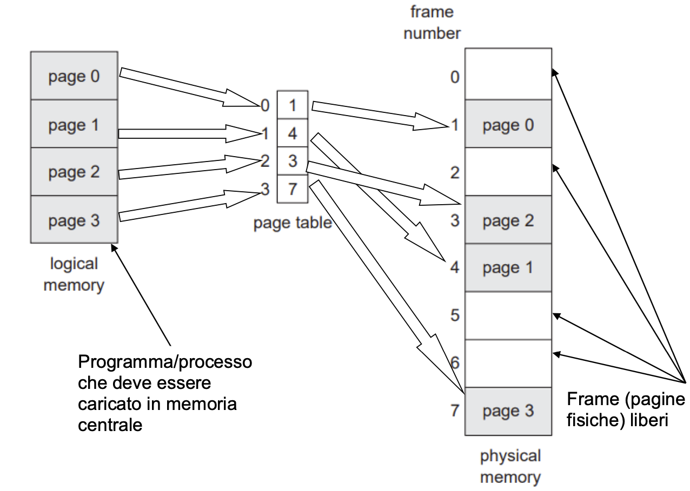
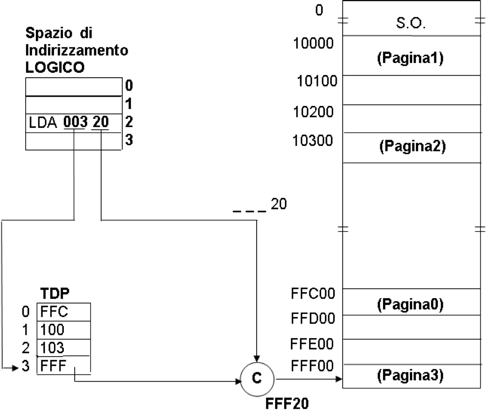
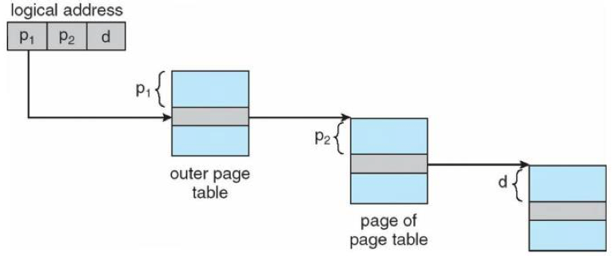
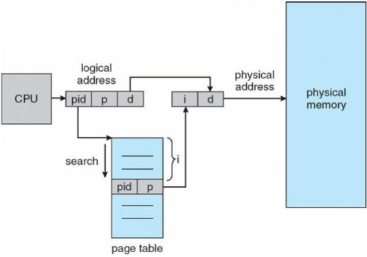

[TOC]

# Memoria

Per poter essere eseuiti i programmi devono essere caricati, almeno parzialmente, in memoria. Nella fase di **fetch** la cpu preleva le istruzioni dalla memoria in base al contenuto del registro Program Counter **PC**. Le istruzioni possono determinare ulteriori letture e scritture di dati in specifici indirizzi di memoria. Le strategie di indicizzazione della memoria sono un componente importantissimo di un sistema operativo. Abbiamo gia' visto come tramite diverse politiche di scheduling si possono ottenere aumenti di performance, in particolare attraverso la multiprogrammazione, bisogna quindi che la memoria possa ospitare piu' processi contemporaneamente per garantire tali prestazioni.

## 1. Punto di vista utente

Per quanto riguarda l'utente, colui che ha piu' contatto con la memoria e' il programmatore, questo tipo di utente ragiona in termini di variabili e codice utilizzando linguaggi di programmazione di alto livello. Tramite nomi simbolici si fa riferimento a variabili, dietro le quinte queste vengono tradotte in indirizzi **logici** o **virtuali**. Il codice sorgente, una volta compilato in formato oggetto, viene sottoposto alla fase di linking, dove vengono collegate le librerie necessarie e a questo punto viene prodotto l'eseguibile il quale viene caricato in memoria nel momento in cui vogliamo eseguirlo. Bisogna che il sistema operativo effettui un **binding**, una corrispondenza tra quelli che sono gli indirzzi fisici effettivi e quelli logici che usa il programmatore. Questo binding avviene in 3 modi diversi:

1. A tempo di compilazione o assemblaggio se la posizione in memoria del programma e' nota a priori allora puo' essere generato un **codice binario assoluto** in questo caso allora gli indirizzi logici coincidono con quelli fisici.

2. A tempo di caricamento, in particolare in questo caso si parla di **rilocazione statica**, il compilatore genera degli indirizzi relativi che poi vengono convertiti in indirizzi fisici dal loader (caricatore). Se si deve spostare il programma in un'area diversa di memoria allora va ricaricato.
3. A tempo di esecuzione, in qesto caso si parla di **rilocazione dinamica**, il programma viene caricato nella sua frma **rilocabile** il binding avviene quando l'eseguibile viene messo in esecuzione ed e' a carico della **MMU** (Memory Management Unit).

In entrambi i casi 2 e 3 l'eseguibile vinario si dice **rilocabile**.

Fino ad ora abbiamo preso in considerazione casistiche di linkinkg statico, ovvero in cui il linking con le librerie, che avviene subito dopo la compilazione crea un eseguibile finale con al suo interno tutto quello che serve per eseguirlo. Una funzionalita' molto importante e utile che il binding a tempo di esecuzione rende possibile e' il **linking dinamico**, ovvero l'uso di librerie dinamiche (file .dll in Windows .so in Unix) in questo caso le librerie vendgono "linkate" solo al momneto del bisogno durante l'esecuzione del programma portando i seguenti vantaggi:

- Dimensioni ridotte degli eseguibili
- Facile aggiornamento delle librerie senza dover ricompilare interamente i programmi che le utilizzano
- Ottimizzazione della memoria: se una procedura di una libreria e' utilizzata da piu processi possiamo tenerne una sola copia in memoria e renderla disponibile a tutti i processi che la richiedono.

> **Come avviene il linking dinamico?**
>
> Nel caso in cui il sistema operativo supporti il linking dinamico, piccole porzioni di codice, dette **stub**, vengono inserite dove necessario e permettono di localizzare la routine appropriata nella libreria residente in memoria. Lo stub rimpiazza se stesso con l-indirizzo della routine e la esegue. Il sistema operativo deve verificare se la routine si trova gia nello spazio di indirizzamento del processo e, in caso negativo, provvedere a renderla disponibile.

Uno degli **svantaggi** introdotti dal linking dinamico e' che gli stub potrebbere potenzialmente rimandare a codice malevolo.

## 2. Punto di vista del Sistema Operativo

Come abbiamo capito nella sezione precedente ci interessa in particolare analizzare la gestione della memoria nel caso di programmi **rilocabili** a run-time. La memoria centrale e' una delle risorse piu' importante (dopo la cpu) di un sistema, in particolare se multiprogrammato. Il gestore della memoria si occupa di:

1. Allocare la memoria fisica ai processi che ne fanno richiesta
    - Un processo per seguire **deve** avere una certa quantita' di memoria, facciamo riferimento alla memoria allocata per un processo come il suo **spazio di indirizzamento**
2. **Isolamento** degli spazi di indirizzamento proteggere lo spazio di indirizzaento di ogni processo da sconfinamenti voluti o erronei da parte di altri processi
3. Consentire la **condivisione** di aree di memoria fra processi interagenti (in ambito globale) o fra processi che utilizzano gli stessi servizi

## 3. Modalita' di gestione della memoria

Vediamo ora quali sono i diversi approcci riguardanti alla gestione della memoria:

1. Nessuna politica: Applicabile solo nel caso di programmi assoluti o rilocabili staticamente.
2. Politiche di allocazione contigua: ogni entita' di un processo occupa locazioni **contigue** dello spazio **fisico** di memoria, gli indirizzi fisici sono quindi consecutivi.
3. Politiche di allocazione non contigua: una entita' di un processo puo' essere allocata in locazioni **non contigue** dello spazio fisico di memoria.

I criteri di valutazione di cui teniamo conto quando valutiamo una politica di gestione della memoria sono i seguenti:

1. Spreco di memoria, risolvibile tramite la **frammentazione**
2. Sovraccarico temporale: complessita' computazio0nale delle operazioni di allocazione/delalocazione della memoria
3. Sovraccarico nelle operazioni di accesso alla memoria: durata delle operazioni aggiuntive in rapporto al tempo di accesso fisico

### 3.1 Politiche di allocazione contigua

Iniziamo ad analizzare le politiche di allocazione contigua, i primi esempi sono giusto cenni storici non piu utilizzati nei sistemi operativi moderni.

#### 3.1.1 Monitor Monoprocesso

Abbiamo gia visto questa politica in precedenza, e' la politica che veniva utilizzata in MS-DOS, sistema operativo monoprogrammato. La memoria veniva suddivisa in 2 aree contigue, la prima era adibita alla porzione del sistema operativo denominata **monitor** ovvero quella parte che doveva rimanere sempre in esecuzione, mentre il resto della memoria era allocato per i processi (del sistema operativo e non). La gestione di questa memoria avveniva in maniera molto semplice: il sistema operativo teneva traccia della prima e ultima locazione disponibile per allocare i processi, la parte di monitor veniva allocata alla testa o coda (parte alta o bassa) della memoria in base alle configurazioni degli interrupt hardware, che in genere facevano parte del sistema operativo. Altre parti del S.O. in particolare il loader e l'interprete dei comandi venivano allocati all'estremo opposto e sovrascritti se necessario. Un grosso problema di questo tipo di politica e' la **protezione del monitor** da accessi indesiderati, risolta tramite uno dei seguenti modi:

1. Impostare la porzione del monitor in **sola lettura**: questo metodo non era particolarmente utilizzato perche' cosi' facendo non si puo' aggiornare il S.O.
1. Utilizzo di appositi **registro barriera** (fence register): ogni indirizzo generato dal programma in esecuzione viene comparato con il valore del fence register, se tale indirizzo risulta maggiore (al di fuori dello spazio di memoria riservato al monitor) allora l'accesso viene permesso, altrimenti no.
1. Associazione di un **bit di protezione** ad ogni locazione di memoria, settando a 1 quelli non accessibili (zona del monitor) e a 0 quelli accessibili.

Le soluzioni 2 e 3 hanno senso solo nel caso in cui il sistema operativo possa fare la distinzione tra le modalita' di funzionamento **utente** e **supervisore**.

#### 3.1.2 Partizionamento statico della memoria

Approccio molto simile al precedente con la differenza che questo viene applicato a sistemi **multiprocesso**, in sostanza quello che prima era un grande blocco unico di memoria adibito al processo in esecuzione sul sistema viene frammentato per poterne ospitare molteplici. Il partizionamento e' **statico**, avviene al momento di caricamento del sistema operativo, e suddivide la memoria in un **numero fisso** di partizioni dalla **dimensione fissata**. In base al grado di multiprgrammazione, alla dimensione della memoria fisica e alla dimensioni tipiche dei processi, si decide che tipo di suddivizione applicare. Esiste una **tabella delle partizioni** dove il gestore della memoria tiene traccia dello stato delle partizioni, della loro dimensione e del loro indirizzo di partenza. **Per la creazione di un processo** e' necessario trovare una partizione libera che ha dimensione sufficiente per contenere il codice e i dati del programma, nel descrittore del progetto includeremo dunque anche la partizione di memoria che gli e' stata assegnata. A questo punto per effettuare il **binding** tra gli indirizzi logci e quelli fisici basta che il **registro base** detto anche di rilocazione venga caricato con il valore contenuto nel descrittore del processo, ovvero l'indirizzo di partenza della zona di memoria in cui si trova il programma. La Memory Management Unit a questo punto non fara' altro che calcolare gli indirizzi fisici come la somma del valore nel registro base piu' l'indirizzo logico. Quando un processo termina invece, bisogna liberare la memoria, il sistema operativo cambiera quindi lo stato di quella partizione da allocata a libera. I **problemi** di questa politica sono i seguenti:

1. Strategia di allocazione delle partizioni: bisogna stabilire una strategia nel caso in cui ci fossero piu partizioni libere che soddisfano i requisiti del nostro processo per decidere quale allocare.
    1. Metodo **first-fit**: scelgo la prima partizione libera che soddisfa i requisiti, questa opzione e' piu veloce.
    2. Metodo **best-fit**: scelgo la piu' piccola disponibile, questa opzione spreca meno memoria e causa una **minore frammentazione**.
2. Strategia in caso di non avere partizioni adatte
    1. Non c'e' nessuna partizione ne libera ne occupata che puo' contenere il processo, questo caso puo' essere gestito come:
        1. **Errore progettuale**, serve ridefinire le partizioni.
        2. Tramite l'uso di tecniche di **overlay**: si sovrappongono nella stessa partizione parti dello stesso programma assoluto.
    2. Non c'e' nessuna partizione libera
    3. Non c'e' nessuna partizione libera che puo' contenere il processo

    I casi ii e iii, invece, possono essere gestiti nei seguenti modi:
      1. **Aspettare** che si liberi una partizione adeguata, **N.B.** si puo interferire con le scelte fatte dallo scheduler
      2. Costringere un processo a lasciare libera una partizione adeguata: lo **swapping**.

##### Swapping

Lo **swapping out** consiste nella **rimozione dalla memoria** di processi (di solito sospesi) per essere messi nel backing store (partizione disco ad accesso rapido), dal quale in seguito vengono portati nuovamente in memoria per proseguire l'esecuzione **swapping in**. Questa operazione permette di avere uno spazio logico della memoria che risulta superiore a quello fisico. Possiamo quindi fare le seguenti considerazioni riguardo allo swapping:

- La maggior prte del tempo di swap e' dovuta al trasferimento di dati (swap in/out). Queste operazioni risultano **lente** in quanto accedono alla memoria secondaria; bisogna valutare se l'utilizzo di queste tecniche e' conveniente o meno.
- Il S.O. mantiene una coda dei processi che sono stati spostati nel backing store.
- Lo swapping e' utilizzato in molti S.O. attuali.
- Non tutti i processi possono essere swappati, i processi critici ad esempio non sono swappabili. Il S.O. deve essere quindi in grado di marcare alcuni processi come non swappabili. Per far si che lo swapping risulti utile bisogna che il numero di processi "fissati" in memoria sia limitato e che tali processi possano essere allocati solo da utenti privilegiati e non da chiunque abbia accesso al sistema.
- La **associazione** fra processo swapped out e partizione puo essere di due tipi:
  1. **statica**: il processo deve ornare alla partizione di residenza precedente allo swap, questo e' necessario nel caso in cui il codice sia assoluto o rilocabile solo staticamente.
  2. **dinamica**: il processo puo essere rilocato in una qualunque partizione, questo e' possibile se il codice e' rilocabile dinamicamente, e' sufficiente modificare il valore del registro base.
- Potrebbero esserci problemi nel caso in cui ci siano delle operazioni di I/O pendenti, in questi casi possiamo scegliere di non usare lo swapping o di usare aree di I/O del S.O.

##### Protezione

Bisogna garantire l'isolamento degli spazi di indirizzameno dei processi:

- protezione del S.O. nei confronti degli altri processi
- protezione di ogni processo nei confronti degli altri processi, possibile solo tramite un **meccanismo hw**

Possibili soluzioni:

1. Se a livello hw oltre il registro base c'e' anche un **registro limite** il cui valore sara' posto uguale al piu' alto indirizzo **logico** utilizzato nel programma. Anche il valore di questo registro deve essere salvato nel descrittore del processo.
2. **Diritti di accesso**: Un insieme di bit associati a blocchi di memoria, questo approccio consiste nell'avere dei bit che vengono riservati per specificare il diritto di accesso delle partizioni, con il grosso limite che con un numero limitato di bit posso salvare le informazioni di un numero limitato di partizioni.

##### Condivisione

Questo concetto e' opposto a quello di protezione appena visto. Come mettiamo in condivisione tra processi le risorse nel caso del partizionamento statico?

1. Entita' condivise nel S.O.:
    - vantaggio: semplicita'
    - svantaggio: crescita del S.O. e staticita'
2. Copie multiple della entita' che deve essere condivisa
    - vantaggio: metodo diretto
    - svantaggio: costoso in termini di tempo, problemi in caso di processi swapped out e grosso spreco di memoria
3. Allocare una **partizione dedicata** e comune:
    - vantaggio: metodo intuitivo
    - svantaggio: ogni accesso viene considerato una violazione in termini di protezione (soluzione: modifica temporanea delle chiavi, insiemi separati di registri base e limite)

##### Conclusioni sul partizionamento statico

Come abbiamo visto il partizionamento statico e' un metodo **semplice**, necessita un un modesto contributo HW,  e' adatto a **ambienti statici**, il suo problema piu critico e' la **frammentazione interna**, ovvero la zona di memoria residua che si viene a creare quando un processo ha una dimensione inferiore a quella della partizione che gli viene allocata. Questo frammento che si viene a creare e' **non utilizzato** e **non utilizzabile**. Questo tipo di problematica in alcuni casi si fa molto sentire, ad esempio quando esistono processi molto grandi che non vengono eseguiti di frequente. Un altro problema di questo tipo di politiche e' che la necessita' di memoria deve essere **nota staticamente**, andando a limitare operazioni relative alla crescita dello stack. Infine e' evidente che il **numero fisso** di partizioni limita il grado di multiprogrammazione, una soluzione parziale e' quella dello swapping che pero in termini I/O e' molto costosa.

#### 3.1.3 Partizionamento Dinamico della Memoria

Vediamo ora come modificare il precedente approccio per migliorarlo, in particolare vedremo come far si che la suddivisione della memoria avvenga in base alle esigenze dei processi in **modo dinamico**. Il **partizionamento dinamico** consiste nell'avere un **numero variabile** di partizioni con **dimensioni variabili**. Questo tipo di approccio di gestione della memoria ci consente di effettuare **MVT**: Multiprogramming with Variable number of Tasks. In questo caso non si parla piu solo partizioni, con partizioni infatti ora faremo riferimento alle aree di memria allocate, mentre chiameremo il resto **memoria libera**, viceversa quando la partizione termina di essere utilizzata viene liberata e torna ad essere libera. Il gestore della memoria a questo punto deve mantenere una **tabella di descrizione delle partizioni** come in precedenza ma con la differenza che anziche' tenere traccia di tutte le zone di memoria terra' traccia solo delle partizioni, ovvero delle zone di memoria allocate. Le zone di memoria libere sono salvate all'interno di una apposita lista, questa **lista di aree di memoria libera** ha una struttura ben precisa, innanzitutto il puntatore alla testa di questa lista risiede nel S.O. mentre il resto dei suoi elementi risiedono in memoria centrale, proprio nelle zone libere a cui si riferiscono. Ogni elemento di questa lista contiene un puntatore al prossimo elemento (linked list, puo' essere anche double linked), e informazioni riguardo alla dimensione dell'area libera a cui fanno riferimento.

> Esempio
>
> Supponiamo di avere la seguente suddivisione della memoria:
>
>     0     100   400  500  750  900   1000
>     [ S.O. | ... | Pi | Pj | Pk | ... ]
> Come possiamo vedere abbiamo il S.O. negli indirizzi da 0 a 100, poi libero da 100 a 400, 3 processi contigui Pi, Pj, Pk e infine di nuovo una zona non allocata da 900 a 1000. Come detto in precedenza il puntatore alla testa della lista si trova nel S.O. e punta in questo caso all'indirizzo 100, qua troveremo una semplice struttura dati, ad esempio una `struct`, che contiene un intero e un puntatore: `[900, 300]` l'intero ci indica la dimensione della zona libera ovvero 300 indirizzi, mentre il puntatore punta il successivo elemento della lista, che e' anche la successiva area libera di memoria ovvero 900. All'indirizzo 900 troveremo la seguente struttura dati: `[-, 100]` perche' la zona non allocata e' di spazia per 100 indirizzi ed e' l'ultima della lista quindi ha il puntatore settato a `NULL`.

##### Creazione di un processo

Vediamo ora come avviene l'allocazione di memoria nel caso della creazione di un processo. Supponiamo che il processo richieda 120KB, il gestore della memoria va a cercare all'interno della tabella di descrizione delle partizioni una partizione libera sufficientemente grande per accogliere il processo, quando trova tale partizione alloca il processo e effettua le opportune modifiche alla lista di aree di memoria libera ridimensionando la partizione che ora e' occupata dal nuovo processo. Facendo riferimento all'esempio di prima, se questo nuovo processo fosse stato allocato all'indirizzo 100 allora la struct a quell'indirizzo sarebbe stata cambiata a `[900, 180]`. Vediamo nello specifico l'**algoritmo di allocazione** della nuova partizione:

1. Si cerca nella lista delle aree libere un'area con dimensione superiore o uguale a quella richiesta dal processo. Se non esiste si puo':
    - aspettare che si liberi
    -  constringere un processo a lasciare libera un'area adeguata &rarr; **swapping**
2. Una volta trovata la partizione si effettua la differenza tra la dimensione richiesta e quella trovata, in base al confronto di questa differenza con una costante c:
    - `diff <= k`: si alloca tutta la partizione
    - `diff > c`: si crea una partizione e il resto rimane memoria libera

    **Strategia per la costante c**:
      - Valore minimo: dipende dalle dimensioni delle informazioni da mantenere per la lista, lo spazio restante deve essere abbastanza per contenere la `struct` di cui si parlava prima.
      - Valore massimo: dipende da scelte di prgetto, determina una minima frammentazione interna la cui entita' puo' essere trascurata.
3. In una riga libera della tabella si memorizzano i dati della nuova partizione
4. Nel descrittore di processo si registra il numero di riga della tabella

###### Strategia di selezione dell'area libera

1. Metodo first-fit, o la suavariante next-fit, sono i metodi piu popolari:
    - first-fit: si sceglie la prima area libera che soddisfa i requisiti
    - next-fit: si memorzza il puntature all'area libera dopo una allocazione e la prossima ricerca parte da li'
2. Metodo best-fit: si sceglie la area libera piu' piccola che soddisfa i requisiti, piu' lento ma spreca meno memoria, crea una minore frammentazion esterna
2. Metodo worst-fit: si sceglie la area libera piu' grande che soddisfa i requisiti, tenta di non creare piccole aree per rdurre lo spreco di memoria

###### Algoritmo di deallocazione

Vediamo ora cosa avviene nel momento in cui il gestore della memoria deve liberare una partizione:

1. Nel descrittore del processo bisogna individuare il numero di riga della tabella e si marca come deallocata
2. Si restituisce la partizione alla lista delle aree libere **unificandola** se possibile con aree libere adiacenti
    - Essendo la lista ordinata per indirizzi questa operazione risulta piuttosto semplice, infatti basta cambiare all'interno della struct la dimensione della nuova partizione liberata. Se la lista e' doppiamente linkata questo algoritmo diventa molto piu immediato.
3. Si cancella la riga della tabella corrispondente alla partizione deallocata

##### Frammentazione Esterna

La frammentazione esterna e' un termina con il quale si indica quelle aree di memoria libere che si vengono a creare tra le partizioni. Allocando e deallocando la memoria queste aree che si vengono a creare possono diventare talmente piccole e **frammetate** da non essere sufficienti a soddisfare richieste di allocazione, anche se globalmente lo spazio in memoria c'e'. La frammentazione viene ridotta quando una partizione liberata puo' essere inlobata in un area libera adiacente, detto cio' non sempre e' possibile deallocare aree di memoria vicine quindi man mano che il tempo passa e la memoria viene allocata e deallocata la frammentazione aumenta sempre di piu'. Una possibile **soluzione** e' la **compattazione**, ovvero compattare tutte le piccole aree frammentate in un'unica area. Il **problema** di questa soluzione chiaramente e' che bisogna sospendere tutti i processi coinvolti per rilocarli in modo dinamico e una volta rilocati bisogna aggiornare la lista delle aree libere e la tabella delle partizioni. La compattazione puo' essere fatta appena possibile, ad esempio ogni volta che si libera una partizione, oppure solo quando e' indispensabile, ad esempio quando non si riesce ad allocare spazio per un processo.

> Nota Bene
>
> Non tutti i processi possono essere rilocati in modo dinamico, ad esempio i processi con I/O pendenti non possono essserre spostati; se il gestore della memoria non vuole essere vincolato a questo aspetto, si deve garantre che l'I/O avvenga solo nello spazio kernel (approfondiremo questo argomento in seguito).

Vediamo ora quali sono i 2 metodi principali che possiamo applicare quando andiamo ad effettuare la compattazione:

1. Compattazione incrementale e selettiva: si va ad applicare il **minimo** numero di spostamenti che soddisfano i nostri requisiti, ovvero una area di memoria contigua di dimensione d.
2. Compattazione globale: si spostano tutti i processi da un lato della memoria, ad esempio quello iniziale, creando un'unica grande area contigua libera.

##### Osservazioni e Conclusioni sul partizionamento dinamico

1. La **traduzione** da indirizzo **logico** a **fisico** viene ottenuta analogamente al partizionamento statico (uso del registro base o registro di rilocazione)
1. Le problematiche di **protezione** e di **condivisione** sono anaogheal caso di partizionamento statico e quindi anche le soluzioni (per protezione uso del registro limite).
1. Richiede lo stesso hw del caso statico
1. Metodo adatto ad ambienti dinamici
1. Non esiste piu' (o e' molto limitato) il problema della **frammentazione interna**
1. Tutta la memoria libera puo' essere allocata ad un processo
1. Un processo potrebbe avere dinamicamente bisogno di piu' memoria rispetto a quella allocata inizialmente, **soluzioni**:
    1. Si fissa la costante **c** in modo che al processo biene allocata piu' memoria di quella strettamente necessaria all'inizio &rarr; la frammentazione interna potrebbe pero' non essere piu' trascurabile se poi quella memoria il processo non la usa
    2. Si interviene solo quando necessario:
      - Se il processo e' allocato vicino ad un'area libera &rarr; si ingloba tale area libera adiacente
      - Il processo viene spostato a run-time in un'area di memoria libera piu' grande
1. Richiede una **gestione piu' complessa**
1. Il problema piu'critico e' la **frammentazione esterna**, risolvibile tramite la **compattazione**
1. Metodo misto: partizionamento statico e dinamico &rarr; statico per allocare parti del sistema che risultano critiche; dinamico per allocarei processi utente.

#### 3.1.4 Segmentazione

Questo metodo e' una via di mezzo tra politica di allocazione contigua e quella non. **Dal punto di vista del S.O.** la frammentazione esterna (problema critico del partizionamento dinamico) si puo' ridurre se si riducono le **dimensioni** delle zone da allocare. Se allochiamo zone piccole allo stesso tempo lasciamo libere zone piu grandi ed e' quindi difficile imbattersi nel caso in cui non ci sia una partizione libera sufficientemente grande. La soluzione consiste quindi nel suddividere i programmi in parti: **segmentare** i processi, da qui il nome **segmentazione**. **Dal punto di vista esterno** la segmentazione e' uno schema di gestione della memoria che asseconda la visione utente. L'utente generalmente non pensa alla memoria come ad un array lineare di byte &rarr; Un programma e' una collezione di segmenti, ogni **segmento** e' un'unita' logica cioe' una raccolta di entita' che sono **logicamente correlate**. Il compilatore crea un **segmento** separato (con dimensioni diverse) per ogni componente el programma, ad esempio: un segmnto per il **codice** uno per i **dat** e uno per lo **stack**. Ogni **segmento** viene allocato in modo **contiguo**, un programma nel suo complesso non ha tutte le sue entita' allocate in modo contiguo. Per questo motivo la segmentazione e' una **via di mezzo** tra allocazione contigua e non contigua.

All'interno del singolo segmento gli indirizzi **partono da zero**, all'interno di un programma ogni entita' viene identificata dalla coppia `[segmento, offset]`. Al momento del caricamento di un programma segmentato **bisogna** allocare ogni segmento &rarr; si procede in  modo analogo al caso di partizionamento dinamico &rarr; bisogna trovare una zona di memoria libera di dimensione sufficiente ad allocare ogni singolo segmento (lista delle aree libere e metodi first-fit, next-fit, best-fit o worst-fit). Per ogni segmento si ha un **descrittore di segmento** in cui si memorizza l'indirizzo fisico iniziale (indirizzo base) e la dimensione del segmento &rarr; **tabella dei descrittori di segmento** (**TDS**) con l'accortezza che **deve** esserci una TDS per ogni processo attivo nel S.O. Questa tabella dei segmenti e' fondamentalmente un vettore di coppie di registri Base e Limite &rarr; La dimensione di ogni segmento serve per controllare che i riferimenti siano tutti all'interno del segmento specificato (no accessi out of range).

##### Osservazioni

1. Dal punto di vista del S.O. la **segmentazione** e' simile alla agestione della memoria partizionata dinamicamente &rarr; la differanza e'che l'unita' di allocazione e' il segmento e che abbiamo piu' coppie basi e limiti (una per ogni segmento).
2. Le TDS devono essere modificateo gni volta che c'e' uno swap o una rilocazione per esigenze di compattazione.
3. La dimensione di ogni TDS dipende dalle dimensioni dello spazio logico di un processo.

##### Realizzazione della TDS

- mantenere la TDS sui registri della cpu ha alcuni svantaggi:
  - bisogna limitare la dimensione della TDS
  - overhead al momento del process switching
- Se le TDS hanno grosse dimensioni, allora no possono essere memorizzate nei registri macchina, ma devono essere allocate in memoria; in questo caso, le TDS fanno parte di un **segmento di memoria speciale** &rarr; quindi c'e' bisogno di un registro hw che punta alla base della TDS del processo corrente detto **registro base della TDS**. Dato che le dimensioni di una TDS possono variare, si deve usare un altro registro hw dedicato detto **registro limite** della tds. N.B. I valori dei registri appena menzionati **devono** essere salvati nel **descrittore del processo**.

A questo punto sorge un **problema**: nel secondo caso infatti, un accesso ad un dato **implica** due accessi in memoria: per accedere alle informazioni della TDS e poi per accedere alla locazione fisica effettiva. Questo causa un **overhead** nella **traduzione** degli indirizzi da logici a fisici, che **non e'** accettabile. Per porre rimedio a questo problema possimo ricorre a 2 soluzioni:
1. Una **cache** (TLB) su cui caricare le sole informazioni sui segmenti usati piu' recentemente (approfondiremo questo discorso con la memoria virtuale)
2. **Registri particolari** detti registri **di segmento** su ui caricare le informazioni sui segmenti utilizzati **piu' di frequente**.

##### Protezione

Fra processi **diversi** &rarr; analoga al caso di partizionamento dinamico: uso dell'indirizzo base e della dimensione del segmento. Inoltre, e' possibile avere un livello di protezione anche all'interno dello stesso processo. Un ulteriore strato di protezione puo' essere aggiunto tramite la tipizzazione dei segmenti di codice, dati e stack e tramite i **diritti di accesso** per ogni tipo di segmento:

- Per segmenti di tipo dtack sia lttura che scrittura
- Per segmenti di tipo codice solo esecuzione o lettura
- Per segmenti di tipo dati o solo lettura o solo scrittura oppure entrambe

In questo modo possiamo prevenire errori dovuti a tentativi di esecuzione di dati e crescit eccessiva dello stack con conseguente sconfinamento in aree codice o dati adiaceni. Le informazioni dui diritti di accessi vengono stabilite tramite degli apposti bit e inseriti nel descrittore di segmento.

##### Pro e Contro

Vediamo ora vantaggi e svantaggi della segmentazione partendo dai primi:

- Flessibilita'
- Facilita' di condivisione
- Condivisione:
  - Le informazioni da condividere sono inserite in **segmenti** dedicati e separati.
  - Ogni processo che deve accedervi avra' nella propria TDS un **descrittore per quel segmento**, possibilmente avendo anche accessi diversi

Gli svantaggi della segmentazione si presentano principalmente nel caso dello swap: il S.O. deve accorgersi se un segmento condiviso da un processo swapped in e' gia in memoria. Infine rimane ancora il discorso della **frammentazione esterna** anche se ridotta rispetto al partizionamento dinamico. Vedremo ora come risolvere queste problematiche tramite le politiche di allocazione **non contigua**.

### 3.2 Politiche di allocazione non contigua

Le entita' di un processo possono essere allocate in **locazioni non contigue** dello spazio fisico di memoria &rarr; approccio opposto rispetto a quello delle politiche di allocazione contigua.

### 3.2.1 Paginazione

La paginazione e' uno dei concetti base delle politiche di allocazione non contigua. La **memoria fisica** viene **suddivisa** in un certo numero di **blocchi** di dimensione fissa chiamati **pagine fisiche** detti anche frame, la cui dimensione e' una potenza di 2. Lo spazio fisico diventa quindi un insieme di pagine di dimensione fissata. Anche lo **spazio logico** di ogni processo vene suddiviso in blocchi di dimensioni fissa detti anche **pagine logiche**. Le pagine fisiche e quelle logiche hanno la **stessa dimensione**. A questo punto bisogna tenere traccia di tutti i frame liberi &rarr; l'allocazione di un processo consiste nel trovare un numero di pagine fisiche libere pari al numero di pagine logiche di cui necessita. Le pagine fisice che servono per allocare un processo possono essere **non fisicamente contigue**. Si h solo frammentazione interna (relativa all'ultimo frame) &rarr; mediamente il 50% dell'ultima pagina fisica allocata! Il sistema di traduzione ell'indirizzo si basa su una **tabella delle pagine** (TDP) **per ogni processo**. Vediamo un esempio di questa tecnica: supponiamo di avere un processo di dimensione parti a 4 pagine logiche (numerate da 0).

Una **TDP** ha tante righe quante sono le pagine logiche: il contenuto di ogni riga e' il numero della pagina fisica (frame) dove e' stata allocata la corrispondente pagina logica. Ogni indirizzo logico generato dalla cpu e' suddiviso automaticamente in un **numero di pagina** `p` e un **offset** `o` all'interno della pagina. p serve da indice nella page table per trovare il numero del frame contenente la pagina logica. Vediamo ora come avviene la traduzione, effettuata dalla MMU, da indirizzo **logico** a indirizzo **fisico**. Consderiamo un sistema che usa indirizzi logci e fisici di 20 bit, con pagine da 256 byte (quindi un offset di 8 bit) e infine 12 bit per il numero di pagina.

La numerazione nell'immagine e' esadecimale, vediamo come a partire dalla coppia di valori `<p, o>` numero pagina, offset pari a `<003, 20>` si passa attraverso la TDP per recuperare l'indirizzo fisico della pagina `FFF` e quindi vi si aggiunge l'offset per arrivare all'indirizzo fisico `FFF20`. Dato che la dimensione della pagina fisica e di quella logica coincidono, il volore dell'offset **rimane invariato** nel passaggio da fisico a logico. Quindi il contenuto della **TDP** sono i 12 bit piu' significativi dell'indirizzo fisico a cui comincia la pagina &rarr; se il numero di fagina fisica e' (in hex) `XXX` allora il suo indirizzo iniziale sara' `XXX00`.

#### Prime Osservazioni

1. Per semplificare la traduzione, la dimensione delle pagine e' sempre una potenza intera di 2. Inizialmente el **dimensioni tipiche** dei sistemi commerciali variavano da 256 byte a 4 KB, attualmente e' compresa fra 512 byte e 1GB ma i valori piu' tipici sono compresi tra 8KB-4KB
2. Il S.O. puo' tenere traccia delle pagine libere e allocate tramite una **tabella della memoria** (TDM). Questa tabella avra' tante righe quante pagine, quindi $\frac{dim_{fisica}}{dim_{pagina}}$.
3. Ogni volta che deve ssere allocato un processo di dimensione $dim_{processo}$ **bisogna** allocargli un numero di pagine libere pari a $\frac{dim_{processo}}{dim_{pagina}}$. Il S.O. alloca sempre un **numero intero** di pagine ad un processo. Se la $dim_{processo}$ non e' un multiplo esatto ella dimensione dellapagina allora l'ultima pagina fisica risultera' utilizzata solo parzialmente &rarr; **frammentazione  della pagina**
4. Non esiste la necessita' di particolari strategie per trovare il numero sufficiente di pagine libere per un singolo processo dato che qualunque insieme di pagine va bene:
    - Non e' necessario che siano contigue
    - Non ci sono problemi di dimensioni in quanto hanno tutte la stessa dimensione (uguale a quella delle pagine logiche)
    - Non ha senso prendere in considerazione politiche first-fit o best-fit

#### Allocazione Delle Pagine

L'efficienza di una strategia a pagine dipende dalla velocita' con cui si riescono ad individuare le pagine fisiche libere. Se utilizziamo la tabella della memoria vista prima e se supponiamo di avere una distribuzione casuale delle pagine libere, il numero medio `x` di righe della TDM che e' necessario esaminare per trovare `n` pagine libere e' $x=\frac{n}{q}$ dove `q` e' la probabilita' che una certa pagina fisica sia libera, cioe' $q=\frac{u}{100}$ dove `u` e' la percentuale di memoria non utilizzata; quindi, `x` e' proporzionale a `n` secondo un fattore $k=\frac{1}{q}\geq 1$. In conclusione, il numero di righe `x` della TDM da anlizzare cresce al crescere della meoria utilizzata (a parita' di richiesta, cioe' di n). In alternativa alla TDM possiamo collegare i numeri dele pagine fisiche libere in una **lista**. Ogni volta che abbiamo bisogno di `n` pagine, togliamo dalla lista i primi `n` numeri.

#### Deallocazione Delle Pagine

Con la TDM, bisognamarcare come libere le `n` pagine che un processo libera, con la lista invece inseriamo all'inizio i numeri elle `n` pagine liberate. **In entrambi i casi**,  il tempo che si impiega e' proporzionale ad `n`

#### Ulteriori Osservazioni

- La gesione conla lista delle pagine libere presenta un **vantaggio** al momento della allocazione nei confronti della TDM &rarr; **non dipende** dal grado di utilizzo della memoria
- La gestione con la lista delle pagine livere presenta pero' uno **svantaggio** in termini di gestione di una struttura dinamica al posto di una statica come e' la TDM &rarr; complessita' temporale e spaziale

#### Realizzazione della TDP

Mantenere la tabella delle pagine sui registri della cpu ha alcuni svantaggi: bisogna limitare la dimensione della tdp e si viene a creare un overhead al momento del process switching. Invece se le tdp hanno grosse dimnsioni bisogna allocarle in memoria, in questo caso abbiamo bisogno di un solo registro che punta alla base della tdp del processo corrente, detto **registro base** della tdp. Dato che le dimensioni di una TDP possono variare, dovrebbe esistere un altro registro hw dedicato detto **registo limite** della tdp oppure deve esistere un **bit di validita'** che indica se la pagina e' nello spazio di idirizzamento logico del processo (vedremo questo concetto meglio quando afftronteremo la memoria virtuale). **N.B.**: I valori di questi due registri **devono** essere salvati nel **descrittore del processo**.

##### TLB

A questo punto individuiamo il seguente **problema**: se salviamo in memoria le TDP allora l'accesso ad **un** dato implica **due** accessi in memoria: uno per accedere alle informazioni della TDP e uno per accedere alla locazione fisica effettiva. Questo **overhead** nella traduzione degli indirizzi da logici a fisici **non e' accettabile**. Per risolvere questo problema bisogna disporre come support hw di una **cache** delle pagine su cui caricare un **sottoinsieme** della TDP. Per questo supporto hw solitamente si impiega della **memoria associativa** ad alta velocita', detta anche **TLB** o (**Translation Look-aside Buffer**), il numero di elementi di una TLB e' di norma compreso fra 64 e 1024. Alcune TLB memorizzano un Address Space Identifier, per ciascun elemento, cosi' da identificare univocamente il processo cui appartiene la corrispondenza `<#pagina,#frame>`: l'ASID consente alla TLB di contenere, nello stesso istante elementi di diversi processi (approfondiremo questo argomento quando vedremo la memoria virtuale).

###### Gestione TLB

Inizialmete la TLB e' vuota, mentre l'esecuzione procede, viene gradualmente riempita con indirizzi di pagne gia' accedute.

> Hit-Ratio
>
> definiamo **hit-ratio** la percentuale che indica quante volte una pagina viene trovata in TLB, dipende dalla dimensione dela TLB, ad esempio per Intel 486 l'hit-ratio e' 98%.

Se il numero di pagina non e' presente nella cache delle pagne si parla di insuccesso della cache: **TLB miss**. Vediamo come si calcola il tempo di accesso effettivo (EAT), se indichiamo con &alpha; l'hit-ratio allora:

$$EAT  = (T_{mem} + T_{TLB}) \alpha + (2T_{mem} + T_{TLB})(1-\alpha)$$

Dove $T_{mem}$ e' il tempo di accesso a memoria e $T_{TLB}$ e' il tempo di accesso alla TLB. Per far si che l'uso della TLB sia conveniente e' necessario che la **probabilita'** che la pagina che serve si trovi nella cache sa molto alta. Si usano quindi **algoritmi probabilistici** per caricare nella cache le pagine che hanno la piu' alta probabilita' di servire al processo nel prossimo futuro, come ad esempio **LRU** (Last Recently Used), approfondiremo questo tipo di algoritmi quando vedremo la memoria virtuale. Nel caso della segmentazione invece, la scelta di quali segmenti caricare nella cache puo' basarsi anche sulla informazione relativa al tipo dei segmmenti cosa che non puo' avvenire nel caso della paginazione dato che la **suddivisione in pagine** viene effettuata in modo **automatico** e quindi una pagina non ha nessuna correlazione con le entita' logiche che contiene. Una singola pagina infatti puo' contenere variabili, stack, codice...

#### Protezione

La protezione degli spazi di indirizzamento di un processo dagli altri viene garantita dal meccanismo di traduzione, grazie ai due registri hw menzionati in precedenza (o al bit di validita'). La presenza di tabelle TDP potrebbe consentire **protezioni piu' granulari** &rarr; ad una pagina potrebbero essere associati dei diritti di accesso (r, w, x) questo meccanismo anche se sembra simile a quello introdotto per la segmentazione in questo caso e' **meno flessibile** dato che la suddivisione in pagine e' **completamente trasparente** al programmatore.

#### Condivisione

La **condivisione** e' immediata in un sistema a pagine, i riferimenti alle pagine che devono essere **condivise** saranno **presenti in piu' TDP**; e' il sistema che **deve** riconoscere e realizzare questa condivisione, visto che la paginazione e' completamente trasparente al programmatore.

#### Organizzazione TDP

L'occupazione di memoria dovuta alle strutture dati (TDP) necessarie per gestire la paginazione puo' divenire eccessivamente grande!

> Esempio
>
> Consideriamo uno spazio di indirizzi logici a 32 bit, con pagine di 4KB; la tabella delle pagine potrebbe essere costituita da un milione di elementi. Se ciascun elemento occupasse 4 byte potrebbe risultare fino a 4MB di occupazione di memoria per una sola tabella delle pagine! Meglio evitare di collocare la tabella delle pagine in modo contiguo in memoria centrale e ricorrere a una di queste 2 soluzioni:
> 1. Paginazione gerarchica: suddividere la paginazione su livelli
> 2. Tabella delle pagine invertita

##### Paginazione gerarchica

Vediamo come funziona la paginazione gerarchica tramite un esempio che implementa questa soluzione con 2 livelli: Un indirizzo logico, in architetture a 32 bit con dimensione della pagina di 4KB, viene suddiviso in:

- Un numero di pagina a 20 bit
- Un offset all'interno della pagina di 12 bit

Dato che la tabella delle pagine e' paginata il numero di pagina viene ulteriormente suddiviso in:

- Un numero di pagina di 10 bit (tabella esterna)
- Un offset di 10 bit (tabella delle pagine)

Pertanto un indirizzo logico sara' suddiviso in questo modo:

    [  n pagina  | offset ]
    [  p1  |  p2 |   d    ]
    [ 10b  | 10b |  12b   ]

Dove p1 sono i 10 bit che fanno da indice nella tabella delle pagine (esterna) detta anche page directory, e p2 sono i 10 bit che indicano l'offset all'interno della pagina della page table entry (interna). In questa immagine vediamo nello specifico lo schema logico di traduzione attuato dalla MMU, da indirizzo logico (generato dalla cpu) a quello fisico (senza introdurre la TLB che sara' invece essenziale).

Dato che ciascun livello viene memorizzato come una tabella separata in memoria, la traduzione di un indirizzo logico nel corrispondente indirizzo fisico puo' richiedere **tre** accessi alla memoria: anche se il tempo richiesto per un accesso alla memoria sembra triplicato, la presenza di **TLB** consente di mantenere prestazioni ragionevoli. In pratica, solo alcune pagine della tabella delle pagine sono memorizzate in memoria, le altre sono su disco (come vedremo nella memoria virtuale). Lo schema di paginazione a due livelli non e' piu' adeguato nel caso di sistemi con spazio di indirizzi a **64 bit** infatti: la tabella delle pagine piu' esterna avrebbe $2^{42}$ elementi, mentre quella interna delle pagine potrebbe essere costituita da $2^10$ elementi da 4 byte ciascuno. Si deve quindi optare per una soluzione a piu' livelli di paginazione (solitamente da 3 a 7). Chiaramente l'aggiunta di livelli aggiunge tabelle in memoria e quindi il numero di accessi in memoria cresce. In conclusione, per le architetture a 64 bit la paginazione gerarchica e' da considerarsi **inadeguata** a causa dei costi proibitivi di accesso alla memoria in caso di TLB miss. Per risolvere il problema nel caso dei 64 bit bisogna adottare la **tabella delle pagine invertita** che vedremo tra poco. Generalmente, si associa una tabella delle pagine ad ogni processo, che contiene un elemento per ogni pagina virtuale che il processo sta utilizzando, dando forma ad una rappresentazione naturale, dato che i processi si riferiscono alle pagine per mezzo di indirizzi logici ed il S.O. si occupa della traduzione in indirizzi fisici. Abbiamo quindi visto come il **problema** di questo approccio sta nel fatto che ogni tabella delle pagine puo' contenere milioni di elementi ed occupare molta memoria.

##### Tabella Delle Pagine Invertita

Questa soluzione consiste nell'utilizzare un'**unica** struttura dati globale che ha un elemento per ogni frame. Ogni elemento della tabella delle pagine invertita rappresenta un frame e, in caso di frame allocato, contiene: `[pid, p, d]` l'identificatore del processo a cui e' assegnato il frame, il numero di pagina logica del processo e l'offset all'interno della pagina. Ecco come cambia quindi lo schema di traduzione attuato dalla MMU, da indirizzo logico a fisico:

Gli svantaggi di questo approccio sono 2:

1. Risulta difficile la realizzazione della **condivisione**, dovuta alla presenza di un solo elemento indicante la pagina logica corrispondente ad ogni pagina fisica.
2. Incremento del tempo necessario per ricercare nella tabella quando si fa un riferimento a pagine &rarr; e' necessario ricercare su tutta la tabella &rarr; ricerca sequenziale &rarr; inefficiente!

Per ridurre il tempo di ricerca, da un punto di vista implemntativo, si possono impiegare tabelle hash per limitare la ricerca ad uno, o al piu' a pochi, elementi della tabella, riducendo cosi' la complessita' da O(n) a O(1). In pratica, e' necessario un meccanismo per gestire le collisioni quando diversi indirizzi logici corrispondono allo stesso frame. Ogni accesso alla tabella hash aggiunge comunque un riferimento alla memoria, per migliorare le prestazioni si usa una **TLB**.

#### Conclusioni sulla paginazione

- La paginazione e' un processo gestito **interamente dal S.O.** diversamente dalla segmentazione
- Elimina il problema della frammenttazione esterna, non servono algoritmi di compattazione
- Allocazioni e deallocazioni sono **semplici** e generano un sovraccarico modesto
- Il grado di utilizzo della memoria e' molto elevato, se la dimensione della pagina e' piccola: la dimensione della pagina piccola produce TDP troppo grandi
- Resta il problema della **frammentazione interna**, per ogni processo sull'ultima pagina allocata. Questa aumenta con l'aumentare della pagina.
- C'e' necessita' di hw dedicato molto sofisticato, abbiamo parlato ad esempio di **memoria associativa** per le TLB.

##### Differenze tra Segmentazione e Paginazione

Usando la paginazione lo spazio di indirizzamento logico e' **lineare**, cosi' come lo e' quello fisico. Il punto di vista dell'utente e' quindi **uguale** al punto di vista del S.O. (a meno della rilocazione). La paginazione e' completamente **trasparente** al programmatore &rarr; l'utente specifica un indirizzo logico che e' diviso automaticamente dall'hardware in due parti, un numero di pagina logica e offset all'interno della pagina. L'indirizzo fisico si ottiene da numero di pagina fisica combinato con l'offset. La dimensione delle pagine e' fissa e uguale per quelle logiche e quelle fisiche: in genere una potenza di 2 &rarr; non e' necessaria una politica di ricerca di pagine libere per allocare le pagine logiche. Entrambi gli approcci sono affetti dal problema della frammentazione interna. Dato che segmentazione e paginazione presentano vantaggi e svantaggi, un'idea e' quella di combinarli assieme &rarr; **segmentazione con paginazione** vedremo questa tecnica nella memoria virtuale.

