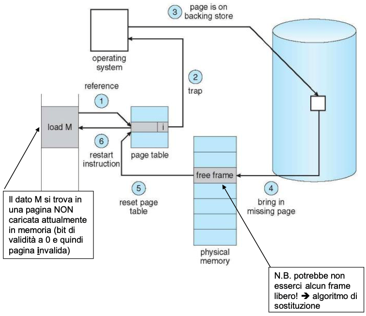

# Memoria

Per poter essere eseguiti i programmi devono essere caricati, almeno parzialmente, in memoria. Nella fase di **fetch** la cpu preleva le istruzioni dalla memoria in base al contenuto del registro Program Counter **PC**. Le istruzioni possono determinare ulteriori letture e scritture di dati in specifici indirizzi di memoria. Le strategie di indicizzazione della memoria sono un componente importantissimo di un sistema operativo. Abbiamo già visto come tramite diverse politiche di scheduling si possono ottenere aumenti di performance, in particolare attraverso la multiprogrammazione, bisogna quindi che la memoria possa ospitare più processi contemporaneamente per garantire tali prestazioni.

## 1. Punto di vista utente

Per quanto riguarda l'utente, colui che ha più contatto con la memoria è il programmatore, questo tipo di utente ragiona in termini di variabili e codice utilizzando linguaggi di programmazione di alto livello. Tramite nomi simbolici si fa riferimento a variabili, dietro le quinte queste vengono tradotte in indirizzi **logici** o **virtuali**. Il codice sorgente, una volta compilato in formato oggetto, viene sottoposto alla fase di linking, dove vengono collegate le librerie necessarie e a questo punto viene prodotto l'eseguibile il quale viene caricato in memoria nel momento in cui vogliamo eseguirlo. Bisogna che il sistema operativo effettui un **binding**, una corrispondenza tra quelli che sono gli indirizzi fisici effettivi e quelli logici che usa il programmatore. Questo binding avviene in 3 modi diversi:

1. A tempo di compilazione o assemblaggio se la posizione in memoria del programma è nota a priori allora può essere generato un **codice binario assoluto** in questo caso allora gli indirizzi logici coincidono con quelli fisici.

2. A tempo di caricamento, in particolare in questo caso si parla di **rilocazione statica**, il compilatore genera degli indirizzi relativi che poi vengono convertiti in indirizzi fisici dal loader (caricatore). Se si deve spostare il programma in un'area diversa di memoria allora va ricaricato.
3. A tempo di esecuzione, in questo caso si parla di **rilocazione dinamica**, il programma viene caricato nella sua forma **rilocabile** il binding avviene quando l'eseguibile viene messo in esecuzione ed è a carico della **MMU** (Memory Management Unit).

In entrambi i casi 2 e 3 l'eseguibile vinario si dice **rilocabile**.

Fino ad ora abbiamo preso in considerazione casistiche di linking statico, ovvero in cui il linking con le librerie, che avviene subito dopo la compilazione crea un eseguibile finale con al suo interno tutto quello che serve per eseguirlo. Una funzionalità molto importante e utile che il binding a tempo di esecuzione rende possibile è il **linking dinamico**, ovvero l'uso di librerie dinamiche (file .dll in Windows .so in Unix) in questo caso le librerie vengono "linkate" solo al momento del bisogno durante l'esecuzione del programma portando i seguenti vantaggi:

- Dimensioni ridotte degli eseguibili
- Facile aggiornamento delle librerie senza dover ricompilare interamente i programmi che le utilizzano
- Ottimizzazione della memoria: se una procedura di una libreria è utilizzata da più processi possiamo tenerne una sola copia in memoria e renderla disponibile a tutti i processi che la richiedono.

> **Come avviene il linking dinamico?**
>
> Nel caso in cui il sistema operativo supporti il linking dinamico, piccole porzioni di codice, dette **stub**, vengono inserite dove necessario e permettono di localizzare la routine appropriata nella libreria residente in memoria. Lo stub rimpiazza se stesso con l-indirizzo della routine e la esegue. Il sistema operativo deve verificare se la routine si trova già nello spazio di indirizzamento del processo e, in caso negativo, provvedere a renderla disponibile.

Uno degli **svantaggi** introdotti dal linking dinamico è che gli stub potrebbero potenzialmente rimandare a codice malevolo.

## 2. Punto di vista del Sistema Operativo

Come abbiamo capito nella sezione precedente ci interessa in particolare analizzare la gestione della memoria nel caso di programmi **rilocabili** a run-time. La memoria centrale è una delle risorse più importante (dopo la cpu) di un sistema, in particolare se multiprogrammato. Il gestore della memoria si occupa di:

1. Allocare la memoria fisica ai processi che ne fanno richiesta
    - Un processo per eseguire **deve** avere una certa quantità di memoria, facciamo riferimento alla memoria allocata per un processo come il suo **spazio di indirizzamento**
2. **Isolamento** degli spazi di indirizzamento proteggere lo spazio di indirizzamento di ogni processo da sconfinamenti voluti o erronei da parte di altri processi
3. Consentire la **condivisione** di aree di memoria fra processi interagenti (in ambito globale) o fra processi che utilizzano gli stessi servizi

## 3. Modalità di gestione della memoria

Vediamo ora quali sono i diversi approcci riguardanti la gestione della memoria:

1. Nessuna politica: Applicabile solo nel caso di programmi assoluti o rilocabili staticamente.
2. Politiche di allocazione contigua: ogni entità di un processo occupa locazioni **contigue** dello spazio **fisico** di memoria, gli indirizzi fisici sono quindi consecutivi.
3. Politiche di allocazione non contigua: una entità di un processo può essere allocata in locazioni **non contigue** dello spazio fisico di memoria.

I criteri di valutazione di cui teniamo conto quando valutiamo una politica di gestione della memoria sono i seguenti:

1. Spreco di memoria, risolvibile tramite la **frammentazione**
2. Sovraccarico temporale: complessità computazionale delle operazioni di allocazione/deallocazione della memoria
3. Sovraccarico nelle operazioni di accesso alla memoria: durata delle operazioni aggiuntive in rapporto al tempo di accesso fisico

### 3.1 Politiche di allocazione contigua

Iniziamo ad analizzare le politiche di allocazione contigua, i primi esempi sono giusto cenni storici non più utilizzati nei sistemi operativi moderni.

#### 3.1.1 Monitor Monoprocesso

Abbiamo già visto questa politica in precedenza, è la politica che veniva utilizzata in MS-DOS, sistema operativo monoprogrammato. La memoria veniva suddivisa in 2 aree contigue, la prima era adibita alla porzione del sistema operativo denominata **monitor** ovvero quella parte che doveva rimanere sempre in esecuzione, mentre il resto della memoria era allocato per i processi (del sistema operativo e non). La gestione di questa memoria avveniva in maniera molto semplice: il sistema operativo teneva traccia della prima e ultima locazione disponibile per allocare i processi, la parte di monitor veniva allocata alla testa o coda (parte alta o bassa) della memoria in base alle configurazioni degli interrupt hardware, che in genere facevano parte del sistema operativo. Altre parti del S.O. in particolare il loader e l'interprete dei comandi venivano allocati all'estremo opposto e sovrascritti se necessario. Un grosso problema di questo tipo di politica è la **protezione del monitor** da accessi indesiderati, risolta tramite uno dei seguenti modi:

1. Impostare la porzione del monitor in **sola lettura**: questo metodo non era particolarmente utilizzato perché così facendo non si può aggiornare il S.O.
1. Utilizzo di appositi **registro barriera** (fence register): ogni indirizzo generato dal programma in esecuzione viene comparato con il valore del fence register, se tale indirizzo risulta maggiore (al di fuori dello spazio di memoria riservato al monitor) allora l'accesso viene permesso, altrimenti no.
1. Associazione di un **bit di protezione** ad ogni locazione di memoria, settando a 1 quelli non accessibili (zona del monitor) e a 0 quelli accessibili.

Le soluzioni 2 e 3 hanno senso solo nel caso in cui il sistema operativo possa fare la distinzione tra le modalità di funzionamento **utente** e **supervisore**.

#### 3.1.2 Partizionamento statico della memoria

Approccio molto simile al precedente con la differenza che questo viene applicato a sistemi **multiprocesso**, in sostanza quello che prima era un grande blocco unico di memoria adibito al processo in esecuzione sul sistema viene frammentato per poterne ospitare molteplici. Il partizionamento è **statico**, avviene al momento di caricamento del sistema operativo, e suddivide la memoria in un **numero fisso** di partizioni dalla **dimensione fissata**. In base al grado di multiprogrammazione, alla dimensione della memoria fisica e alla dimensioni tipiche dei processi, si decide che tipo di suddivisione applicare. Esiste una **tabella delle partizioni** dove il gestore della memoria tiene traccia dello stato delle partizioni, della loro dimensione e del loro indirizzo di partenza. **Per la creazione di un processo** è necessario trovare una partizione libera che ha dimensione sufficiente per contenere il codice e i dati del programma, nel descrittore del processo (PCB) includeremo dunque anche la partizione di memoria che gli è stata assegnata. A questo punto per effettuare il **binding** tra gli indirizzi logici e quelli fisici basta che il **registro base** detto anche di rilocazione venga caricato con il valore contenuto nel descrittore del processo, ovvero l'indirizzo di partenza della zona di memoria in cui si trova il programma. La Memory Management Unit a questo punto non farà altro che calcolare gli indirizzi fisici come la somma del valore nel registro base più l'indirizzo logico. Quando un processo termina invece, bisogna liberare la memoria, il sistema operativo cambierà quindi lo stato di quella partizione da allocata a libera. I **problemi** di questa politica sono i seguenti:

1. Strategia di allocazione delle partizioni: bisogna stabilire una strategia nel caso in cui ci fossero più partizioni libere che soddisfano i requisiti del nostro processo per decidere quale allocare.
    1. Metodo **first-fit**: scelgo la prima partizione libera che soddisfa i requisiti, questa opzione è più veloce.
    2. Metodo **best-fit**: scelgo la più piccola disponibile, questa opzione spreca meno memoria e causa una **minore frammentazione**.
2. Strategia in caso di non avere partizioni adatte
    1. Non c'è nessuna partizione ne libera ne occupata che può contenere il processo, questo caso può essere gestito come:
        1. **Errore progettuale**, serve ridefinire le partizioni.
        2. Tramite l'uso di tecniche di **overlay**: si sovrappongono nella stessa partizione parti dello stesso programma assoluto.
    2. Non c'è nessuna partizione libera
    3. Non c'è nessuna partizione libera che può contenere il processo

    I casi ii e iii, invece, possono essere gestiti nei seguenti modi:
      1. **Aspettare** che si liberi una partizione adeguata, **N.B.** si puo interferire con le scelte fatte dallo scheduler
      2. Costringere un processo a lasciare libera una partizione adeguata: lo **swapping**.

##### Swapping

Lo **swapping out** consiste nella **rimozione dalla memoria** di processi (di solito sospesi) per essere messi nel backing store (partizione disco ad accesso rapido), dal quale in seguito vengono portati nuovamente in memoria per proseguire l'esecuzione **swapping in**. Questa operazione permette di avere uno spazio logico della memoria che risulta superiore a quello fisico. Possiamo quindi fare le seguenti considerazioni riguardo allo swapping:

- La maggior parte del tempo di swap è dovuta al trasferimento di dati (swap in/out). Queste operazioni risultano **lente** in quanto accedono alla memoria secondaria; bisogna valutare se l'utilizzo di queste tecniche è conveniente o meno.
- Il S.O. mantiene una coda dei processi che sono stati spostati nel backing store.
- Lo swapping è utilizzato in molti S.O. attuali.
- Non tutti i processi possono essere swappati, i processi critici ad esempio non sono swappabili. Il S.O. deve essere quindi in grado di marcare alcuni processi come non swappabili. Per far si che lo swapping risulti utile bisogna che il numero di processi "fissati" in memoria sia limitato e che tali processi possano essere allocati solo da utenti privilegiati e non da chiunque abbia accesso al sistema.
- La **associazione** fra processo swapped out e partizione può essere di due tipi:
  1. **statica**: il processo deve tornare alla partizione di residenza precedente allo swap, questo è necessario nel caso in cui il codice sia assoluto o rilocabile solo staticamente.
  2. **dinamica**: il processo può essere rilocato in una qualunque partizione, questo è possibile se il codice è rilocabile dinamicamente, è sufficiente modificare il valore del registro base.
- Potrebbero esserci problemi nel caso in cui ci siano delle operazioni di I/O pendenti, in questi casi possiamo scegliere di non usare lo swapping o di usare aree di I/O del S.O.

##### Protezione

Bisogna garantire l'isolamento degli spazi di indirizzamento dei processi:

- Protezione del S.O. nei confronti degli altri processi
- Protezione di ogni processo nei confronti degli altri processi, possibile solo tramite un **meccanismo hw**

Possibili soluzioni:

1. Se a livello hw oltre il registro base c'è anche un **registro limite** il cui valore sarà posto uguale al più alto indirizzo **logico** utilizzato nel programma. Anche il valore di questo registro deve essere salvato nel descrittore del processo.
2. **Diritti di accesso**: Un insieme di bit associati a blocchi di memoria, questo approccio consiste nell'avere dei bit che vengono riservati per specificare il diritto di accesso delle partizioni, con il grosso limite che con un numero limitato di bit posso salvare le informazioni di un numero limitato di partizioni.

##### Condivisione

Questo concetto è opposto a quello di protezione appena visto. Come mettiamo in condivisione tra processi le risorse nel caso del partizionamento statico?

1. Entità condivise nel S.O.:
    - vantaggio: semplicità
    - svantaggio: crescita del S.O. e staticità
2. Copie multiple della entità che deve essere condivisa
    - vantaggio: metodo diretto
    - svantaggio: costoso in termini di tempo, problemi in caso di processi swapped out e grosso spreco di memoria
3. Allocare una **partizione dedicata** e comune:
    - vantaggio: metodo intuitivo
    - svantaggio: ogni accesso viene considerato una violazione in termini di protezione (soluzione: modifica temporanea delle chiavi, insiemi separati di registri base e limite)

##### Conclusioni sul partizionamento statico

Come abbiamo visto il partizionamento statico è un metodo **semplice**, necessita un modesto contributo HW,  è adatto a **ambienti statici**, il suo problema più critico è la **frammentazione interna**, ovvero la zona di memoria residua che si viene a creare quando un processo ha una dimensione inferiore a quella della partizione che gli viene allocata. Questo frammento che si viene a creare è **non utilizzato** e **non utilizzabile**. Questo tipo di problematica in alcuni casi si fa molto sentire, ad esempio quando esistono processi molto grandi che non vengono eseguiti di frequente. Un altro problema di questo tipo di politiche è che la necessità di memoria deve essere **nota staticamente**, andando a limitare operazioni relative alla crescita dello stack. Infine è evidente che il **numero fisso** di partizioni limita il grado di multiprogrammazione, una soluzione parziale è quella dello swapping che però in termini I/O è molto costosa.

#### 3.1.3 Partizionamento Dinamico della Memoria

Vediamo ora come modificare il precedente approccio per migliorarlo, in particolare vedremo come far si che la suddivisione della memoria avvenga in base alle esigenze dei processi in **modo dinamico**. Il **partizionamento dinamico** consiste nell'avere un **numero variabile** di partizioni con **dimensioni variabili**. Questo tipo di approccio di gestione della memoria ci consente di effettuare **MVT**: Multiprogramming with Variable number of Tasks. In questo caso non si parla più solo partizioni, con partizioni infatti ora faremo riferimento alle aree di memoria allocate, mentre chiameremo il resto **memoria libera**, viceversa quando la partizione termina di essere utilizzata viene liberata e torna ad essere libera. Il gestore della memoria a questo punto deve mantenere una **tabella di descrizione delle partizioni** come in precedenza ma con la differenza che anziché tenere traccia di tutte le zone di memoria terrà traccia solo delle partizioni, ovvero delle zone di memoria allocate. Le zone di memoria libere sono salvate all'interno di una apposita lista, questa **lista di aree di memoria libera** ha una struttura ben precisa, innanzitutto il puntatore alla testa di questa lista risiede nel S.O. mentre il resto dei suoi elementi risiedono in memoria centrale, proprio nelle zone libere a cui si riferiscono. Ogni elemento di questa lista contiene un puntatore al prossimo elemento (linked list, può essere anche double linked), e informazioni riguardo alla dimensione dell'area libera a cui fanno riferimento.

> Esempio
>
> Supponiamo di avere la seguente suddivisione della memoria:
>
>     0     100   400  500  750  900   1000
>     [ S.O. | ... | Pi | Pj | Pk | ... ]
> Come possiamo vedere abbiamo il S.O. negli indirizzi da 0 a 100, poi libero da 100 a 400, 3 processi contigui Pi, Pj, Pk e infine di nuovo una zona non allocata da 900 a 1000. Come detto in precedenza il puntatore alla testa della lista si trova nel S.O. e punta in questo caso all'indirizzo 100, qua troveremo una semplice struttura dati, ad esempio una `struct`, che contiene un intero e un puntatore: `[900, 300]` l'intero ci indica la dimensione della zona libera ovvero 300 indirizzi, mentre il puntatore punta il successivo elemento della lista, che è anche la successiva area libera di memoria ovvero 900. All'indirizzo 900 troveremo la seguente struttura dati: `[-, 100]` perché la zona non allocata è si spazia per 100 indirizzi ed è l'ultima della lista quindi ha il puntatore settato a `NULL`.

##### Creazione di un processo

Vediamo ora come avviene l'allocazione di memoria nel caso della creazione di un processo. Supponiamo che il processo richieda 120KB, il gestore della memoria va a cercare all'interno della tabella di descrizione delle partizioni una partizione libera sufficientemente grande per accogliere il processo, quando trova tale partizione alloca il processo e effettua le opportune modifiche alla lista di aree di memoria libera ridimensionando la partizione che ora è occupata dal nuovo processo. Facendo riferimento all'esempio di prima, se questo nuovo processo fosse stato allocato all'indirizzo 100 allora la struct a quell'indirizzo sarebbe stata cambiata a `[900, 180]`. Vediamo nello specifico l'**algoritmo di allocazione** della nuova partizione:

1. Si cerca nella lista delle aree libere un'area con dimensione superiore o uguale a quella richiesta dal processo. Se non esiste si può:
    - aspettare che si liberi
    - costringere un processo a lasciare libera un'area adeguata &rarr; **swapping**
2. Una volta trovata la partizione si effettua la differenza tra la dimensione richiesta e quella trovata, in base al confronto di questa differenza con una costante c:
    - `diff <= k`: si alloca tutta la partizione
    - `diff > c`: si crea una partizione e il resto rimane memoria libera

    **Strategia per la costante c**:
      - Valore minimo: dipende dalle dimensioni delle informazioni da mantenere per la lista, lo spazio restante deve essere abbastanza per contenere la `struct` di cui si parlava prima.
      - Valore massimo: dipende da scelte di prgetto, determina una minima frammentazione interna la cui entità può essere trascurata.
3. In una riga libera della tabella si memorizzano i dati della nuova partizione
4. Nel descrittore di processo si registra il numero di riga della tabella

###### Strategia di selezione dell'area libera

1. Metodo first-fit, o la sua variante next-fit, sono i metodi più popolari:
    - first-fit: si sceglie la prima area libera che soddisfa i requisiti
    - next-fit: si memorizza il puntatore all'area libera dopo una allocazione e la prossima ricerca parte da lì
2. Metodo best-fit: si sceglie la area libera più piccola che soddisfa i requisiti, più lento ma spreca meno memoria, crea una minore frammentazione esterna
2. Metodo worst-fit: si sceglie la area libera più grande che soddisfa i requisiti, tenta di non creare piccole aree per ridurre lo spreco di memoria

###### Algoritmo di Deallocazione

Vediamo ora cosa avviene nel momento in cui il gestore della memoria deve liberare una partizione:

1. Nel descrittore del processo bisogna individuare il numero di riga della tabella e si marca come deallocata
2. Si restituisce la partizione alla lista delle aree libere **unificandola** se possibile con aree libere adiacenti
    - Essendo la lista ordinata per indirizzi questa operazione risulta piuttosto semplice, infatti basta cambiare all'interno della struct la dimensione della nuova partizione liberata. Se la lista è doppiamente linkata questo algoritmo diventa molto più immediato.
3. Si cancella la riga della tabella corrispondente alla partizione deallocata

##### Frammentazione Esterna

La frammentazione esterna è un termina con il quale si indica quelle aree di memoria libere che si vengono a creare tra le partizioni. Allocando e deallocando la memoria queste aree che si vengono a creare possono diventare talmente piccole e **frammentate** da non essere sufficienti a soddisfare richieste di allocazione, anche se globalmente lo spazio in memoria c'è. La frammentazione viene ridotta quando una partizione liberata può essere inglobata in un area libera adiacente, detto ciò non sempre è possibile deallocare aree di memoria vicine quindi man mano che il tempo passa e la memoria viene allocata e deallocata la frammentazione aumenta sempre di più. Una possibile **soluzione** è la **compattazione**, ovvero compattare tutte le piccole aree frammentate in un'unica area. Il **problema** di questa soluzione chiaramente è che bisogna sospendere tutti i processi coinvolti per rilocarli in modo dinamico e una volta rilocati bisogna aggiornare la lista delle aree libere e la tabella delle partizioni. La compattazione può essere fatta appena possibile, ad esempio ogni volta che si libera una partizione, oppure solo quando è indispensabile, ad esempio quando non si riesce ad allocare spazio per un processo.

> Nota Bene
>
> Non tutti i processi possono essere rilocati in modo dinamico, ad esempio i processi con I/O pendenti non possono essere spostati; se il gestore della memoria non vuole essere vincolato a questo aspetto, si deve garantire che l'I/O avvenga solo nello spazio kernel (approfondiremo questo argomento in seguito).

Vediamo ora quali sono i 2 metodi principali che possiamo applicare quando andiamo ad effettuare la compattazione:

1. Compattazione incrementale e selettiva: si va ad applicare il **minimo** numero di spostamenti che soddisfano i nostri requisiti, ovvero una area di memoria contigua di dimensione d.
2. Compattazione globale: si spostano tutti i processi da un lato della memoria, ad esempio quello iniziale, creando un'unica grande area contigua libera.


##### Osservazioni e Conclusioni sul partizionamento dinamico

1. La **traduzione** da indirizzo **logico** a **fisico** viene ottenuta analogamente al partizionamento statico (uso del registro base o registro di rilocazione)
1. Le problematiche di **protezione** e di **condivisione** sono analoghe al caso di partizionamento statico e quindi anche le soluzioni (per protezione uso del registro limite).
1. Richiede lo stesso hw del caso statico
1. Metodo adatto ad ambienti dinamici
1. Non esiste più (o è molto limitato) il problema della **frammentazione interna**
1. Tutta la memoria libera può essere allocata ad un processo
1. Un processo potrebbe avere dinamicamente bisogno di più memoria rispetto a quella allocata inizialmente, **soluzioni**:
    1. Si fissa la costante **c** in modo che al processo viene allocata più memoria di quella strettamente necessaria all'inizio &rarr; la frammentazione interna potrebbe però non essere più trascurabile se poi quella memoria il processo non la usa
    2. Si interviene solo quando necessario:
      - Se il processo è allocato vicino ad un'area libera &rarr; si ingloba tale area libera adiacente
      - Il processo viene spostato a run-time in un'area di memoria libera più grande
1. Richiede una **gestione più complessa**
1. Il problema più critico è la **frammentazione esterna**, risolvibile tramite la **compattazione**
1. Metodo misto: partizionamento statico e dinamico &rarr; statico per allocare parti del sistema che risultano critiche; dinamico per allocare processi utente.

#### 3.1.4 Segmentazione

Questo metodo è una via di mezzo tra politica di allocazione contigua e quella non. **Dal punto di vista del S.O.** la frammentazione esterna (problema critico del partizionamento dinamico) si può ridurre se si riducono le **dimensioni** delle zone da allocare. Se allochiamo zone piccole allo stesso tempo lasciamo libere zone più grandi ed è quindi difficile imbattersi nel caso in cui non ci sia una partizione libera sufficientemente grande. La soluzione consiste quindi nel suddividere i programmi in parti: **segmentare** i processi, da qui il nome **segmentazione**. **Dal punto di vista esterno** la segmentazione è uno schema di gestione della memoria che asseconda la visione utente. L'utente generalmente non pensa alla memoria come ad un array lineare di byte &rarr; Un programma è una collezione di segmenti, ogni **segmento** è un'unità logica cioè una raccolta di entità che sono **logicamente correlate**. Il compilatore crea un **segmento** separato (con dimensioni diverse) per ogni componente del programma, ad esempio: un segmento per il **codice** uno per i **dati** e uno per lo **stack**. Ogni **segmento** viene allocato in modo **contiguo**, un programma nel suo complesso non ha tutte le sue entità allocate in modo contiguo. Per questo motivo la segmentazione è una **via di mezzo** tra allocazione contigua e non contigua.

All'interno del singolo segmento gli indirizzi **partono da zero**, all'interno di un programma ogni entità viene identificata dalla coppia `[segmento, offset]`. Al momento del caricamento di un programma segmentato **bisogna** allocare ogni segmento &rarr; si procede in  modo analogo al caso di partizionamento dinamico &rarr; bisogna trovare una zona di memoria libera di dimensione sufficiente ad allocare ogni singolo segmento (lista delle aree libere e metodi first-fit, next-fit, best-fit o worst-fit). Per ogni segmento si ha un **descrittore di segmento** in cui si memorizza l'indirizzo fisico iniziale (indirizzo base) e la dimensione del segmento &rarr; **tabella dei descrittori di segmento** (**TDS**) con l'accortezza che **deve** esserci una TDS per ogni processo attivo nel S.O. Questa tabella dei segmenti è fondamentalmente un vettore di coppie di registri Base e Limite &rarr; La dimensione di ogni segmento serve per controllare che i riferimenti siano tutti all'interno del segmento specificato (no accessi out of range).

##### Osservazioni

1. Dal punto di vista del S.O. la **segmentazione** è simile alla gestione della memoria partizionata dinamicamente &rarr; la differenza è che l'unità di allocazione è il segmento e che abbiamo più coppie basi e limiti (una per ogni segmento).
2. Le TDS devono essere modificate ogni volta che c'è uno swap o una rilocazione per esigenze di compattazione.
3. La dimensione di ogni TDS dipende dalle dimensioni dello spazio logico di un processo.

##### Realizzazione della TDS

- mantenere la TDS sui registri della cpu ha alcuni svantaggi:
  - bisogna limitare la dimensione della TDS
  - overhead al momento del process switching
- Se le TDS hanno grosse dimensioni, allora non possono essere memorizzate nei registri macchina, ma devono essere allocate in memoria; in questo caso, le TDS fanno parte di un **segmento di memoria speciale** &rarr; quindi c'è bisogno di un registro hw che punta alla base della TDS del processo corrente detto **registro base della TDS**. Dato che le dimensioni di una TDS possono variare, si deve usare un altro registro hw dedicato detto **registro limite** della tds. N.B. I valori dei registri appena menzionati **devono** essere salvati nel **descrittore del processo**.

A questo punto sorge un **problema**: nel secondo caso infatti, un accesso ad un dato **implica** due accessi in memoria: per accedere alle informazioni della TDS e poi per accedere alla locazione fisica effettiva. Questo causa un **overhead** nella **traduzione** degli indirizzi da logici a fisici, che **non è** accettabile. Per porre rimedio a questo problema possiamo ricorre a 2 soluzioni:
1. Una **cache** (TLB) su cui caricare le sole informazioni sui segmenti usati più recentemente (approfondiremo questo discorso con la memoria virtuale)
2. **Registri particolari** detti registri **di segmento** su cui caricare le informazioni sui segmenti utilizzati **più di frequente**.

##### Protezione

Fra processi **diversi** &rarr; analoga al caso di partizionamento dinamico: uso dell'indirizzo base e della dimensione del segmento. Inoltre, è possibile avere un livello di protezione anche all'interno dello stesso processo. Un ulteriore strato di protezione può essere aggiunto tramite la tipizzazione dei segmenti di codice, dati e stack e tramite i **diritti di accesso** per ogni tipo di segmento:

- Per segmenti di tipo stack sia lettura che scrittura
- Per segmenti di tipo codice solo esecuzione o lettura
- Per segmenti di tipo dati o solo lettura o solo scrittura oppure entrambe

In questo modo possiamo prevenire errori dovuti a tentativi di esecuzione di dati e crescita eccessiva dello stack con conseguente sconfinamento in aree codice o dati adiacenti. Le informazioni dei diritti di accessi vengono stabilite tramite degli apposti bit e inseriti nel descrittore di segmento.

##### Pro e Contro

Vediamo ora vantaggi e svantaggi della segmentazione partendo dai primi:

- Flessibilità
- Facilità di condivisione
- Condivisione:
  - Le informazioni da condividere sono inserite in **segmenti** dedicati e separati.
  - Ogni processo che deve accedervi avrà nella propria TDS un **descrittore per quel segmento**, possibilmente avendo anche accessi diversi

Gli svantaggi della segmentazione si presentano principalmente nel caso dello swap: il S.O. deve accorgersi se un segmento condiviso da un processo swapped in è già in memoria. Infine rimane ancora il discorso della **frammentazione esterna** anche se ridotta rispetto al partizionamento dinamico. Vedremo ora come risolvere queste problematiche tramite le politiche di allocazione **non contigua**.

### 3.2 Politiche di allocazione non contigua

Le entità di un processo possono essere allocate in **locazioni non contigue** dello spazio fisico di memoria &rarr; approccio opposto rispetto a quello delle politiche di allocazione contigua.

#### 3.2.1 Paginazione

La paginazione è uno dei concetti base delle politiche di allocazione non contigua. La **memoria fisica** viene **suddivisa** in un certo numero di **blocchi** di dimensione fissa chiamati **pagine fisiche** detti anche frame, la cui dimensione è una potenza di 2. Lo spazio fisico diventa quindi un insieme di pagine di dimensione fissata. Anche lo **spazio logico** di ogni processo vene suddiviso in blocchi di dimensioni fissa detti anche **pagine logiche**. Le pagine fisiche e quelle logiche hanno la **stessa dimensione**. A questo punto bisogna tenere traccia di tutti i frame liberi &rarr; l'allocazione di un processo consiste nel trovare un numero di pagine fisiche libere pari al numero di pagine logiche di cui necessita. Le pagine fisiche che servono per allocare un processo possono essere **non fisicamente contigue**. Si ha solo frammentazione interna (relativa all'ultimo frame) &rarr; mediamente il 50% dell'ultima pagina fisica allocata! Il sistema di traduzione dell'indirizzo si basa su una **tabella delle pagine** (TDP) **per ogni processo**. Vediamo un esempio di questa tecnica: supponiamo di avere un processo di dimensione pari a 4 pagine logiche (numerate da 0).


Una **TDP** ha tante righe quante sono le pagine logiche: il contenuto di ogni riga è il numero della pagina fisica (frame) dove è stata allocata la corrispondente pagina logica. Ogni indirizzo logico generato dalla cpu è suddiviso automaticamente in un **numero di pagina** `p` e un **offset** `o` all'interno della pagina. `p` serve da indice nella page table per trovare il numero del frame contenente la pagina logica. Vediamo ora come avviene la traduzione, effettuata dalla MMU, da indirizzo **logico** a indirizzo **fisico**. Consideriamo un sistema che usa indirizzi logici e fisici di 20 bit, con pagine da 256 byte (quindi un offset di 8 bit) e infine 12 bit per il numero di pagina.


La numerazione nell'immagine è esadecimale, vediamo come a partire dalla coppia di valori `<p, o>` numero pagina, offset pari a `<003, 20>` si passa attraverso la TDP per recuperare l'indirizzo fisico della pagina `FFF` e quindi vi si aggiunge l'offset per arrivare all'indirizzo fisico `FFF20`. Dato che la dimensione della pagina fisica e di qu ella logica coincidono, il valore dell'offset **rimane invariato** nel passaggio da fisico a logico. Quindi il contenuto della **TDP** sono i 12 bit più significativi dell'indirizzo fisico a cui comincia la pagina &rarr; se il numero di pagina fisica è (in hex) `XXX` allora il suo indirizzo iniziale sarà `XXX00`.

##### Prime Osservazioni

1. Per semplificare la traduzione, la dimensione delle pagine è sempre una potenza intera di 2. Inizialmente le **dimensioni tipiche** dei sistemi commerciali variavano da 256 byte a 4 KB, attualmente è compresa fra 512 byte e 1GB ma i valori più tipici sono compresi tra 8KB-4KB
2. Il S.O. Può tenere traccia delle pagine libere e allocate tramite una **tabella della memoria** (TDM). Questa tabella avrà tante righe quante pagine, quindi $\frac{dim_{fisica}}{dim_{pagina}}$.
3. Ogni volta che deve essere allocato un processo di dimensione $dim_{processo}$ **bisogna** allocargli un numero di pagine libere pari a $\frac{dim_{processo}}{dim_{pagina}}$. Il S.O. alloca sempre un **numero intero** di pagine ad un processo. Se la $dim_{processo}$ non è un multiplo esatto ella dimensione della pagina allora l'ultima pagina fisica risulterà utilizzata solo parzialmente &rarr; **frammentazione  della pagina**
4. Non esiste la necessità di particolari strategie per trovare il numero sufficiente di pagine libere per un singolo processo dato che qualunque insieme di pagine va bene:
    - Non è necessario che siano contigue
    - Non ci sono problemi di dimensioni in quanto hanno tutte la stessa dimensione (uguale a quella delle pagine logiche)
    - Non ha senso prendere in considerazione politiche first-fit o best-fit

##### Allocazione Delle Pagine

L'efficienza di una strategia a pagine dipende dalla velocità con cui si riescono ad individuare le pagine fisiche libere. Se utilizziamo la tabella della memoria vista prima e se supponiamo di avere una distribuzione casuale delle pagine libere, il numero medio `x` di righe della TDM che è necessario esaminare per trovare `n` pagine libere è 
$$
x=\frac{n}{q}
$$
dove `q` è la probabilità che una certa pagina fisica sia libera, cioè 
$$
q=\frac{u}{100}
$$
 dove `u` è la percentuale di memoria non utilizzata; quindi, `x` è proporzionale a `n` secondo un fattore.
$$
k=\frac{1}{q}\geq 1
$$
In conclusione, il numero di righe `x` della TDM da analizzare cresce al crescere della memoria utilizzata (a parità di richiesta, cioè di n). In alternativa alla TDM possiamo collegare i numeri delle pagine fisiche libere in una **lista**. Ogni volta che abbiamo bisogno di `n` pagine, togliamo dalla lista i primi `n` numeri.

##### Deallocazione Delle Pagine

Con la TDM, bisogna marcare come libere le `n` pagine che un processo libera, con la lista invece inseriamo all'inizio i numeri delle `n` pagine liberate. **In entrambi i casi**,  il tempo che si impiega è proporzionale ad `n`

##### Ulteriori Osservazioni

- La gestione con la lista delle pagine libere presenta un **vantaggio** al momento della allocazione nei confronti della TDM &rarr; **non dipende** dal grado di utilizzo della memoria
- La gestione con la lista delle pagine libere presenta però uno **svantaggio** in termini di gestione di una struttura dinamica al posto di una statica come è la TDM &rarr; complessità temporale e spaziale

##### Realizzazione della TDP

Mantenere la tabella delle pagine sui registri della cpu ha alcuni svantaggi: bisogna limitare la dimensione della tdp e si viene a creare un overhead al momento del process switching. Invece se le tdp hanno grosse dimensioni bisogna allocarle in memoria, in questo caso abbiamo bisogno di un solo registro che punta alla base della tdp del processo corrente, detto **registro base** della tdp. Dato che le dimensioni di una TDP possono variare, dovrebbe esistere un altro registro hw dedicato detto **registro limite** della tdp oppure deve esistere un **bit di validità** che indica se la pagina è nello spazio di indirizzamento logico del processo (vedremo questo concetto meglio quando affronteremo la memoria virtuale). **N.B.**: I valori di questi due registri **devono** essere salvati nel **descrittore del processo**.

###### TLB

A questo punto individuiamo il seguente **problema**: se salviamo in memoria le TDP allora l'accesso ad **un** dato implica **due** accessi in memoria: uno per accedere alle informazioni della TDP e uno per accedere alla locazione fisica effettiva. Questo **overhead** nella traduzione degli indirizzi da logici a fisici **non è accettabile**. Per risolvere questo problema bisogna disporre come support hw di una **cache** delle pagine su cui caricare un **sottoinsieme** della TDP. Per questo supporto hw solitamente si impiega della **memoria associativa** ad alta velocità, detta anche **TLB** o (**Translation Look-aside Buffer**), il numero di elementi di una TLB è di norma compreso fra 64 e 1024. Alcune TLB memorizzano un Address Space Identifier, per ciascun elemento, così da identificare univocamente il processo cui appartiene la corrispondenza `<#pagina,#frame>`: l'ASID consente alla TLB di contenere, nello stesso istante elementi di diversi processi (approfondiremo questo argomento quando vedremo la memoria virtuale).

###### Gestione TLB

Inizialmente la TLB è vuota, mentre l'esecuzione procede, viene gradualmente riempita con indirizzi di pagine già accedute.

> Hit-Ratio
>
> definiamo **hit-ratio** la percentuale che indica quante volte una pagina viene trovata in TLB, dipende dalla dimensione della TLB, ad esempio per Intel 486 l'hit-ratio è 98%.

Se il numero di pagina non è presente nella cache delle pagine si parla di insuccesso della cache: **TLB miss**. Vediamo come si calcola il tempo di accesso effettivo (EAT), se indichiamo con &alpha; l'hit-ratio allora:

$$
EAT  = (T_{mem} + T_{TLB}) \alpha + (2T_{mem} + T_{TLB})(1-\alpha)
$$
Dove T<sub>mem</sub> è il tempo di accesso a memoria e T<sub>TLB</sub> è il tempo di accesso alla TLB. Per far si che l'uso della TLB sia conveniente è necessario che la **probabilità** che la pagina che serve si trovi nella cache sa molto alta. Si usano quindi **algoritmi probabilistici** per caricare nella cache le pagine che hanno la più alta probabilità di servire al processo nel prossimo futuro, come ad esempio **LRU** (Last Recently Used), approfondiremo questo tipo di algoritmi quando vedremo la memoria virtuale. Nel caso della segmentazione invece, la scelta di quali segmenti caricare nella cache può basarsi anche sulla informazione relativa al tipo dei segmenti cosa che non può avvenire nel caso della paginazione dato che la **suddivisione in pagine** viene effettuata in modo **automatico** e quindi una pagina non ha nessuna correlazione con le entità logiche che contiene. Una singola pagina infatti può contenere variabili, stack, codice...

##### Protezione

La protezione degli spazi di indirizzamento di un processo dagli altri viene garantita dal meccanismo di traduzione, grazie ai due registri hw menzionati in precedenza (o al bit di validità). La presenza di tabelle TDP potrebbe consentire **protezioni più granulari** &rarr; ad una pagina potrebbero essere associati dei diritti di accesso (r, w, x) questo meccanismo anche se sembra simile a quello introdotto per la segmentazione in questo caso è **meno flessibile** dato che la suddivisione in pagine è **completamente trasparente** al programmatore.

##### Condivisione

La **condivisione** è immediata in un sistema a pagine, i riferimenti alle pagine che devono essere **condivise** saranno **presenti in più TDP**; è il sistema che **deve** riconoscere e realizzare questa condivisione, visto che la paginazione è completamente trasparente al programmatore.

##### Organizzazione TDP

L'occupazione di memoria dovuta alle strutture dati (TDP) necessarie per gestire la paginazione può divenire eccessivamente grande!

> Esempio
>
> Consideriamo uno spazio di indirizzi logici a 32 bit, con pagine di 4KB; la tabella delle pagine potrebbe essere costituita da un milione di elementi. Se ciascun elemento occupasse 4 byte potrebbe risultare fino a 4MB di occupazione di memoria per una sola tabella delle pagine! Meglio evitare di collocare la tabella delle pagine in modo contiguo in memoria centrale e ricorrere a una di queste 2 soluzioni:
> 1. Paginazione gerarchica: suddividere la paginazione su livelli
> 2. Tabella delle pagine invertita

###### Paginazione gerarchica

Vediamo come funziona la paginazione gerarchica tramite un esempio che implementa questa soluzione con 2 livelli: Un indirizzo logico, in architetture a 32 bit con dimensione della pagina di 4KB, viene suddiviso in:

- Un numero di pagina a 20 bit
- Un offset all'interno della pagina di 12 bit

Dato che la tabella delle pagine è paginata il numero di pagina viene ulteriormente suddiviso in:

- Un numero di pagina di 10 bit (tabella esterna)
- Un offset di 10 bit (tabella delle pagine)

Pertanto un indirizzo logico sarà suddiviso in questo modo:

    [  n pagina  | offset ]
    [  p1  |  p2 |   d    ]
    [ 10b  | 10b |  12b   ]

Dove p1 sono i 10 bit che fanno da indice nella tabella delle pagine (esterna) detta anche page directory, e p2 sono i 10 bit che indicano l'offset all'interno della pagina della page table entry (interna). In questa immagine vediamo nello specifico lo schema logico di traduzione attuato dalla MMU, da indirizzo logico (generato dalla cpu) a quello fisico (senza introdurre la TLB che sarà invece essenziale).


Dato che ciascun livello viene memorizzato come una tabella separata in memoria, la traduzione di un indirizzo logico nel corrispondente indirizzo fisico può richiedere **tre** accessi alla memoria: anche se il tempo richiesto per un accesso alla memoria sembra triplicato, la presenza di **TLB** consente di mantenere prestazioni ragionevoli. In pratica, solo alcune pagine della tabella delle pagine sono memorizzate in memoria, le altre sono su disco (come vedremo nella memoria virtuale). Lo schema di paginazione a due livelli non è più adeguato nel caso di sistemi con spazio di indirizzi a **64 bit** infatti: la tabella delle pagine più esterna avrebbe $2^{42}$ elementi, mentre quella interna delle pagine potrebbe essere costituita da $2^10$ elementi da 4 byte ciascuno. Si deve quindi optare per una soluzione a più livelli di paginazione (solitamente da 3 a 7). Chiaramente l'aggiunta di livelli aggiunge tabelle in memoria e quindi il numero di accessi in memoria cresce. In conclusione, per le architetture a 64 bit la paginazione gerarchica è da considerarsi **inadeguata** a causa dei costi proibitivi di accesso alla memoria in caso di TLB miss. Per risolvere il problema nel caso dei 64 bit bisogna adottare la **tabella delle pagine invertita** che vedremo tra poco. Generalmente, si associa una tabella delle pagine ad ogni processo, che contiene un elemento per ogni pagina virtuale che il processo sta utilizzando, dando forma ad una rappresentazione naturale, dato che i processi si riferiscono alle pagine per mezzo di indirizzi logici ed il S.O. si occupa della traduzione in indirizzi fisici. Abbiamo quindi visto come il **problema** di questo approccio sta nel fatto che ogni tabella delle pagine può contenere milioni di elementi ed occupare molta memoria.

###### Tabella Delle Pagine Invertita

Questa soluzione consiste nell'utilizzare un'**unica** struttura dati globale che ha un elemento per ogni frame. Ogni elemento della tabella delle pagine invertita rappresenta un frame e, in caso di frame allocato, contiene: `[pid, p, d]` l'identificatore del processo a cui è assegnato il frame, il numero di pagina logica del processo e l'offset all'interno della pagina. Ecco come cambia quindi lo schema di traduzione attuato dalla MMU, da indirizzo logico a fisico:


Gli svantaggi di questo approccio sono 2:

1. Risulta difficile la realizzazione della **condivisione**, dovuta alla presenza di un solo elemento indicante la pagina logica corrispondente ad ogni pagina fisica.
2. Incremento del tempo necessario per ricercare nella tabella quando si fa un riferimento a pagine &rarr; è necessario ricercare su tutta la tabella &rarr; ricerca sequenziale &rarr; inefficiente!

Per ridurre il tempo di ricerca, da un punto di vista implementativo, si possono impiegare tabelle hash per limitare la ricerca ad uno, o al più a pochi, elementi della tabella, riducendo così la complessità da O(n) a O(1). In pratica, è necessario un meccanismo per gestire le collisioni quando diversi indirizzi logici corrispondono allo stesso frame. Ogni accesso alla tabella hash aggiunge comunque un riferimento alla memoria, per migliorare le prestazioni si usa una **TLB**.

##### Conclusioni sulla paginazione

- La paginazione è un processo gestito **interamente dal S.O.** diversamente dalla segmentazione
- Elimina il problema della frammentazione esterna, non servono algoritmi di compattazione
- Allocazioni e deallocazioni sono **semplici** e generano un sovraccarico modesto
- Il grado di utilizzo della memoria è molto elevato, se la dimensione della pagina è piccola: la dimensione della pagina piccola produce TDP troppo grandi
- Resta il problema della **frammentazione interna**, per ogni processo sull'ultima pagina allocata. Questa aumenta con l'aumentare della pagina.
- C'è necessità di hw dedicato molto sofisticato, abbiamo parlato ad esempio di **memoria associativa** per le TLB.

###### Differenze tra Segmentazione e Paginazione

Usando la paginazione lo spazio di indirizzamento logico è **lineare**, così come lo è quello fisico. Il punto di vista dell'utente è quindi **uguale** al punto di vista del S.O. (a meno della rilocazione). La paginazione è completamente **trasparente** al programmatore &rarr; l'utente specifica un indirizzo logico che è diviso automaticamente dall'hardware in due parti, un numero di pagina logica e offset all'interno della pagina. L'indirizzo fisico si ottiene da numero di pagina fisica combinato con l'offset. La dimensione delle pagine è fissa e uguale per quelle logiche e quelle fisiche: in genere una potenza di 2 &rarr; non è necessaria una politica di ricerca di pagine libere per allocare le pagine logiche. Entrambi gli approcci sono affetti dal problema della frammentazione interna. Dato che segmentazione e paginazione presentano vantaggi e svantaggi, un'idea è quella di combinarli assieme &rarr; **segmentazione con paginazione** vedremo questa tecnica nella memoria virtuale.

### 3.3 Memoria Virtuale

Abbiamo visto ripetutamente che un programma per essere eseguito ha bisogno di essere caricato in memoria, in realtà **non tutto** deve essere per forza in memoria.. Alcune parti quali porzioni di codice correlate alla gestione di errori, array liste e tabelle sovradimensionati rispetto all'utilizzo standard... Tutte queste casistiche occupano spazio **inutilmente**: non è necessario che esse vengano caricate in memoria per un corretto funzionamento del programma. Dobbiamo quindi stabilire una **classificazione ortogonale**:

1. L'intero spazio di indirizzamento logico di un processo **deve** essere in memoria perché il processo possa eseguire
2. **Non** è **necessario** che l'intero spazio di indirizzamento logico di un processo sia in memoria perché il processo possa eseguire

La **memoria virtuale** consente di eseguire **processi** che sono stati caricati **solo parzialmente** aumentando il grado di multiprogrammazione: la somma degli **spazi di indirizzamento virtuali** (o logici) di tutti i **processi attivi** in un sistema a memoria virtuale **può** superare la capacità della memoria fisica. In un **sistema a memoria virtuale** lo spazio di indirizzamento virtuale di un processo viene mantenuto in memoria secondaria (**backing store**) e vengono caricate secondo necessità sono alcune parti in memoria centrale. Chiaramente tutti i dettagli della gestione della VM (virtual memory) sono completamente **trasparenti** al programmatore. Il programmatore ha l'**illusione** di avere a disposizione una memoria fisica che è maggiore di quella effettivamente presente. Il **punto centrale** in questo tipo di gestione è che il S.O. deve sapere quali parti caricare in memoria centrale senza penalizzare l'esecuzione con lunghi tempi di attesa di caricamento da memoria secondaria. La VM può essere vista come **estensione** della paginazione e della segmentazione, quindi la traduzione da indirizzi logici a fisici può essere basata su tabella delle pagine e/o tabella dei segmenti. La **differenza** è che con la VM, alcune delle parti (pagine o segmenti) che costituiscono lo spazio di indirizzamento virtuale di un processo in esecuzione possono essere mancanti dalla memoria fisica. Nei sistemi a memoria virtuale l'hardware di traduzione (MMU) deve essere in grado di riconoscere se la parte richiesta si trova o meno in memoria reale. La parte mancante può essere una pagina o un segmento a seconda dello schema scelto. Principalmente faremo riferimento allo schema a pagine, nello specifico la **paginazione su richiesta**.

#### 3.3.1 Paginazione su Richiesta

Di solito, la VM, è realizzata mediante tecniche di **paginazione su richiesta**:

- Tutte le pagine di ogni processo risiedono in memoria secondaria
- Durante l'esecuzione alcune pagine vengono trasferite in memoria centrale all'occorrenza: **su richiesta**

##### Pager

Il pager è quella parte del S.O. che si occupa dei trasferimenti delle pagine da/verso memoria secondaria/centrale. Il pager non va confuso con lo **swapper** che si occupa di gestire i trasferimenti da/verso memoria secondaria/centrale di **interi** processi. Il pager è **lazy** cioè trasferisce in memoria centrale una pagina soltanto se ritenuta necessaria e quindi se viene acceduta.

#### 3.3.2 Gestione delle Pagine

Uno dei temi principali della VM è la gestione delle pagine, infatti è importante che le pagine che servono siano presenti in memoria in modo di non dovere andare a recuperarle sul disco; nei casi in cui la pagina non è in memoria invece, bisogna cercare di recuperarla il più velocemente possibile.

##### Riconoscere la mancanza di pagina

Una possibile strategia per riconoscere la mancanza di pagina è quella di utilizzare un **bit di presenza**, detto anche bit di validità, in ogni riga della tabella delle pagine. se vale 1 la pagina è presente in memoria, altrimenti no. Il S.O. deve mantenere una tabella interna per decidere se si tratta di un riferimento non valido e tutti gli indirizzi sul disco di dove si trovano le pagine (in particolare quelle mancanti). In teoria, alcuni programmi possono accedere a diverse pagine con una singola istruzione provocando più page fault.

##### Gestione della Eccezione di Mancanza di Pagina (Page Fault Trap)

Il processo **viene sospeso** e il controllo torna al S.O., che può tramite l'algoritmo di scheduling mandare in esecuzione un altro processo pronto. Il processo che ha subito il **page fault** rimane sospeso finché la pagina mancante non viene caricata in memoria. Quando c'è un page fault (bit di presenza = 0) il gestore della memoria deve:

1. Trovare una pagina di memoria reale libera (o liberarne una)
2. caricare la pagina mancante leggendola dalla memoria secondaria, modificando la tabella delle pagine (e caricando le informazioni anche nella TLB)
3. Settare a **pronto** il processo che era stato sospeso

Chiaramente l'hw deve essere in grado di riconoscere una interruzione durante l'esecuzione di una istruzione e, quando il processo che genera la Page Fault Trap viene interrotto il S.O. deve garantire che, una volta recuperata la pagina che serve, l'esecuzione di quel processo riprenda **esattamente** dal punto dove si era interrotto. Vediamo ora con la seguente immagine le varie fasi di gestione di un page fault:



In alcuni casi è anche possibile avviare l'esecuzione di un processo senza pagine in memoria, questa casistica si dice **paginazione su richiesta pura**. Quando il S.O. carica nel contatore di programma l'indirizzo della prima istruzione del processo, si verifica un page fault &rarr; il processo continua la propria esecuzione, provocando page fault, fino ad ottenere il caricamento in memoria di tutte le pagine "necessarie". Il punto due della precedente immagine è un evento cruciale nel funzionamento della VM, vediamo quindi più nello specifico cosa avviene quando una pagina non è presente in memoria:

1. Trap al S.O.
2. Salvataggio dei registri utente e dello stato del processo
3. Verifica che l'interruzione sia dovuta o meno ad un page fault
4. Controllo della correttezza del riferimento alla pagina e localizzazione della pagina su disco (punto 3 in figura)
5. Lettura dal disco e trasferimento (4 della figura)
  1. Attesa nella coda del dispositivo di I/O
  2. Attesa dovuta a posizionamento e latenza
  3. Trasferimento della pagina in un frame libero
6.  Durante l'attesa: allocazione della cpu ad altri processi utente
7.  Ricezione dell'interrupt da disco (I/O completato)
8. Context switch (se è stato eseguito il passo 6)
9. Verifica della provenienza dell'interruzione da disco
10. Aggiornamento della tabella delle pagine (e dei frame) per segnalare la presenza in memoria della pagina richiesta (5 della figura)
11. Attesa nella ready queue
12. Context switch per la ripresa della esecuzione sulla cpu (6 della figura)

#### 3.3.3 Strategie relative alla memoria virtuale

A livello logico (indipendentemente da paginazione o segmentazione) ci sono alcuni compiti per i quali si applicano **strategie** o politiche volte a definire **come** svolgere questi compiti in modo corretto ed efficiente:

1. Strategia di allocazione: **quanta** memoria reale (pagine o segmenti) allocare inizialmente ad ogni processo attivo? Se si usa la paginazione su richiesta pura, la risposta è chiaramente 0, ma non tutti i S.O. la usano.
2. Strategia di ricerca: **quali** parti (pagine o segmenti) caricare, e **quando** caricarle, dal disco in memoria?
3. Strategia di sostituzione (o rimpiazzamento): **quando** è necessario portare una nuova parte (pagina o segmento) in memoria centrale e non c'è spazio a sufficienza (**sovrallocazione**) **quale** parte (vittima) rimuovere per creare spazio per la nuova?
4. Strategia di posizionamento: **dove** mettere una parte (pagina o segmento) che entra in memoria centrale?

Inizieremo dai punti 2 e 4 in quanto sono quelli più intuitivi e banali.

##### Strategie di Ricerca

Quando una parte (pagina o segmento) che serve ad un processo non si trova in memoria c'è il bisogno di recuperarla. Nel momento in cui riceviamo un eccezione di page fault dobbiamo quindi andare a recuperare la pagina mancante. A seconda dello schema su cui si basa la Memoria Virtuale si ha quindi: richiesta di parti (pag o seg) e paginazione/segmentazione su richiesta. In alternativa si potrebbero pensare anche delle strategie anticipative, ma è difficile prevedere in modo accurato le necessità future di un processo.

##### Strategia di Posizionamento

Si adottano le stesse strategie di allocazione già descritte per la paginazione e la segmentazione. Nel caso di paginazione basta trovare una pagina libera; nel caso della segmentazione il discorso è più complicato: bisogna trovare una zona di memoria libera sufficientemente grande per far entrare nella memoria il segmento mancante.

##### Strategia di Sostituzione

Affrontiamo ora le strategie di sostituzione, concentrando l'attenzione sull'implementazione della VM con uno **schema a paginazione**. Quando è necessario portare una nuova pagina in memoria centrale, **ma** non c'è spazio a sufficienza si parla di **sovrallocazione** queste casistiche rappresentano un **problema** e sono un tipo di situazione **molto comune** perché, in particolare aumentando il grado di multiprogrammazione, ci sono molti processi caricati parzialmente in memoria. L'unica **soluzione** che abbiamo è **liberare** una pagina allocata, una sorta di swap out di una pagina, per fare posto a quella nuova. Il punto quindi è **quale** pagina rimuovere? Si tratta di selezionare una **vittima** che verra spostata su disco. Bisogna adottare una **politica di sostituzione**. Questo tipo di operazione richiede 2 trasferimenti da/a disco, uno per caricare la pagina mancante e uno per spostare la vittima. In genere esiste una **copia in memoria secondaria** (nel backing store) di tutte le pagine, per migliorare le performance, il backing store deve essere il più veloce possibile, è quindi meglio tenerlo separato dal file system possibilmente anche su un device dedicato ed accedervi direttamente. Analizziamo i seguenti due casi:

1. Se la pagina che viene selezionata come vittima **non** è stata **modificata** era in memoria reale, allora semplicemente possiamo sovrascriverla, non è necessario effettuare la copia nel backing store e quindi le interazioni con il disco passano da 2 a 1. Quando servirà di nuovo verrà caricata la **copia** dal backing store.
2. Se la pagina che viene selezionata come vittima è stata **modificata** mentre era in memoria allora si deve ricopiarla sul backing store, quindi 2 interazioni con il disco.

A volte è presente un meccanismo hw che tiene traccia delle modifiche alle pagine chiamato [**dirty bit**](https://www.youtube.com/embed/JwQZQygg3Lk) questa flag viene alzata ad ogni scrittura sulla pagina, questo meccanismo permette al sistema, quando in idle, di salvare su disco tutte le pagine con il dirty bit settato. Se non esiste il dirty bit allora bisogna scrivere la pagina su disco ogni volta, abbassando le prestazioni. Definiamo il tempo medio di accesso (**EAT**) come

$$
EAT = (1-p) * T_{mem} + p * (T_{page\_fault})
$$
Dove `p` è il page fault rate indicato come probabilità tra 0 e 1.

##### Politiche di Sostituzione

Questo tipo di algoritmi viene valutato eseguendoli su una particolare stringa di riferimenti a memoria (detta **reference string** o **sequenza degli accessi**) e contando il numero di page fault su tale sequenza. La sequenza è costituita solo da numeri di pagine logiche, non da indirizzi completi, perché a generare il page fault è il tentativo di trovare un certo numero di pagina fisica dove è stata caricata una certa pagina logica. Gli accessi multipli alla stessa pagina non provocano page fault, dato che una pagina viene tolta dalla memoria **solo** quando serve fare spazio, possiamo pensare che gli ulteriori accessi (dopo il primo) non provocheranno eccezioni, quindi nella sequenza non troveremo mai due numeri di pagina uguali adiacenti. I risultati ottenuti dipendono significativamente dal numero di frame a disposizione, in generale ci si aspetta che il numero di page fault cali all'aumentare del numero di frame liberi disponibili. Le politiche di sostituzione devono tendere, a parità di numero di frame a disposizione, a minimizzare il numero di page fault. In tutti gli esempi seguenti la sequenza degli accessi (reference string) che verrà considerata è la seguente:

```
7, 0, 1, 2, 0, 3, 0, 4, 2, 3, 0, 3, 2, 1, 2, 0, 1, 7, 0, 1
```

Inoltre, consideriamo, sempre in tutti gli esempi, una situazione di partenza in memoria che vede 3 pagine libere.

###### Politica di sostituzione First In First Out (FIFO)

Questa politica seleziona come **vittima** la pagina che si trova da più tempo in memoria reale. Per effettuare questa politica, il gestore della memoria deve tenere traccia dell'ordine di caricamento delle pagine in memoria in una coda fifo. Se analizziamo la situazione di esempio presentata in precedenza con 3 pagine libere e la suddetta reference string otteniamo un totale di 15 page faults.


Questa politica risulta molto semplice da implementare ed intuitiva, ha prestazioni non sempre buone dato che tende a scartare pagine indipendentemente dalla loro **frequenza di utilizzo** ma soprattutto è affetta da un problema denominato **belady**: al crescere del numero di pagine libere può crescere il numero di page fault!!! Dipende dalla sequenza di accesso.

###### Politica di sostituzione Ottima (OPT)

Dopo la scoperta della anomalia di **belady** la ricerca si è focalizzata sulla definizione di un algoritmo che prevedesse il **minore** numero di page fault. Questa politica seleziona come vittima la pagina che (nel futuro) verrà utilizzata dopo il maggior tempo possibile. Sempre considerando l'esempio iniziale con questo metodo si ottengono 9 page fault.


Il grosso **svantaggio** di questa politica è la **difficoltà di implementazione** dato che comporta avere una conoscenza futura, viene solamente usata come metro di confronto per valutare le altre politiche.

###### Politica di sostituzione Least Recently Used (LRU)

Questa politica seleziona come vittima la pagina che è stata utilizzata meno recentemente. L'algoritmo **LRU** si comporta **meglio** di quello FIFO, si considera il comportamento del programma sulla base dell'ipotesi che la pagina utilizzata meno recentemente ha **minore probabilità** di essere referenziata nel prossimo futuro. Per effettuare questa politica il gestore della memoria deve tenere traccia dell'ultimo istante di tempo in cui le pagine sono state usate. Vediamo che nell'esempio si ottengono un totale di 12 page fault.


**OPT** e **LRU** sono algoritmi "a pila" che non soffrono dell'anomalia di Belady perché se *S(n)* è l'insieme delle pagine mantenute in memoria con n frame, allora:
$$
S(n) \subseteq S(n+1)
$$
La politica LRU è usata molto spesso, il **problema** maggiore è **come** implementarla dato che bisogna avere un modo per determinare l'**ordine di accesso** alle pagine che richiede hw aggiuntivo. Ci sono principalmente due soluzioni:

1. Uso di un **contatore**: questa soluzione è la più semplice, consiste nell'aggiungere un campo **tempo** per ogni riga (pagina) della tabella delle pagine per mantenere l'indicazione dell'istante di tempo dell'ultimo accesso alla pagina e, nel momento in cui bisogni rimuoverne una, si sceglie la pagina con il valore **più piccolo** del campo tempo. Gli **svantaggi** di questo approccio sono facili da individuare: serve effettuare una ricerca lineare sulla tabella delle pagine e aggiornare il contatore **ad ogni** accesso in memoria, con la possibilità di overflow.
2. Aggiunta di uno **stack** con i numeri di pagina: ogni volta che si effettua l'accesso ad una pagina il suo numero viene inserito alla **testa** dello stack; così facendo la pagina in cima è quella usata più di recente mentre quella in **coda** è la **vittima** &rarr; Least Recently Used. Implementando questa soluzione non è necessario fare ricerche per la scelta della pagina, ma mantenere lo stack aggiornato ha un costo, soprattutto nel caso in cui non bisogni fare una semplice operazione di push o di pop ma, ad esempio, si debba riordinare gli elementi all'interno dello stack per riportarne in cima alcuni che si trovano al centro.

###### Politica di sostituzione che Approssimano **LRU**

La politica di sostituzione LRU è un algoritmo lento e, per il suo supporto completo, richiede hw non reperibile su tutte le architetture. Alcune architetture introducono un meccanismo hw detto **reference bit** che può servire ad **approssimare** la politica LRU. Si usa un **reference bit** nella tabella delle pagine per ogni riga (pagina), questo bit inizialmente è zero e viene settato **ogni volta che la pagina viene acceduta**. Vediamo quindi utilizzando questo metodo quali approssimazioni di LRU possono essere implementate:

1. **Memorizzazione Dei Reference Bit**

   Questa politica, per ogni pagina, memorizza **ad intervalli regolari** in un registro a scorrimento (tipicamente di 1 Byte) il suo reference bit. Il reference bit viene memorizzato nel bit più significativo, effettuando uno shift a destra e quindi scartando quello meno significativo. Il reference bit infine viene azzerato. Quindi, in questo Byte di **storia** abbiamo la situazione degli ultimi 8 intervalli di tempo. A questo punto, per scegliere la **vittima** basta confrontare i byte di ogni pagina, considerandoli **interi senza segno** e scegliendo la pagina a cui è associato il valore più basso. Chiaramente non si può garantire l'unicità dei valori dei byte, se ci sono più pagine con lo stesso valore possiamo decidere di eliminarle tutte oppure usare una selezione FIFO tra di esse. Infine, si può pensare di aumentare o diminuire la dimensione del registro a scorrimento riducendolo fino a zero (**reference bit**).

1. **Algoritmo di Seconda Chance: Not Recently Used (NRU)**

   Questa politica si basa sulla politica FIFO, con una variante: quando una pagina viene selezionata come **vittima** dall'algoritmo FIFO, viene verificato il suo **reference bit** se è **0** allora si conferma la selezione, se è **1** allora si dà a quella pagina una **seconda chance** e si passa a considerare la prossima pagina nell'ordinamento FIFO. Quando a una pagina è data una seconda chance, il suo **reference bit** viene **azzerato** e la pagina diviene l'ultima pagina inserita della coda FIFO &rarr; implementazione con una coda circolare detta anche **clock**. Nel caso peggiore, quando tutti i bit sono a 1, si esegue un ciclo su tutta la coda dando a ogni pagina una seconda chance &rarr; NRU **degenera** nella gestione FIFO se tutti i bit sono 0. Se una pagina è acceduta ciclicamente con frequenza sufficientemente elevata, ottiene sempre una seconda chance e non viene mai sostituita!

1. **Classi di Pagine**

   Questa politica considera oltre al **reference bit** anche il **dirty bit** e classifica ogni pagina in una delle seguenti classi:
   1. `[0,0]` Né usata recentemente né scritta &rarr; migliore pagina da sostituire
   1. `[0,1]` Non usata recentemente, ma scritta &rarr; non così buona poiché la pagina deve essere scritta su disco
   1. `[1,0]` Usata recentemente, ma non scritta &rarr; non buona poiché la pagina probabilmente verrà ancora usata
   1. `[1,1]` Usata recentemente e scritta &rarr; la peggiore, la pagina verrà ancora usata e prima di essere sostituita deve essere scritta su disco

   Quando è necessario un rimpiazzamento di pagina, viene scelta quella che è nella classe (non vuota) più bassa. Se ci sono più pagine, si può usare una politica FIFO o random per scegliere la pagina vittima. Questo algoritmo viene anche detto **seconda chance migliorato** poiché è lo stesso algoritmo di prima, ma invece ce controllare solo il reference bit controlla anche il dirty bit.

1. **Least Frequently Used (LFU)**

   Questa politica mantiene un **contatore** del numero di riferimenti che sono stati fatti ad ogni pagina, seleziona come **vittima** la pagina che ha il contatore settato al valore **minore** basandosi sull'assunzione che una pagina attivamente usata dovrebbe avere un numero di riferimenti maggiore. Un **problema** di questa politica  è che se una pagina viene usata molto frequentemente solo inizialmente il suo contatore le permette di permanere in memoria anche quando non è più necessario, una possibile **fix** è effettuare sul contatore uno shift a destra di un bit ad intervalli regolari.

1. **Most Frequently Used (MFU)**

   Questa politica è **complementare** rispetto a LFU: considera che se una pagina ha il minor valore del contatore allora è stata probabilmente appena caricata in memoria reale e quindi è ancora in uso. Le politiche **LFU** e **MFU** sono **poco usate** poiché la loro implementazione risulta onerosa e non approssimano bene la sostituzione OPT.

###### Osservazioni

1. Di solito i progettisti dei S.O. nella gestione della memoria virtuale fanno in modo di mantenere sempre un **pool di frame liberi** che vengono usati "in parallelo" all'algoritmo di sostituzione: più nello specifico quando si verifica un page fault, si seleziona un frame vittima, ma prima di trascriverlo in memoria secondaria (dirty bit = 1), si procede alla copia della pagina richiesta in un frame del pool. In questo modo il processo può essere riattivato rapidamente senza attendere la fine dell'operazione di salvataggio del frame vittima sulla memoria di massa &rarr; il frame che risulterà libero dopo lo sfratto della vittima andrà a fare parte del pool di frame liberi (senza cancellarne il contenuto). Quando si verifica un page fault, prima di accedere alla memoria di massa, si controlla se la pagina richiesta è ancora presente nel pool dei frame liberi &rarrr; soft page fault, non sono necessarie operazioni di I/O.
2. La tecnica di copiatura su scrittura, **copy-on-write** (**COW**), permette alla coppia di processi padre-figlio di condividere inizialmente le stesse pagine di memoria. Se uno dei due processi modifica una pagina condivisa, e solo in quel caso, viene creata una copia della pagina. La tecnica COW garantisce una modalità di creazione dei processi più efficiente, grazie alla copia delle sole pagine (condivise) modificate. Questa tecnica è usata nella primitiva `fork()` di Linux, dato che normalmente un processo figlio dopo essere stato creato effettua una primitiva `exec()` si pensi ad esempio ad un processo sotto-shell che deve eseguire un comando.

Fino ad ora abbiamo implicitamente supposto di attuare una sostituzione andando ad operare sui frame allocati al processo che ha provocato il page fault &rarr; **sostituzione locale** con il **vantaggio** che si tende a **localizzare** gli effetti della strategia di sostituzione sulla politica di allocazione (il numero di pagine allocate ad un processo rimane costante) e lo **svantaggio** che non vengono rese disponibili ai processi che ne facciano richiesta pagine di altri processi scarsamente utilizzate (possibile sottoutilizzo della memoria). Chiaramente la sostituzione locale non è l'unica alternativa, se un processo p subisce un page fault e c'è bisogno di un rimpiazzamento di pagina l'algoritmo potrebbe considerare per selezionare la vittima **tutte** le pagine presenti in memoria (**sostituzione globale**). Questa alternativa comporta alcuni **svantaggi**: il numero di pagine allocate ad un processo **varia** durante l'esecuzione, in questo modo si tende ad aumentare il **grado di accoppiamento** fra la strategia di sostituzione e la politica di allocazione dei vari processi &rarr; le pagine che l'algoritmo di allocazione sceglie **inizialmente** per un certo processo potrebbero essere selezionate dall'algoritmo di sostituzione, attivato per "colpa" di un altro processo. Un processo può avere **performance** molto diverse in differenti esecuzioni a causa dell'intrusione dell'algoritmo **globale**: il tempo di esecuzione di ciascun processo può variare in modo significativo, un processo non può controllare la propria frequenza di page fault. I **vantaggi** della sostituzione comportano un **maggior throughput**.

##### Strategia di Allocazione

Vediamo ora nello specifico quanta memoria reale serve allocare ad ogni processo attivo. Dal punto di vista del singolo processo, **maggiore** è la memoria allocata **minore** sarà il numero di page fault. Chiaramente non possiamo esagerare in questo perché se no allocando troppa memoria per ogni processo, andremmo a diminuire troppo il grado di multiprogrammazione. Dal punto di vista del sistema **minore** è la memoria allocata e **maggiore** sarà il grado di multiprogrammazione, con lo svantaggio complementare a prima che allocando troppa poca memoria per processo si rischia di incappare in troppi page fault. Si può impostare un **limite minimo** sul numero di pagine che devono essere allocate ad ogni processo, questo numero viene fissato in base all'architettura secondo il numero massimo di pagine che ogni singola istruzione può referenziare, solitamente tra le 3 e le 17. Alcuni S.O. applicano la **paginazione su richiesta pura** cioè senza avere caricato nessuna delle pagine logiche in memoria e quindi senza effettuare **pre-paging**. Un altro concetto fondamentale di cui tener conto quando si parla di strategie di allocazione è come viene gestito il **limite massimo** di memoria per ogni processo.

###### Politica di Allocazione Uguale

Questa semplice politica consiste nell'allocare un numero uguale di pagine a tutti i processi, una vera e propria **assegnazione uniforme** dividendo il numero di pagine disponibile per il numero di processi che ne hanno bisogno, ad esempio con 5 processi e 100 pagine ne assegna 20 ad ognuno.

###### Politica di Allocazione Disuguale

Questa politica riconosce che i vari processi hanno necessità diverse di memoria e quindi adotta una **assegnazione proporzionale**: alloca le pagine in base alla dimensione del processo. Si sommano le dimensioni di tutti i processi e si assegnano le pagine in maniera proporzionale alla loro dimensione rispetto al totale, le pagine allocate dovranno essere $\geq$ del valore minimo fissato dall'architettura e $\leq$ delle pagine libere. Una variante di questa politica tiene conto anche della **priorità**, andando a prelevare pagine da processi a bassa priorità per allocarle a quelli ad alta priorità.

###### Trashing

Un sistema si dice in **trashing** quando spende più tempo a gestire la memoria virtuale che ad eseguire i processi. Le cause possono essere spiegate illustrando il funzionamento dei primi sistemi di memoria virtuale paginata (che non usavano tecniche per prevenirlo):

1. Se un processo ha un numero di pagine inferiore a quelle necessarie, il tasso di page fault cresce
2. Il processo (con la sostituzione globale) prenderà i frame da altri processi e similmente faranno altri processi
3. Se molti processi entrano in questa coda, la ready queue si svuota velocemente, l'efficienza della cpu cala, quindi il S.O. aumenta il livello di multiprogrammazione
4. I nuovi processi hanno bisogno di acquisire frame, che però non sono liberi, quindi entrano nella coda del dispositivo usato per il backing store si torna quindi al punto 3

Il thrashing viene anche detto **paginazione degenere** ed è estremamente dannoso per le prestazioni: l'Inattività della cpu ed i carichi di I/O che vengono generati possono prendere il sopravvento sul normale funzionamento del sistema. In casi estremi, il sistema potrebbe non funzionare utilmente, spendendo tutte le sue risorse spostando le pagine dal backing store alla memoria e viceversa dalla memoria al backing store. La paginazione su richiesta **tuttavia funziona** perché i processi rispettano il **principio di località degli accessi**: i programmi hanno una forte tendenza a favorire un sottoinsieme del loro spazio di indirizzamento durante l'esecuzione, che costituisce la loro **località**. Una **località** è un insieme di pagine che vengono accedute insieme e quindi sono contemporaneamente in uso attivo:

- Il processo passa da una località ad un altra
- Le località possono essere (parzialmente) sovrapposte

> Esempio
>
> Quando viene invocata una funzione si definisce una nuova **località** vengono fatti riferimenti alle sue istruzioni, alle sue variabili locali ed a un sottoinsieme delle variabili globali; quando la funzione termina il processo lascia la località corrispondente.

###### Principio di Località Degli Accessi

- Un processo, durante qualsiasi intervallo di tempo, favorisce un sottoinsieme delle proprie pagine
- La sequenza di accessi alla memoria di un processo mostra un'alta correlazione tra immediato passato e immediato futuro;
- La frequenza con cui un certa pagina viene referenziata è una funzione che varia lentamente nel tempo

Quindi la **località** di un processo è rappresentata da un **insieme di pagine** all'interno delle quali, durante un certo periodo di tempo, si trova la maggior parte degli accessi in memoria di quel processo. La località presenta caratteristiche **dinamiche**:

- L'identità delle pagine che ne fanno parte varia dinamicamente
- Quando un programma è in esecuzione, il processo **passa lentamente** attraverso diverse località , che possono sovrapporsi

Quindi, quando avviene il **thrashing**?

1. Il **thrashing di un processo** avviene quando la memoria assegnatagli è inferiore a quella richiesta dalla sua località
2. Il **thrashing del sistema** avviene quando la memoria fisica è inferiore alla somma delle località dei processi attivi

Gli effetti del thrashing possono essere limitati utilizzando tecniche di sostituzione locale. Il principio di località degli accessi porta a considerare che ci sia un **elevata probabilità** che le pagine referenziate recentemente siano referenziate nel prossimo futuro. Il modello di località è il principio non dichiarato sottostante all'uso della TLB (caching), se gli accessi fossero casuali invece che strutturati in località il caching sarebbe pressoché inutile.

###### Politica di Allocazione Basata sulla Teoria del Working Set

La teoria del working set affronta i problemi della allocazione e della sostituzione cercando di dare risposta al problema del thrashing. Il **working set** (WS) di un processo è l'insieme delle pagine che sono state accedute in una **finestra temporale** di ampiezza $\Delta$ nell'immediato passato. È una **approssimazione** della località di un processo. Ci sono **due regole** che stanno alla base della teoria del working set:

1. Un programma deve andare in esecuzione **se e solo se** il suo WS è in memoria reale
2. Una pagina **non deve** essere rimossa dalla memoria **se appartiene** al WS del processo corrente; questo vale sia per l'allocazione che la sostituzione

Se **non** si segue questa teoria e si elimina una pagina che è nel WS di un processo, la **frequenza** dei page fault **aumenterà**. Una caratteristica fondamentale di questa politica è la **dimensione** dei WS. Chiaramente per far si che questa politica funzioni bisogna avere abbastanza spazio in memoria per contenere tutti i WS altrimenti bisogna diminuire il numero di processi attivi, ovvero liberare memoria tramite **swapping** di processi. Quindi per evitare il thrashing si deve diminuire il grado di multiprogrammazione attuando uno swapping-out di alcuni processi e non appena si libera nuovamente spazio bisognerà effettuare lo swap-in. Un'altra caratteristica fondamentale di questa politica è la dimensione della finestra temporale $\Delta$: se è **troppo piccola** allora non comprenderà tutta la località del processo, se è **troppo grande** può comprendere troppe località del processo. La finestra temporale può essere definita anche in termini di **accessi in memoria** per esempio potremmo decidere di definire località del processo i suoi ultimi 10 accessi in memoria e quindi continuare a cambiare dinamicamente il suo WS ad ogni nuovo accesso in memoria.

###### Politica di Allocazione Basata sulla Frequenza dei Page Fault

In generale la **relazione** fra la frequenza dei page fault e la quantità di memoria allocata ad un processo **non è lineare**, si stabilisce una frequenza di page fault "accettabile"" e si utilizza una politica di sostituzione globale:

- Se la frequenza effettiva di page fault è troppo bassa, il processo rilascia dei frame
- Se la frequenza effettiva di page fault è troppo alta, il processo acquisisce dei nuovi frame

In particolare:

1. Per ogni processo esiste una **soglia** nel rapporto fra numero di pagine **fisiche** e numero di pagine **logiche** al di sotto della quale il numero delle page faults aumenta **molto rapidamente**.
2. Per ogni processo esiste un **limite** al numero di pagine fisiche al di sopra del quale si ha un modesto aumento delle prestazioni

La politica di allocazione deve scegliere un valore compreso fra questi due estremi: si fissano due soglie entro cui deve stare la frequenza di page fault. Quando la frequenza di page fault supera la soglia superiore si devono allocare altre pagine, mentre quando diminuisce al di sotto di quella inferiore si deve fermare la allocazione di nuove pagine.

#### 3.3.4 File Mappati in Memoria

La mappatura di file in memoria permette il trattamento dell'accesso a file come un normale accesso alla memoria, l mappatura si realizza associando un blocco del disco ad una o più pagine residenti in memoria. L'accesso iniziale al file avviene tramite una richiesta di pagina che produce un page fault, quindi una porzione del file pari ad una pagina viene caricata dal S.O. in una pagina fisica. Ogni successiva lettura e scrittura del file viene gestita come un accesso ordinario alla memoria. Questo approccio comporta alcuni **vantaggi**:

1. Si alleggerisce il lavoro del sistema di I/O
2. Si ha accesso rapido alle informazioni contenute nel file
3. Più processi possono mappare contemporaneamente lo stesso file, garantendo la condivisione di pagine di memoria.

E introduce alcuni **problemi**:

1. Quando aggiornare il contenuto del file su disco?
    1. periodicamente e/o all'atto della chiusura del file con la chiamata `close()`
    2. Quando il pager scandisce le pagine per controllarne il **dirty bit** (modifiche immediatamente visibili a tutti i processi che condividono il file)

La condivisione dei file in memoria presenta analogie con la **memoria condivisa** e, infatti, la memoria condivisa può essere realizzata utilizzando file mappati in memoria. L'accesso al contenuto del file mappato in memoria deve essere controllato utilizzando un meccanismo di sincronizzazione (di quelli già visti) per garantire l'integrità dei dati

#### 3.3.5 Allocazione di Memoria al Kernel

Il Kernel, per allocare la propria memoria, attinge ad una riserva di memoria libera **diversa** dalla lista dei frame usata per soddisfare i processi utente. Il kernel richiede memoria per strutture dati dalle dimensioni variabili, di solito molto più piccole di un frame. Bisogna fare un uso oculato della memoria per evitare gli sprechi: in molti S.O. il kernel non è soggetto né a paginazione né a memori virtuale. Parti della memoria del kernel devono essere contigue perché alcuni dispositivi accedono direttamente alla memoria fisica senza l'interfaccia della memoria virtuale, come ad esempio i **dispositivi di I/O**. Vediamo ora due metodi per allocare la memoria per il **kernel**: il metodo Buddy e il metodo a Lastre.

##### Metodo Buddy

Utilizza una partizione di dimensione fissa per l'allocazione della memoria, composta da pagine fisicamente contigue. La memoria viene allocata attraverso un allocatore-potenza-di-2:

- Alloca memoria in blocchi di dimensione pari a potenze di 2
- La quantità richiesta viene arrotondata alla più piccola potenza di 2 che la contiene
- Quando si richiede meno memoria di quella che costituisce la partizione corrente, questa viene divisa in due partizioni gemelle di identica dimensione
- Il procedimento continua fino ad ottenere la partizione minimale per l'allocazione richiesta

**Vantaggio**: Al momento della deallocazione si possono ricongiungere rapidamente buddy (partizioni) adiacenti a formare partizioni di memoria contigua più lunghe

**Svantaggio**: L'arrotondamento della dimensione del blocco alla potenza del 2 più piccola che lo contiene può generare **frammentazione interna**.

##### Metodo a Lastre

- Una lastra (o slab) è composta da uno o più frame fisicamente contigui
- Uno o più slab contigui formano una cache, ciascuna cache è un contenitore di oggetti.
- Un oggetto è un'area di memoria di una specifica dimensione: ad esempio PCB, descrittori di file, etc... Vi è una sola cache per ciascuna categoria di strutture dati del kernel.

Quando una struttura dati del kernel deve essere allocata, si sceglie dalla cache opportuna un qualunque oggetto libero e lo si marca come *"in uso"*. Una slab può assumere uno dei seguenti stati:

- Piena: tutti gli oggetti sono contrassegnati come usati
- Vuota: tutti gli oggetti sono contrassegnati come liberi
- Parzialmente occupata - la lastra contiene oggetti sia usati sia liberi

Quando una lastra diventa piena, un nuovo oggetto viene allocato in una slab completamente vuota. Se non vi sono lastre vuote, si procede all'allocazione di una nuova lastra (cache grow) e la si appende in fondo alla cache opportuna.

**Vantaggi**

1. Si annulla lo spreco di memoria derivante dalla frammentazione
2. Le richieste di memoria vengono soddisfatte rapidamente

#### 3.3.6 Considerazioni Varie

##### Dimensione della Pagina

Abbiamo visto come la **dimensione** della pagina gioca un ruolo chiave nei S.O. a memoria virtuale. Tipicamente la dimensione delle pagine varia tra 4KB e 4MB. Una pagina con **dimensioni piccole** può ridurre la frammentazione di pagina, ridurre la quantità di I/O nel trasferimento memoria-disco e viceversa e può fare un uso migliore della memoria dato che pagine piccole si adattano maggiormente alla località dei programmi. **MA** aumentano le dimensioni delle tabelle delle pagine aumentano in proporzione i tempi di trasferimento da disco e il numero di page fault. Riassumendo:

|**Meglio Piccola**|**Meglio Grande**|
|---|---|
|Frammentazione|Dimensioni della page table|
|Quantità di I/O|Tempo di I/O|
|Località|Numero di page fault|

Non esiste una risposta ottimale al problema, la tendenza storicamente è verso l'incremento.

##### Cache delle Pagine

Nei S.O. che fanno uso di VM basati sulla paginazione, un altro elemento di progetto molto importante riguarda la cache delle pagine o **TLB**. Un parametro importante della TLB, oltre l'hit ratio, è la **TLB reach**: la quantità di memoria accessibile via TLB. Idealmente, il working set di ogni processo dovrebbe essere contenuto nella TLB, altrimenti si verificano molti page fault ed il tempo di esecuzione diviene proibitivo. Per aumentare la portata della TLB si può aumentare la sua dimensione, questo approccio è tanto efficace quanto **costoso**. In alternativa si può aumentare la dimensione delle pagine, questa ultima scelta però potrebbe portare ad un incremento della frammentazione, date che non tutte le applicazioni richiedono pagine grandi. **Soluzione**: prevedere pagine di diverse dimensioni: permette l'utilizzo di pagine grandi alle applicazioni che lo richiedono senza aumento della frammentazione. L'uso di dimensioni diverse delle pagine richiede che la gestione della TLB si svolta dal S.O. e non dall'hw, uno dei campi della TLB deve indicare la dimensione della pagina fisica cui fa riferimento. La TLB  deve essere gestita (via hw o sw) da strategie di allocazione e sostituzione che consentano un migliore uso della capacità limitata di questa memoria associativa. I problemi da affrontare sono simili a quelli discussi per il problema generale della memoria virtuale. Un aspetto peculiare riguardo alla **allocazione** nella cache delle pagine è se in ogni istante debba contenere **solo** pagine del processo corrente (cache **dedicata** al processo corrente) oppure se possa contenere pagine di vari processi (cache **non dedicata**). Lo **svantaggio**di avere la cache **dedicata** è che quando si passa da un processo all'altro bisogna che la TLB sia svuotata e il nuovo processo subisce una serie di TLB miss fino a che non conterrà le informazioni relative alle sue pagine, causando **overhead** eccessivo nel caso di esecuzione di una routine di risposta ad una interruzione. In ambito **multiprocesso** in genere si sceglie l'implementazione della cache **non dedicata**. Bisogna che nella cache ci sia l'indicazione anche del processo cui la pagina appartiene (Address-Space-Identifier **ASID**). Riguardo al problema di **rimpiazzamento** nella cache delle pagine, questo si applica solitamente ogni volta che un riferimento è adatto "a vuoto" (TLB miss): si può utilizzare nel caso di una cache **non dedicata** sia selezioni della vittima locali che globali. In genere, la scelta ricade su una politica **locale** basata sull'algoritmo **LRU**. Un altro aspetto riguardante la cache delle pagine è quello della **coerenza** delle informazioni rispetto alla situazione attuale (pagine in memoria reale o meno). Ci devono essere azioni (hw o sw) che consentono di azzerare il contenuto della cache o di invalidarne alcuni elementi.

##### Protezione e Condivisione

Per quanto riguarda la **condivisione** in genere si adotta la soluzione che **esclude** la **rimozione** di pagine/segmenti che sono **condivise**, questo perché è complesso mantenere la **consistenza** di più tabelle.

##### I/O

Un Problema analogo a quello della condivisione si può avere nel caso di **operazioni I/O**, ad esempio durante l'attesa di una procedura di I/O un processo. Immaginiamo un processo `p` che fa una richiesta di I/O e quindi si mette in **attesa** del completamento. Durante questa attesa potrebbe essere che avvengano page fault generati da altri processi e quindi la pagina che contiene `p` venga **selezionata come vittima**, una volta ottenuti i dati dall'operazione di I/O questi verrebbero scritti su una pagina fisica che non è la giusta pagina logica!!! Per rimediare a questo tipo di problema:

1. I dispositivi di I/O scrivono/leggono da buffer di sistema (questi non vengono **mai** sfrattati dalla memoria) con lo **svantaggio** che serve una doppia copia dallo spazio utente a quello di sistema e viceversa.
2. Le pagine di memoria interessate da operazioni di I/O sono bloccate (**pinned**), queste pagine vengono marcate con un **bit di vincolo** e non possono essere rimosse dalla memoria con il **problema** che una pagina pinnata potrebbe non essere mai rilasciata.

##### Elaborazione in Tempo Reale

Sfruttando la memoria virtuale si incrementa la produttività del sistema, però i singoli processi possono risentire di questa gestione: durante la loro esecuzione possono essere soggetti a un numero maggiore di page faults. Un processo in tempo reale ha bisogno di ottenere il controllo della cpu e di completare la propria elaborazione con un ritardo minimo. Quindi la memoria virtuale rappresenta l'antitesi dell'elaborazione in tempo reale.

#### 3.3.7 Memoria Virtuale Basata sulla Segmentazione

Vantaggi:

- Maggiore facilità nella strategia di allocazione &rarr; bisogna avere per ogni processo almeno un segmento di codice, uno di dati e quello dello stack (working set di segmenti)
- Maggiore flessibilità a livello di **protezione** e **condivisione**
- Maggiore controllo sulla **località**

Svantaggi:

- Gestione della memoria reale (strategia di **posizionamento**) e di quella secondaria **complicata** a causa delle dimensioni variabili dei segmenti

Visto che le realizzazioni di **VM** con **paginazione** o **segmentazione** presentano vantaggi e svantaggi si cerca di ottenere il meglio di entrambe **combinando** i due approcci tramite la **segmentazione con paginazione**.

##### Segmentazione con Paginazione

L'utente usa la **segmentazione** e il sistema, trasparentemente, usa la **paginazione** per facilitare la allocazione sia in memoria reale che in quella secondaria, eliminando il problema della **frammentazione esterna**. Lo schema di traduzione di un indirizzo virtuale si basa quindi su due tabelle:

1. Tabella dei segmenti, contenente indirizzo di inizio (base), dimensione della tabella delle pagine da utilizzare per quel segmento e diritti di accesso
1. Tabella delle pagine, una per ogni segmento.

**Variante**: nel caso in cui non esiste nessuna pagina di un certo segmento presente in memoria reale (facendo check sul **bit di presenza segmento**) si può prevedere una **eccezione di mancanza di segmento**, che fa si che si portino in memoria reale diverse pagine di quel segmento. Lo **svantaggio** della segmentazione con paginazione è il numero di accessi in memoria:

1. Primo accesso alla tabella dei segmenti
2. Secondo accesso alla tabella delle pagine del segmento corrente
3. Terzo accesso alla locazione di memoria

Nasce quindi la **necessità** sia di registri di segmento (o cache di segmento) che di cache di pagine.

#### 3.3.8 Gestione della Memoria in Unix

Per concludere il discorso sulla memoria virtuale vediamo nel concreto come le prime versioni di unix gestiscono la memoria.

##### Prime Versioni

In Unix lo spazio logico e segmentato in segmenti di codice e segmenti di dati (globali, stack e heap). Nelle **prime versioni** l'allocazione dei segmenti era:

- Segmentazione pura con politica **first fit**
- Non c'era uso di memoria virtuale
- In caso di difficoltà di allocazione dei processi, swapping dell'intero spazio degli indirizzi **N.B.** condivisione di codice.

I principali problemi con questo tipo di gestione erano la frammentazione esterna, la stretta influenza della dimensione dello spazio fisico sulla gestione dei processi in multiprogrammazione e la crescita dinamica dello spazio logico, che comportava la necessità di rilocazione di processi già caricati in memoria.

###### Swapping

In assenza di memoria virtuale, lo **swapper** ricopre un ruolo chiave per la gestione delle contese di memoria. Periodicamente esso viene attivato per provvedere ad eventuali **swap-out** di processi sospesi o ingombranti o da molto tempo in memoria e **swap-in** di processi piccoli o da molto tempo swappati.

##### Versioni Moderne

Da BSD v.3 in poi:

- Segmentazione paginata: in particolare il segmento di codice e il segmento di dati
- Memoria virtuale tramite paginazione su richiesta ottimizzata gestita con core map: struttura dati interna al kernel che descrive lo stato di allocazione dei frame e che viene consultata in caso di page fault

La **paginazione su richiesta ottimizzata**:
1. Una prima ottimizzazione viene ottenuta mantenendo sempre disponibili un certo numero di pagine fisiche tramite la sostituzione operata dal **pagedaemon**: all'atto di un page fault, la sua gestione può essere effettuata più velocemente.
2. Una seconda ottimizzazione deriva da pre caricare pagine non strettamente necessarie nei frame mantenuti liberi: quando avviene un page fault, se la pagina è già in un frame liberi, basta soltanto modificare la tabella delle pagine e la lista dei frame liberi senza necessità di effettuare un trasferimento da disco

Le versioni di unix moderne usano una politica di sostituzione delle pagine che approssima la politica LRU, simile all'algoritmo di **seconda chance**.

**Sostituzione della vittima**:

- La pagina viene resa invalida
- Il frame selezionato viene inserito nella lista dei frame liberi
    - Se a livello hw risulta presente e settato il **dirty bit**  allora la pagina va anche copiata in memoria secondaria
    - Se il dirty bit non risulta presente, la pagina va sempre copiata in memoria secondaria

L'algoritmo di sostituzione viene eseguito da un **processo ciclico attivato in background** (anche detto **deamon** o demone) detto **pagedaemon**. In Unix, la sostituzione delle pagine viene attivata quando il numero totale di frame liberi è ritenuto insufficiente. **I parametri** dell'algoritmo sono:

- **lotsfree**: numero minimo di frame liberi per per evitare la paginazione su richiesta
- **minfree**: numero minimo di frame liberi necessari per evitare lo swapping dei processi
- **desfree**: numero minimo di frame desiderabili

$$
lots_{free}>des_{free}>min_{free}
$$

Lo **scheduler** attiva l'algoritmo di sostituzione cioè il pagedaemon se il numero di frame liberi è sovraccarico, ovvero:

- Carico elevato
- Numero di frame liberi < $min_{free}$
- Numero medio di frame nell'unità di tempo < $des_{free}$

Allora lo **scheduler** attiva lo **swapper**.

Il sistema evita che il pagedaemon usi più del 10% del tempo totale di cpu, per evitare trashing: attivazione (al massimo) ogni 250ms.

#### 3.3.9 Conclusioni

##### Punto di Vista dell'Utente

- La VM risulta dà l'**illusione** di avere memoria **illimitata**: lo spazio di indirizzamento logico può essere **maggiore** di quello fisico.
- Il **tempo di ricircolo** migliora con l'aumentare della disponibilità di memoria fisica

##### Punto del Sistema Operativo

- Abbiamo la possibilità di **variare** la **quantità** di memoria allocata ad ogni processo in modo da variare il grado di multiprogrammazione e quindi la percentuale di utilizzo della cpu
- Siamo in grado di utilizzare **maggiormente** la memoria: le parti non utilizzate dei processi non vengono caricate
- Tramite la paginazione, frammentazione esterna e compattazione vengono praticamente annullati

###### Svantaggi

- **Maggiore** complessità sia hw che sw
- Problema del **thrashing**
- Il tempo di ricircolo **medio** tende ad aumentare


