- [Introduzione](#introduzione)
  - [Task e Jobs](#task-e-jobs)
    - [Stato di Transizione dei Task](#stato-di-transizione-dei-task)
  - [Scheduling](#scheduling)
    - [Schedule](#schedule)
  - [Task Real Time](#task-real-time)
    - [Criticità del Task](#criticità-del-task)
    - [Modalità di Attivazione](#modalità-di-attivazione)
      - [Modello Periodico](#modello-periodico)
      - [Modello Aperiodico](#modello-aperiodico)
      - [Modello Sporadico](#modello-sporadico)
    - [Tipologie di Vincoli](#tipologie-di-vincoli)
      - [Vincoli Temporali](#vincoli-temporali)
      - [Vincoli di Precedenza](#vincoli-di-precedenza)
      - [Vincoli di Risorsa](#vincoli-di-risorsa)
  - [Anomalie di Scheduling](#anomalie-di-scheduling)
    - [Aggiunta di un Processore](#aggiunta-di-un-processore)
    - [Task più Corti](#task-più-corti)
    - [Eliminazione dei Vincoli di Precedenza](#eliminazione-dei-vincoli-di-precedenza)
    - [Processore più Veloce](#processore-più-veloce)
    - [Inserimento di un Ritardo](#inserimento-di-un-ritardo)
- [Scheduling](#scheduling-1)
  - [Tipologie](#tipologie)
  - [Criteri di Selezione dello Scheduling](#criteri-di-selezione-dello-scheduling)
  - [Processi CPU-Bound e I/O Bound](#processi-cpu-bound-e-io-bound)
  - [Terminologia dello Schedule](#terminologia-dello-schedule)
    - [Complessità](#complessità)
      - [Semplificazione del Problema](#semplificazione-del-problema)
    - [Tassonomia dell'Algoritmo](#tassonomia-dellalgoritmo)
- [Algoritmi di Scheduling non Real-Time](#algoritmi-di-scheduling-non-real-time)
  - [First In First Out (FIFO o FCFS)](#first-in-first-out-fifo-o-fcfs)
  - [Shortest Job First (SJF)](#shortest-job-first-sjf)
  - [Priority Scheduling](#priority-scheduling)
  - [Round Robin](#round-robin)
    - [Round Robin basato su Priorità](#round-robin-basato-su-priorità)
- [Algoritmi di Scheduling Real Time](#algoritmi-di-scheduling-real-time)
  - [Earliest Due Date (EDD)](#earliest-due-date-edd)
  - [Earliest Deadline First (EDF)](#earliest-deadline-first-edf)
- [Task Periodici e Sporadici](#task-periodici-e-sporadici)
  - [Timeline Scheduling](#timeline-scheduling)
    - [Vantaggi](#vantaggi)
    - [Svantaggi](#svantaggi)
    - [Problemi dovuti all'Overload](#problemi-dovuti-alloverload)
  - [Priority Scheduling](#priority-scheduling-1)
    - [Rate Monotonic (RM)](#rate-monotonic-rm)
      - [Verificare la Schedulabilità](#verificare-la-schedulabilità)
        - [Calcolo di $U_{lub}$](#calcolo-di-u_lub)
  - [Teorema: Istante Critico (T-Periodici)](#teorema-istante-critico-t-periodici)
  - [Task Sporadici](#task-sporadici)
    - [Teorema: Istante Critico (T-Sporadici)](#teorema-istante-critico-t-sporadici)
  - [Assunzioni per l'Ottimalità](#assunzioni-per-lottimalità)
  - [Hyperbolic Bound (HB)](#hyperbolic-bound-hb)
- [Scheduling a Priorità Dinamiche](#scheduling-a-priorità-dinamiche)
  - [Earliest Deadline First (EDF)](#earliest-deadline-first-edf-1)
- [Deadline Minore o Uguale al Periodo](#deadline-minore-o-uguale-al-periodo)
  - [Deadline Monotonic](#deadline-monotonic)
  - [Response Time Analysis](#response-time-analysis)
    - [Calcolo dell'Interferenza](#calcolo-dellinterferenza)
  - [Processor Demand](#processor-demand)
    - [Limitare la Complessità](#limitare-la-complessità)
- [Sommario](#sommario)
- [Mutua Esclusione](#mutua-esclusione)
  - [Problemi derivanti dalla Mutua Esclusione](#problemi-derivanti-dalla-mutua-esclusione)
    - [Blocco su un Semaforo](#blocco-su-un-semaforo)
      - [Conflitto su una Sezione Critica](#conflitto-su-una-sezione-critica)
  - [Protocolli per l'Accesso a Risorse Condivise](#protocolli-per-laccesso-a-risorse-condivise)
    - [Non Preemptive Protocol (NPP)](#non-preemptive-protocol-npp)
    - [Highest Locker Priority (HLP)](#highest-locker-priority-hlp)
    - [Priority Inheritance Protocol (PIP)](#priority-inheritance-protocol-pip)
      - [Tipologie di Bloccaggio](#tipologie-di-bloccaggio)
        - [Teorema 1](#teorema-1)
        - [Teorema 2](#teorema-2)
      - [Vantaggi e Svantaggi](#vantaggi-e-svantaggi)
      - [Chained Blocking](#chained-blocking)
    - [Priority Ceiling Protocol (PCP)](#priority-ceiling-protocol-pcp)
      - [Vantaggi e Svantaggi](#vantaggi-e-svantaggi-1)
      - [Prevenzione Deadlock](#prevenzione-deadlock)
    - [Calcolo del Bloccaggio](#calcolo-del-bloccaggio)
      - [Rate Monotonic](#rate-monotonic)
      - [EDF](#edf)
      - [Esercizio sul Calcolo di $B_i$](#esercizio-sul-calcolo-di-b_i)
    - [Stack Resource Policy (SRP)](#stack-resource-policy-srp)
      - [Condivisione dello Stack](#condivisione-dello-stack)

# Introduzione

## Task e Jobs
Un task si può considerare come un'infinita sequenza di istanze (istruzioni) chiamate jobs, che sono eseguite da un processore fino al completamento. I job possono ripetersi *periodicamente* oppure in *maniera sporadica*. In genere, in un Sistema Operativo un task *può essere un processo* o *un thread*. I parametri di un task sono:
- $S_i$: *start time* inizio dell'esecuzione
- $f_i$: *fine dell'esecuzione*. Istante di tempo in cui viene eseguita l'ultima istruzione che il task deve eseguire.
- ↑ $r_i$ (o $a_i$, *arrival time*): il task *arriva in stato ready* ed è pronto ad eseguire (entra nella coda dei task pronti ad eseguire).

Il _numero di task_ che possono andare in esecuzione *dipende dal numero di core*.

### Stato di Transizione dei Task
- → READY : *activation*, il task viene creato per la prima volta
- READY → RUNNING : *dispatching*
- RUNNING → BLOCKED : *wait*
- BLOCKED → READY: *signal*
- RUNNING → READY: *preemption*
- RUNNING → : *termination*

A seconda di come si ordina la *ready queue*, cambia l'ordine di esecuzione dei task. L'ordine con la quale si decide di governare questa coda determina la *policy di scheduling* (o algoritmo di scheduling). Per mantenere una coda ordinata solitamente si paga in *inserimento* o in *estrazione*.

## Scheduling
Un algoritmo di scheduling si dice *preemptive*, se un task in esecuzione può essere sospeso temporaneamente per eseguirne un altro più importante, *non preemptive* altrimenti. Un algoritmo non preemptive *non permette* la preemption di un task anche nel caso in cui arrivi un task con priorità maggiore: solo dopo che il task in esecuzione raggiunge il suo completamento può andare in esecuzione il prossimo. Gli algoritmi non preemptive, seppur di semplice implementazione (non presentano overhead dovuto alla latenza del context switch, nel quale si salva il contesto), possono comportare la *deadline miss* di diversi task, specie quando questi arrivano con *frequenza elevata*.

### Schedule
Con il termine si fa riferimento all'***assegnamento dei task al processore***. Lo schedule ci sa dire ***quale task va in esecuzione istante per istante***. È possibil definire lo schedule come un *mapping* $\sigma$:

$$
σ(t) = 
\begin{cases} 
  k > 0 \qquad \text{se $τ _k$ sta eseguendo} \\ 
  0 \qquad \text{se il processore è idle}
\end{cases}
$$

Quando il processore è *idle*, il S.O aspetta degli input. L'intervallo di esecuzione di un task prende il nome di *time slice*.

## Task Real Time
I task real time si differenziano dagli altri per il concetto di *deadline*. Si possono avere deadline che coincidono con il periodo del task, oppure deadline *implicite* o *esplicite*. In questi sistemi possiamo introdurre diversi parametri:
- $C_i$ o *WCET* (*worst case execution time*): tempo di esecuzione del caso peggiore (*configurazione* che lo causa questo ritardo).
- $d_i$ : deadline *assoluta*, si tratta di un *istante $t$*
- $D_i$ : deadline *relativa*, si tratta di un *intervallo di tempo* dato da $d_i - r_i$

Altri parametri sono:
- **Lateness** ($L$) : *ritardo del task*. Dato dal $f_i - d_i$, se si finisce prima della deadline si ha un *valore negativo*
- **Tardiness** : Lateness dove vengono eliminati i risultati negativi, ovvero quei casi in cui *il task finisce prima della deadline*. Viene definita come $max(0, L)$, il valore negativo viene messo a zero quando *non c'è ritardo* nell'esecuzione.
- **Residual *WCET*** $c_i(t)$ : tempo che rimane da eseguire in un determinato istante di tempo (per questo dipende da un *t*). Durante l'istante di arrivo $r_i$ è pari a $c_i(r_i) = C_i$
- **Slack** : *margine di tempo* che rimane *prima* che il task raggiunga la sua *deadline* (e quindi avere un *deadline miss*). Viene definito come $d_i - t - c_i(t)$. Se mentre si sta eseguendo un task c'è preemption, ci da informazione su quanto tempo al massimo può essere sottratto il processore senza incorrere a un deadline miss.

### Criticità del Task
Le diverse tipologie di criticità si differenziano l'una dall'altra per le *conseguenze* che si hanno in caso di deadline miss.
- **HARD** Task : non è mai possibile violare una deadline (conseguenze molto serie, esempio del braccio meccanico che si deve muovere o di sensori)
- **SOFT** Task : a volte è possibile violare una deadline (pendolo inverso, user command interpretation, message displaying)
- **FIRM** Task : la violazione della deadline è consentita esclusivamente a determinati jobs. È possibile mancare le deadline, a patto che non ne vengano mancate troppe di fila. L'obiettivo è quindi quello di *ottimizzare la reattività*.

Un sistema operativo in grado di gestire gli hard task chiamato *hard real-time system*, utilizzato solitamente per l'acquisizione di sensori. La code base dei sistemi RTOS (*Realtime Operating Systems*) è molto più minimale, in quanto si tratta di sistemi che *devono essere predicibili*.

### Modalità di Attivazione
- **Time Driven** : il task è *attivato dal kernel* secondo degli *intervalli di tempo prestabiliti* (task periodico). 

- **Event Driven** : il task è attivato dallo *scatenarsi di un evento* o dall'*invocazione esplicita di una primitiva di attivazione* (task aperiodico). In questi casi il prossimo job parte dopo il precedente: non si ha la certezza di quanto tempo dopo ciò accada. Nei task sporadici il prossimo job parte *almeno un periodo dopo la fine dell'esecuzione precedente*. Un sistema aperiodico non da grandi garanzie: il carico potenziale di un task sul sistema è potenzialmente infinito. Nei task sporadici è necessario conoscere il *minimal time arriving*.

#### Modello Periodico
Ai parametri precedenti si aggiunge il *Periodo* $T_i$, ovvero la distanza tra due invocazioni successive dello stesso task (tra due *arrival time* $r_i$ di due jobs appartenenti allo *stesso task*). Definito $ϕ_i$ l'*arrival time del primo job appartenente al task* si ha:

$$
\begin{cases} 
  r_{i,k} = \phi_i + (k-1) T_i \\ 
  d_{i,k} = r_{i,k} + D_i
\end{cases}
$$

In molti casi la deadline relativa e il periodo (tempo di interarrivo) coincidono, in questi casi si parla di *Implicit Task Model*. Avere la deadline più piccola del periodo richiede di completare l'istanza un po' prima che il prossimo job abbia inizio: 

$$
D_i < T_i
$$

#### Modello Aperiodico
In un modello *aperiodico* l'attivazione del job successivo avviene in modo più libero: non è presente un periodo o un minimo tempo di interarrivo. Non viene utilizzato in modo ricorrente, di solito viene utilizzato per *allarmi*.

$$
r_{i,k+1} > r_{i,k}
$$

#### Modello Sporadico
Nel modello *sporadico* si ha un *minimo tempo di interarrivo* $T_i$: l'arrivo del *job successivo* avviene *dopo almeno un $T_i$* dal *job precedente*. I task possono arrivare anche con una periodicità *maggiore o uguale* a  $T_i$, *mai con una periodicità minore*.
$$
r_{i, k+1} \geq r_{i,k} + T_i
$$

### Tipologie di Vincoli
- **Vincoli di Tempo**: possono essere *deadline*, *vincoli di completamento*, *jitter*. Il jitter è la *variazione del Response Time* $R_i = f_i - r_i$, dato dalla differenza tra il *finishing time* e l'*arrival time*. A volte avere dei task lenti non è sempre un male, conoscere il ritardo dei task (ma anche il loro *jitter*) permette di gestirli meglio. 
- **Vincoli di Precedenza**: viene imposto un *ordinamento* nell'esecuzione di *task o job diversi*.
- **Vincoli di Risorsa**: talvolta i task hanno necessità di accedere a risorse condivise. Con vincoli di questo tipo, i task possono sincronizzarsi in modo da garantire l'accesso in mutua esclusione alla risorsa, garantendo la consistenza dei dati.

#### Vincoli Temporali
I vincoli di tempo possono essere *espliciti* o *impliciti*. In quelli espliciti viene resa nota, in termini di secondi o millisecondi, la periodicità legata all'esecuzione di un determinato task. In quelli impliciti vengono fornite delle *latenze massime* relative all'esecuzione di un task (es. *frenata nella guida autonoma*: deve essere fatta con una certa latenza dal rilevamento dell'ostacolo per garantire la sicurezza). Minore è il tempo di gestione dell'interrupt più performante è il sistema operativo.

#### Vincoli di Precedenza
Per capire con esattezza in che ordine eseguire determinati task, è possibile utilizzare un *Directed Acyclic Graph* (DAG).

#### Vincoli di Risorsa
Quando due task tentano di accedere alla stessa risorsa condivisa, il secondo deve bloccarsi in attesa che il primo finisca le proprie operazioni. Ciò garantisce la *consistenza dei dati*, ma il ritardo dovuto al locking potrebbe comunque causare una *deadline miss*. Quando si fa l'analisi della schedulabilità di un task set, bisogna pertanto considerare anche lo scenario in cui un task possa rimanere in attesa di accedere a risorse occupate da altri task con priorità maggiore. I vincoli di Risorsa, così come quelli di Precedenza sono tipicamente *legati all'utilizzo di semafori*.

## Anomalie di Scheduling
Supponendo di voler provare a migliore le *condizioni operative* in cui opera un programma, ad esempio mediante un processore più veloce, task più corti o vincoli di precedenza, talvolta le cose anziché migliorare potrebbero peggiorare.

**Scenario**:

Dati tre processori e il task set sottostante, si suppone che ciascun task esegua per un numero determinato di unità di tempo, e che la sua priorità sia tanto maggiore quando il suo indice è minore  ($priorità_{\tau_{i-1}} > priorità_{\tau_i}$).

$$
T_1 : 3 → T_9: 9 \\
T_2 : 2 \\ T_3: 2 \\
T_4 : 2 → T_5: 4 \\
 → T_6: 4 \\ → T_7: 4 \\  → T_8:4
$$

Tra questi sono presenti dei vincoli di precedenza indicati dalle frecce. All'inizio, nella coda dei processi pronti, sono presenti solo $T_1, T_2, T_3, T_4$. I primi tre task vengono messi in esecuzione sui tre processori a disposizione. Poiché il task $T_9$ non viene preemptato dal task $T_7$ a più alta priorità lo scheduler è di tipo *non preemptive*, e finisce all'istante $t_r = 12$.

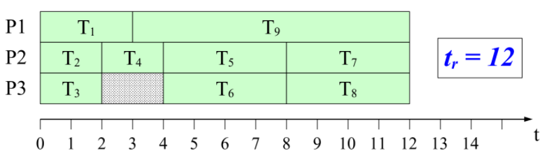

### Aggiunta di un Processore

Con l'aggiunta di un *quarto processore* ci si aspetta immediatamente di avere delle performance migliori, tuttavia non è così:

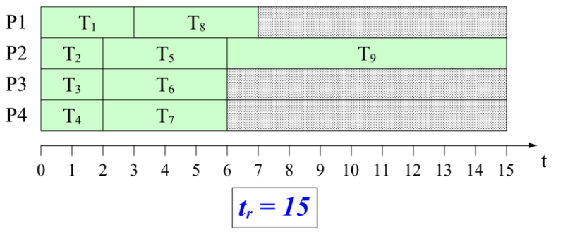

Facendo partire il task $T_9$ per ultimo, 3 processori su 4 sono *idle*. Questo genere di problema prende il nome di *bin packing problem*. L'aumento di un processore causa un *impacchettamento sfortunato*: rispetto a prima si finisce dopo. 

### Task più Corti

Si considera ora una *situazione analoga a quella inziale*, dove l'esecuzione per tutti i task è stata ridotta di un'unità di tempo.

$$
T_1 : 2 → T_9: 8 \\
T_2 : 1 \\ T_3: 1 \\
T_4 : 1 → T_5: 3 \\ 
 → T_6: 3 \\ → T_7: 3 \\  → T_8:3
$$

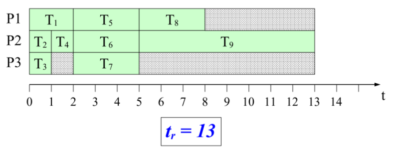

Anche in questo caso si ottiene un *bin packing infelice*. Per diverso tempo si hanno due processori in stato *idle*. Anche in questo caso, diminuendo la durata dei task (ad esempio utilizzando *processori con una frequenza maggiore, quindi più veloci nell'esecuzione*) le cose vanno peggio.

### Eliminazione dei Vincoli di Precedenza

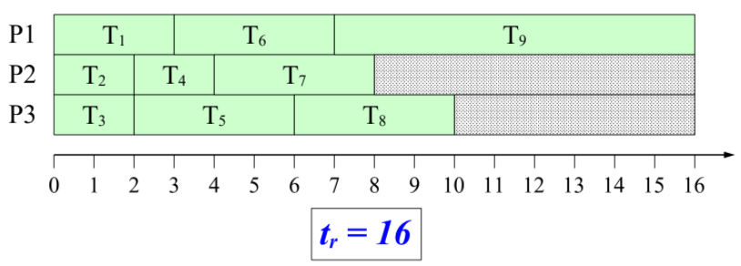

Anche in questo caso, si ottiene un *impacchettamento sfortunato*.

### Processore più Veloce

Nell'immagine sottostante con il *colore giallo* si evidenzia l'*accesso a delle risorse condivise*. Nel primo caso comincia ad eseguire $\tau_2$, che viene interrotto da $\tau_1$ (task a priorità maggiore), che completa la sua esecuzione *prima dello scadere della sua deadline* (freccia rossa). Nel secondo scenario si considera lo stesso task set mandato in esecuzione su un processore due volte più veloce. Poiché $\tau_2$ finisce prima, può da subito fare una *lock* per accedere alle risorse condivise. Durante la sua esecuzione, il task $\tau_2$ viene preemptato da $\tau_1$ che però non avendo a disposizione la disposizione le risorse deve mettersi in attesa: il controllo ripassa a $\tau_2$, che finisce le operazioni sulle sue risorse condivise per poi passare immediatamente il controllo a $\tau_1$ che ora può fare una lock sulle stesse e operare, tuttavia nel momento in cui $\tau_1$ torna ad eseguire è già troppo tardi, e avviene una *deadline miss*. L'aver permesso al task $\tau_2$ di eseguire prima il locking della risorsa ha causato un bloccaggio significativo a $\tau_1$, che ha portato a un *deadline miss*. L'aumento della velocità del processore in questo caso ha comportato un *scenario peggiore*.

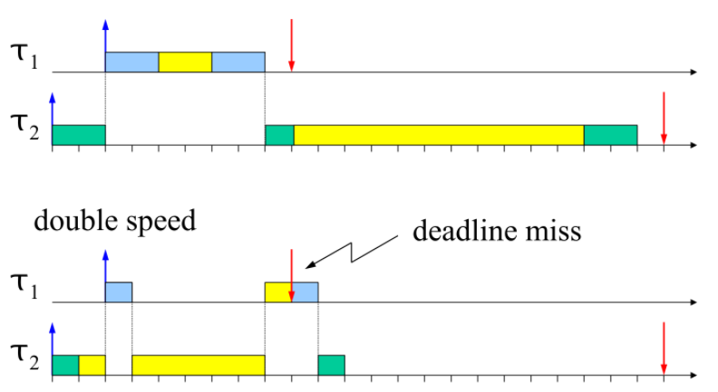

### Inserimento di un Ritardo

Il ritardo può essere inserito mediante una *sleep* (o *nanosleep*) di un istante di tempo specificato.

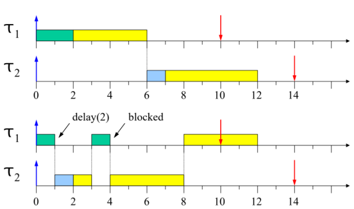

L'inserimento di un ritardo X non è un'operazione lineare, pertanto non sempre comporta un ritardo di X. Talvolta comporta un ritardo *molto maggiore di X*. 

L'approccio più sicuro prevede di dare *garanzie analitiche*. Bisogna assicurarsi che il task non violi la deadline qualsiasi sia l'arrivo dei jobs. Si privilegiano sistemi che hanno una *limitata variabilità nel tempo di esecuzione* e che siano *predicibili*.

# Scheduling
Il termine fa riferimento alla selezione di *quale processo o thread selezionare per essere mandato in esecuzione*. 
## Tipologie
In generale se ne distinguono di tre tipi:
- **Long Term** : utilizzato *prima di creare un processo* da inserire in coda, serve a capire se il sistema rimane sostenibile (schedulabile) e se il processore riesce ad eseguirlo insieme ad altri. Quando un programma è creato, è soggetto a un ***test di ammissione***. Fino a quando il programma non viene ammesso, non viene inserito nel sistema. Quando supera il test questo viene inserito nella *coda dei processi pronti*. Avere troppi processi in esecuzioni potrebbe comportare del *trashing*, ovvero delle latenze dovute allo swap tra memoria principale e secondaria.
- **Short Term** : decide quale processo mandare in esecuzione (dalla coda *ready* allo stato di *running*). Una ***funzione di selezione*** decide qual è il prossimo processo (task) da eseguire. La *modalità di decisione* può essere *preemptive* (il task può essere interrotto in favore di un altro) o *non preemptive*.
- **Medium Term** : decide quali processi (solitamente una *minoranza*) tenere nella memoria principale (RAM) e quali in memoria secondaria. Portare un processo sulla memoria principale prende il nome di ***swap in***, toglierlo ***swap out***.

Nel corso si affrontano principalmente gli short, nei quali si deve decidere quale task mandare in esecuzione in un certo *istante* $t$. I task soggetti a short scheduling si trovano già in stato di pronto.

## Criteri di Selezione dello Scheduling
Per valutare uno scheduler, in particolare per i sistemi real time, dal **punto divista dell'utente** è importante guardare il ***tempo di risposta***: non quello generico, ma il *worst case response type*. Dal **punto di vista sistemistico** invece si guarda il ***throughput***: *la quantità di lavoro che il processore riesce ad eseguire in un intervallo di tempo*. Throughput e tempo di risposta sono due concetti separati: aggiungendo un core ad un processore il tempo di risposta di un task rimane lo stesso, ma è possibile far eseguire due task contemporaneamente portando ad un aumento del throughput. Anche la *performance* (che guarda il *caso medio*) è importante, ma la ***predicibilità*** (che guarda il *worst case*), specie in questo tipo di sistemi, lo è ancora di più: poter prevedere il comportamento di esecuzione rappresenta un grande vantaggio. Determinati *sistemi operativi* e *soluzioni hardware architetturali* prediligono solitamente *uno dei due*, difficilmente entrambi (Intel ad esempio massimizza le average performance). Un altro criterio importante è la ***fairness***: che impedisci che un task rimanga in *starvation* troppo a lungo.

## Processi CPU-Bound e I/O Bound
Un **Processo CPU Bound** è un processo che ha *poche operazioni di I/O* e che mentre si interfaccia verso i dispositivi esterni non rilascia la CPU, uno **I/O Bound** passa la maggior parte del tempo ad aspettare delle operazioni di I/O dall'esterno. 

> **Approfondimento**:
> Un processo occupa del tempo nel processore, ma del tempo anche per approvvigionare i dati necessari alla sua esecuzione. Questi dati devono essere portati in memoria RAM per essere elaborati dai processori. La memoria è sempre più un collo di bottiglia: in passato non era così, si guardava principalmente la frequenza del processore. Le prestazioni aumentano in relazione al numero di core nel sistema (non in relazione alla frequenza della CPU!). Sono i *core* che prendono ed elaborano dati. Legge di Moore: più transistors sullo stesso chip → più capacità computazionale. Per "mangiare" questi dati (data crunching) ho bisogno di dispositivi hardware potenti: le schede video. Con una RAM direttamente sulla GPU c'è un unico bus su cui viaggiano i dati, conferendo un notevole aumento delle prestazioni. La banda rappresenta il modo in cui i dati vengono forniti dalla memoria alla CPU. Negli ultimi anni rimane la stessa. Stesso discorso per la latenza: ci vuole lo stesso tempo per leggere un dato di quanto ci volessero anni fa. Le prestazioni delle CPU sono aumentate notevolmente, tuttavia è la memoria che fa ancora da collo di bottiglia. Se la CPU, in termini di performance nette, migliora un 60% l'anno, la memoria rimane su un 7%. 

## Terminologia dello Schedule

Lo schedule è **fattibile** quando, dato un insieme di task (*task set*) e un insieme di vincoli, tutti sono in grado di rispettare le loro deadline. Un set di task è **schedulabile** se esiste almeno uno scenario in cui lo schedule è fattibile.

- τ insieme di *n* task
- P insieme di *m* processori
- R insieme di *r* risorse (ciascuna risorsa $r_i$ è protetta da un semaforo $s_i$)

### Complessità

Questi rappresentano gli input del mio sistema. Dati questi tre input bisogna trovare uno schedule fattibile affinché tutti i task rispettino ciascuno le proprie deadline. Il problema dello scheduling è un *problema NP hard*. 

**NP Hard** → Si tratta di una classe di problemi per cui è estremamente difficile trovare una soluzione polinomiale, pertanto non presentano soluzioni note. La soluzione migliore proposta per questi problemi è di tipo esponenziale. (Es. Problema dell'Impacchettamento di $n$ pacchi un box vuoto: il numero $n$ compare come *esponente nella soluzione*). Come si dimostra? Si prende un problema già appartenente a questa classe, e tramite un numero di passi polinomiale ci si riconduce al problema di partenza (facendo ad esempio delle equivalenze). Se si trovasse la soluzione anche a un solo problema appartenente a questa classe, si potrebbero risolvere a cascata anche tutti gli altri.

#### Semplificazione del Problema

Il problema dello scheduling è un problema NP hard, tuttavia esistono algoritmi polinomiali che si possono trovare sotto determinate condizioni, come quella di *considerare un solo processore* (sistema *single core*). *Ogni task* viene considerato *preemptive*, e arriva nello stesso momento degli altri (*attivazioni simultanee*). Questi *non hanno vincoli di precedenza* tra loro e *nessuna risorsa condivisa* (nessun vincolo tra le risorse: mutex o semafori). Queste assunzioni permettono di analizzare il caso più semplice di tutti. Essendo le ultime due semplificazioni molto restrittive, queste non saranno sempre valide.

### Tassonomia dell'Algoritmo

- Preemptive vs. Non Preemptive
- Online vs. Offline
- Static vs. Dynamic
- Best Effort vs. Optimal

La decisione dell'ordine esecuzione può essere fatta ***online***, *man mano che i task arrivano*, quando sono attivati o entrano ed escono da una coda. Un algoritmo online risulta essere *molto più flessibile e reattivo*, ed è tipico dei sistemi che devono gestire eventi come degli allarmi. Al contrario, l'algoritmo si dice ***offline***, se tutte le *decisioni sono state prese prima* che i *task partano*: in questo caso le decisioni sono salvate su una tabella e si parla di *table-driven schedule* (è il caso di uno scheduler a priorità fisse dove ciascun task viene accodato in base alla sua priorità). Un algoritmo offline è *molto predicibile* ma *poco flessibile*, inoltre la sua tabella può diventare lunga. In un algoritmo di scheduling ***statico*** le decisioni di scheduling sono prese basandosi su *parametri fissi*, come ad esempio la priorità, il tempo di interarrivo o quello di esecuzione. Uno scheduling ***dinamico*** prende invece decisioni basandosi su *parametri che possono cambiare nel tempo* (come nel caso di job che hanno stessa deadline relativa, e diversa deadline assoluta). Un algoritmo si dice ***ottimale*** (*scheduler ottimo*) se *trova sempre uno schedule fattibile*, ammesso che esista. Si dice ***best effort*** quando fa il meglio che riesce, senza garantire di trovare lo schedule ottimo, o di trovarne uno fattibile. Un algoritmo *best effort* è *molto più veloce di uno ottimale*.

**Problema di SCHEDULING** → Dato un task set, come distribuire i task sulla CPU?

**Problema di SCHEDULABILITY** → Dato un algoritmo e il suo task set, si riescono a rispettare le deadline?

# Algoritmi di Scheduling non Real-Time

## First In First Out (FIFO o FCFS)
I task vengono eseguiti nell'ordine di arrivo. L'algoritmo *non è preemptive*: un task non può essere "sorpassato" da uno che arriva dopo. È un algoritmo *dinamico*: la priorità di un task si basa completamente sul suo *tempo di arrivo in coda*, non è possibile conoscerlo a priori. Poiché non si conosce l'ordine di esecuzione a priori è un algoritmo *online* ed è *best effort*.

Si tratta di un algoritmo *non predicibile*: il tempo di esecuzione di un task dipende dal suo *istante di arrivo* (*arrival time*).

## Shortest Job First (SJF)
Viene schedulato per primo il *task con il più piccolo tempo di computazione* ($C_i$ o *WCET*). Il vantaggio di questo scheduler sta nel fatto che *minimizza il tempo di risposta medio*: permette di finire il maggior numero di task nel minor tempo possibile. Non è ottimale per i task real-time, dove è esclusivamente importante che il task non superi la sua deadline: con un algoritmo di questo tipo i task più lunghi (importanti o critici) vengono eseguiti solo alla fine. L'algoritmo può essere *sia preemptive che non preemptive*. L'algoritmo è statico: dipende dal solo tempo di computazione del task, che non cambia (tutti i jobs di un task hanno lo stesso tempo di computazione). La decisione dell'ordine di esecuzione può essere fatti *sia online che offline*. 

**Dimostrazione: Scheduler che Minimizza il Tempo di Risposta Medio**

Per dimostrare che questo scheduler minimizza il tempo di risposta medio si procede con una *dimostrazione per assurdo*. Si assume quindi che esista un algoritmo $σ ≠ SJF$  che ha un tempo di risposta medio minore di SJF: $\overline{R}_\sigma < \overline{R}_{SJF}$. Affinché $\sigma$ sia diverso si deve fare in modo che, almeno una volta, non esegua per primo il task con il più piccolo tempo di computazione presente nella coda dei task pronti. Minimizzare il tempo di risposta medio coincide con il minimizzare il finishing time medio, ovvero la somma dei finishing time fratto il numero di task.
$$
\frac{f_{\tau_1} + f_{\tau_2}}{2}
$$

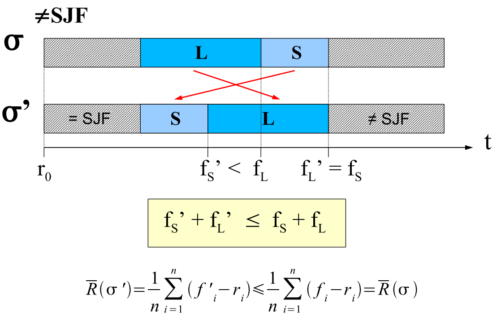

Per minimizzare il finishing time medio tuttavia è necessario ricondursi verso SJF. Facendolo per tutti gli $n$ task presenti sul sistema si ottiene un algoritmo $\sigma^* = SJF$, che vince in tutte le simulazioni e pertanto si conferma il migliore nel conseguire l'obiettivo proposto: minimizzare il tempo di risposta.

## Priority Scheduling
Ad ogni task viene assegnata una priorità (un numero basso sta a rappresentare una priorità più alta). Il task con la priorità maggiore viene selezione per l'esecuzione, qualora due task avessero la stessa priorità vengono scelti mediante FCFS oppure Round Robin. I task generalmente hanno priorità fisse, pertanto hanno priorità fisse anche i job che li compongono. È uno degli algoritmi di scheduling più utilizzato (anche nei sistemi real-time). Il problema di questo scheduling è la ***starvation***: task con una bassa priorità non eseguono mai (in caso di un *carico elevato di task ad alta priorità*). Una soluzione a questo problema potrebbe essere l'***aging***: più un task aspetta più la sua priorità aumenta, tuttavia così facendo i task non avrebbero più una priorità fissa, e non sarebbe più adatto ai sistemi real-time: nel momento in cui il task esegue potrebbe già essere troppo tardi e avere una deadline miss.

## Round Robin
Nell'algoritmo *Round Robin* (puro) *non esiste il concetto di priorità*. I task vengono schedulati nell'ordine di arrivo (come in FCFS), ma il sistema presenta il concetto di ***quanto di tempo***: ogni task che esegue lo fa per un determinato quanto di tempo. Se un task ha un tempo di esecuzione che supera il quanto di tempo, allo scadere del quanto (*interrupt*) su di esso viene fatta preemption e ritorna in coda (*ready queue*) per essere rieseguito. In base al suo tempo di esecuzione, *un task può eseguire per più unità di tempo*.

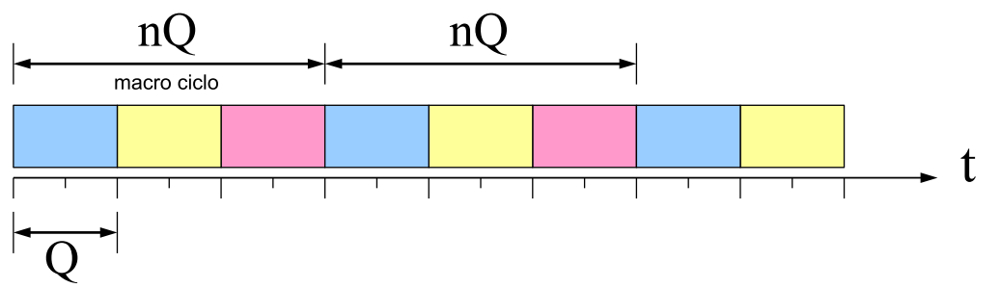

Definito $n$ il numero di task in un sistema e $Q$ il *quanto di tempo*, ciascun task esegue dopo $(n-1)Q$ volte. Un *macro ciclo* ha dimensione $nQ$. Per eseguire un task con una durata di $C_i > Q$  *unità di tempo* eseguo un numero di macro cicli pari a $\frac{C_i}{Q}$ (numero di volte in cui subisce preemption). Quindi il *tempo di risposta* $R_i$ (tempo che impiega ad eseguire) è dato da:
$$
R_i \simeq (nQ)\frac{C_i}{Q} = n \cdot C_i
$$
È come se *si virtualizzasse il processore* in relazione al numero di task, processore che in questo modo è come se fosse $n$ volte più lento. In questo modo ogni task ha l'*impressione* di avere un *processore* (più lento) *dedicato*. Il caso degenere di uno scheduler Round Robin con task che hanno $C_i < Q$ è uno *scheduler FCFS*, in quanto *non c'è preemption*. Diminuire il quanto di tempo non è sempre una buona soluzione: bisogna considerare anche il tempo di overhead (*preemption*) per il cambio di contesto. Con un quanto di tempo troppo piccolo si ha solo overhead e non si procede mai nell'esecuzione dei task.

### Round Robin basato su Priorità
È possibile implementare uno scheduler Round Robin con ***diverse code di priorità differente***. Se un processo non riesce a finire la sua esecuzione, è possibile spostarlo su un altra coda FIFO con priorità maggiore (*aging*). In questo modo viene eseguito più spesso ed è più propenso a finire liberando spazio. Questa algoritmo tenta di superare i limiti dei processi I/O bound (ai task più lunghi viene abbassata la priorità, mentre a quelli più corti viene alzata, in modo che finiscano prima).

# Algoritmi di Scheduling Real Time
Algoritmi che riescono a dare *garanzie nel tempo di risposta*. I *task* possono essere *schedulati secondo* una **deadline relativa**, con un algoritmo a ***priorità statica***, oppure secondo una **deadline assoluta**, con un *algoritmo a **priorità dinamica***. 

## Earliest Due Date (EDD)

L'algoritmo ***seleziona il task*** con la ***deadline relativa più piccola***. Si considera che tutti i task arrivino simultaneamente (***priorità statica***) già pronti per l'esecuzione e che la loro priorità sia conosciuta a priori. La *preemption non rappresenta un problema* per queste condizioni iniziali. *EDD* ***minimizza il ritardo massimo*** (*lateness massima*, $L_{MAX}$): se esiste uno schedule per cui tutti i task finiscono prima della propria deadline, allora EDD lo troverà. Quando $L_{MAX}<0$ *nessun task missa la propria deadline*.

**Dimostrazione: Ottimalità di EDD**

Per dimostrare che l'algoritmo *minimizza il ritardo massimo* si procede con una *dimostrazione per assurdo*. Si assume quindi che esista un algoritmo $\sigma \neq EDD$,  che ha un ritardo massimo minore di EDD: $L_{MAX}^{\sigma} < L_{MAX}^{EDD}$. Affinché $\sigma$ sia diverso si deve fare in modo che, almeno una volta, non esegua per primo il task con la deadline relativa più piccola nella coda dei task pronti. La *lateness di un task $i$ viene definita come segue*:
$$
L_i = f_i - d_i
$$
Si procede a calcolare la *lateness massima*. Essendo la distanza da $f_i$ a $d_i$ *negativa* nel caso in cui un task finisce la sua esecuzione prima di raggiungere la sua deadline, si prenderà in considerazione la *la lateness di A* (che finisce più a ridosso della sua deadline): $L_A > L_B$. Per minimizzare la lateness di A (obiettivo di $\sigma$), procedo a creare la configurazione $\sigma '$.

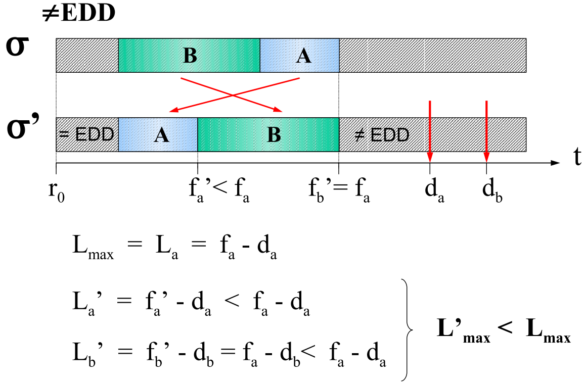

Sia la *lateness di A* che *quella di B* risultano *minori della lateness massima* $L_A$ *della configurazione* $\sigma$. Di conseguenza, la *lateness massima ottenuta con la nuova configurazione* risulta *strettamente minore* di quella della *configurazione iniziale*. Per minimizzare la lateness massima tuttavia è necessario continuare a ricondursi verso EDD. Facendolo per tutti gli $n$ task presenti sul sistema si ottiene un algoritmo $\sigma^* = EDD$.

Il *finishing time* del *task i-esimo* è *la somma dei tempi di computazione di tutti i task aventi una deadline precedente alla sua*:
$$
f_i = \sum_{k=1}^i C_k
$$
Affinché un *task set sia schedulabile*, *ciascun task deve avere un finishing time minore della sua deadline*:
$$
\forall i \quad \sum_{k=1}^i C_k \leq D_i
$$

**Complessità**: L'ordinamento del task set richiede $O(n)$ operazioni.

## Earliest Deadline First (EDF)

L'algoritmo ***seleziona il task*** con la ***deadline assoluta più piccola***. Non si considera più che i task arrivino simultaneamente, ma questi possono arrivare *in qualsiasi momento* (***priorità dinamica***, la *deadline assoluta è diversa per ogni job*). Esiste sia la versione preemptive che non preemptive dell'algoritmo: quella preemptive ha caratteristiche di ottimalità tali per cui l'algoritmo *minimizza il ritardo massimo*. Se esiste uno schedule tale per cui ogni task finisce la sua esecuzione prima di raggiungere la propria deadline, EDF lo troverà. EDF è un algoritmo ***online***.

È possibile capire *a priori* se le deadline verranno rispettate. Per farlo, ad ogni arrivo, è necessario *controllare se tutti i job hanno abbastanza spazio per eseguire prima della loro deadline*. Quindi all'arrivo di un job si guarda, per ciascun job, *il tempo che gli rimane da eseguire* $c_i(t)$, *sommato a tutti quelli dei job con una priorità più alta di lui*. Il tempo rimanente di esecuzione deve essere quindi *più piccolo del suo time to deadline* (tempo necessario a raggiungere la sua deadline).
$$
\forall i \quad \sum_{k=1}^i c_k(t) \leq d_i -t
$$

**Complessità**: L'ordinamento del task set, *per ogni nuovo arrivo* richiede $O(n)$ operazioni.

# Task Periodici e Sporadici

Di seguito si considerano diversi algoritmi di scheduling per Task Periodici e Sporadici. Non si considerano quei task che vengono eseguiti una sola volta e poi terminano la loro esecuzione. Cominciando con i Task Periodici, importante è la grandezza $T$ che è il Periodo. 

## Timeline Scheduling
Chiamato anche *cycle executive* o *cyclic scheduling*, o ancora *table driven scheduling*. Viene implementato ***offline***: ancora prima dell'esecuzione del primo task, si decide l'ordine di esecuzione. La loro *esecuzione* viene rappresentata in *forma tabellare*, e la tabella viene *periodicamente ripetuta*. Ha dei pregi e dei difetti: per costruzione, se tutto si comporta a dovere, *si ha sempre conoscenza di ciò che succede*. Se qualcosa nel sistema cambia, *non si ha flessibilità*. E' stato *uno dei primi scheduler* utilizzati, soprattutto in ambito militare. Per un implementazione tipo non è neanche necessario il sistema operativo (*bare metal*).

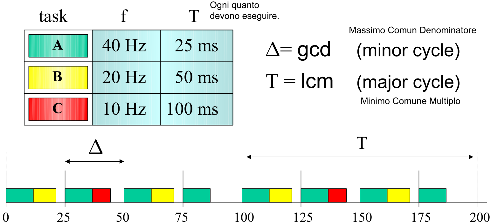

L'*asse del tempo* viene diviso in *intervalli di uguale lunghezza* chiamati **time slot**. Ogni task viene allocato in uno slot o più slot. Se si fa in modo che ogni task non superi mai il suo periodo, allora questo non sforerà mai la sua deadline. Il ***minor cycle***, *massimo comun divisore dei periodi* indicato con il simbolo $\Delta$ è la granularità con la quale cambio le decisioni di scheduling (tempo dopo il quale si verifica un *interrupt*). Il ***major cycle***, *minimo comune multiplo dei periodi* indicato con il simbolo $T$, è il periodo con il quale lo schedule si ripete *identico* nel tempo. Nello schedule, la somma dei tempi di esecuzione dei job che *iniziano all'interno di un minor cycle* deve essere sempre minore del *minor cycle* ($\Delta$). Non si possono verificarsi problemi fintanto che gli arrivi dei task sono sincronizzati.

### Vantaggi
Quando tutto è noto a priori funziona molto bene. Data l'assenza di preemption, *si ha un overhead molto basso*. Un sistema di questo tipo *consente di tenere il jitter sotto controllo*.

### Svantaggi
Scheduler poco configurabile, non si abitua facilmente ad applicazioni che hanno una loro dinamicità. Si dimostra in questi casi uno *scheduler molto poco flessibile*: se arriva un nuovo task sicuramente è necessario rifare completamente lo schedule. Se un task per qualsiasi motivo *esegue per più tempo di quanto preventivato*, c'è il rischio di una *deadline miss*. Anche la *gestione di task* con un *periodo molto grande* rispetto agli altri rappresenta un *problema*.

### Problemi dovuti all'Overload
Quando un task ci mette più tempo del previsto ad eseguire potrebbe verificarsi un effetto domino: lo scheduler comincia ad accumulare ritardo su tutti gli altri task. Abortire il task potrebbe portare *il sistema in uno stato inconsistente* (esempio: modifica di una risorsa lasciata incompleta). 

**Soluzione: Espandibilità**

La modifica anche di un solo task può comportare un *intero aggiornamento del sistema*. Una soluzione al problema precedente consiste nello ***splittare un job*** *in due (o più) job diversi*, ciascuno su *minor cycle diversi*. Quando si hanno dei periodi armonici (periodo di esecuzione di un job multiplo del precedente) la situazione è più semplice. Quando ciò non accade, si ha un *minor cycle più piccolo*, che comporta *molti più context switch* (interrupt), e un *periodo più grande*, il che comporta un *numero di intervalli di sincronizzazione* $\frac{T}{\Delta}$ molto maggiore. Ciò comporta una *tabella molto più lunga* e dunque *aumento dell'overhead*.

## Priority Scheduling
Scheduler più utilizzato in assoluto. Ad ogni task è associata una *priorità non arbitraria* assegnata secondo dei *vincoli temporali.* Con uno scheduler di questo tipo è possibile *verificare analiticamente la fattibilità dello schedule*. Richiede un S.O con il supporto alle priorità. I task con la *stessa priorità* possono essere ordinati mediante *FCFS* oppure *Round Robin* (prima uno per un determinato *slot di tempo*, poi l'altro). L'algoritmo viene adattato ad un contesto *real-time* sulla base di come vengono *stabilite le priorità*: non conviene dare le priorità secondo la loro durata (*SJF*), è meglio assegnarle in base *ai periodi dei task* (inversamente proporzionale al periodo di un task), dove più piccolo è il periodo maggiore sarà la priorità associata (*rate monotonic*), oppure in base alla *deadline relativa*. In generale è uno *scheduling a priorità fisse* (la stessa priorità è assegnata ad ogni job di un task). 

### Rate Monotonic (RM)

Si assegna una ***priorità più alta*** al task che ha il ***rate*** *(periodo) **più piccolo***. L'algoritmo presenta preemption e ha un numero di cambi di contesto nettamente minore rispetto ad un'implementazione tipo fatta con un Timeline Scheduling. Con uno scheduler di questo tipo, *il task a più alta priorità non subisce mai preemption (ha zero jitter)*.

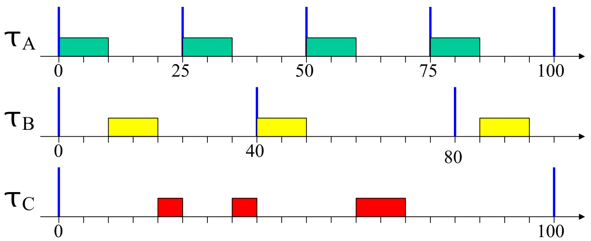

Per i task periodici e sporadici, Rate Monotonic è stato dimostrato avere l'**assegnamento di priorità** ***ottimale*** (non il migliore assoluto! EDF è anche migliore!). Tra tutti gli algoritmi *a **priorità fisse*** (dove la priorità di un task non cambia durante l'esecuzione), assegnare la priorità *secondo il rate* è la scelta ottimale: se rate monotonic non riesce a trovare uno schedule fattibile, nessun altro algoritmo a priorità fisse può riuscirci. Anche se la durata di un job è appena più grande (ad esempio per un sovraccarico del sistema), non cambia più di tanto la sua schedulabilità: lo scheduler si auto-adatta.

[//]: <> "Possibile domanda per l'orale: Disegnare uno scheduler Rate Monotonic - slide 16"

#### Verificare la Schedulabilità
Per valutarla è necessario calcolare *l'utilizzazione del processore* $U_p$: somma delle utilizzazioni del processore da parte di tutti gli $n$ task ($U_i$ : utilizzo del processore da parte del *task i-esimo*), data dal rapporto tra *execution time* e *periodo*.
$$
U_i = \frac{C_i}{T_i} \qquad \qquad \qquad U_p= \sum _{i=1}^n \frac{C_i}{T_i}
$$
In genere un processore è *occupato ad eseguire un task* 9 volte su 10. Se $U_p > 1$ allora il processore è in ***sovraccarico*** e non è possibile trovare uno schedule fattibile. Una ***condizione necessaria*** per la schedulabilità è tale che senza di essa non è possibile trovare uno schedule fattibile, una ***condizione sufficiente*** invece basta per trovare uno schedule fattibile. Avere un $U_p<1$ è una *condizione necessaria*, ma *non sufficiente*: possono esistere casi dove un task set non è comunque schedulabile da *RM* nonostante il processore non sia in sovraccarico. 

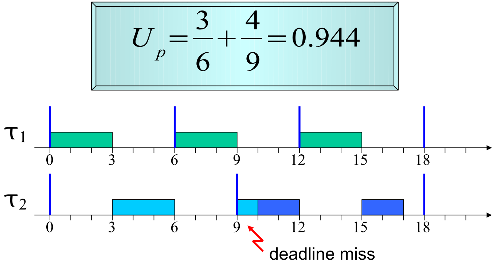

> **Esempio**:
> 
> $C_1 = 2,\; T_1 = 4$  ; $C_1 = 2,\; T_1 = 6$
>
> $U_{TOT} =  \frac{C_1}{T_1} + \frac{C_2}{T_2} = \frac{2}{4} + \frac{2}{6}$
>
> Sotto all'utilizzo, ma non fattibile. La Preemption fa missare il processo $\tau _2$.

La schedulabilità deve essere studiata dunque in una regione $U_p \leq 1$. In questa regione deve esistere quindi un ***valore di soglia*** $U_{lub}$ (*least upper bound*, anche chiamato $U_{LL}$ da *Liu and Layland*) al di sotto del quale la *schedulabità è garantita*.  In questo modo, avere un $U_p < U_{lub}$ sarebbe una ***condizione sufficiente alla schedulabilità***. $U_{lub}$ è il valore che ***tra tutti i task set non schedulabili*** ha l'***utilizzazione più piccola***.

$U_{lub}<U_{p}\leq 1$ I task che hanno un'utilizzazione $U_p$ sono in una ***regione di incertezza***, non si può dire con sicurezza se siano schedulabili o meno.

##### Calcolo di $U_{lub}$ 

È stato dimostrato che per un set di $n$ task periodici:

$$
U^{RM}_{lub} = n(2^{1/n}-1)
$$

$$
\text{per}\; n → \inf \qquad U_{lub}=\ln 2
$$

Il *least upper bound* dipende pertanto dal *numero di task del sistema* e ha *complessità* $O(1)$.

## Teorema: Istante Critico (T-Periodici)
[//]: <> "Possibile domanda per l'orale"
Si tratta del ***worst case del tempo di risposta***. Se il tempo di risposta è maggiore della deadline non si viene schedulati. Si vuole quindi trovare la situazione di arrivo che massimizza il tempo di risposta. Il tempo di risposta di un task è massimizzato quando ***il task arriva insieme ai task a priorità più alta di lui***. Quelli a più bassa priorità, in uno scheduler preemptive, non hanno alcun impatto sul tempo di risposta. Il caso in cui ***tutti i task arrivano assieme*** è quello che *massimizza tutti i tempi di risposta* (tutti i task sono massimizzati): si tratta del ***caso peggiore di tutti***, anche definito *strettamente sincrono*.

## Task Sporadici
Alternativa più comoda ai task periodici. $T_i$ diventa il ***minimo tempo di interarrivo***. Consiste nel *minimo tempo che deve passare prima dell'arrivo del prossimo task*. Ciascun job $\tau _{ik}$ deve essere attivato con un ritardo $r_{ik} = r_{i(k-1)} + T_i$. Il prossimo job pertanto *non può arrivare prima di un tempo* $T_i$. Anche in questo caso ogni job deve finire prima della sua *deadline assoluta*, data dalla somma del *tempo di arrivo* con la sua *deadline relativa*: $d_i = r_i + D_i$.

Il *Timeline Scheduling* per questo tipo di task è *problematico*: con degli arrivi sporadici è difficili individuare il *major cycle*. L'alternativa migliore rimane utilizzare il *Priority Scheduling* (event based).

### Teorema: Istante Critico (T-Sporadici)

È valido un teorema simile a quello dell'istante critico visto per i task periodici. Il ***caso peggiore*** *per i task sporadici è lo **stesso per i periodici***. L'istante critico corrisponde allo scenario in cui i ***task arrivano esattamente periodici*** (con il loro minimo tempo di interarrivo) in un istante $T_0$. Il caso sporadico si rifà a quello periodico. I risultati ottenuti per i task periodici valgono anche per i periodici, compreso il calcolo di $U_p$ e di $U^{RM}_{lub}$ (al posto di $T_i$ si utilizza il *minimo tempo di interarrivo*).

## Assunzioni per l'Ottimalità

Si assume, per semplicità, che tutti i job di un task eseguano per lo stesso tempo di esecuzione $WCET= C_i$ (pari al loro *worst case*), che il loro *minimo tempo di inter-arrivo* $T_i$ sia *costante per tutti i jobs appartenenti a un task*, e che per ciascun task $D_i=T_i$. Per ultimo, si assumono *i task tra loro indipendenti*, senza vincoli su risorse o semafori o di relazione tra loro.

## Hyperbolic Bound (HB)
Il seguente test ha una *complessità* di $O(n)$ ma permette di esplorare meglio quello spazio compreso tra $1 < U_p < U_{lub}$, in modo da ***massimizzare l'utilizzo del processore***. Il test di schedulabilità precedente rimane *sufficiente*: questo test permette di *alzare la regione di fattibilità*.
$$
\prod _{i=1}^n (U_i + 1) \leq 2
$$
L'*hyperbolic bound* consiste nel fare la produttoria dell'utilizzazione di tutti i task *più 1*: se il risultato è *minore di* $2$ allora il task set è *schedulabile*. E' un *test sufficiente*, ma non necessario. Migliora rispetto al precedente aumentando la regione di discriminazione, ma non in modo troppo significativo.

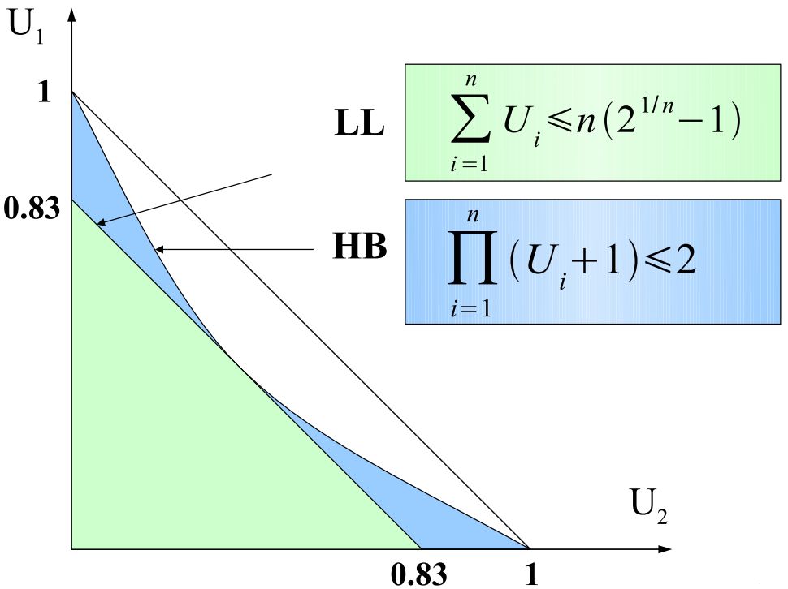

Task set con $n=2$. I problemi che calcolano HB e LL hanno una *complessità lineare*.

# Scheduling a Priorità Dinamiche

Analizziamo il comportamento di uno scheduler a *priorità dinamiche* con *task periodici*.

## Earliest Deadline First (EDF)
Algoritmo di scheduling ***dinamico***: da ***priorità*** ai task (o jobs) che hanno la ***deadline assoluta minore***: si assume sempre che sempre i task abbiano la deadline *deadline* (assoluta) *uguale al periodo* e *accesso alle risorse condiviso*.  Si comporta anche meglio di *Rate Monotonic*: i suoi vantaggi rispetto a RM sono legati all'*utilizzazione raggiungibile*. Fintanto che $U_p ⩽ 1$ con EDF l'esecuzione *riesce sempre*: avere *un'**utilizzazione del processore minore o uguale a 1*** è una ***condizione necessaria e sufficiente per la schedulabilità***. Permette di discriminare perfettamente i task set schedulabili da quelli non schedulabili. I task set con $U_p < 1$ che prima con Rate Monotonic davano *deadline miss* ora riescono a eseguire.

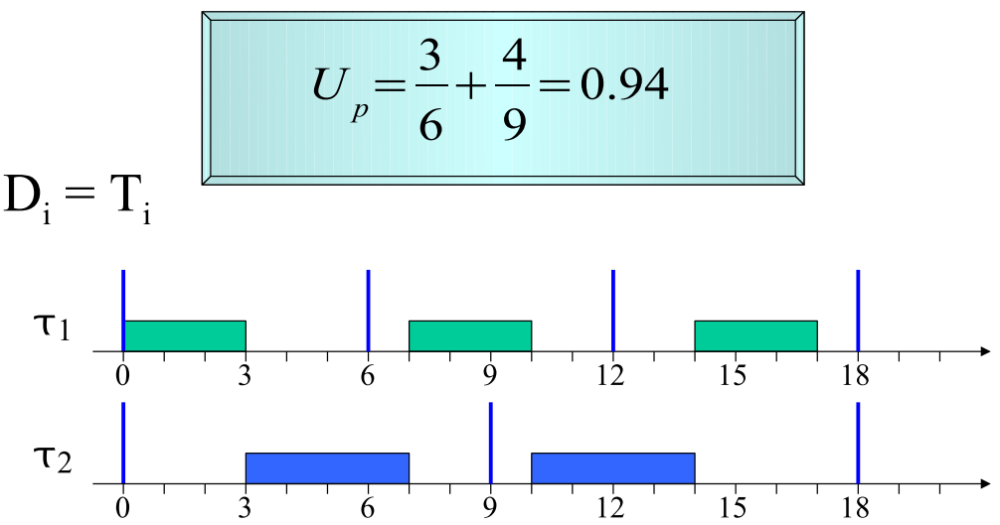

Mentre *RM* è ottimale tra gli *algoritmi a priorità fisse*, EDF è ottimale per tutti gli algoritmi di scheduling. Se un task set non è schedulabile con EDF, allora non esiste nessuno scheduler in grado di schedularlo. EDF permette di riempire completamente il processore.

[//]: <> "Possibile domanda per l'orale -> Dimostrazione dell'Ottimalità di EDF"

**Dimostrazione: Ottimalità di EDF**

Per dimostrare che l'algoritmo *è ottimale* si procede con una *dimostrazione per assurdo*. Si assume quindi che esista un algoritmo $\sigma \neq EDF$,  tale per cui un task set è schedulabile e mentre EDF ne avrebbe missato una deadline.

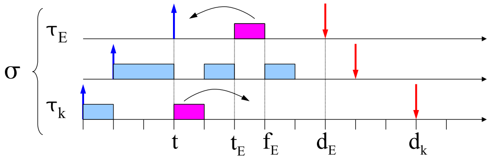

All'istante $t$ l'algoritmo $\sigma$ prende la prima *decisione diversa da EDF*: viene schedulato il task $\tau_k$ che ha una *deadline maggiore del task* $\tau_E$. Poiché $\sigma$ prende una decisione diversa da EDF, sappiamo che $d_E < d_k$ (EDF dovrebbe scegliere $d_E$, ma $\sigma$ sceglie $d_k$). Riconducendosi a EDF (schedulando prima i task con deadline assoluta minore), finirebbe l'esecuzione dei task all'istante $f_E$. Pertanto il nuovo istante di fine esecuzione del task $\tau_k$ è $f_k'=f_E \leq d_E \leq d_k$, la *fattibilità rimane preservata* e avendo anticipato il task $\tau_E$ il suo finishing time migliora. Iterando il procedimento per tutti gli $n$ task presenti sul sistema si ottiene un algoritmo $\sigma^* = EDF$, raggiungendo una *contraddizione* con l'ipotesi che assunta per assurdo.

Essendo $U_p \leq 1$ una *condizione necessaria e sufficiente per la schedulabilità,* per EDF il *least upper bound è uguale a 1*. 
$$
U_{lub}^{EDF} = 1
$$
Con EDF in generale si hanno ***meno cambi di contesto***. In uno scheduler priorità fisse, se arriva un task ad alta priorità c'è *sempre preemption*. A priorità dinamiche l'algoritmo *concede di più*. Se confrontato con RM, che è più semplice da implementare e più prevedibile durante i sovraccarichi (che non inficiano sui task a priorità più alta), EDF risulta comunque *più efficiente* e con *un numero minore di cambi di contesto*.

# Deadline Minore o Uguale al Periodo
Può essere comodo a volte dare a un task una deadline minore del suo periodo, in modo da dargli *un margine prima della sua attivazione successiva*. In questi casi non è più possibile utilizzare il concetto di *utilizzazione per la schedulabilità*: avere $U_p<1$ non garantisce più la *fattibilità dello schedule*. Anticipando la deadline rispetto al periodo, occorre utilizzare ***un'utilizzazione modificata*** $U_i^*$ definita come segue: 
$$
U_i^*=\frac{C_i}{D_i}
$$
I test precedenti sono ancora applicabili sia a EDF che a Rate Monotonic:
$$
U_i^*\leq 1^{EDF} \qquad 	\qquad U_i^*\leq U_{lub}^{RM}
$$
Avere $U_i^*\leq 1^{EDF}$ è ora solo una ***condizione sufficiente*** alla schedulabilità e *non più necessaria*: una condizione di questo tipo *discrimina pochi task set schedulabili*, lo ***spazio di schedulabilità è molto più grande***.  Se $U_i^*>1$ non è possibile dire niente sullo schedule: è possibile avere task set con $U^*$ *molto maggiore di 1* che sono *comunque schedulabili*. EDF rimane l'algoritmo *ottimale*, tuttavia non è più possibile caricare l'*utilizzazione al 100%*.

> **Esempio**:
>
> Scrivere un task set *schedulabile* con $U_p^* > 1 $. I task vengono scritti in formato: $C_i$, $D_i$, $T_i$
>
> - $\tau_1$ : $2, 2, 4$
>
> - $\tau_2$ : $2, 4, 4$
>
> I seguenti task hanno: 
>
> - $U_p = \frac{2}{4} + \frac{2}{4} = \frac{1}{2} + \frac{1}{2} = 1$
> - $U_p^* = \frac{2}{2} + \frac{2}{4} = 1 + \frac{1}{2} = 1,5$

È possibile raggiungere la divergenza nell'utilizzazione del processore attraverso una *serie armonica che tende all'infinito*. Considerati $n$ task con uguale periodo, ciascuno che esegue per un tempo $C$ e una deadline uguale a $iD$ (dove $i$ è il numero del task che va da $1$ a $n$):
$$
\frac{C}{D} + \frac{C}{2D} + \frac{C}{3D} + \dots + \frac{C}{nD} \qquad \qquad \qquad \sum _ {n=1}^\infty \frac{1}{n} \rightarrow \infty
$$
Si dimostra inoltre che *non è necessario arrivare fino all'iperperiodo* (minimo comune multiplo del periodo tra i task) per vedere se un task set è schedulabile. È sufficiente *fermarsi al primo idle point* (primo punto in cui il processore è inattivo).

Come si è fatto per EDF (con priorità dinamiche) è necessario *trovare delle condizioni necessarie e sufficienti* per la schedulabilità. Si ricercano delle condizioni necessarie e sufficienti *sia per RM che per EDF* (se le *deadline siano diverse dal periodo*). I test che permettono di discriminare meglio lo spazio schedulabile sono la *Response Time Analysis* (per Fixed Priority) e il *Processor Demand* (per EDF). In base al tipo di priorità, con *deadline minore o uguale al periodo* vengono utilizzati i seguenti algoritmi di scheduling:

- **Deadline Monotonic** (*statico*, al posto di *Rate Monotonic*)
- **Earliest Deadline First** (*dinamico*)

## Deadline Monotonic

Algoritmo ***statico***: prende le decisioni basandosi sulla *deadline relativa*, che è la stessa per ogni task, pertanto *prende le stesse decisioni per ogni job appartenente allo stesso task*. Viene data ***priorità*** ai task che hanno una ***deadline relativa minore***. L'*utilizzazione* (modificata) del processore è data dalla *somma dell'utilizzazione di tutti i task*:

$$
U_p^* = \sum_{i=1}^{n} \frac{C_i}{D_i}​
$$

## Response Time Analysis
Per andare a *discriminare i task set schedulabili* si utilizza un test basato sulla Response Time Analysis: si calcola per ciascuno dei task il ***tempo di risposta in caso peggiore***. Il tempo di risposta $R_i$ di un task è dato dalla differenza tra il suo *finishing time* $f_i$ e il suo *arrival time* $r_i$: quindi è anche dato dalla somma dei *tempi per cui il task esegue* ($C_i$, *computation time*) con quella di tutti gli *intervalli di tempo* in cui il *task è pronto a eseguire ma sta già eseguendo un altro task con priorità maggiore* ($I_i$, *interferenza*). Un task a più bassa priorità non potrebbe mai eseguire se è disponibile uno a priorità maggiore in un algoritmo preemptive (senza bloccaggio). 
$$
R_i = C_i + I_i
$$
L'interferenza è data dalla somma dei tempi di esecuzione $C_i$ dei task a più alta priorità del task $i$:
$$
\sum ^h C_i = I_i
$$
La *RTA* consiste nell'assicurarsi che il ***tempo di risposta sia minore o uguale alla deadline*** (relativa): 
$$
R_i \leq D_i
$$
Il test è ***valido per qualsiasi algoritmo a priorità fisse***. Il problema rimane il *calcolo dell'Interferenza*.

### Calcolo dell'Interferenza

Per calcolare l'interferenza sul task i-esimo si guarda il caso in cui il task è pronto ma non può eseguire a causa di quelli a più alta priorità: l'***istante critico***, istante nel quale il *task arriva assieme a quelli a priorità più alta di lui*.

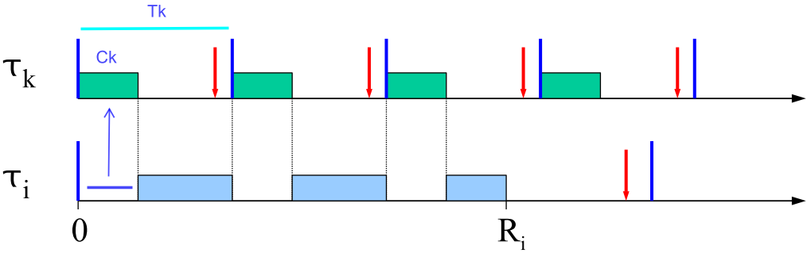

Il task $\tau _k$ si ripete con periodo $T_k$ ed esegue per un tempo $C_k$. Si può dunque affermare che l'interferenza data dal task $\tau _k$ sul task $\tau _i$ è data da:
$$
I_{ik}=\lceil{\frac{R_i}{T_k}}\rceil C_k
$$

Il valore conta *quanti release* del task $\tau_k$ sono presenti nel tempo di risposta $R_i$ considerato. L'*operatore floor* considera la *parte intera superiore*. L'*interferenza totale* sarà data dalla sommatoria dei task da $\tau_1$ fino a $\tau_{i-1}$ e si calcola facendo:
$$
I_{i}=\sum_{k=1}^{i-1}\lceil{\frac{R_i}{T_k}}\rceil C_k
$$
La funzione a gradino (ceiling) non si presta per essere manipolata. Non è possibile isolare un'incognita al suo interno. La formula $R_i$ risulta:
$$
R_i= C_i+ I_i = C_i + \sum_{k=1}^{i-1}\lceil{\frac{R_i}{T_k}}\rceil C_k
$$
Poiché messa in questo modo non è possibile isolare $R_i$, per ricavarlo è necessario ricorrere a una ***soluzione iterativa***. 
$$
\begin{cases} 
  R_i^0 = C_i \\ \\
  R_i^{(s+1)} = C_i + \sum_{k=1}^{i-1}\lceil{\frac{R_i^s}{T_k}}\rceil C_k
\end{cases}
$$
Nella soluzione iterativa si mette dentro un $R_i^0 = C_i$, definito come $R_i$ *al passo $0$*: il tempo di risposta deve infatti essere almeno uguale a $C_i$. Quello indicato come apice prende il nome di ***passo***. Il valore ottenuto viene *sostituito nella formula di* $R_i$: se si ottiene un valore uguale a $C_i$ il procedimento è concluso, se viene fuori qualcosa di diverso si tratta sicuramente di un *valore più grande* (si tratta di una somma) e si procede a calcolare $R_i^1$ ($R_i$ al *passo* $1$). Si itera il procedimento fino a quando non si raggiunge una *convergenza* $(R_i^{(s+1)}= R_i^{(s)})$ o ***punto fisso*** (*fixed point iteration*).  Affinché il task set sia schedulabile $R$ deve essere  sempre *minore o uguale* a $D$: se la supera non ha senso continuare, perché *sicuramente il task set non è schedulabile*.

> **Esempio**:
>
> [//]: <> "Possibile domanda per l'orale "
> Analisi della *schedulabilità di un task set* a priorità fisse (senza EDF). Il task set è schedulabile? Che utilizzazione è possibile usare? 
>
> I task, con $D \leq T$, vengono rappresentati come segue $\rightarrow$ $τ_i : (C_i, D_i = T_i)$
> - $τ _1 : (3, 6)$
> - $τ _2 : (7, 28)$
> - $τ _3 : (5, 30)$
>
> Non è possibile utilizzare l'utilizzazione normale con la sommatoria dei $\frac{C_i}{T_i}$, ma si deve utilizzare quella che somma i $\frac{C_i}{D_i}$:
>
> $U_{TOT} = \frac{3}{6} + \frac{7}{28} + \frac{5}{30} = 0,916$
>
> La condizione *sufficiente per la schedulabilità è che* $U_{TOT} \leq U_{lub} = n \sqrt[n]{2} - 1$
>
> $U_{lub} = 0,779 $
>
> L'utilizzazione è maggiore, quindi *non si deduce nulla di certo*. L'utilizzazione trovata risiede *all'interno del margine di incertezza*, e per uno studio più certo occorre controllare con la *Response Time Analysis*.
>
> **R1**:
>
> $R_1 = C_1 + 0 = 3$ : il *response time del task $\tau_1$* è 3. 
>
> **R2**:
>
> $R_2^{(s+1)} = C_i + ⌈\frac{R_2^s}{T_1}⌉\cdot3 = R_2^{(0)} + ⌈\frac{R_2^s}{T_1}⌉\cdot3$
>
> $R_2^{(0)} = C_i=7$
>
> $R_2^{(1)} =  7 + ⌈\frac{7}{6}⌉3  = 7 + 2 \cdot 3 = 7+6= 13$
> $R_2^{(2)} = 7 + ⌈\frac{13}{6}⌉3 = 7 + 3\cdot 3 = 7+9 = 16$
> $R_2^{(3)} = 7 + ⌈\frac{16}{6}⌉3 = 7 + 3\cdot 3 = 7+9 = 16 = R_2^{(2)} ≤ D_2 = 28$
>
> **R3**:
>
> $R_3^{(s+1)} = 5+ \sum _{k=1}^{i-1}⌈\frac{R_3^s}{T_i}⌉\cdot C_i = 5 + ⌈\frac{R_3^s}{6}⌉\cdot 3 + ⌈\frac{R_3^{(s)}}{28}⌉\cdot 7$
>
> $R_3^{(0)}=C_i=5$
>
> $R_3^{(1)} = 5 + ⌈\frac{5}{6}⌉3 + ⌈\frac{5}{28}⌉7 = 5 + 1\cdot 3 + 1 \cdot 7= 5+3+7 = 15$
> $$R_3^{(2)} = 5 + ⌈\frac{15}{6}⌉3 + ⌈\frac{15}{28}⌉7 = 5 + 3\cdot 3 + 1 \cdot 7= 5+9+7 =21$$
> $R_3^{(3)} = 5 + ⌈\frac{21}{6}⌉3 + ⌈\frac{21}{28}⌉7 = 5 + 4\cdot 3 + 1 \cdot 7= 5+12+7 = 24$ 
> $R_3^{(4)} = 5 + ⌈\frac{24}{6}⌉3 + ⌈\frac{24}{28}⌉7 = 5 + 4\cdot 3 + 1 \cdot 7= 5+12+7 = 24 = R_3^{(3)} ≤ D_3 = 30 $
>
> Anche $\tau_3$ come $\tau_1$ e $\tau_2$ risulta *schedulabile*. Essendo schedulabili tutti i task, l'intero *task set è schedulabile*.
>
> Ulteriore richiesta: Ricalcolare $R_3$ assumendo un *execution time* $C_i$ del task $τ_3$ pari a 7 $\rightarrow τ _3 : (7, 30)$. Non è necessario ricalcolare il tempo di risposta di $\tau_2$ e $\tau_3$ perché si sta considerando un algoritmo preemptive, quindi i task a più alta priorità non vengono influenzati da quelli a priorità più bassa.
>
> $R_3^{(s+1)} = 7 + \sum _{k=1}^{i-1}⌈\frac{R_3^s}{T_i}⌉\cdot C_i = 7 + ⌈\frac{R_3^s}{6}⌉\cdot 3 + ⌈\frac{R_3^{(s)}}{28}⌉\cdot 7$
>
> $R_3^{(0)}=C_i=7$
>
> $R_3^{(1)} = 7 + ⌈\frac{7}{6}⌉3 + ⌈\frac{7}{28}⌉7 = 7 + 2\cdot 3 + 1 \cdot 7= 7+6+7 = 20$
> $R_3^{(2)} = 7 + ⌈\frac{20}{6}⌉3 + ⌈\frac{20}{28}⌉7 = 7 + 4\cdot 3 + 1 \cdot 7= 7+12+7 = 26$
> $R_3^{(3)} = 7 + ⌈\frac{26}{6}⌉3 + ⌈\frac{26}{28}⌉7 = 7 + 5\cdot 3 + 1 \cdot 7= 7+15+7 = 29 < D_3 $
> $R_3^{(4)} = 7 + ⌈\frac{29}{6}⌉3 + ⌈\frac{29}{28}⌉7 = 7 + 5\cdot 3 + 2 \cdot 7= 7+15+14 = 36 > D_3 $
>
> Non è più schedulabile.

## Processor Demand
Test utilizzato quando $D_i \neq T_i$: discrimina i task set schedulabili in una zona avente $U_p^* > 1$. In ogni ***intervallo*** si guarda se il ***tempo di computazione richiesto dal task set*** è ***minore del tempo che si ha a disposizione***, allora è schedulabile: $demand(t) \leq t$ .

Bisogna considerare esclusivamente i *job che hanno release time e deadline all'interno dell'intervallo*: il ***tempo di computazione*** di questi task prende il nome di **processor demand**. Si elimina il contributo dei task che *non sono contenuti* dentro l'intervallo.  La *demand* in un intervallo $[t_1,t_2]$ viene indicata come $g(t_1,t_2)$. Tutti i job all'interno di questo intervallo hanno una *priorità più alta* di quelli che hanno una deadline dopo.
$$
g(t_1,t_2)=\sum_{r_i \geq t_1}^{d_i \leq t_2} C_i
$$
La ***demand è massima*** quando *l'arrivo del primo job (contenuto) di tutti i task coincide con l'inizio dell'intervallo* $t_1$. Facendo partire tutti i task in $t_1$, è possibile considerare $t_1=0$ e $t_2=L$ (*grandezza dell'intervallo*). Avere tutti i ***task sincroni*** (*tutti i task vengono rilasciati nello stesso istante* $t_0$) è la ***configurazione che massimizza la demand*** e che ha *response time maggiore di tutti*. Si indica con $r_{i,k}$ l'arrivo del $k$-esimo job appartenente al task $i$-esimo.

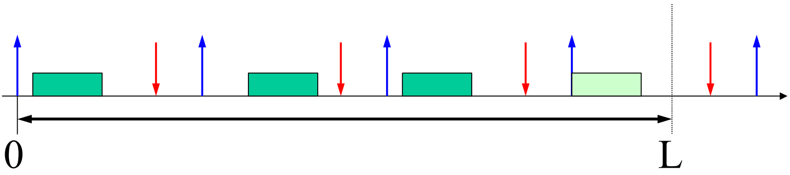
$$
\tau_i : \qquad r_{i,0}=0 \qquad r_{i,1}=T_i \qquad r_{i,2}=2T_i
$$
**Processor Demand in** $[0, L]$:
$$
g(0, L) = \sum_{i=1}^{n}⌊\frac{L + T_i - D_i}{T_i}⌋\cdot C_i
$$
Poiché $t_1=0$ si può indicare indicare *l'intero intervallo* con $L$. Il valore racchiuso all'interno dell'operatore *floor* rappresenta il *numero di job* interamente contenuti all'interno dell'intervallo $L$. Si vuole fare in modo che:
$$
\forall L>0, \qquad g(0,L) \leq L
$$
Il task set è schedulabile se la condizione risulta vera *per tutti gli intervalli* (per ogni task). Si basa sul concetto che *ciò che viene richiesto al processore è minore di quanto viene offerto dallo stesso*. Il ***problema*** di questo test rimane il fatto che *deve essere vero per ogni $L$* e che $L$ *è continuo*. È necessario *trovare un **upper bound** per $L$ dopo il quale è possibile fermarsi* (se fino a quel momento le deadline sono state rispettate).

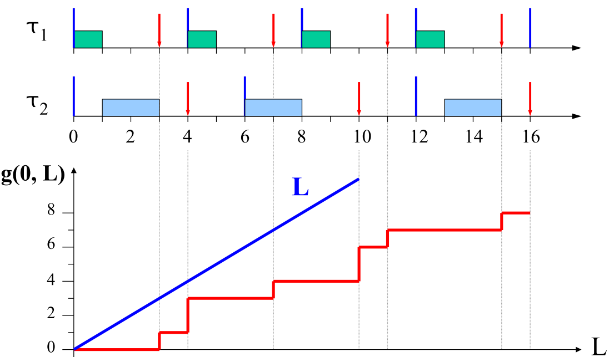

Assicurarsi che $g(L)\leq L$ significa assicurarsi che la curva rossa sia sempre sotto quella blu. Se la configurazione peggiore di tutte è quella in cui i task sono tutti sincroni e strettamente periodici (anche il caso sporadico si riduce a quello periodico e sincrono), allora prima o poi lo ***schedule*** (*curva rossa*) ***si ripete identico dopo l'iperperiodo***. L'iperperiodo $H$, nel caso più sfortunato è il *prodotto dei periodi*: $T_n$, e ha complessità esponenziale, è dato dato:
$$
\forall L \leq H=lcm_{i=0}^n(T_i)
$$
Rimane tuttavia ancora il *problema della continuità di L*: di $L$ nell'iperperiodo possono essercene infiniti. Il gradino tuttavia lo si ha *in corrispondenza delle deadline*: quindi, per motivi geometrici, basta ***assicurarsi che la curva rossa sia sotto $L$ in corrispondenza delle deadline***. Dopo un gradino infatti il valore rimane costante con pendenza zero, mentre $L$ ha una *pendenza fissa*. Pertanto bisogna guardare un *insieme di $L$*:
$$
L : \forall D_i + k T_i \leq H
$$
*La complessità non è più infinita*: viene ridotta al ***numero di deadline in un iperperiodo***.

### Limitare la Complessità

Quando i task hanno periodi primi tra loro, allora l'iperperiodo è il prodotto dei periodi:
$$
H=lcm(T_1, \dots , T_n) = \prod _{i=1}^{n} T_i=x^n
$$
La **complessità** è pertanto *esponenziale*: $O(x^n)$. Per questo si vuole *cercare ulteriormente di limitare la complessità*, finendo *prima dell'iperperiodo* utilizzando delle *manipolazioni algebriche*. Per farlo si parte dalla definizione di $g(L)$:
$$
g(0,L) = \sum_{i=1}^{n}⌊\frac{L + T_i - D_i}{T_i}⌋\cdot C_i
$$
E ad essa si ***sostituisce l'operatore floor*** con delle semplici *parentesi*, ottenendo $G$, trovando per definizione un qualcosa di *maggiore o uguale*.
$$
G(0, L) = \sum_{i=1}^{n} (\frac{L + T_i - D_i}{T_i})\cdot C_i \\
= \sum_{i=1}^{n} L \frac{C_i}{T_i} + \sum_{i=1}^{n} (T_i - D_i) \frac{C_i}{T_i} \\
= LU + \sum_{i=1}^{n} (T_i - D_i)U_i
$$
Attraverso delle manipolazioni è possibile riscrivere la formula ottenuta scomponendola in *due sommatorie*, e in seguito tirare fuori dalla prima $L$ (termine costante che non ha una dipendenza dall'indice). In seguito sostituire dove occorre le formule corrispondenti all'utilizzo del processore $U$.

[//]: <> "Possibile domanda per l'orale -> Dimostrazione della Limiting L (questa)"
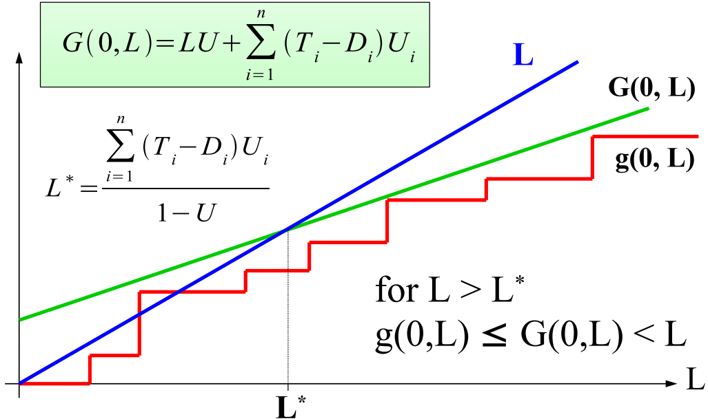

Dal punto di vista grafico, come detto precedentemente, la funzione $G(0,L)$ *non andrà mai sotto la rossa* (può al massimo toccarla). La retta verde una *una pendenza minore* rispetto alla retta blu (con pendenza $1$), e ha ***pendenza** pari a $U$*. Il suo punto di partenza sull'asse delle ordinate è pari alla parte della funzione contenente la sommatoria (con $L=0$). Quindi, ogni volta che $U<1$ la curva verde e la curva blu si toccano. Si cerca dunque l'***intersezione*** tra $G(L)$ e $L$.
$$
g(L) \leq G(L) < L \quad \rightarrow \quad g(L) \leq L
$$
In questo modo *non è più necessario andare fino all'iperperiodo*, ma basta arrivare *dopo* $L^*$. Per trovare $L^*$ è sufficiente porre: $G(0,L)=L$, che risulta:
$$
L^* = \frac{\sum _{i=1}^{n} (T_i -D_i)U_i}{1-U}
$$
Fintanto che $U<1$ è possibile fermarsi in $L^*$, tuttavia a volte questo può risultare anche *più grande dell'iperperiodo*. Il valore di $L^*$ cresce all'*avvicinarsi* di $U$ ad 1. In una condizione generica quindi è meglio considerare le deadline da $0$ al valore *minimo tra iperperiodo $H$ e* $L^*$:
$$
D = \{d_k | d_k \leq \min(H, L^*)\} \qquad \text{per ciascuna controllo che } \qquad g(0,l)\leq L
$$

> **Esempio**:
>
> Analisi della *schedulabilità di un task set* a priorità dinamiche (EDF). Il task set è schedulabile? Che utilizzazione è possibile usare? 
>
> I task, con $D \neq T$ (non si può utilizzare $U \leq 1$), vengono rappresentati come segue $\rightarrow$ $τ_i : (C_i, D_i, T_i)$. Si potrebbe utilizzare $U^* \leq1$, ma si procede prima ad analizzare la schedulabilità con *Processor Demand*. 
>
> - $τ _1 : (3, 6)$
> - $τ _2 : (7, 28)$
> - $τ _3 : (7, 28, 30)$
>
> Si calcola $H$ e $L^*$ e si guardano le deadline comprese tra $0$ e il minimo tra questi due.
>
> $H = mcm(T_1,T_2,T_3) = 420$
>
> In seguito, si calcola $U$ per sostituirlo all'interno della formula di $L^*$:
>
> $U = \sum_{i=1}^{n} \frac{C_i}{T_i} = \frac{3}{6} + \frac{7}{28} + \frac{7}{30} = \frac{1}{2} + \frac{1}{4} + \frac{7}{30} = 0,9833$
>
> $L^* = \frac{\sum _{i=1}^{n} (T_i -D_i)U_i}{1-U} = \frac{2 \cdot \frac{7}{30}}{1-(\frac{1}{2}+\frac{1}{4}+\frac{7}{30})}=\frac{2 \cdot \frac{7}{30}}{1-0,9833}=28$
>
> Pertanto si guardano, per ogni task, le deadline contenute in $L^*=28$:
>
> $\tau_1 : 6,\quad12,\quad 18,\quad 24$
> $\tau_2 = \tau_3 : 28$
>
> Si hanno *5 deadline*. Per le prime 4, sia $\tau_2$ che $\tau_3$ non presentano istanze. L'unica interessante è $28$. Dovendo $\tau_1$ eseguire per 4 volte, mentre i task $\tau_2$ e $\tau_3$ rispettivamente una volta, si avrà:
>
> $g(0,28) = n.deadline(\tau_1) \cdot C_1 + n.deadline(\tau_2)\cdot C_2+n.deadline(\tau_3) \cdot C_3= 4 \cdot3 + 1 \cdot 7 + 1\cdot 7 = 26$ 
>
> Poiché deve essere $g(0,L) \leq L$ e $26 < 28$ allora *il task set è schedulabile*.

# Sommario

Per il momento si sono visti *tre diverse tipologie di scheduling*:

- Offline → ***Timeline Scheduling***
- A Priorità Fisse → ***Rate Monotonic***, ***Deadline Monotonic***
- A Priorità Dinamiche → ***Earliest Deadline First***

Per *verificare la schedulabilità di un task set* si è fatto riferimento a *tre (due sono varianti della stessa) diverse tecniche di analisi*:

- Limite di Utilizzazione del Processore (***sufficiente*** per $D=T$ in *RM*)  → $U \leq U_{lub}$
  - Limite di Utilizzazione del Processore *Modificata* (***sufficiente*** per $D \neq T$ in *RM*)  → $U^* \leq U_{lub}$
  - Utilizzazione del Processore minore di 1 (***ottimo*** per *EDF* nel caso $D = T$) → $U < 1$
  - Utilizzazione del Processore minore di 1 (***sufficiente*** per EDF nel caso $D \neq T$) → $U<1$
- *Response Time Analysis* (***esatto per RM e DM***, quindi solo per *Algoritmi a Priorità Fisse*) → $\forall i \quad R_i \leq D_i$
- *Processor Demand* (***esatto per EDF***) → $\forall L \quad g(0,L) \leq L$

La **complessità** di questi test è invece:

- *Test basati sull'Utilizzazione del Processore*: $O(n)$
- *Response Time Analysis*: *pseudo-polinomiale* $O(n^x)$
- *Processor Demand* *pseudo-polinomiale* solo se $U<1$ allora $O(n^x)$, altrimenti *esponenziale*

# Mutua Esclusione

## Problemi derivanti dalla Mutua Esclusione

La mutua esclusione viene gestita mediante l'utilizzo di *semafori* sui quali vengono fatte operazioni di *lock* e *unlock*. Non si considerano più i **task** come *indipendenti*, ma come ***dipendenti***, in quanto ***accedono alle stesse risorse condivise***.

### Blocco su un Semaforo
Talvolta è inevitabile che un task ad alta priorità debba aspettare uno a bassa priorità: ciò avviene quando quello a bassa priorità è il primo che accede a una risorsa utilizzando una *wait*. Quando viene preemptato dall'arrivo di un task a più alta priorità, il task ad alta priorità esegue, ma se deve accedere anch'esso alla risorsa condivisa non può fare altro che ridare il controllo al precedente. Questo fenomeno prende il nome di **bloccaggio**. Durante il fenomeno del bloccaggio, il task a più alta priorità *non può eseguire*, e al suo posto esegue un task a più bassa priorità. la *Response Time* pertanto è ora data dalla somma del *tempo di computazione*, dell'*interferenza* e del *bloccaggio*.
$$
R = C_i + I_i + B_i
$$
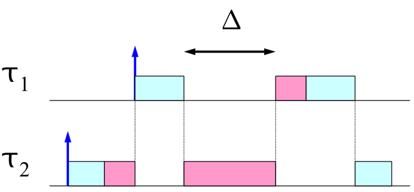

In generale ci si aspetta che il *tempo di bloccaggio massimo* del task ad alto priorità corrisponda alla *lunghezza della sezione critica del task* $\tau_2$, ma in realtà il *ritardo dovuto al fenomeno del bloccaggio può essere anche peggiore*. Nel caso peggiore il bloccaggio può essere pari all'*intero tempo di esecuzione di un task* più la *sezione critica massima dei task a più bassa priorità*.
$$
B_{MAX}=C_i+ \delta _{MAX}
$$

#### Conflitto su una Sezione Critica

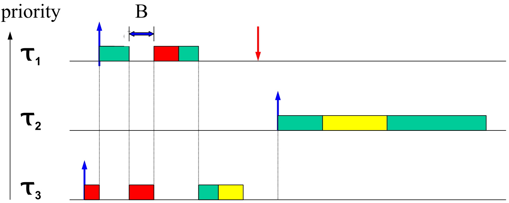

Si evidenziano con due colori diversi (*giallo* e *rosso*) due *risorse diverse*. Con l'inversione di priorità (***Priority Inversion***) un task ad alta priorità potrebbe dover aspettare, *per un tempo indeterminato*, l'esecuzione di task a priorità minore. Nel caso precedente il task $\tau_3$ accede alla sezione critica facendo una *wait sulla risorsa rossa*, all'arrivo del task a più alta priorità $\tau_1$, viene preemptato in favore dell'esecuzione di quest'ultimo che comincia ad eseguire. Quando il task $\tau_1$ richiede l'accesso alla risorsa rossa facendo una *wait*, questa però è ancora trattenuta dal task $\tau_2$, quindi il task $\tau_1$, non potendo proseguire nella sua esecuzione, si blocca. Solo nel momento in cui il task $\tau_3$ fa una *signal* il task $\tau_1$ può tornare ad eseguire.

Il fatto che un task a più alta priorità esegua al posto di uno a priorità più bassa non è un problema, lo diventa quando accade il contrario: se un task a *priorità più bassa* esegue al posto di uno a *priorità più alta*. La situazione precedente può complicarsi ulteriormente anticipando l'arrivo del task $\tau_2$.

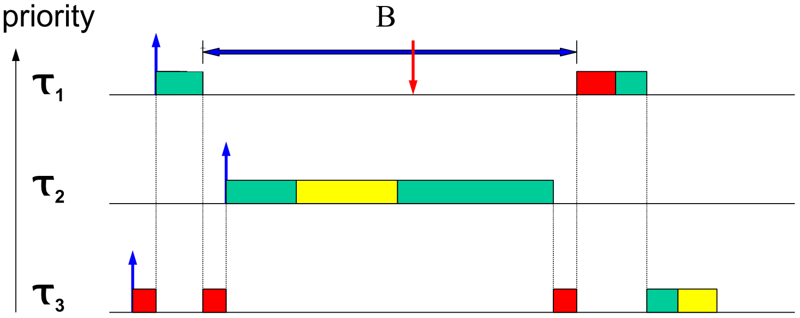

Con una situazione di questo tipo *l'intera esecuzione $C_2$* entra nel termine di bloccaggio. La soluzione alle situazioni di *Priority Inversion* che si vengono a creare consiste nell'***utilizzo di protocolli*** per l'***accesso a risorse condivise***. Questi sono:

- Non Preemptive Protocol (NPP)
- Highest Locker Priority (HLP)
- Priority Inheritance Protocol (PIP)
- Priority Ceiling Protocol (PCP)
- Stack Resource Policy (SRP)

Questi protocolli risolvono i problemi *per piattaforme single-core*. I primi due sono i più semplici. Nei sistemi commerciali solitamente non si trovano tutti.

## Protocolli per l'Accesso a Risorse Condivise
### Non Preemptive Protocol (NPP)
Consiste nel ***vietare la preemption*** di un *task che è entrato **in una sezione critica***. Ciò non è sufficiente a evitare i bloccaggi (un task ad alta priorità può essere comunque bloccato). Il protocollo è di *facile implementazione*, ma presenta un **problema**: potrebbe far sì che *anche i task ad alta priorità che non utilizzano la CS rimangano bloccati*. Limita il problema dell'*unbounded priority inversion*, ma rimane quello della priority inversion normale. Se un task a bassa priorità entra in una sezione critica, un task a più alta priorità deve comunque aspettarlo, rischiando di missare le sue deadline se la sezione critica è sufficientemente lunga.

**Implementazione**: Quando un ***task entra in una sezione critica*** (*critical section*, *CS*), la sua ***priorità*** (cambiata dentro la *wait*) ***diventa massima***. Una volta terminata la sezione critica, il task riabbassa la sua priorità a quella nominale.
$$
P_{CS} = \max(P_1,…,P_n)
$$

L'*NPP* permette di avere *tempi di bloccaggio più bassi* e *meno preemption*. Il *tempo di bloccaggio* di un task è dato dal massimo tempo di esecuzione della sezione critica tra tutti i task del sistema *a più bassa priorità* di quello considerato ($n= \text{lowest priority tasks}$).
$$
B = \max_{i=1}^n CS
$$

### Highest Locker Priority (HLP)

Una possibile soluzione al problema di NPP (i task che non utilizzano la CS rimangono bloccati) consiste nel *non mettere la priorità più alta tra tutti*, ma ***la priorità più alta tra tutti quelli che accedono alle sezioni critiche***. Non più alla massima di sistema quindi, ma ai soli task che usano quella risorsa. Si chiama **ceiling della risorsa** la *priorità più alta dei task che possono accedere alla risorsa*. Il protocollo è anche chiamato ***Immediate Priority Ceiling***. Definito $s_k$ come il *semaforo associato alla risorsa $k$*, il **Ceiling della Risorsa** può essere definito, in formule:
$$
C(s_k) = \max \{P_j:\tau_j \text{ uses } s_k\}
$$
**Implementazione** : Quando un task entra in una sezione critica, la sua priorità diventa massima tra tutti i task che possono utilizzare quella risorsa (gli viene assegnata la stessa priorità di questi task e messo primo in coda). Ciò permette a un task con priorità più alta, che non deve utilizzare la risorsa del task in esecuzione, di preemptare questo task e procedere con la sua esecuzione. Quando il task esce dalla sezione critica (*signal*), abbassa la sua priorità.
$$
P_{CS} = max\{P_k|τ _k \text{ uses CS}\}
$$

Seppur si tratta di un miglioramento rispetto al precedente, anche questo task presenta un **problema**: il *caso di bloccaggio se un task decide di non accedere a una risorsa* (***bloccaggio just in case***). L'***accesso alla sezione critica di un task*** potrebbe talvolta essere determinato da ***particolari condizioni***. In questi casi *un task ad alta priorità potrebbe essere bloccato inutilmente* da un task a priorità più bassa che quando accede alla sezione critica alza la priorità al suo stesso livello.

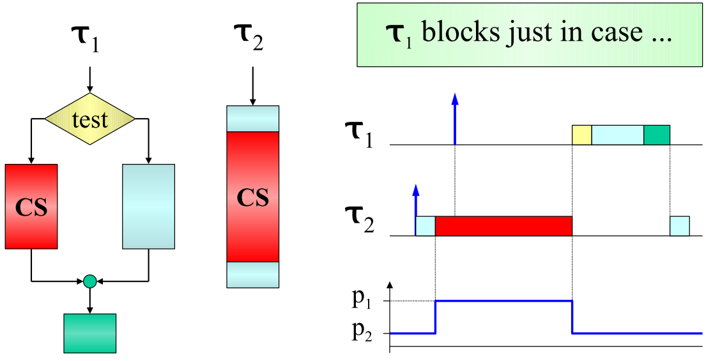

L'ordine di esecuzione in questi casi varia in base allo scenario e alle esigenze di sistema: si potrebbe comunque decidere, in fase di implementazione, di lasciar eseguire a un task ad alta priorità come $\tau_1$ la parte di test, e nel caso in cui debba accedere alla sezione critica ripassare il controllo a $\tau_2$.

### Priority Inheritance Protocol (PIP)

Il *Priority Inheritance Protocol* risolve il problema dell'*accesso condizionale alle sezioni critiche*. Un task in una sezione critica ***aumenta la sua priorità solo se necessario, ovvero se ne blocca altri***. Il task bloccante in questo modo acquisisce la stessa priorità del task bloccato: l'***aumento di priorità avviene nel momento in cui avviene il bloccaggio***. È possibile che alcuni task che richiedono la stessa risorsa non ne richiedano l'accesso immediatamente: fintanto che i task a più alta priorità non devono accedere alla sezione critica, possono eseguire e fare preemption. Quando qualcuno richiede l'accesso alla sezione critica, la priorità *non viene alzata al massimo*, ma diventa ***la massima priorità tra tutti i task che sta bloccando***. Si cerca di evitare il bloccaggio allo stretto necessario. Anche questo protocollo presenta un problema: ci si potrebbe *bloccare su sezioni critiche diverse*.

$$
P_{CS} = max\{P_k|τ_k \text{ blocked on CS }\}
$$

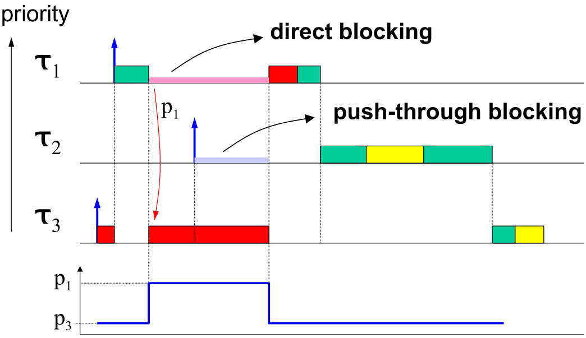

Il task $\tau_3$ aumenta la sua priorità a quella di $\tau_1$ nel momento in cui quest'ultimo richiede l'accesso alla risorsa e si blocca. Poiché da questo momento la sua priorità è la stessa di $\tau_1$, il task $\tau_3$ non viene preemptato da $\tau_2$, che esegue solo dopo che $\tau_1$ finisce la propria esecuzione. Con questo protocollo *non si ha più il problema dell'unbounded priority inversion* ($\tau_1$ non viene più bloccato da $\tau_2$). 

#### Tipologie di Bloccaggio

Il Bloccaggio è un ***ritardo causato da task a priorità più bassa***. Ne esistono due tipologie:

- **Direct Blocking** : Il task si blocca sul semaforo appartenente alla risorsa di cui ha bisogno.
- **Push-Through Blocking** : Bloccaggio indiretto, è proprio di un task che non può eseguire a causa di un altro con priorità minore *con cui non condivide una risorsa*. È dovuto all'esistenza di un task a più alta priorità che condivide una risorsa con un task a più bassa priorità di quello in considerazione. È il task a più bassa priorità che lo blocca nel momento in cui eredita una priorità maggiore.

Si vuole conoscere il *bloccaggio massimo* che un task può sperimentare. Per questo vengono definiti diversi teoremi:

Un task può bloccarsi sui semafori usati dai task con una *priorità minore con i quali condivide delle risorse*, oppure su quelli, sempre con una priorità minore, che condividono risorse con dei task con una *priorità maggiore di quello considerato*.

##### Teorema 1
Un task $\tau_i$ si può bloccare *al massimo una volta per semaforo*. Detto $m$, il numero di semafori su cui un task si può bloccare, questo si può bloccare un massimo di $m$ volte.

##### Teorema 2

Un task $\tau_i$ si può bloccare *al massimo una volta per ogni task a più bassa priorità*. Detto $n$, il numero di task a più bassa priorità su cui il task si può bloccare, questo si può bloccare un massimo di $n$ volte.

Combinando i due teoremi precedenti, si ha che un task si può bloccare un massimo di $\min (n,m)$ volte.

> **Esempio**:
>
> 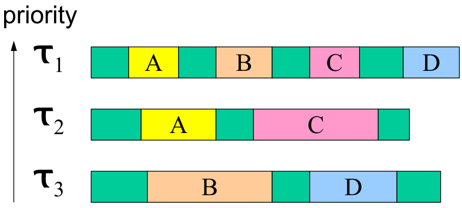
>
> - $\tau_1$ può essere bloccato una volta da $\tau_2$ (su $A_2$ o $C_2$) e una volta da $\tau_3$ (su $B_3$ o $C_3$) $\rightarrow B_{1MAX} = C_2 + B_3$
> - $\tau_2$ può essere bloccato una volta da $\tau_3$ (su $B_3$ o $C_3$) $\rightarrow B_{2MAX} = B_3$
> - $\tau_3$ non può essere bloccato (ha solo *interferenza*)

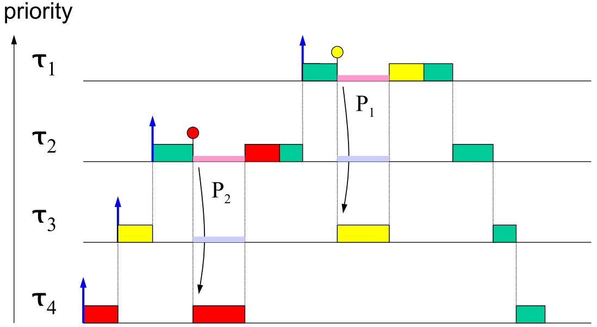

Nel momento in cui $\tau_2$ subisce un *bloccaggio diretto* da parte del task $\tau_4$, quest'ultimo alza la sua priorità a quella di $\tau_2$, comportando per $\tau_3$ un *bloccaggio indiretto (push-through blocking)*. Una volta che $\tau_4$ finisce la sua esecuzione, il controllo passa a $\tau_2$ che esegue fino a quando viene preemptato da $\tau_1$, che esegue fino a quando dovendo accedere alla risorsa gialla subisce un *bloccaggio diretto* da parte di $\tau_3$, che eredita ora la priorità di $\tau_1$. Poiché $\tau_3$ ha ereditato la priorità di $\tau_1$ ha anche comportato un *bloccaggio indiretto* per il task $\tau_2$ che deve ancora finire di eseguire. Una volta che $\tau_3$ esce dalla sezione critica (in *giallo*), ripassa il controllo al task $\tau_1$, che può finire la sua esecuzione, a questo punto i task successivi, non essendoci più sezioni critiche da eseguire, possono finire in ordine: $\tau_2, \tau_3,\tau_4$. 

#### Vantaggi e Svantaggi

È trasparente al programmatore, che non deve settare per ciascun task a quali semafori può accedere, in quanto compito è delegato al S.O; inoltre *limita il problema della Priority Inversion*. Il **problema** del protocollo sta nel fatto che *non evita la deadlock* e la *chained blocking*, il che comporta un *tempo di bloccaggio maggiore* (e il *tempo di overhead per ciascun bloccaggio*).

#### Chained Blocking

Quando un *task viene bloccato più di una volta* (una volta per ogni task o semaforo) si parla di ***chained blocking*** (*bloccaggio a catena*). Tutti questi bloccaggi costituiscono dell'*overhead* nel quale si deve continuamente salvare il contesto.

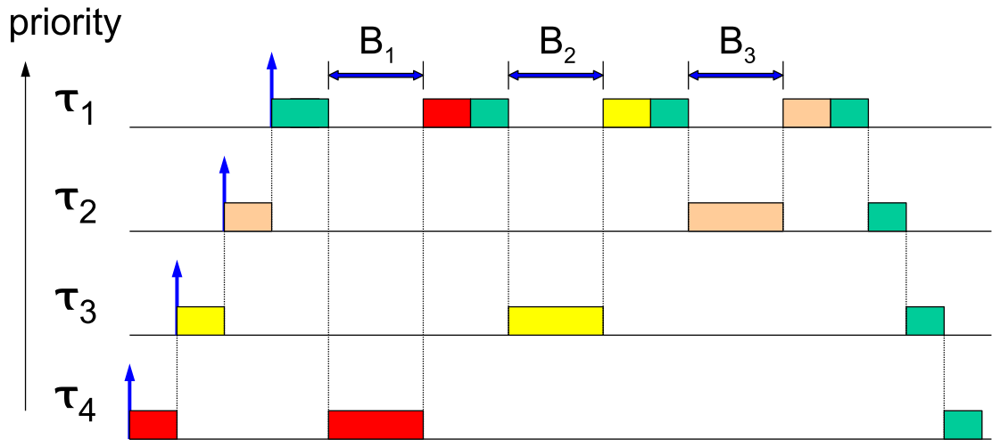

### Priority Ceiling Protocol (PCP)

Questo protocollo *risolve il problema delle deadlock e della chained blocking di PIP*. È ***basato sulle stesse regole di PIP*** al quale ***viene aggiunto un test di accesso***. Un task può entrare in una sezione critica solo se è libera è se non c'è rischio di bloccaggio a catena. 
$$
PCP = PIP + test
$$
Bisogna quindi assicurarsi che ***anche le risorse a cui il task deve accedere successivamente siano libere***. Se è presente almeno una risorsa occupata a cui il task $\tau_i$ potrebbe dover accedere, allora *il ceiling di questa risorsa è almeno uguale alla priorità di $\tau_i$*. Nel caso in cui il task presenta almeno una risorsa occupata, questo si blocca (*ceiling blocking*) in quanto *si trova al di sotto del ceiling delle risorse che in questo momento sono occupate*. Si deve a ***conoscere a priori quali task utilizzano quali risorse***, pertanto ***non si tratta di un protocollo trasparente***.

Si dimostra che *con PCP* se ci si blocca, ci si blocca solo sulla prima risorsa. È un *protocollo molto favorevole in termine di tempi di bloccaggio*. Si tratta del ***protocollo ottimale*** tra tutti quelli per l'accesso a risorse condivise. Il *test del protocollo* richiede che, affinché un task $\tau_i$ possa entrare in una sezione critica, la sua *priorità deve essere più alta del ceiling più alto tra tutte le risorse correntemente bloccate*.
$$
P_i > \max\{C(s_k):s_k\text{ locked by tasks } \neq \tau_i\}
$$

> **Esempio**:
>
> 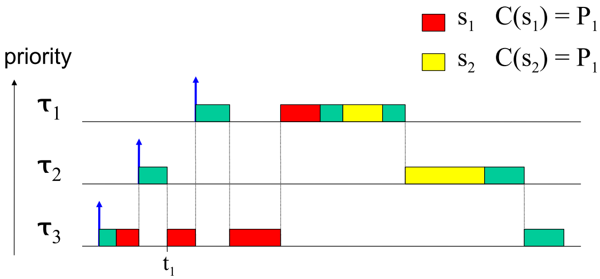
>
> Parte $\tau_3$ che controlla, prima di bloccare la *risorsa rossa*, controlla se è libera e se si trova a una priorità più alta del ceiling più alto tra tutte le risorse bloccate: poiché queste non sono presenti può effettuare una *lock* ed entrare nella *CS rossa*. Parte $\tau_2$, che chiede la risorsa gialla che è libera, e controlla di essere *al di sopra del ceiling di tutte le risorse bloccate*: l'esito è negativo, in quanto il *ceiling della risorsa rossa è a $\tau_1$*, e la *risorsa rossa è ancora bloccata*. A questo punto il task $\tau_3$ eredita la priorità di $\tau_2$, che proseguire nella sua esecuzione. Quando arriva il task $\tau_1$ questo preempta ed esegue, fino a bloccarsi quando deve entrare nella *CS rossa*, in quanto questa è ancora occupata da $\tau_3$. Sia il task $\tau_1$ che $\tau_2$ *si sono bloccati una sola volta e per un tempo pari ad una sezione critica*. *Ciascun task si blocca al massimo per una sola sezione critica*.

#### Vantaggi e Svantaggi

Il vantaggio di questo protocollo sta nel fatto che il **bloccaggio** viene ***ridotto a una sola sezione critica***, e che *previene la deadlock*. Il **problema** sta nel fatto che *il protocollo non è più trasparente al programmatore* (come *PIP*).

#### Prevenzione Deadlock

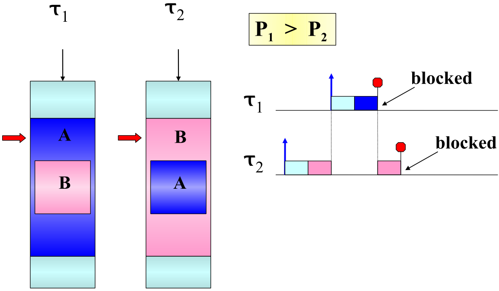

Nello scenario precedente, *senza PCP*, due risorse come $\tau_1$ e $\tau_2$ potevano incorrere deadlock aspettando ciascuno il liberarsi della sezione critica occupata dall'altro (entrambi i task devono eseguire una sezione critica all'interno di un'altra sezione critica). 

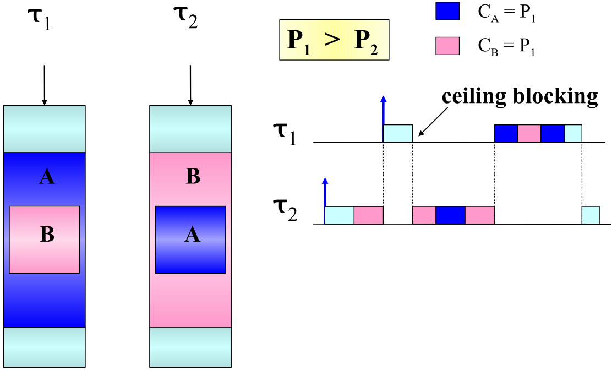

*Con PCP*, poiché $\tau_1$ è il *task a più alta priorità* e *utilizza entrambe le risorse A e B*, sia il *ceiling di A* che il *ceiling di B* sono $C_A = C_B =1$. Quando $\tau_2$ parte può bloccare la *risorsa B* perché *è libera* e *la sua priorità è più alta del ceiling delle risorse correntemente bloccate* (non ce ne sono). Una volta che $\tau_2$ entra nella sezione critica il *ceiling delle risorse bloccate è messo a $\tau_1$*. Una volta preemptato da $\tau_1$, quest'ultimo esegue e cerca di *bloccare la risorsa A*, che *è libera* e guarda che *la sua priorità sia più alta del ceiling di tutte le risorse correntemente bloccate*. La seconda condizione non è soddisfatta, in quanto $C_B=P_1$, pertanto *non può entrare nella CS blu*. $\tau_2$ può tornare ad eseguire fino a liberare entrambe le risorse per poi essere nuovamente preemptato da $\tau_1$, che in questo modo può terminare la sua esecuzione e far terminare in seguito anche $\tau_2$.

### Calcolo del Bloccaggio

Il tempo di bloccaggio *dipende dall'algoritmo di scheduling* e dal *protocollo di accesso alle risorse* scelti. Per ogni task $\tau_i$ si ricerca il suo *tempo di bloccaggio massimo* $B_i$.

#### Rate Monotonic

Con *Rate Monotonic* la somma dell'utilizzazione di ogni task a più alta priorità o uguale deve essere *minore o uguale* a $U_{lub}$: 
$$
\sum_{hep} U_i \leq U_{lub}
$$
Con il *tempo di bloccaggio* questo test *non è più valido*, ora il *test cambia per ogni task*. Si deve calcolare l'*utilizzazione dei task a più alta priorità di $\tau_i$* (*interferenza*) e l'*utilizzazione di $\tau_i$, alla quale si aggiunge il tempo di bloccaggio*.
$$
\forall i \quad \sum_{k=1}^{i-1} \frac{C_k}{T_k}+\frac{C_i+B_i}{T_i} \leq i(2^{1/i}-1)
$$

La formula va integrata alla *Response Time Analysis*. In essa la *Response Time* del task $i$ diventa:
$$
R_i = C_i + I_i + B_i = C_i + \sum_{k=1}^{i-1}\lceil{\frac{R_i}{T_k}}\rceil C_k + B_i
$$

#### EDF

$$
\forall i \quad \sum_{k=1}^{i-1} \frac{C_k}{T_k}+\frac{C_i+B_i}{T_i} \leq 1
$$

La formula va integrata al *Processor Demand*.
$$
g(0,L) = \sum_{i=1}^{n}⌊\frac{L + T_i - D_i}{T_i}⌋\cdot C_i + B(L)
$$

#### Esercizio sul Calcolo di $B_i$

> In tabella vengono rappresentate le *unità di tempo* per cui ciascun task deve accedere alle sezioni critiche di ciascuna delle tre risorse. Si vuole conoscere il *bloccaggio* $B_{PIP}$ con *Priority Inheritance* e il *bloccaggio* $B_{PCP}$ con *Priority Ceiling*. 
>
> |          | $R_1$ | $R_2$ | $R_3$ | $B_{PIP}$ | $B_{PCP}$ |
> | :------: | :---: | :---: | :---: | :-------: | :-------: |
> | $\tau_1$ |   \   |  20   |   \   |     5     |     5     |
> | $\tau_2$ |   5   |   \   |  10   |    20     |    10     |
> | $\tau_3$ |   \   |   5   |   5   |    15     |    10     |
> | $\tau_4$ |   \   |   \   |   5   |    10     |    10     |
> | $\tau_5$ |  10   |   3   |   \   |     0     |     0     |
>
> Il task $\tau_5$, non avendo nessuno a priorità più bassa, ha *bloccaggio nullo*. 
>
> Il task $\tau_4$ non si può bloccare su $R_3$ perché *non ha task a priorità più bassa che vi accedono*, ma il task $\tau_5$ *condivide dei semafori con task a più alta priorità di $\tau_3$*, pertanto potrebbe comportare un *bloccaggio di tipo push-through*. Il task $\tau_4$ si può però *bloccare una sola volta*, in quanto il minimo tra il *numero di task a più bassa priorità di lui* e *il numero di semafori a cui può accedere*: $\min (n,m)=1$. Il peggiore su cui si può bloccare per *PIP* è ***10***.
>
> Il task $\tau_3$ si può bloccare un *massimo di $2$ volte* e *su tutte e 3 le risorse*. *Potendosi bloccare una sola volta per risorsa*, il *bloccaggio peggiore che può avere è* ***15*** (*10+5*).
>
> Il task $\tau_2$ si può bloccare *su tutte le risorse*. Quando si prende un'unità di tempo per cui un task a più bassa priorità accede alla sezione critica, non ci saranno più bloccaggi né da parte di quel task, né da parte di quella risorsa. Il bloccaggio peggiore per *PIP* per il task $\tau_3$ è: ***20*** (*10 + 5 + 5* $\rightarrow$ il primo *5* è dato da $\tau_3$ di $R_2$, mentre il secondo da $\tau_4$ di $R_3$).
>
> Il task $\tau_1$ si può bloccare *solo su $R_2$*, in quanto *non ha task a più alta priorità che accedono alle risorse* $R_1$ e $R_3$.
>
> Per calcolare il $B_{PCP}$ di ogni task, siccome con *Priority Ceiling si evitano le catene di bloccaggio*, *si prende la massima unità di tempo per cui un task a più bassa priorità con cui condivide una risorsa la utilizza*. Il bloccaggio con priority ceiling risulta più facile da calcolare ed *è migliore*: si blocca al più *una volta sola*.

### Stack Resource Policy (SRP)

Si tratta del protocollo equivalente a *Highest Locker Priority* (*HLP, chiamato anche Immediate Priority Ceiling*), precedentemente utilizzato con algoritmi a *priorità fisse*, con algoritmi con ***priorità dinamiche*** (come *EDF*). Il **bloccaggio** avviene ***ancora prima di iniziare ad eseguire***. Bloccarsi *solo prima di iniziare ad eseguire* si tratta di *un **enorme vantaggio in termini di overhead***: fintanto che si è *bloccati primi di iniziare*, non sono ancora stati salvati dei dati nei registri. Ad ogni task quindi vengono assegnati:

- una ***priorità*** $p_i$
- un ***livello di preemption*** $\pi_i$, che viene assegnato (sia su *EDF* che su *RM*) in modo *inversamente proporzionale a $T_i$*: 

$$
\pi_i = \frac{1}{T_i}
$$

È lo *stesso modo in cui viene assegnata la priorità su Rate Monotonic*. Inoltre, a ciascuna risorsa $r_k$ viene assegnato:

- un ***ceiling statico***, definito come il precedente: *la priorità più alta tra i task che usano a la risorsa* $r_k$.

$$
ceil(r_k) = \max _i \{\pi_i | \tau_i \text{ needs } r_k\}
$$

- un ***ceiling dinamico***, definito come *il ceiling della risorsa più alto tra quelle correntemente occupate*.

$$
\prod _s (t) = \max \{ceil(r_k) | R_k \text{ is currently busy }\}
$$

Un task ad alta priorità ***può cominciare la sua esecuzione*** solo se ***il suo livello di preemption*** è ***piè grande del ceiling di sistema***.

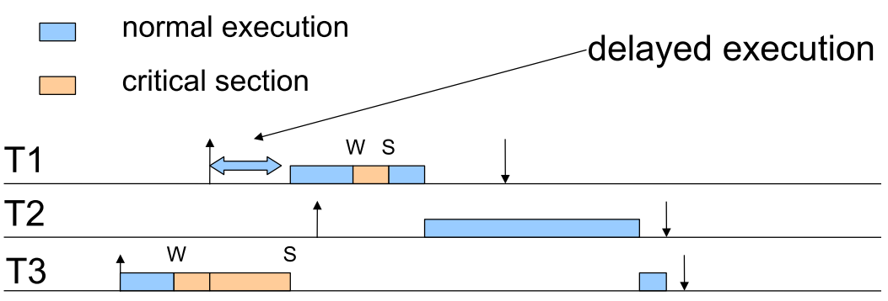

Nel momento in cui $\tau_3$ effettua la *lock* sulla risorsa, *il ceiling di sistema sale al livello di* $\tau_1$. Pertanto il task a più alta priorità $\tau_1$ non può eseguire immediatamente ma subirà *bloccaggio*. Il task $\tau_1$ potrà preemptare $\tau_3$ quando quest'ultimo farà una *signal*, liberando la risorsa e *abbassando il ceiling di sistema*. Con questa semplice regola si fa in modo che ***quando il task comincia ad eseguire non subirà più bloccaggio***, ***potrà solo essere preemptato da task a più alta priorità***.

Anche questo protocollo ***previene i deadlock***. Si tratta di un *algoritmo pulito*: ***riduce il numero di preemption non necessarie*** (*un task non può preemptare un altro se non ha abbastanza risorse*). Il ***tempo di bloccaggio massimo è limitato a quello di PCP***. Inoltre, il protocollo ***permette di condividere lo stack***, e quindi di ***risparmiare quanta più RAM possibile***.

#### Condivisione dello Stack

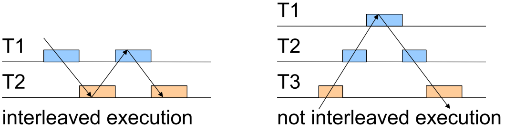

Lo **stack può essere condiviso** ogni volta che ***è possibile garantire che due task non saranno mai interlacciati***. COn un'esecuzione interlacciata, quando $\tau_1$ torna ad eseguire andrebbe a liberare nello *stack* delle zone *non sue*. Con un'**esecuzione non interlacciata* si avrebbe invece che lo *stack viene liberato non appena il task finisce l'esecuzione*. In generale, lo stack può essere condiviso quando:

- i ***task hanno la stessa priorità*** (in modo che non si possano preemptare a vicenda)
- i ***task non si bloccano*** (come in *SRP*)
