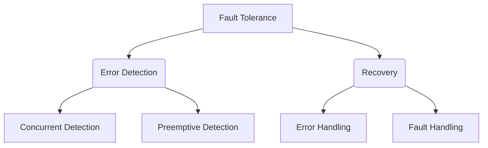

- [Software Defined Data Center](#software-defined-data-center)
  - [Punti di Vista](#punti-di-vista)
  - [Infrastruttura](#infrastruttura)
    - [Data Center Network](#data-center-network)
      - [Limiti della Topologia ad Albero](#limiti-della-topologia-ad-albero)
    - [Scalabilità](#scalabilità)
      - [Architettura di un Web Cluster](#architettura-di-un-web-cluster)
      - [Limiti](#limiti)
    - [Traffico](#traffico)
    - [Gestione del Data Center](#gestione-del-data-center)
      - [Reti Esterne](#reti-esterne)
  - [Software Defined Data Center](#software-defined-data-center-1)
    - [Inibitori SDDC](#inibitori-sddc)
    - [Soluzioni](#soluzioni)
      - [Iperconvergenza](#iperconvergenza)
      - [Riduzione della Topologia di Rete](#riduzione-della-topologia-di-rete)
  - [Progettazione di un Data Center](#progettazione-di-un-data-center)
    - [Posizione](#posizione)
    - [Sicurezza dei Data Center](#sicurezza-dei-data-center)
    - [Raffreddamento](#raffreddamento)
    - [Metriche di Failure](#metriche-di-failure)
    - [CAP Teorem](#cap-teorem)

# Software Defined Data Center

L'applicazione dei *principi di virtualizzazione* ai data center nasce dall'**esigenza** di avere un sistema ***elastico*** e ***flessibile***.

## Punti di Vista

Ci sono **diversi aspetti** che un *cloud provider* deve *tenere in considerazione*, ciascuno di questi appartenente a punti di vista differenti:

<u>**UTENTE**</u>:

Un utente deve avere la ***percezione*** di avere una ***macchina per se'***. La **scalabilità** del sistema messo a disposizione dell'utente deve essere ***istantanea***: in *pochi istanti* deve essere possibile per l'utente avere a disposizione altre macchine. Il sistema deve garantire una certa **sicurezza**: sui data center possono essere messi *dati sensibili*, pagando si deve essere certi che un *team di persone competenti* (con *privilegi diversi*) *mantengano la piattaforma sicura*. Il servizio offerto deve essere **affidabile**: le ***risorse sempre disponibili*** (*ridondanza dei dati*) e il *downtime di pochi minuti all'anno*.

<u>**INGEGNERISTICO**</u>:

L'infrastruttura deve essere gestita sotto gli aspetti ***software*** e ***hardware***, in particolare in termini di ***consumo energetico***, ***raffreddamento*** e ***sicurezza*** (*persone che hanno accesso ai sistemi*).

<u>**SOFTWARE**</u>:

È necessario un **sistema di monitoraggio** per conoscere le ***macchine accese*** e le ***risorse utilizzate***, in modo da sapere ***quanto far pagare i servizi***.

**<u>HARDWARE</u>**:

I **nodi di calcolo** (*host*) vengono raggruppati in ***racks*** che possono essere raggruppati in ***pods***, dei *container di racks* (generalmente spostati usando dei camion) che presentano *tre cavi*: per la *rete*, *energia* e per il *raffreddamento*.

## Infrastruttura

Il data center viene organizzato in ***blade systems***, composti da un certo numero (*solitamente 4*) di **blade** (l'*unità di computazione*, una sorta di *lama*) messe all'interno di un ***chassis***. Se nella *blade* troviamo componenti come *RAM*, *CPU* e *hardware di rete*, nello *chassis* si trova l'*alimentazione*, il *sistema di raffreddamento* e quello di *monitoraggio*. I **blade systems** vengono organizzati in ***racks***, delle sorti di ***armadi*** che presentano ***degli switch*** utilizzati per l'*interconnessione* di più *blade systems tra loro* e *con il resto del datacenter*.  Nei racks sono presenti *due tipi di switch*:

- **top-of-rack**: per la *connessione di più **elementi nello stesso rack***
- **end-of-row**: per la *connessione di **racks sulla stessa fila***

Le **blades** montano ***sistemi di storage di piccole dimensioni NVRAM o SSD*** (generalmente intorno ai *500Gb*, *1Tb*) utilizzati come *caching dei dati* e per far girare l'*hypervisor*, mentre l'unità di **storage** vera e propria dei data center consiste in una ***Storage Area Network*** (***SAN***), uno ***storage persistente*** che ***mantiene le copie delle immagini delle VM***.

### Data Center Network

La rete di un datacenter presenta una **topologia ad albero** nel quale è possibile individuare diversi livelli (dal basso all'alto):

- **Servers**: si tratta dei ***blade systems***, rappresentano le *foglie dell'albero* e sono interconnessi tra loro mediante dei *collegamenti da 1-10Gbps*.
- **Edge Layer**: anche chiamato ***Access Layer***, è composto da ***switch top-of-rack*** ed eventualmente da quelli di tipo ***end-of-row***. In questo layer i ***blade systems vengono connessi*** e vengono implementate le funzioni di *isolamento del traffico* e di *gestione dei guasti*.
- **Aggregation Layer**: su questo livello vengono ***interconnesse zone separate dei datacenter*** (interconnessione di *pods*). Il layer implementa ***funzionalità di QoS per i flussi dati*** (è possibile anche rallentarne alcuni in casi di sovraccarico). 
- **Core Layer**: in questo layer si ***lavora esclusivamente a livello di rete***. Gestisce tutte le ***connessioni con l'esterno*** e l'***instradamento in caso di failures*** (quando alcuni link non sono disponibili), inoltre ***interagisce con la SAN***.

#### Limiti della Topologia ad Albero

Il principale problema di questa topologia sta nei **layer superiori** (*aggregation* e *core*), che possono diventare dei ***colli di bottiglia*** o essere soggetti a ***failures***. La **soluzione** consiste nell'utilizzo della **replicazione** e nella ***riprogettazione della topologia***. Con una **nuova topologia** di tipo **Fat Tree** vengono messi a disposizione ***più link nella parte superiore della rete***, ottenendo una ***banda maggiore***, e quindi ***maggiore scalabilità*** e ***tolleranza ai guasti***. La **configurazione di rete** utilizzata per ottenere questi risultati si chiama ***CLOS Network***.

**CLOS Network**: si considera il ***datacenter*** come un ***grafo***, dove i nodi sono i *server/switch* e gli archi tra i nodi le *connessioni*. L'obiettivo di una rete di questo tipo è quello di ***minimizzare il numero di percorsi bloccati*** (*in uso*), ***minimizzando il numero di connessioni***. L'**efficienza** di questa rete è data dal ***numero di connessioni simultanee*** che si riescono a supportare.

> **Google Data Center** - Scenario
> La crescita del traffico per i data center Google segue la *legge di Moore*, raddoppiando ogni 12/15 mesi. Questo aumento ha come conseguenza un *aumento del numero di elementi di rete da interconnettere*. Nel 2004 il rapporto tra la banda gestibile dal dispositivo e quella entrante era di *10:1*. È in scenari simili che l'adozione di una *CLOS Network* fa la differenza. 

### Scalabilità

La **scalabilità** rappresenta il ***problema principale di un datacenter***. Quando si parla di scalabilità questa può essere *verticale*, si scala facendo un ***upgrade degli apparati hardware/software*** oppure **orizzontale**, ***basato sulla replicazione***. Tra i due la *scelta migliore*, nonché la *più economica* è quella della *replicazione orizzontale*, che consiste anche nel ***fare affidamento sulla generazione precedente***, con un *10% in meno di performance* su *dispositivi che costano la metà*. Scelto il tipo di scalabilità rimane da decidere *come replicare*. Anche per la **replicazione** sono disponibili *due metodi*:

- **Replicazione VERTICALE**: dove un **servizio complesso** viene ***suddiviso in sottoservizi ciascuno messo su un dispositivo diverso***
- **Replicazione ORIZZONTALE**: che consiste nella ***replicazione di oggetti identici***

#### Architettura di un Web Cluster

In generale, l'*architettura tipica di un **Web Cluster*** fa uso di entrambi i metodi di replicazione e si divide su due livelli:

- **Front-end**: costituito dallo **switch** *visibile all'esterno come un unico indirizzo IP pubblico*. Il **ruolo** dello switch nell'architettura è quello di ***direttore d'orchestra***, deve avere delle ***funzionalità per il bilanciamento del traffico***, e per questo si hanno due opzioni:

  - **Switch di Livello 4** (*Trasporto*): vengono utilizzate delle **binding tables** (*strutture dati*) per ***tenere traccia delle connessioni TCP***. Il *3-way-handshake* viene *mediato dallo switch* e poi *portato avanti dal server*.
  - **Switch di Livello 7** (*Applicativo*): si tratta di **nodi più intelligenti** che ***lavorano in termini richiesta***, e possono ***tenere traccia delle sessioni utente***. Il *3-way-handshake* viene ***gestito interamente dallo switch***, che *deve conoscere la richiesta per sapere dove inoltrarla*.

  Non c'è una soluzione migliore dei due. Possono essere adottate entrambe in base al contenuto del traffico.

  > Esempio: ***Instagram***
  > La *maggior parte del contenuto del contenuto* è un *contenuto statico* (*immagini*), pertanto si possono usare switch di livello 4. Per tutte quelle funzionalità che utilizzano delle *API* per *consigliare post*, *chi seguire*, è possibile utilizzare switch di livello 7.

- **Backend**: **insieme di server** *configurati con IP privati* che utilizzano il front-end per le comunicazioni con l'esterno

#### Limiti

I limiti della scalabilità sono strettamente collegati alla **consistenza dei dati**: le repliche devono essere ***mantenute aggiornate***. I **colli di bottiglia** possono verificarsi sia negli ***switch*** che nella ***rete dei datacenter***. Inoltre, è opportuno considerare la **crescita dei datacenter** anche in relazione al ***consumo energetico*** che richiedono.

### Traffico

Quando si parla di traffico di un datacenter si deve far riferimento a **piccoli gruppi di cluster interconnessi**. I gruppi che ***comunicano*** tra loro ***vanno messi vicini***: non necessariamente ***sulla stessa macchina fisica***, poiché potrebbero entrare in *competizione per le risorse* causando un *overload* e di conseguenza un *calo di prestazioni*, ma ***neanche lontani*** per *evitare di spostare grandi quantità di traffico*. Inoltre, è opportuno spostare tutte quelle operazioni che occupano traffico come i **backup** durante le *ore notturne*, quando il server è meno probabile che debba soddisfare le richieste degli utenti.

### Gestione del Data Center

Il **posizionamento** e la **migrazione** delle macchine virtuali può essere utilizzata come *soluzione a diversi problemi*:

- **Bilanciamento del Carico**
- **Consumo Energetico**
- **Utilizzo della Rete**
- **Gestione del Calore**: spegnere intere aree all'interno del data center può far risparmiare sul *consumo energetico per il raffreddamento*

#### Reti Esterne

La **congestione** non è sempre un problema *vicino al datacenter*. Spesso può essere causata dall'ultimo miglio (lato *client*). Può essere dovuto a *dispositivi di accesso*, o da *internet access point*. In questi casi un **service provider** deve fungere anche da ***internet service provider***, diventando *padrone dei **centri di calcolo*** e della ***rete che li interconnette*** e tenendo conto delle ***modalità di accesso ai servizi dell'utente***. Possibili soluzioni alla congestione possono essere:

- **Aumento della *connettività del data center***
- ***Replicazione* dei *service point***
- **Gestione del *data center* e delle *reti che li interconnettono***

> **Scenario: *Google Cloud***
> Google ha i suoi ***data center*** (*servizi* e *VM*) sparsi per gli angoli della terra. Un sistema di ***edge point***, in quantità maggiore, ha il compito di *mantenere il traffico sulla rete Google* (*cold potato policy*, cercano di mantenere il traffico su loro stessi). Gli ***edge nodes***, che sono una miriade, hanno invece i *contenuti statici* che gli utenti richiedono. Google è stato il *pioniere* in questo, società come *Amazon*, *Facebook* e *Microsoft* lo hanno seguito a ruota.

## Software Defined Data Center

In un **data center tradizionale** c'è una *netta distinzione* tra il *livello di **computazione*** (*gestione delle VM*) e quello di ***comunicazione*** (*rete*). In un **Software Defined Data Center** (***SDDC***) questi due livelli si uniscono formando ***un unico livello***. Non c'è più una visione di una *singola VM* ma di **reti virtuali**, composte da ***Macchine Virtuali*** (***VM***) e ***Virtual Router*** (***VR***). Le funzionalità di rete e i suoi apparati vengono implementati via ***software*** e via ***hardware*** (*general purpose*).

### Inibitori SDDC

Ci sono diversi aspetti ***elementi da rimuovere*** per sfruttare appieno i vantaggi offerti da un ***SDDC***:

- **Gestione della Rete Statica**: occorre ***rimuovere le VLAN***. Ogni piccolo **cambiamento** nelle *VLAN* comporta una ***riconfigurazione***, un dettaglio non trascurabile in uno scenario dinamico dovuto alle continue ***migrazioni delle macchine***. Poiché le *VLAN* sono *complesse* e possono introdurre *errori*, bisogna ***mapparle in modo intelligente sul layout fisico del datacenter*** (le macchine parlando con un *sottoinsieme di nodi*).

  **VLAN**: *Rete Locale* divisa in *più reti locali logicamente non comunicanti tra loro* ma che *condividono la stessa infrastruttura fisica*.

- **Frammentazione delle Risorse**: Nei data center le macchine hanno indirizzi IP *pubblici* e *privati*. La soluzione migliore per effettuare il mapping consiste nell'avere un **unico switch** che ***vede tutti*** gli ***indirizzi IP pubblici e privati***, e associare diverse ***VLAN*** con ***indirizzi IP pubblici diversi***. 

- **Peer 2 Peer Poor Connectivity**: Se a **livelli più bassi** (*Access Layer*) gli switch comunicano con ***comunicazioni host-to-network*** (***H2N***), attraverso **zone diverse del datacenter** questi utilizzano una ***comunicazione basata su IP***. I due switch hanno costi differenti. Per questo si utilizza l'**Oversubscription**: la *somma delle bande di tutte le porte*. Si assume che ***la rete non è mai utilizzata al 100%*** (è impossibile che tutte le  *porte trasmettano dati* alla *massima velocità possibile*). Tipicamente a *livello Access* gli switch hanno un'*Oversubscription* di *10* ($\frac{1}{10}$ dell'Oversubscription), mentre a *livello di Core* di *80*. 

### Soluzioni

Vengono proposti diversi *approcci* per venire in contro ai *requisiti di un SDDC*.

#### Iperconvergenza

È un tentativo di condensare in un **livello di intelligenza unico** tutte le ***funzioni di gestioni del datacenter***. L'Iperconvergenza è *ampiamente utilizzata in contesti cloud* e consiste in un **sistema verticale** con già al suo interno tutti gli elementi di ***computazione***, ***storage*** e ***networking***. Sono a tutti gli effetti dei **piccoli datacenter** ***già testati*** in modo da non risultare ***colli di bottiglia***. Sistemi di questo ***si auto configurano***, comportando a una ***riduzione dei costi di gestione*** e un ***deployment efficiente***.

#### Riduzione della Topologia di Rete

Consiste nella **virtualizzazione delle risorse di rete** in modo da avere una ***visione semplificata***. Gli elementi di switching multipli vengono *condensati* su un ***unico elemento di switching***. L'idea è quella di avere una **rete mesh** che *interconnette tra loro* ***dispositivi di rete*** e ***di storage***. In questo modo non si ha più una visione dei singoli switch sulla rete ma, questi vengono interconnessi tra loro in modo da ***creare uno switch con centinaia di porte***. Non è più necessario *adattare il traffico alla rete*, ma è la ***rete che si adatta al traffico***: è possibile creare temporaneamente una *connessione fisica ad alta velocità tra due nodi*.

## Progettazione di un Data Center

### Posizione

Il posizionamento di un data center è un *fattore importante da tenere in considerazione*. In generale è bene scegliere ***zone economiche***, ***sicure da disastri naturali*** (in *America* le zone vicino a *Las Vegas* sono sicure, ma *non economiche*), ***lontane da impianti chimici o nucleari*** e che ***non siano obiettivi militari***. Quando si sceglie *dove costruire un data center* è inoltre importante guardare i costi delle risorse come l'***energia***, le ***tasse*** e il ***costo delle risorse umane***. Anche questo **mercato** viene ***mosso dalle tendenze*** che fanno ***lievitare i prezzi***. Anche fattori come il ***clima*** e la ***logistica*** (*autostrade*, *trasporto*) sono da considerare. Anche la **vicinanza all'utente** è un aspetto da considerare, in quando contribuisce a un *miglioramento del tempo di risposta* dei servizi.

### Sicurezza dei Data Center

Questi sistema senza un **personale adeguato** valgono zero. Il *personale* è la ***causa di più incidenti***. Occorre fare un ***analisi del comportamento*** dei dipendenti, *prima dell'assunzione* e *durante il periodo lavorativo*. Inoltre il personale richiede una certa ***formazione***, ed è necessaria una ***separazione in ruoli***. L'**accesso fisico alle strutture** deve essere ***vietato***: i data center richiedono ***entrate controllate*** con ***sistemi di videosorveglianza*** e ***guardie di sicurezza***. Qualora a parte del personale dovesse essere concesso l'accesso questo deve essere concesso mediante dei ***badge*** o dei ***sistemi di autenticazione con dati biometrici***. Ciascun dipendente deve disporre dei ***privilegi di accesso minimi per poter svolgere il proprio lavoro***. 

### Raffreddamento

Il **Raffreddamento** rappresenta ***il costo maggiore per la manutenibilità di un data center***. La tecnologia più utilizzata per quest'aspetto consiste nell'utilizzo delle ***Computer Room Air Conditioner*** (***CRAC***), ovvero di *stanze di condizionatori enormi*. Questi includono un ***sistema di raffreddamento*** e di ***filtraggio della polvere*** (che rende *meno efficiente la dissipazione del calore*). Il **flusso dell'aria** viene gestito in modo da avere ***dell'aria fredda che gira sotto al pavimento*** e che esce attraverso delle ***piastrelle perforate***. I server vengono messi tutti *girati allo stesso modo* e si cerca di creare un ***sistema di corridoi alternati di aria fredda e di aria calda***. Per evitare la dissipazione del calore dai corridoi caldi possono anche essere utilizzati un ***tettuccio*** o delle ***tende*** sopra ai *racks*. Il **riscaldamento** è un *aspetto molto importante* perché ha un ***impatto importante sulla vita dei componenti***. Data la loro importanza anche i ***sistemi di raffreddamento devono essere ridondanti***. Deve esserci un ***protocollo di emergenza*** nei casi in cui uno o più condizionatori si spengono.

> ***Google*** e ***Facebook***: I due colossi, essendo il raffreddamento il costo energetico più grande all'interno di un data center, hanno cominciato a *costruire data center* in ***zone con un clima freddo***, in modo da poter ***utilizzare l'aria esterna***.

### Metriche di Failure

> **MTBF**: *Mean Time Between Failures*
> **MTTF**: *Mean Time To Failures*
> **MTTF**: *Mean Time To Repair*
>
> $MTBF = MTTF + MTTR$

La **disponibilità** $A$ (*Availability*) è data da:
$$
A = \frac{MTTF}{MTBF} = 1 - \frac{MTTR}{MTBF}
$$
Sulla base di questo fattore è possibile calcolare delle **classi di disponibilità**. La **replicazione geografica** può essere talvolta un metodo di ***autoriparazione dei problemi senza personale***. Nei sistemi come i datacenter la ***recovery*** in seguito a un guasto deve essere ***fatta automaticamente***, mentre il ***rilevamento degli errori*** può essere fatto ***durante il funzionamento del sistema*** (*concurrent detection*) o nei ***momenti in cui le operazioni sono sospese*** (*preemptive detection*). 

Considerando invece $N$ sottosistemi, ciascuno con una ***probabilità di failure*** $r_i$ la **probabilità che fallisca l'intero sistema** $R$ dipende dalla ***tipologia di interazione del sistema***:

- **S. Seriale**: basta che *un solo sottosistema fallisca* &rarr; $R=\prod r_i$
- **S. Parallelo**: *tutti i sottosistemi devono fallire* &rarr; $R = 1- \prod (1-r_i)$

### CAP Teorem

Il **CAP Teorem** afferma che nella *progettazione di un datacenter* è possibile scegliere solo ***due caratteristiche*** tra ***Consistenza***, ***Availability*** e ***Partition Tolerance***.